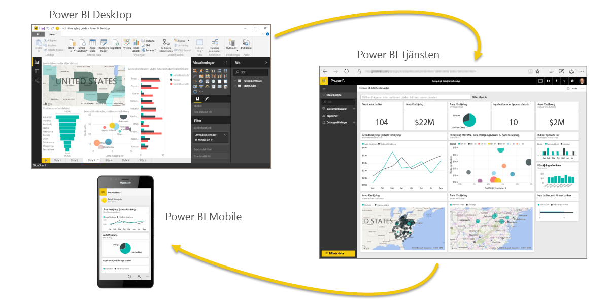

Välkommen till **Interaktiv utbildning** för Power BI. I den här onlinekursen, som du genomför i egen takt, förklaras Power BI steg för steg så att du kan bygga upp dina kunskaper från grunden.

Kursen är utformad för att ge vägledning i lagom stora segment i ett logisk flöde som hjälper dig att lära dig koncepten, detaljerna och exemplen. Den innehåller dessutom massor av visuella objekt och videor som underlättar inlärandet.

Denna **interaktiva utbildning** innehåller många **avsnitt** och varje avsnitt innehåller i sin tur många **ämnen**. Efter de första ämnena i det här **Komma igång**-avsnittet innehåller nästan alla ämnen en video som beskriver det du kan lära dig. Innehållet under videon förklarar konceptet ytterligare så att du kan gå igenom informationen och lära dig den i din egen takt.

Om du är **nybörjare** på Power BI hjälper den här kursen dig att komma igång och om du är Power BI-**veteran** kopplar den här kursen samman koncepten och fyller i eventuella kunskapsgap. Vi hoppas att du kommer att ha nöje av kursen och ser fram emot att lägga till mer innehåll i framtiden.

## Vad är Power BI?
**Power BI** är en samling programvarutjänster, appar och kopplingar som arbetar tillsammans för att förvandla dina orelaterade datakällor till sammanhängande, visuellt fördjupande och interaktiva insikter. Oavsett om dina data består av ett enkelt Excel-kalkylblad eller en samling molnbaserade och lokala hybridinformationslager, kan du med **Power BI** enkelt ansluta till dina datakällor, visualisera (eller identifiera) vad som är viktigt och dela det med någon eller alla du vill.

**Power BI** kan vara enkelt och snabbt och kan på ett ögonblick skapa snabba insikter från ett Excel-kalkylblad eller en lokal databas. Men **Power BI** är också robust och håller företagsklass och möjliggör omfattande modellering och analys i realtid samt anpassad utveckling. Så det kan vara ditt personliga verktyg för rapportering och visualisering och även fungera som analys- och beslutsmotor till grupprojekt, avdelningar eller hela bolag.

## Power BI:s delar
Power BI består av ett Windows-skrivbordsprogram som heter **Power BI Desktop**, en SaaS-tjänst (*programvara som en tjänst*) online som kallas **Power BI-tjänsten** och Power BI**-mobilappar** som finns tillgängliga för Windows-telefoner och -surfplattor, samt för iOS- och Android-enheter.

Dessa tre delar – **skrivbordet**, **tjänsten** och **mobilapparna** – är utformade för att människor ska kunna skapa, dela och använda affärsinsikter på det sätt som passar dem bäst beroende på roll.

## Hur Power BI matchar din roll
Hur du använder Power BI kan bero på vilken roll du har i ett projekt eller i ett team. Och andra personer i andra roller kan använda Power BI på annat sätt, vilket fungerar lika bra.

Du kanske som exempel i första hand använder **Power BI-tjänsten** men din siffertokiga affärsrapportskapande kollega kanske i stor utsträckning använder sig av **Power BI Desktop** (och publicerar skrivbordsrapporterar till Power BI-tjänsten, som du sedan läser). En annan kollega på försäljningssidan kanske främst använder sin Power BI-mobilapp för att övervaka sina försäljningskvoter och för att sätta sig in i ny information om ett potentiellt försäljningstillfälle.

Du kan också använda delarna i **Power BI** vid olika tidpunkter, beroende på vad du vill uppnå eller vilken din roll är för ett visst projekt eller en viss uppgift.

Du kanske vill visa utvecklingen för lager och tillverkning på en instrumentpanel i realtid i tjänsten och även använda **Power BI Desktop** för att skapa rapporter för ditt team om kundengagemangsstatistik. Hur du använder Power BI kan baseras på vilken funktion eller tjänst i Power BI som är det bästa verktyget för din situation – men alla delar av Power BI är tillgängliga för dig, vilket är anledningen till att det är så flexibelt och övertygande.

Vi diskuterar dessa tre delar – **skrivbordet**, **tjänsten** och **mobilappar** – i mer detalj senare i den här **interaktiva utbildningen**. Vi ska också skapa rapporter i Power BI Desktop, dela dem i tjänsten och granska dem i detalj på vår mobila enhet i kommande artiklar.

## Arbetsflödet i Power BI
Ett vanligt arbetsflöde i Power BI börjar i **Power BI Desktop** där en rapport skapas. Rapporten publiceras sedan i Power BI-**tjänsten** och delas så användare av **Power BI Mobile**-appar kan använda informationen.

Det går inte alltid till på det viset och det är helt okej, men vi ska använda det flödet för att lära dig de olika delarna i Power BI och hur de kompletterar varandra.

Okej, nu när vi har en översikt över den här kursen, vad Power BI är och dess tre huvuddelar, ska vi titta på hur det är att använda **Power BI**.

