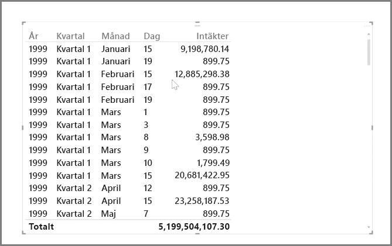
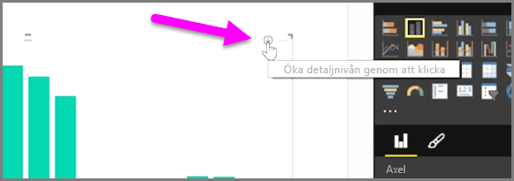
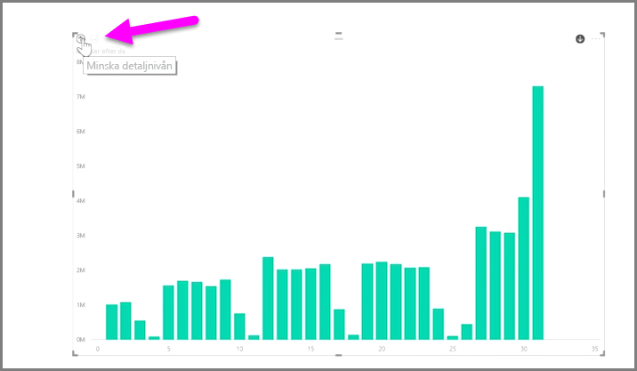
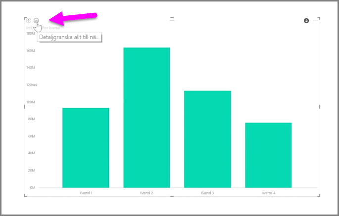
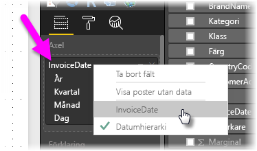
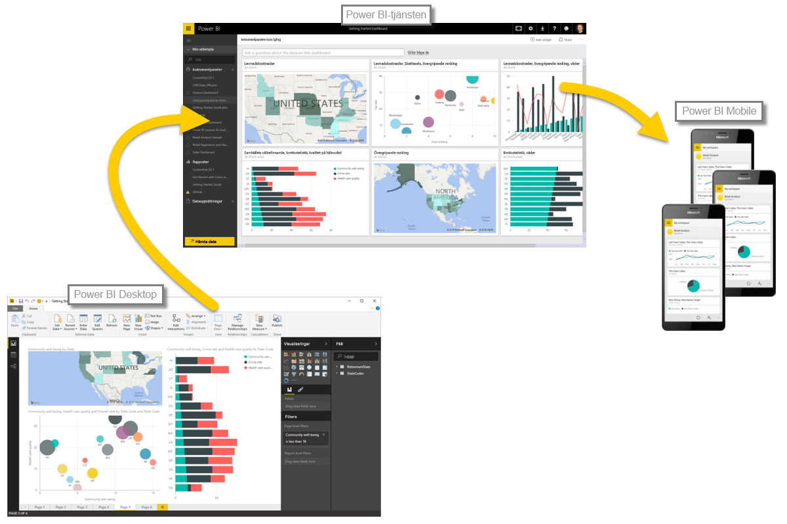

Det är lätt att analysera tidsbaserade data med Power BI. Modelleringsverktygen i Power BI Desktop inkluderar automatiskt genererade fält som gör att du kan granska nedåt efter år, kvartal, månad och dagar med en enda klickning.  

När du skapar en tabellvisualisering i din rapport med hjälp av ett datumfält, inkluderar Power BI Desktop automatiskt uppdelningar efter tidsperiod. Som exempel delades datumfältet i tabellen **Datum** automatiskt upp i år, kvartal, månad och dag av Power BI, enligt vad som visas på följande bild.

Visualiseringar visar data på *årsnivå* som standard, men du kan ändra det genom att aktivera **Granska nedåt** i det övre högra hörnet av det visuella objektet.

Nu när du klickar på staplarna och linjerna i diagrammet går den vidare till nästa nivå i tidshierarkin, till exempel från *år* till *kvartal*. Du kan fortsätta att gå nedåt tills du når den mest detaljerade nivån i hierarkin, som i det här exemplet är *dagar*. Om du vill gå tillbaka uppåt i tidshierarkin, klickar du på **Granska uppåt** i det övre vänstra hörnet av det visuella objektet.

Du kan också granska nedåt i alla data som visas i det visuella objektet, i stället för bara en vald period, med hjälp av dubbelpilsikonen för **granska alla** som du också hittar i det övre högra hörnet av det visuella objektet.

Så länge som din modell har ett datumfält, skapar Power BI automatiskt olika vyer för olika tidshierarkier.

För att gå tillbaka till enskilda datum i stället för att använda datumhierarkin, högerklickar du helt enkelt på kolumnnamnet i **Fält**-området (i följande bild är namnet på kolumnen *Fakturadatum*) och väljer sedan kolumnnamnet från den menyn som visas, i stället för **Datumhierarki**. Sedan visas dina data baserat på dessa kolumndata, utan tillämpning av datumhierarkin, i ditt visuella objekt. Behöver du gå tillbaka till att använda datumhierarkin? Inga problem – bara högerklicka igen och välj **Datumhierarki** i menyn.

## Nästa steg
**Grattis!** Du har slutfört det här avsnittet i kursen **Interaktiv utbildning** för Power BI. Nu när du känner till hur man *modellerar* data är du redo att lära dig om allt det roliga som väntar i nästa avsnitt: **Visualiseringar**.

Som vi nämnt tidigare bygger den här kursen upp dina kunskaper genom att följa det vanligaste arbetsflödet i Power BI:

* Hämta data till **Power BI Desktop** och skapa en rapport.
* Publicera i Power BI-tjänsten där du kan skapa nya **visualiseringar** och instrumentpaneler
* **Dela** dina instrumentpaneler med andra, särskilt med personer som är i farten
* Visa och interagera med delade instrumentpaneler och rapporter i **Power BI Mobile**-appar

Du kanske inte gör allt det arbetet själv, men du kommer ändå att *förstå* hur dessa instrumentpaneler skapas och hur de ansluter till data ... och när du är klar med den här kursen, kommer du att kunna skapa en egen.

Vi ses i nästa avsnitt!

