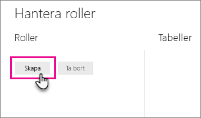

## <a name="define-roles-and-rules-in-power-bi-desktop"></a>Definiera roller och regler i Power BI Desktop
Du kan definiera roller och regler i Power BI Desktop. När du publicerar till Power BI publiceras även rolldefinitionerna.

Följ dessa steg för att definiera säkerhetsroller.

1. Importera data till Power BI Desktop-rapporten eller konfigurera en DirectQuery-anslutning.
   
   > [!NOTE]
   > Du kan inte definiera roller i Power BI Desktop för live-anslutningar i Analysis Services. Du måste göra det i Analysis Services-modellen.
   > 
   > 
2. Välj **Hantera roller** på fliken **Modellering**.
   
   
3. Välj **Skapa** i fönstret **Hantera roller**.
   
   
4. Ange ett namn på rollen under **Roller**. 
5. Välj den tabell som du vill tillämpa DAX-regeln på under **Tabeller**.
6. I rutan **DAX-uttryck för tabellfilter** anger du DAX-uttrycket. Det här uttrycket returnerar värdet true eller false. Till exempel: ```[Entity ID] = “Value”```.
      
   

   > [!NOTE]
   > Du kan använda *username()* i detta uttryck. Observera att *username()* har formatet *DOMÄN\användarnamn* i Power BI Desktop. I Power BI-tjänsten och Power BI-rapportservern används formatet för användarens huvudnamn (UPN). Du kan även använda *userprincipalname()* , vilket alltid returnerar användaren i samma format som dess huvudnamn, *användarnamn\@contoso.com*.
   > 
   > 

7. När du har skapat DAX-uttrycket markerar du kryssrutan ovanför uttrycksrutan för att verifiera uttrycket.
      
   
   
   > [!NOTE]
   > I den här uttrycksrutan använder du kommatecken för att separera DAX-funktionsargumenten även om du använder ett språk som normalt använder semikolonavgränsare (t.ex. franska eller tyska). 
   >
   >
   
8. Välj **Spara**.

Du kan inte tilldela användare till en roll i Power BI Desktop. Du kan tilldela dem i Power BI-tjänsten. Du kan aktivera dynamisk säkerhet i Power BI Desktop genom att använda DAX-funktionerna *username()* eller *userprincipalname()* samt konfigurera rätt relationer. 

