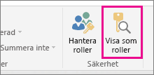
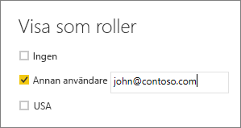

## Verifiera rollerna i Power BI Desktop
När du har skapat rollerna kan du testa rollresultaten i Power BI Desktop.

1. Välj **Visa som roller** på fliken **Modellering**. 

    

    Du kan se de roller du har skapat i fönstret **Visa som roller**.

    

3. Välj en roll du har skapat och sedan **OK** för att tillämpa rollen. 

   Rapporterna återger de data som är relevanta för rollen.

4. Du kan också välja **Annan användare** och ange en viss användare. 

    

   Det är bäst att ange användarens huvudnamn (UPN), eftersom det är det som Power BI-tjänsten och Power BI-rapportservern använder.

   I Power BI Desktop visar bara **Annan användare** olika resultat om du använder dynamisk säkerhet baserad på dina DAX-uttryck. 

5. Välj **OK**. 

   Rapporten återges baserat på vad användaren kan se.

