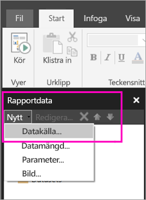

# Skapa en inbäddad datakälla för sidnumrerade rapporter i Power BI-tjänsten

I den här artikeln får du lära dig att skapa och ändra en inbäddad datakälla för en sidnumrerad rapport i Power BI-tjänsten. Du definierar en inbäddad datakälla i en enda rapport och använder den endast i den rapporten. För närvarande måste sidnumrerade rapporter som publiceras till Power BI-tjänsten innehålla inbäddade datamängder och inbäddade datakällor. De kan anslutas till följande datakällor:

- Azure Analysis Services
- Azure SQL Database och 
- Azure SQL Data Warehouse
- SQL Server
- SQL Server Analysis Services
- Oracle 
- Teradata 

För följande datakällor ska du använda alternativet [SQL Server Analysis Services-anslutning](../service-premium-connect-tools.md):

- Power BI Premium datasets

Sidnumrerade rapporter ansluter till lokala datakällor via en [Power BI-gateway](../service-gateway-onprem.md). Du ställer in gatewayen när du har publicerat rapporten till Power BI-tjänsten.

Mer information finns i [Rapportdata i Power BI Report Builder](report-builder-data.md).

## Skapa en inbäddad datakälla
  
1. Öppna Power BI Report Builder.

1. I verktygsfältet i fönstret Rapportdata väljer du **Nytt** > **Datakälla**. Dialogrutan **Egenskaper för datakälla** öppnas.

    
  
2.  I textrutan **Namn** skriver du ett namn på datakällan, eller så godkänner du standardinställningen.  
  
3.  Välj **Använd en anslutning som är inbäddad i min rapport**.  
  
1.  I listan **Välj anslutningstyp** väljer du en typ av datakälla. 

1.  Ange en anslutningssträng med hjälp av någon av följande metoder:  
  
    -   Skriv anslutningssträngen direkt i textrutan **Anslutningssträng**. 
  
     -   Välj **Skapa** för att öppna dialogrutan **Anslutningsegenskaper** för den datakälla som du valde i steg 2.  
  
        Fyll i lämpliga fält i dialogrutan **Anslutningsegenskaper** för typen av datakälla. Anslutningsegenskaper är bl.a. typ av datakälla, namnet på datakällan och de autentiseringsuppgifter som används. När du har angett värden i dialogrutan väljer du **Testa anslutningen** för att kontrollera att datakällan är tillgänglig och att de autentiseringsuppgifter som du angav är korrekta.  
  
4.  Välj **Autentiseringsuppgifter**.  
  
     Ange de autentiseringsuppgifter som ska användas för den här datakällan. Ägaren av datakällan väljer vilken typ av autentiseringsuppgifter som stöds. Mer information finns i [Ange autentiseringsuppgifter och anslutningsinformation för Rapport över datakällor](https://docs.microsoft.com/sql/reporting-services/report-data/specify-credential-and-connection-information-for-report-data-sources).
  
5.  Välj **OK**.  
  
     Datakällan visas i fönstret Rapportdata.  
     
## Begränsningar och överväganden

Sidnumrerade rapporter som ansluter till Power BI-datamängder följer reglerna för delade datamängder i Power BI med några mindre ändringar.  För att användare korrekt ska kunna visa sidnumrerade rapporter med Power BI-datamängder, och för att säkerställa att säkerhet på radnivå (RLS) är aktiverat och infört för dina visningsprogram, ska du vara noga med att följa dessa regler:

### Klassiska appar och arbetsytor

- .rdl i samma arbetsyta som datamängd (samma ägare): Stöds
- .rdl i annan arbetsyta än datamängd (samma ägare): Stöds
- Delad .rdl: Du behöver ha läs-behörigheter tilldelade varje användare som visar rapporten på datamängdsnivå
- Delad app: Du behöver ha läs-behörigheter tilldelade varje användare som visar rapporten på datamängdsnivå
- .rdl i samma arbetsyta som datamängd (annan ägare): Stöds
- .rdl på en annan arbetsyta än datamängden (annan användare): du behöver läs-behörighet tilldelad för varje användare som visar rapporten på datamängdsnivå
- Säkerhet på rollnivå: Du behöver läs-behörighet tilldelad för varje användare som visar rapporten på datamängdsnivå för att det ska framtvingas.

### Nya appar och arbetsytor

- .rdl i samma arbetsyta som datamängd: Stöds
- .rdl i annan arbetsyta än datamängd (samma ägare): Stöds
- Delad .rdl: Du behöver ha läs-behörigheter tilldelade varje användare som visar rapporten på datamängdsnivå
- Delad app: Du behöver ha läs-behörigheter tilldelade varje användare som visar rapporten på datamängdsnivå
- .rdl i samma arbetsyta som datamängd (annan användare) – stöds
- .rdl i annan arbetsyta än datamängd (annan ägare): Du behöver ha läs-behörigheter tilldelade varje användare som visar rapporten på datamängdsnivå
- Säkerhet på rollnivå: Du behöver läs-behörighet tilldelad för varje användare som visar rapporten på datamängdsnivå för att det ska framtvingas

## Nästa steg

- [Skapa en inbäddad datamängd för en sidnumrerad rapport i Power BI-tjänsten](paginated-reports-create-embedded-dataset.md)
- [Vad är sidnumrerade rapporter i Power BI Premium?](paginated-reports-report-builder-power-bi.md)
