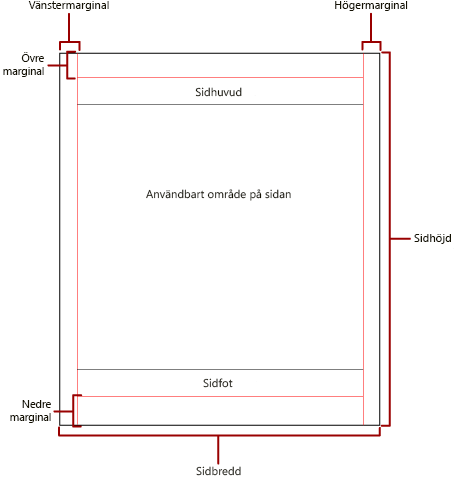
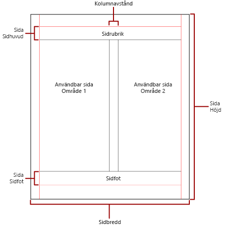

# Sidnumrering i sidnumrerade rapporter i Power BI

 *Sidnumrering* syftar på antalet sidor i en rapport och hur rapportobjekt är ordnade på dessa sidor. Sidnumreringen i sidnumrerade rapporter i Power BI varierar beroende på vilket återgivningstillägg du använder för att visa och leverera rapporten. När du kör en rapport på rapportservern används HTML-återgivning. HTML följer en viss uppsättning sidnumreringsregler. Om du till exempel exporterar samma rapport till PDF används PDF-återgivning, som har en annan uppsättning regler. Rapportens sidbrytningar blir därför annorlunda. Du måste förstå reglerna som används för att styra sidbrytning i sidnumrerade Power BI-rapporter. Då kan du skapa lättlästa rapporter som är optimerade för den återgivning du tänker använda.  
  
 I det här avsnittet beskrivs vilken påverkan den fysiska sidstorleken och rapportlayouten har på hur rapporten återges med hård sidbrytning. Du kan ange egenskaper för att ändra den fysiska sidstorleken och marginalerna, och dela in rapporten i kolumner. Använd fönstret **Rapportegenskaper**, fönstret **Egenskaper** eller dialogrutan **Utskriftsformat**. Du öppnar fönstret **Rapportegenskaper** genom att klicka på det blå området utanför rapportens brödtext. Du öppnar dialogrutan **Utskriftsformat** genom att klicka på **Kör** på startfliken och sedan på **Utskriftsformat** på fliken Kör.  
  
> [!NOTE]  
>  Om du har designat en rapport som är en sida bred, men den återges över flera sidor, kontrollerar du att bredden för rapportens brödtext, inklusive marginaler, inte är större än bredden för den fysiska sidstorleken. Du kan förhindra att tomma sidor läggs till i rapporten genom att minska storleken på containern genom att dra i hörnet på containern åt vänster.  

## Rapportens brödtext  
 Rapportens brödtext är en rektangulär container som visas som ett tomt utrymme på designytan. Behållaren kan växa eller krympa för att få plats med rapportobjekt som finns i behållaren. Rapportens brödtext motsvarar inte den fysiska sidstorleken. Rapportens brödtext kan växa utanför gränserna för den fysiska sidstorleken och sträcka sig över flera rapportsidor. Vissa renderare, till exempel Microsoft Excel, Word, HTML och MHTML, återger rapporter som växer eller krymper beroende på sidans innehåll. Rapporter som återges i dessa format är optimerade för skärmbaserad visning, till exempel i en webbläsare. I dessa återgivningar läggs lodräta sidbrytningar till när det behövs.  
  
 Du kan formatera rapportens brödtext med färg, format, bredd för kantlinjerna. Du kan också lägga till en bakgrundsfärg och en bakgrundsbild.  
  
## Den fysiska sidan  
 Den fysiska sidstorleken är pappersstorleken. Den pappersstorlek som du anger för rapporten styr hur rapporten återges. Rapporter som återges med hård sidbrytning infogar sidbrytningar vågrätt och lodrätt baserat på den fysiska sidstorleken. De här sidbrytningarna ger bästa möjliga läsupplevelse när de skrivs ut eller visas i filformat med hård sidbrytning. Rapporter som återges med mjuk sidbrytning infogar sidbrytningar vågrätt baserat på den fysiska storleken. Sidbrytningarna ger bästa möjliga läsupplevelse i webbläsare.  
  
 Som standard är sidstorleken 8,5 x 11 tum, men du kan ändra storleken i fönstret **Rapportegenskaper** eller i dialogrutan **Utskriftsformat**, eller genom att ändra egenskaperna PageHeight och PageWidth i fönstret **Egenskaper**. Sidstorleken ökar eller minskar inte för att få plats med innehållet i rapportens brödtext. Om du vill att rapporten ska visas på en enda sida måste allt innehåll i rapportens brödtext få plats på den fysiska sidan. Om den inte får plats och du använder hårda sidbrytningar behövs ytterligare sidor för rapporten. Om rapportens brödtext växer utanför den fysiska sidans högra kant, infogas en vågrät sidbrytning. Om rapportens brödtext växer utanför den fysiska sidans nedre kant, infogas en lodrät sidbrytning.  
  
 Om du vill åsidosätta den fysiska sidstorleken som definierats i rapporten kan du ange fysisk sidstorlek med inställningarna för enhetsinformation för den specifika återgivning som du använder för att exportera rapporten. En komplett lista finns i [Device Information Settings for Rendering Extensions](https://docs.microsoft.com/sql/reporting-services/device-information-settings-for-rendering-extensions-reporting-services?view=sql-server-2017) i dokumentationen för SQL Server Reporting Services.  
  
### Marginaler

 Marginalerna dras från kanten på de fysiska siddimensionerna inåt till den angivna marginalinställningen. Om ett rapportobjekt sträcker sig utanför marginalytan kapas det så att den överskjutande ytan inte visas. Om du anger marginalstorlekar som gör att den vågräta eller lodräta bredden på sidan blir lika med noll, får marginalinställningarna standardvärdet noll. Marginaler anges i fönstret **Rapportegenskaper** eller i dialogrutan **Utskriftsformat**, eller genom att ändra egenskaperna TopMargin, BottomMargin, LeftMargin och RightMargin i fönstret **Egenskaper**. Om du vill åsidosätta marginalstorleken som definierats i rapporten kan du ange marginalstorlek med inställningarna för enhetsinformation för den specifika återgivning som du använder för att exportera rapporten.  
  
 Området på den fysiska sidan som återstår efter att området tilldelats för marginaler, kolumnavstånd och sidhuvud och sidfot kallas *användbart sidområde*. Marginaler används bara när du återger och skriver ut rapporter i återgivningsformat med hård sidbrytning. På följande bild visas marginaler och det användbara sidområdet på en fysisk sida.  
  
 
  
### Kolumner som i nyhetsbrev  

 Rapporten kan delas upp i kolumner, som i en tidning. Kolumnerna hanteras som *logiska* sidor som återges på motsvarande *fysiska* sida. De ordnas från vänster till höger, uppifrån och ned, och avgränsas med ett tomt utrymme mellan varje kolumn. Om rapporten är indelad i fler än en kolumn delas varje fysiska sida in lodrätt i kolumner, och varje kolumn räknas som en logisk sida. Anta att du till exempel har två kolumner på en fysisk sida. Innehållet i rapporten fyller den första kolumnen och sedan den andra kolumnen. Om rapporten inte ryms i de första två kolumnerna fylls även den första och andra kolumnen på nästa sida. Kolumnerna fortsätter att fyllas från vänster till höger, uppifrån och ned tills alla rapportobjekt återges. Om du anger kolumnstorlekar som gör att den vågräta bredden eller lodräta bredden blir lika med noll får kolumnavståndet standardvärdet noll.  
  
 Du anger kolumner i fönstret **Rapportegenskaper** eller i dialogrutan **Utskriftsformat**, eller genom att ändra egenskaperna TopMargin, BottomMargin, LeftMargin och RightMargin i fönstret **Egenskaper**. Om du vill använda en marginalstorlek som inte har definierats kan du ange marginalstorlek med inställningarna för enhetsinformation för den specifika återgivning som du ska exportera rapporten till. Kolumner används endast när du återger och skriver ut rapporter i PDF- eller bildformat. På följande bild visas det användbara sidområdet för en sida som innehåller kolumner.  
  

  
## Sidbrytningar och sidnamn

 En rapport blir lättare att läsa och informationen blir enklare att granska och exportera om rapporten har sidnamn. Reporting Services innehåller egenskaper för rapporter, dataområden (för tabeller, matriser och listor), grupper och rektanglar i rapporten för att styra sidnumrering, återställning av sidnummer och tillhandahålla nya sidnamn i rapporten vid sidbrytningar. Dessa funktioner kan förbättra rapporter, oavsett vilket format rapporterna återges i, men är särskilt användbara när du exporterar rapporter till Excel-arbetsböcker.

> [!NOTE]
> Bakom kulisserna är dataområden för tabeller, matriser och listor i själva verket samma typ av dataområde: en *tablix*. Så du kan stöta på det namnet. 

 Egenskapen InitialPageName tillhandahåller det första sidnamnet för rapporten. Om rapporten inte innehåller sidnamn för sidbrytningar används det inledande sidnamnet för alla nya sidor som skapas av sidbrytningar. Du måste inte använda ett inledande sidnamn.  
  
 En återgiven rapport kan tillhandahålla ett nytt sidnamn för den nya sidan som orsakas av en sidbrytning. Om du vill ange sidnamnet anger du egenskapen PageName för en tabell, matris, lista, grupp eller rektangel. Du behöver inte ange sidnamn vid sidbrytningar. Om du inte gör det används värdet för InitialPageName i stället. Om InitialPageName också är tomt får den nya sidan inget namn.  
  
 Dataområden (tabeller, matriser och listor), grupper och rektanglar stöder sidbrytningar.  
  
 Sidbrytningen innehåller följande egenskaper:  
  
- **BreakLocation** tillhandahåller positionen för sidbrytningen som tillämpas för rapportelementet: vid början, vid slutet eller vid början och slutet. I grupper kan BreakLocation placeras mellan grupper.  
  
- **Disabled** anger om en sidbrytning används för rapportelementet. Om den här egenskapen utvärderas till True ignoreras sidbrytningen. Den här egenskapen används för att dynamiskt inaktivera sidbrytningar baserat på uttryck när rapporten körs.  
  
- **ResetPageNumber** anger om sidnumret ska återställas till 1 vid en sidbrytning. Om den här egenskapen utvärderas till True återställs sidnumret.  
  
 Du kan ange egenskapen BreakLocation i dialogrutorna **Egenskaper för tablix**, **Egenskaper för rektangel** eller **Gruppegenskaper**, men du måste ange egenskaperna Disabled, ResetPageNumber och PageName i fönstret Egenskaper för Report Builder. Om egenskaperna i fönstret Egenskaper ordnas efter kategori hittar du egenskaperna i kategorin **PageBreak**. För grupper finns kategorin **PageBreak** inuti kategorin **Group**.  
  
 Du kan använda konstanter och enkla eller komplexa uttryck för att ange värdet för egenskaperna Disabled och ResetPageNumber. Du kan dock inte använda uttryck med egenskapen BreakLocation. Mer information om hur du skriver och använder uttryck finns i [Uttryck i Power BI Report Builder](report-builder-expressions.md).  
  
 I din rapport kan du skriva uttryck som refererar till aktuella sidnamn eller sidnummer med samlingen **Globals**. Mer information finns i [Built-in Globals and Users References](https://docs.microsoft.com/sql/reporting-services/report-design/built-in-collections-built-in-globals-and-users-references-report-builder?view=sql-server-2017) i dokumentationen för Report Builder och Reporting Services.
  
### Namnge Excel-kalkylbladsflikar

 Dessa egenskaper är användbara när du exporterar rapporter till Excel-arbetsböcker. Använd egenskapen InitialPage om du vill ange ett standardnamn för kalkylbladsfliken när du exporterar rapporten, och använd sidbrytningar och egenskapen PageName för att ange olika namn för varje kalkylblad. Varje ny rapportsida, som definieras av en sidbrytning, exporteras till ett annat kalkylblad som namnges av värdet för egenskapen PageName. Om PageName är tomt, men rapporten har ett inledande sidnamn, använder alla kalkylblad i Excel-arbetsboken samma namn, det vill säga det inledande sidnamnet.  
  
 Mer information om hur dessa egenskaper fungerar när rapporter exporteras till Excel finns i [Exportera till Microsoft Excel](https://docs.microsoft.com/sql/reporting-services/report-builder/exporting-to-microsoft-excel-report-builder-and-ssrs) i dokumentationen för Report Builder och Reporting Services.  
  
## Nästa steg

- [Visa en sidnumrerad rapport i Power BI-tjänsten](../consumer/paginated-reports-view-power-bi-service.md)
- [Undvik tomma sidor när du skriver ut sidnumrerade rapporter](../guidance/report-paginated-blank-page.md)
- Fler frågor? [Prova Power BI Community](https://community.powerbi.com/)
