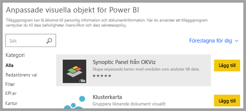
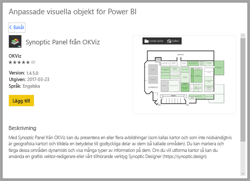
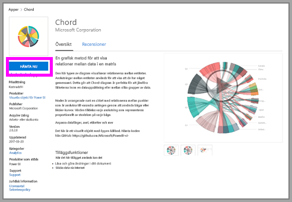
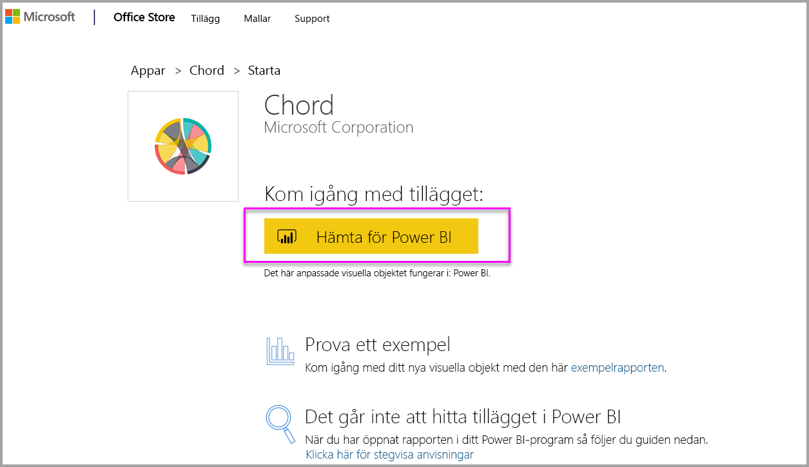

# Anpassade visuella objekt i Power BI
När du skapar eller redigerar en Power BI-rapport finns det många olika typer av visuella objekt som du kan använda. Dessa visuella objekt visas i fönstret **Visualiseringar**. När du hämtar Power BI Desktop eller öppna Power BI-tjänsten (app.powerbi.com) medföljer den här uppsättningen visuella objekt på köpet. 

Men du är inte begränsad till den här uppsättningen visuella objekt. Om du väljer ellipserna öppnas en annan källa med visuella rapportobjekt: *anpassade visuella objekt*.

Anpassade visuella objekt skapas av medlemmar i communityn och av Microsoft, och de finns på [AppSource](https://appsource.microsoft.com/marketplace/apps?product=power-bi-visuals). Dessa visuella objekt kan du hämta och lägga till i dina Power BI-rapporter. Alla dessa anpassade visuella objekt har godkänts av Microsoft och de fungerar liknande sätt som de visuella objekt som ingår i Power BI från början. De kan filtreras, markeras, redigeras, delas osv. 

Vad är AppSource? Enkelt uttryckt är det den plats där du hittar appar och tillägg till dina Microsoft-program. [AppSource](https://appsource.microsoft.com) ger miljontals användare av produkter som Office 365, Azure, Dynamics 365, Cortana och Power BI tillgång till lösningar som hjälper dem att utföra sitt arbete effektivare, insiktsfullare eller snyggare än tidigare.

## Två typer av anpassade visuella objekt

De anpassade visuella objekt för Power BI som är tillgängliga på AppSource kan delas in i 2 kategorier: **godkända** och **certifierade**. *AppSources godkända* visuella objekt kan köras i webbläsare, rapporter och instrumentpaneler.  *Power BI:s certifierade* visuella objekt har genomgått rigorös testning och stöds i extra scenarier, t.ex. [e-prenumerationer](service-report-subscribe.md) och [export till PowerPoint](service-publish-to-powerpoint.md).

Om du vill se en lista över certifierade anpassade visuella objekt, eller skicka dina egna, så hittar du information i [Certifierade anpassade visuella objekt](power-bi-custom-visuals-certified.md).

Är du webbutvecklare och intresserad av att skapa egna visualiseringar och lägga till dem i AppSource?  Läs [Kom igång med utvecklarverktyg](service-custom-visuals-getting-started-with-developer-tools.md) och lär dig hur du [publicerar anpassade visuella objekt till AppSource](https://appsource.microsoft.com/marketplace/apps?product=power-bi-visuals).

## Hämta eller importera anpassade visuella objekt från Microsoft AppSource
Du har två alternativ för att hämta och importera anpassade visuella objekt – inifrån Power BI och från AppSource-webbplatsen. 

###    Hämta anpassade visuella objekt från Power BI
1. Markera ellipserna längst ned i fönstret Visualiseringar. 

    

2. Välj **Importera från lagret** i listrutan.

    

3. Hitta det visuella objekt du vill importera genom att söka igenom listan. 

    

4.  Om du vill veta mer om ett specifikt visuellt objekt, så markera och välj det.

    

5.  På den här informationssidan kan du visa skärmdumpar, videor, detaljerade beskrivningar och annat. 

    

6. Bläddra längst ned om du vill se granskningar.

    

7.    Importera det anpassade visuella objektet genom att välja **Lägg till**. Ikonen för det anpassade visuella objektet läggs till längst ned i fönstret Visualiseringar och kan nu användas i rapporten.

       

###    Hämta och importera anpassade visuella objekt från Microsoft AppSource

1. Börja med [Microsoft AppSource](https://appsource.microsoft.com) och välj fliken **Appar**. 

    

2. Då kommer du till [appresultatssidan](https://appsource.microsoft.com/en-us/marketplace/apps) där du kan visa de främsta apparna i varje kategori, inklusive *Power BI-appar*. Men vi söker efter anpassade visuella objekt, så vi begränsar resultaten genom att välja **Visuella Power BI-objekt** från den vänstra navigeringslistan.

    

3. AppSource visar en panel för varje anpassat visuellt objekt.  Varje panel har en ögonblicksbild av det anpassade visuella objektet med en kort beskrivning och en nedladdningslänk. Markera panelen om du vill se mer information. 

    

4. På den här informationssidan kan du visa skärmdumpar, videor, detaljerade beskrivningar och annat. Ladda ned det visuella objektet genom att välja **Hämta det nu** och sedan godkänna användningsvillkoren. 

    

5. Välj länken för att hämta det anpassade visuella objektet.

    

    Nedladdningssidan innehåller också anvisningar om hur du importerar det anpassade visuella objektet till Power BI Desktop och Power BI-tjänsten.

    Du kan också hämta en exempelrapport som innehåller det anpassade visuella objektet och visar dess funktioner.

    

6. Spara .pbiviz-filen och öppna sedan Power BI.    
7. Öppna den rapport där du vill lägga till det anpassade visuella objektet, och längst ned i fönstret **Visualiseringar** väljer du ellipserna > **Importera från fil**.  

      

8. Lägg till ikonen för det anpassade visuella objektet längst ned i fönstret **Visualiseringar** genom att välja filen för det anpassade visuella objektet. Det anpassade visuella objektet är nu tillgängligt att användas i rapporten.

    
    
##    Överväganden och felsökning

- Ett anpassat visuellt objekt läggs till i en specifik rapport när det importeras. Om du vill använda det visuella objektet i en annan rapport måste du importera det till den rapporten också. När en rapport med ett anpassat visuellt objekt sparas med alternativet **Spara som**, så sparas en kopia av det anpassade visuella objektet med den nya rapporten.

- Om du inte ser fönstret **Visualiseringar** innebär det att du inte har redigeringsbehörigheter för rapporten.  Du kan bara lägga till anpassade visuella objekt till rapporter som du kan redigera, inte till rapporter som har delats med dig.

Har du fler frågor? [Prova Power BI Community](http://community.powerbi.com/)

