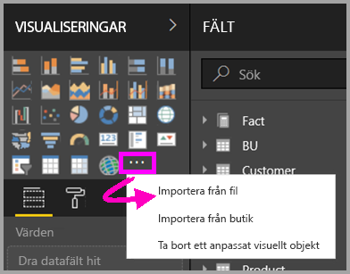
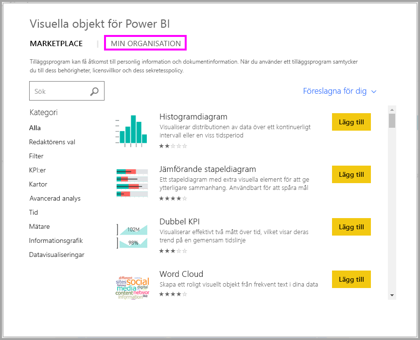
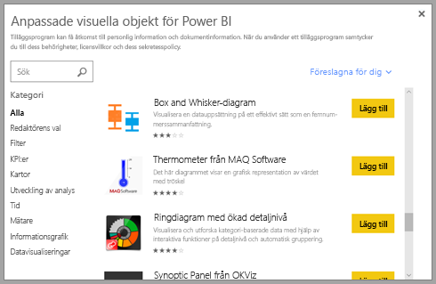
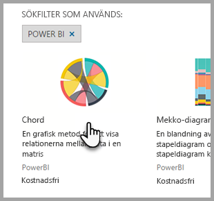

# Anpassade visuella objekt i Power BI

När du skapar eller redigerar en Power BI-rapport, kan du använda många olika typer av visuella objekt. Ikoner för dessa visuella objekt som visas i den **visualiseringar** fönstret. Dessa visuella objekt kommer kompletta när du laddar ned [Power BI Desktop](https://powerbi.microsoft.com/desktop/) eller öppna den [Power BI-tjänsten](https://app.powerbi.com).

Men du inte är begränsad till den här uppsättningen visuella objekt. Om du väljer ellipserna (...) längst ned på sidan, en annan källa med visuella rapportobjekt blir tillgänglig –*anpassade visuella objekt*.

Utvecklare skapa anpassade visuella objekt med hjälp av de anpassade visuella objekt SDK. Dessa visuella objekt företagsanvändare kan se sina data på ett sätt som passar verksamheten. Rapportförfattarna kan sedan importera anpassade visuella filerna till sina rapporter och använda dem precis som alla andra visuella Power BI-objekt. Anpassade visuella objekt är första klassens medborgare i Power BI och kan filtreras markerade, redigerade, delad och så vidare.

Anpassade visuella objekt distribueras på tre sätt:

* Filer för anpassade visuella objekt
* Visuella objekt för organisationer
* Visuella Microsoft Azure Marketplace-objekt

## Filer för anpassade visuella objekt

Anpassade visuella objekt är paket som innehåller kod för att återge data förses. Alla kan skapa ett anpassat visuellt objekt och paketera dem som en enda `.pbiviz` fil, som sedan kan importeras till en Power BI-rapport.

> [!WARNING]
> Ett anpassat visuellt objekt kan innehålla kod med säkerhets- eller integritetsrisker. Kontrollera att du litar på författaren och källan för anpassade visuella innan du importerar den till din rapport.

## Visuella objekt för organisationer

Power BI-administratörer godkänna och distribuera anpassade visuella objekt i organisationen, vilka Rapportförfattare kan enkelt identifiera, uppdatera och använda. Administratörer kan enkelt hantera (till exempel uppdatera version, aktivera/inaktivera) dessa visuella objekt.

 [Läs mer om visuella](power-bi-custom-visuals-organization.md).

## Visuella Microsoft Azure Marketplace-objekt

Medlemmar i communityn och Microsoft har bidragit med anpassade visuella objekt offentligt-förmånen och publicerat dem på den [AppSource](https://appsource.microsoft.com/marketplace/apps?product=power-bi-visuals) marketplace. Du kan ladda ned dessa visuella objekt lägga till dem i Power BI-rapporter. Microsoft har testat och godkänt dessa anpassade visuella objekt gäller funktionalitet och kvalitet.

Vad är [AppSource](developer/office-store.md)? Det är den plats som du hittar appar, tillägg och tillägg för Microsoft-programvara. [AppSource](https://appsource.microsoft.com/) ger miljontals användare av produkter som Office 365, Azure, Dynamics 365, Cortana och Power BI till lösningar som hjälper dem att få arbetet gjort effektivt, mer insikt, och snyggt än tidigare.

### Certifierade visuella objekt

Power BI: S certifierade visuella objekt är visuella marknadsplatsobjekt som har genomgått ytterligare rigorös kvalitetstestning och stöds i extra scenarier, till exempel [e-prenumerationer](https://docs.microsoft.com/power-bi/service-report-subscribe), och [exportera till PowerPoint](https://docs.microsoft.com/power-bi/service-publish-to-powerpoint).
Om du vill se en lista över certifierade anpassade visuella objekt, eller skicka dina egna, så hittar du information i [Certifierade anpassade visuella objekt](https://docs.microsoft.com/power-bi/power-bi-custom-visuals-certified).

Är du webbutvecklare och intresserad av att skapa egna visualiseringar och lägga till dem i AppSource? Se [utveckla en anpassad visualisering i Power BI](developer/custom-visual-develop-tutorial.md) och lär dig hur du [publicera anpassade visuella objekt till AppSource](https://docs.microsoft.com/power-bi/developer/office-store).

### Importera ett anpassat visuellt objekt från en fil

1. Välj ellipserna längst ned i den **visualiseringar** fönstret.

    

2. Välj **Importera från fil** i listrutan.

    

3. Öppna Arkiv-menyn väljer du den `.pbiviz` fil som du vill importera och välj sedan **öppna**. Ikon för det anpassade visuella objektet läggs till längst ned på din **visualiseringar** fönstret och är nu tillgängligt för användning i dina rapporter.

    

### Importera visuella objekt för organisationer

1. Välj ellipserna längst ned i den **visualiseringar** fönstret.

    

2. Välj **Importera från marknadsplats i listrutan**.

    

3. Välj **MIN ORGANISATION** på den översta flikmenyn.

    

4. Hitta det visuella objekt du vill importera genom att söka igenom listan.

    

5. Välj **Lägg till** att importera det anpassade visuella objektet. Ikonen har lagts till längst ned på din **visualiseringar** fönstret och är nu tillgängligt för användning i dina rapporter.

    

## Hämta eller importera anpassade visuella objekt från Microsoft AppSource

Har du två alternativ för att hämta och importera anpassade visuella objekt: från Power BI och från den [AppSource-webbplatsen](https://appsource.microsoft.com/).

### Hämta anpassade visuella objekt från Power BI

1. Välj ellipserna längst ned i den **visualiseringar** fönstret.

    

2. Välj **Importera från marknadsplats i listrutan**.

    

3. Hitta det visuella objekt du vill importera genom att söka igenom listan.

    

4. Om du vill veta mer om ett specifikt visuellt objekt, så markera och välj det.

    

5. På den här informationssidan kan du visa skärmdumpar, videor, detaljerade beskrivningar och annat.

    

6. Bläddra längst ned om du vill se granskningar.

    

7. Välj **Lägg till** att importera det anpassade visuella objektet. Ikonen har lagts till längst ned på din **visualiseringar** fönstret och är nu tillgängligt för användning i dina rapporter.

    

### Hämta och importera anpassade visuella objekt från Microsoft AppSource

1. Börja med [Microsoft AppSource](https://appsource.microsoft.com) och välj fliken **Appar**.

    

2. Gå till [appresultatsidan](https://appsource.microsoft.com/marketplace/apps) där du kan visa de främsta apparna i varje kategori, inklusive *Power BI-appar*. Vi söker efter anpassade visuella objekt, så vi väljer **Power BI-visualiseringar** från den vänstra navigeringslistan att begränsa resultaten.

    

3. AppSource visar en panel för varje anpassat visuellt objekt.  Varje panel har en anpassad visuell ögonblicksbild med en kort beskrivning och en nedladdningslänk. Markera panelen om du vill se mer information.

    

4. På den här informationssidan kan du visa skärmdumpar, videor, detaljerade beskrivningar och annat. Välj **Hämta nu** att ladda ned visuellt objektet och sedan godkänna användningsvillkoren.

    

5. Välj länken för att hämta det anpassade visuella objektet.

    

    Nedladdningssidan innehåller också anvisningar om hur du importerar det anpassade visuella objektet till Power BI Desktop och Power BI-tjänsten.

    Du kan också hämta en exempelrapport som innehåller det anpassade visuella objektet och visar dess funktioner.

    

6. Spara den `.pbiviz` filen och öppna sedan Power BI.

7. Importera den `.pbiviz` -filen i din rapport. (Se avsnittet [Importera ett anpassat visuellt objekt från en fil](#import-a-custom-visual-from-a-file) ovan.)

## Överväganden och begränsningar

* Ett anpassat visuellt objekt läggs till i en specifik rapport när det importeras. Om du vill använda det visuella objektet i en annan rapport måste du importera det till den rapporten också. När en rapport med ett anpassat visuellt objekt sparas med alternativet **Spara som**, så sparas en kopia av det anpassade visuella objektet med den nya rapporten.

* Om du inte ser en **visualiseringar** rutan innebär det att du inte har redigeringsbehörigheter rapporten.  Du kan bara lägga till anpassade visuella objekt till rapporter som du kan redigera, inte till rapporter som har delats med dig.

## Felsök

Felsökning av beskrivs [felsökning dina anpassade visualiseringar i Power BI](power-bi-custom-visuals-troubleshoot.md).

## Vanliga frågor och svar

Mer information och svar på frågor finns i [Vanliga frågor och svar om anpassade visuella Power BI-objekt](power-bi-custom-visuals-faq.md#organizational-custom-visuals).

## Nästa steg

* [Visualiseringar i Power BI-rapporter](visuals/power-bi-report-visualizations.md)

Har du fler frågor? [Testa Power BI Community](http://community.powerbi.com/).
