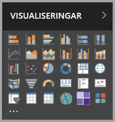
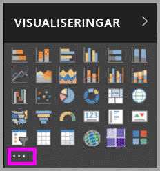
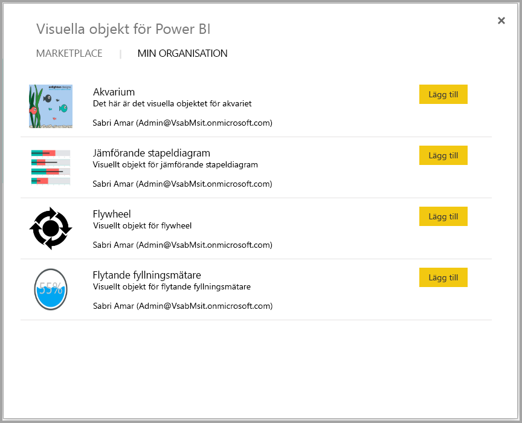
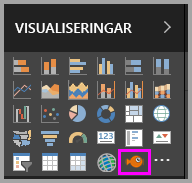
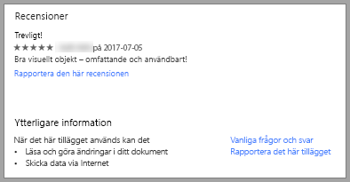
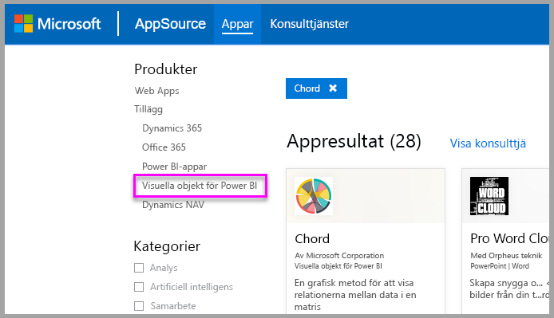

# Anpassade visuella objekt i Power BI
När du skapar eller redigerar en Power BI-rapport finns det många olika typer av visuella objekt som du kan använda. Dessa visuella objekt visas i fönstret **Visualiseringar**. När du hämtar Power BI Desktop eller öppna Power BI-tjänsten (app.powerbi.com) medföljer den här uppsättningen visuella objekt på köpet.

Men du är inte begränsad till den här uppsättningen visuella objekt. Om du väljer ellipserna öppnas en annan källa med visuella rapportobjekt: *anpassade visuella objekt*.

Anpassade visuella objekt skapas av utvecklare med hjälp av SDK:n för anpassade visuella objekt, så att företagsanvändare kan visa sina data på det sätt som passar företaget bäst. Rapportförfattarna kan sedan importera filerna för anpassade visuella objekt till sina rapporter och använda dem som vilka andra visuella Power BI-objekt som helst. Anpassade visuella objekt har högsta prioritet i Power BI och kan filtreras markeras, redigeras, delas osv.

Anpassade visuella objekt kan distribueras på tre olika sätt:
* Filer för anpassade visuella objekt
* Visuella organisationsobjekt
* Visuella Microsoft Azure Marketplace-objekt

## Filer för anpassade visuella objekt

Anpassade visuella objekt är paket som innehåller kod för att återge de data som de förses med. Alla kan skapa anpassade visuella objekt och paketera dem som .pbiviz-filer som kan importeras till Power BI-rapporter.

> [!WARNING]
> Ett anpassat visuellt objekt kan innehålla kod som innebär säkerhets- eller integritetsrisker. Kontrollera att författaren och det visuella objektets källa är betrodda innan du importerar det i din rapport.
> 
> 

## Visuella organisationsobjekt

Power BI-administratörer kan distribuera anpassade visuella objekt i organisationen, så att rapportförfattarna enkelt kan identifiera och använda de anpassade visuella objekt som administratören har godkänt för användning inom organisationen. Detta ger administratören möjlighet att välja specifika anpassade visuella objekt att distribuera i organisationen, liksom möjligheten att enkelt hantera dessa visuella objekt (t.ex. genom versionsuppdatering, aktivering/inaktivering). För rapportförfattare representerar det en enkel metod med vilket de kan identifiera visuella objekt som är unika för organisationen, och som även ger ett sömlöst stöd för uppdatering av dessa visuella objekt.

Mer information om anpassade visuella objekt i organisationer får du genom att [läsa mer om visuella objekt i organisationer](power-bi-custom-visuals-organization.md).

## Visuella Microsoft Azure Marketplace-objekt

Medlemmar i communityn, liksom Microsoft, har offentligt bidragit med anpassade visuella objekt och publicerat dem på [AppSource](https://appsource.microsoft.com/en-us/marketplace/apps?product=power-bi-visuals)-marknadsplatsen. Dessa visuella objekt kan du hämta och lägga till i dina Power BI-rapporter. Alla dessa anpassade visuella objekt har testats och godkänts av Microsoft när det gäller funktionalitet och kvalitet.

Vad är AppSource? Enkelt uttryckt är det den plats där du hittar appar och tillägg till dina Microsoft-program. [AppSource](https://appsource.microsoft.com/en-us/) ger miljontals användare av produkter som Office 365, Azure, Dynamics 365, Cortana och Power BI tillgång till lösningar som hjälper dem att utföra sitt arbete effektivare, insiktsfullare eller snyggare än tidigare.

### Certifierade visuella objekt

Power BI:s certifierade visuella objekt är visuella marknadsplatsobjekt som har genomgått ytterligare rigorös testning och som stöds i extra scenarier, t.ex. [e-prenumerationer](https://docs.microsoft.com/en-us/power-bi/service-report-subscribe) och [export till PowerPoint](https://docs.microsoft.com/en-us/power-bi/service-publish-to-powerpoint).
Om du vill se en lista över certifierade anpassade visuella objekt, eller skicka dina egna, så hittar du information i [Certifierade anpassade visuella objekt](https://docs.microsoft.com/en-us/power-bi/power-bi-custom-visuals-certified).

Är du webbutvecklare och intresserad av att skapa egna visualiseringar och lägga till dem i AppSource? Läs [Kom igång med utvecklarverktyg](https://docs.microsoft.com/en-us/power-bi/service-custom-visuals-getting-started-with-developer-tools) och lär dig hur du [publicerar anpassade visuella objekt till AppSource](https://appsource.microsoft.com/en-us/marketplace/apps?product=power-bi-visuals).

### Importera anpassade visuella objekt från en fil

1. Markera ellipserna längst ned i fönstret Visualiseringar.

    

2. Välj **Importera från fil** i listrutan.

    

3. Välj den .pbiviz-fil som du vill importera på menyn Öppna fil och välj sedan Öppna. Ikonen för det anpassade visuella objektet läggs till längst ned i fönstret Visualiseringar och kan nu användas i rapporten.

    

### Importera visuella organisationsobjekt

1. Markera ellipserna längst ned i fönstret Visualiseringar.

    

2. Välj Importera från marknadsplats i listrutan.

    

3. Välj **MIN ORGANISATION** på den översta flikmenyn.

    

4. Hitta det visuella objekt du vill importera genom att söka igenom listan.
    
    

5. Importera det anpassade visuella objektet genom att välja **Lägg till**. Ikonen för det anpassade visuella objektet läggs till längst ned i fönstret Visualiseringar och kan nu användas i rapporten.

    
 
## Hämta eller importera anpassade visuella objekt från Microsoft AppSource
Du har två alternativ för att hämta och importera anpassade visuella objekt – inifrån Power BI och från AppSource-webbplatsen.

### Hämta anpassade visuella objekt från Power BI

1. Markera ellipserna längst ned i fönstret Visualiseringar.

    

2. Välj **Importera från marknadsplats i listrutan**.

    

3. Hitta det visuella objekt du vill importera genom att söka igenom listan.

    

4. Om du vill veta mer om ett specifikt visuellt objekt, så markera och välj det.

    

5. På den här informationssidan kan du visa skärmdumpar, videor, detaljerade beskrivningar och annat.

    

6. Bläddra längst ned om du vill se granskningar.

    

7. Importera det anpassade visuella objektet genom att välja Lägg till. Ikonen för det anpassade visuella objektet läggs till längst ned i fönstret Visualiseringar och kan nu användas i rapporten.

    

### Hämta och importera anpassade visuella objekt från Microsoft AppSource

1. Börja med [Microsoft AppSource](https://appsource.microsoft.com) och välj fliken **Appar**. 

    

2. Då kommer du till [appresultatssidan](https://appsource.microsoft.com/en-us/marketplace/apps) där du kan visa de främsta apparna i varje kategori, inklusive *Power BI-appar*. Men vi söker efter anpassade visuella objekt, så vi begränsar resultaten genom att välja **Visuella Power BI-objekt** från den vänstra navigeringslistan.

    

3. AppSource visar en panel för varje anpassat visuellt objekt.  Varje panel har en ögonblicksbild av det anpassade visuella objektet med en kort beskrivning och en nedladdningslänk. Markera panelen om du vill se mer information. 

    

4. På den här informationssidan kan du visa skärmdumpar, videor, detaljerade beskrivningar och annat. Ladda ned det visuella objektet genom att välja **Hämta det nu** och sedan godkänna användningsvillkoren. 

    

5. Välj länken för att hämta det anpassade visuella objektet.

    

    Nedladdningssidan innehåller också anvisningar om hur du importerar det anpassade visuella objektet till Power BI Desktop och Power BI-tjänsten.

    Du kan också hämta en exempelrapport som innehåller det anpassade visuella objektet och visar dess funktioner.

    

6. Spara .pbiviz-filen och öppna sedan Power BI.

7. Importera filen .pbiviz till rapporten (Mer information finns i avsnittet [Importera ett anpassat visuellt objekt från en fil](#import-a-custom-visuals-from-a-file) ovan)

## Överväganden och felsökning

- Ett anpassat visuellt objekt läggs till i en specifik rapport när det importeras. Om du vill använda det visuella objektet i en annan rapport måste du importera det till den rapporten också. När en rapport med ett anpassat visuellt objekt sparas med alternativet **Spara som**, så sparas en kopia av det anpassade visuella objektet med den nya rapporten.

- Om du inte ser fönstret **Visualiseringar** innebär det att du inte har redigeringsbehörigheter för rapporten.  Du kan bara lägga till anpassade visuella objekt till rapporter som du kan redigera, inte till rapporter som har delats med dig.

Har du fler frågor? [Prova Power BI Community](http://community.powerbi.com/)
