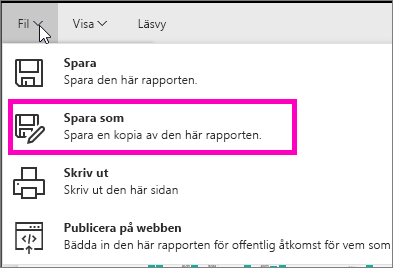

# Skapa en ny rapport från en befintlig rapport
Du kanske redan har en rapport som ansluter till din datauppsättning och har en del visuella objekt som du vill återanvända eller ändra.  Varför inte helt enkelt kopiera den rapporten och ha till grund för en ny rapport?  Om du vill göra det:

1. [Öppna en rapport](service-report-open-in-reading-view.md).
2. Från **fil**-menyn, väljer du **spara som**.
   
   
3. Ange ett namn för den nya rapporten och välj **spara**.
   
   
   
   Ett meddelande visas att den nya rapporten sparades till din aktuella arbetsyta i Power BI.
   
   
4. Öppna fliken **rapporter** på arbetsytan och välj den nya rapporten för att öppna den. Du kan också ta bort visuella objekt som du inte vill behålla, ändra andra visuella objekt och lägga till nya.
   
   
5. Ha roligt med att uppdatera och redigera din nya rapport.

## Nästa steg:
[Skapa nya visualiseringar](power-bi-report-add-visualizations-ii.md)

[Ta bort visualiseringar](service-delete.md) du inte behöver
