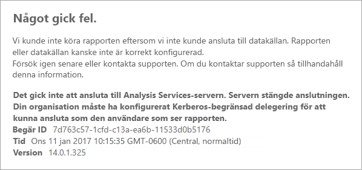
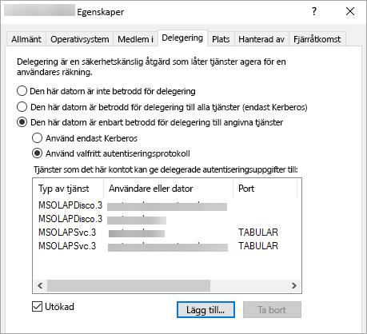

# <a name="configure-kerberos-to-use-power-bi-reports"></a>Konfigurera Kerberos för att använda Power BI-rapporter
<iframe width="640" height="360" src="https://www.youtube.com/embed/vCH8Fa3OpQ0?showinfo=0" frameborder="0" allowfullscreen></iframe>

Läs hur du konfigurerar din rapportserver för Kerberos-autentisering till datakällor som används inom dina Power BI-rapporter för en distribuerad miljö.

Power BI-rapportservern inkluderar möjligheten att vara värd för Power BI-rapporter. Flera datakällor som stöds av din rapportserver. Den här artikeln fokuserar specifikt på SQL Server Analysis Services, men du kan använda koncepten och tillämpa på andra datakällor, till exempel SQL Server.

Du kan installera Power BI-rapportserver, SQL Server och Analysis Services på en enda dator och allt bör fungera utan ytterligare konfiguration. Det här är bra för en testmiljö. Det kan träffa fel om du har dessa tjänster installerade på separata datorer vilket kallas för en distribuerad miljö. I den här miljön, krävs det att du använder Kerberos-autentisering. Det krävs konfiguration för att implementera detta. 

Mer specifikt behöver du konfigurera begränsad delegering. Du kan ha Kerberos som konfigurerats i din miljö, men det kanske inte har konfigurerats för begränsad delegering.

## <a name="error-running-report"></a>Fel vid rapportkörning
Om din rapportserver inte är korrekt konfigurerad, kan följande felmeddelanden visas.

    Something went wrong.

    We couldn’t run the report because we couldn’t connect to its data source. The report or data source might not be configured correctly. 

I den tekniska informationen visas följande meddelande.

    We couldn’t connect to the Analysis Services server. The server forcibly closed the connection. To connect as the user viewing the report, your organization must have configured Kerberos constrained delegation.



## <a name="configuring-kerberos-constrained-delegation"></a>Konfigurera Kerberos-begränsad delegering
Det finns flera objekt som måste konfigureras för att Kerberos-begränsad delegering ska fungera. Det inkluderar inställningar för tjänstens huvudnamn (SPN) och delegeringsinställningar för tjänstkonton.

> [!NOTE]
> Du måste vara domänadministratör för att kunna konfigurera SPN och delegeringsinställningar.
> 
> 

Vi behöver konfigurera eller validera följande.

1. Autentiseringstypen i rapportserverkonfigurationen.
2. SPN för rapportserverns tjänstkonto.
3. SPN för Analysis Services-tjänsten.
4. SPN för SQL Browser-tjänsten på Analysis Services-datorn. Detta är enbart för namngivna instanser.
5. Delegeringsinställningarna på rapportserverns tjänstkonto.

## <a name="authentication-type-within-report-server-configuration"></a>Autentiseringstyp i rapportserverkonfigurationen
Vi måste konfigurera autentiseringstypen för rapportservern att tillåta Kerberos-begränsad delegering. Detta görs i **rsreportserver.config**-filen. Standardplatsen för den här filen är `C:\Program Files\Microsoft Power BI Report Server\PBIRS\ReportServer`.

I filen rsreportserver.config behöver du finjustera avsnittet **autentisering/AuthenticationTypes**.

Vi vill försäkra oss om att RSWindowsNegotiate visas och är först i listan över autentiseringstyper. Det bör se ut ungefär så här.

```
<AuthenticationTypes>
    <RSWindowsNegotiate/>
    <RSWindowsNTLM/>
</AuthenticationTypes>
```

Om du behövde ändra konfigurationsfilen, behöver du stoppa och starta rapportservern för att säkerställa att ändringarna träder ikraft.

Mer information finns i [konfigurera Windows-autentisering på rapportservern](https://docs.microsoft.com/sql/reporting-services/security/configure-windows-authentication-on-the-report-server).

## <a name="spns-for-the-report-server-service-account"></a>SPN för rapportserverns tjänstkonto
Därefter behöver vi kontrollera att rapportservern har giltiga SPN:er tillgängliga. Detta baseras på det tjänstkonto som har konfigurerats för rapportservern.

### <a name="virtual-service-account-or-network-service"></a>Virtuellt tjänstkonto eller nätverkstjänst
Om din rapportserver har konfigurerats för virtuella tjänstkonton eller nätverkstjänstkonto, borde du inte behöva göra något. Dessa finns i kontexten för datorkontot. Datorkontot har värd-SPN som standard. Dessa täcker HTTP-tjänsten och kommer att användas av rapportservern.

Om du använder ett virtuellt servernamn som inte är samma som datorkontot, täcker inte värdposterna dig och du måste manuellt lägga till SPN för det virtuella värdnamnet.

### <a name="domain-user-account"></a>Domänanvändarkonto
Om din rapportserver är konfigurerad att använda ett domänanvändarkonto, måste du manuellt skapa HTTP-SPN på det kontot. Detta kan göras med hjälp av verktyget setspn som medföljer Windows.

> [!NOTE]
> Du behöver domänadministratörsrättigheter för att skapa SPN.
> 
> 

Det rekommenderas att du skapar två SPN. Ett med NetBIOS-namnet och det andra med det fullständigt kvalificerade domännamnet (FQDN). SPN har följande format.

    <Service>/<Host>:<port>

Power BI-rapportservern använder en tjänst för HTTP. Du kommer inte att lista en port för HTTP-SPN. Tjänsten vi är intresserade av här är HTTP. Värden för SPN blir det namn som du använder i en URL. Detta är vanligtvis namnet på datorn. Om du är bakom en belastningsutjämnare kan detta vara ett virtuellt namn.

> [!NOTE]
> Du kan verifiera URL:en genom att antingen titta på vad du anger i adressfältet i webbläsaren eller titta i konfigurationshanteraren för rapportservern på webbportalens URL-flik.
> 
> 

Om ditt datornamn är ContosoRS, är ditt SPN följande.

| SPN-typ | SPN |
| --- | --- |
| Fullständigt kvalificerat domännamn (FQDN) |HTTP/ContosoRS.contoso.com |
| NetBIOS |HTTP/ContosoRS |

### <a name="location-of-spn"></a>Plats för SPN
Var placerar du SPN? SPN placeras på det du använder för ditt tjänstkonto. Om du använder ett virtuellt tjänstkonto eller nätverkstjänst, är det här datorkontot. Även om vi har nämnt det innan, borde du bara behöva göra detta för en virtuell URL. Om du använder en domänanvändare för rapportserverns tjänstkonto, placerar du SPN på den domänanvändarens konto.

Om vi till exempel använder nätverkstjänstkontot och vårt datornamn är ContosoRS, skulle vi placera SPN på ContosoRS.

Om vi använder ett domänanvändarkonto för RSService, skulle vi placera SPN på RSService.

### <a name="using-setspn-to-add-the-spn"></a>Använd SetSPN för att lägga till SPN
Vi kan använda SetSPN-verktyget för att lägga till SPN. Vi följer samma exempel som ovan med datorkontot och domänanvändarkontot.

Att placera SPN på ett datorkonto för både FQDN- och NetBIOS SPN, skulle se ut ungefär så här om vi använder den virtuella URL:en contosoreports.

      Setspn -a HTTP/contosoreports.contoso.com ContosoRS
      Setspn -a HTTP/contosoreports ContosoRS

Att placera SPN på ett domänanvändarkonto för både FQDN- och NetBIOS SPN, skulle se ut ungefär så här om vi använder datornamnet som värd för SPN.

      Setspn -a HTTP/ContosoRS.contoso.com RSService
      Setspn -a HTTP/ContosoRS RSService

## <a name="spns-for-the-analysis-services-service"></a>SPN för Analysis Services-tjänsten
SPN för Analysis Services liknar det vi gjorde med Power BI-rapportservern. Formatet för SPN är lite annorlunda om du har en namngiven instans.

För Analysis Services använder vi en tjänst av MSOLAPSvc.3. Vi anger instansnamnet för portplatsen på SPN. Värddelen av SPN ska antingen vara datornamnet eller namnet på det virtuella klustret.

Ett exempel på en Analysis Services-SPN ser ut ungefär så här.

| Typ | Format |
| --- | --- |
| Standardinstans |MSOLAPSvc.3/ContosoAS.contoso.com<br>MSOLAPSvc.3/ContosoAS |
| Namngiven instans |MSOLAPSvc.3/ContosoAS.contoso.com:INSTANCENAME<br>MSOLAPSvc.3/ContosoAS:INSTANCENAME |

Placeringen av SPN liknar också det som nämndes med Power BI-rapportserver. Den är baserad på tjänstkontot.  Om du använder lokalt system eller nätverkstjänst, hamnar inom kontexten för datorkontot. Om du använder ett domänanvändarkonto för Analysis Services-instansen, placerar du SPN på domänanvändarkontot.

### <a name="using-setspn-to-add-the-spn"></a>Använd SetSPN för att lägga till SPN
Vi kan använda SetSPN-verktyget för att lägga till SPN. I det här exemplet är datornamnet ContosoAS.

Att placera SPN på ett datorkonto för både FQDN- och NetBIOS-SPN, skulle se ut ungefär så här.

    Setspn -a MSOLAPSvc.3/ContosoAS.contoso.com ContosoAS
    Setspn -a MSOLAPSvc.3/ContosoAS ContosoAS

Att placera SPN på ett domänanvändarkonto för både FQDN- och NetBIOS-SPN, skulle se ut ungefär så här.

    Setspn -a MSOLAPSvc.3/ContosoAS.contoso.com OLAPService
    Setspn -a MSOLAPSvc.3/ContosoAS OLAPService

## <a name="spns-for-the-sql-browser-service"></a>SPN för SQL Browser-tjänsten
Om du har en Analysis Services-namngiven instans, måste du också kontrollera att du har ett SPN för Browser-tjänsten. Detta är unikt för Analysis Services.

SPN för SQL Browser liknar det vi gjorde med Power BI-rapportservern.

För SQL Browser, använder vi tjänsten MSOLAPDisco.3. Vi anger instansnamnet för portplatsen på SPN. Värddelen av SPN ska antingen vara datornamnet eller namnet på det virtuella klustret.
Du behöver inte ange något för instansnamn eller port.

Ett exempel på en Analysis Services-SPN ser ut ungefär så här.

    MSOLAPDisco.3/ContosoAS.contoso.com
    MSOLAPDisco.3/ContosoAS

Placeringen av SPN liknar också det som nämndes med Power BI-rapportserver. Skillnaden här är att SQL Browser alltid körs under det lokala systemkontot. Det innebär att SPN alltid ska vara i datorkontot. 

### <a name="using-setspn-to-add-the-spn"></a>Använd SetSPN för att lägga till SPN
Vi kan använda SetSPN-verktyget för att lägga till SPN. I det här exemplet är datornamnet ContosoAS.

Att placera SPN på ett datorkonto för både FQDN- och NetBIOS-SPN, skulle se ut ungefär så här.

    Setspn -a MSOLAPDisco.3/ContosoAS.contoso.com ContosoAS
    Setspn -a MSOLAPDisco.3/ContosoAS ContosoAS

Mer information finns i [ett SPN för SQL Server Browser-tjänsten krävs](https://support.microsoft.com/kb/950599).

## <a name="delegation-settings-on-the-report-server-service-account"></a>Delegeringsinställningarna på rapportserverns tjänstkonto
Den sista delen som vi ska konfigurera är delegeringsinställningar på rapportserverns tjänstkonto. Det finns olika verktyg som du kan använda för att utföra dessa steg. I det här dokumentet, kommer vi att behålla Active Directory-användare och -datorer.

Du måste starta genom att gå till egenskaperna för rapportserverns tjänstkonto i Active Directory-användare och -datorer. Det kan antingen vara datorkontot, om du använde ett virtuellt tjänstkonto eller nätverkstjänst, eller så kan det vara ett domänanvändarkonto.

Vi vill konfigurera begränsad delegering med protokollövergång. Med begränsad delegering, måste du vara uttrycklig med vilka tjänster vi vill delegera till. Vi lägger till både SPN för Analysis Services-tjänsten och SQL Browser i listan som Power BI-rapportservern kan delegera till.

1. Högerklicka på rapportserverkontot och välj **egenskaper**.
2. Välj fliken **delegering**.
3. Välj **lita på den här datorn enbart för delegering till angivna tjänster**.
4. Välj **Använd valfritt autentiseringsprotokoll**.
5. Under **tjänster som det här kontot kan ge delegerade autentiseringsuppgifter**: väljer du **lägg till**.
6. I den nya dialogrutan väljer du **Användare eller datorer**.
7. Ange tjänstkontot för Analysis Services-tjänsten och välj **Ok**.
8. Välj det SPN som du skapade. Det börjar med `MSOLAPSvc.3`. Om du har lagt till både FQDN och NetBIOS SPN, väljs båda. Du kan bara se en.
9. Välj **OK**.  Du bör nu se SPN-namnet i listan.
10. Du kan också markera **expanderat** för att visa både FQDN- och NetBIOS SPN i listan.
11. Välj **lägg till** igen. Vi lägger till SQL Browser SPN nu.
12. I den nya dialogrutan väljer du **Användare eller datorer**.
13. Ange datornamnet för datorn som SQL Browser-tjänsten är på och välj **Ok**.
14. Välj det SPN som du skapade. Det börjar med `MSOLAPDisco.3`. Om du har lagt till både FQDN och NetBIOS SPN, väljs båda. Du kan bara se en.
15. Välj **OK**. Dialogrutan bör likna följande när du har markerat **expanderat**.
    
    
16. Välj **OK**.
17. Starta om Power BI-rapportservern.

## <a name="running-a-power-bi-report"></a>Kör en Power BI-rapport
När all ovanstående konfiguration är på plats, borde din rapport visas korrekt. 


Den här konfigurationen borde fungera i de flesta fall, men med Kerberos kan det behövas en annan konfiguration beroende på din miljö. Om rapporten fortfarande inte läses in, bör du ta kontakt med din domänadministratör för att undersöka vidare eller kontakta supporten.

## <a name="next-steps"></a>Nästa steg
[Administratörsöversikt](admin-handbook-overview.md)  
[Installera Power BI-rapportserver](install-report-server.md)  

Har du fler frågor? [Fråga Power BI Community](https://community.powerbi.com/)

