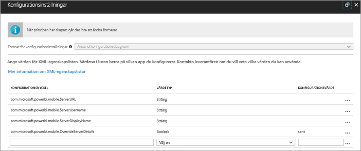
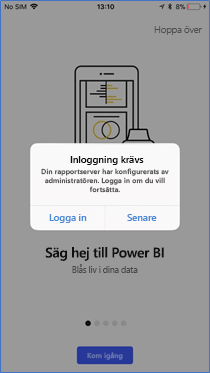
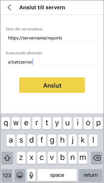
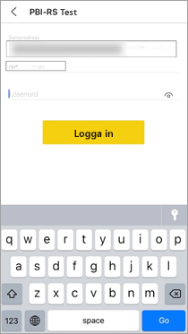

# Fjärrkonfiguration av Power BI iOS-mobilappar för åtkomst till en rapportserver

I den här artikeln kommer du lära dig att använda din organisations MDM-verktyg för att konfigurera åtkomsten från iOS-mobilappen för Power BI till en rapportserver. För att konfigurera detta skapar IT-administratören en appkonfigurationsprincip med nödvändig information som sedan skickas till appen. 

 När rapportservern har konfigurerats blir det lättare för Power BI iOS-mobilappanvändarna att ansluta till organisationens rapportserver. 

## Skapa appkonfigurationsprincipen i MDM-verktyget 

Som administratör följer du de här anvisningarna i Microsoft Intune för att skapa appkonfigurationsprincipen. Hur man skapar appkonfigurationsprinciper kan skilja sig åt mellan olika MDM-verktyg. 

1. Anslut ditt MDM-verktyg. 
2. Skapa och namnge en ny appkonfigurationsprincip. 
3. Välj vilka användare som appkonfigurationsprincipen ska distribueras till. 
4. Skapa nyckel-värdepar. 

I följande tabell anges paren.

|Nyckel  |Typ  |Beskrivning  |
|---------|---------|---------|
| com.microsoft.powerbi.mobile.ServerURL | Sträng | URL till rapportserver   Bör börja med http eller https |
| com.microsoft.powerbi.mobile.ServerUsername | Sträng | [valfritt]   Användarnamnet som ska användas för att ansluta servern.   Om det inte finns, uppmanas användaren att ange användarnamn för anslutningen i appen.| 
| com.microsoft.powerbi.mobile.ServerDisplayName | Sträng | [valfritt]   Standardvärdet är ”Rapportserver”   Ett eget namn som används i appen för att representera servern | 
| com.microsoft.powerbi.mobile.OverrideServerDetails | Boolesk | Standardvärdet är True  När värdet är ”True” åsidosätts eventuella rapportserverdefinitioner som redan finns i den mobila enheten. Befintliga servrar som redan är konfigurerade tas bort.   Genom att sätta Åsidosätt till True förhindras också att användaren tar bort konfigurationen.   Sätt värdet till ”False” för att lägga till de push-överförda värdera, vilket bevarar de befintliga inställningarna.   Om samma server-URL redan har konfigurerats i mobilappen, lämnas den konfigurationen i befintligt skick. Användaren uppmanas inte att logga in på nytt för samma server. |

Här är ett exempel på hur man ställer in konfigurationsprincipen i Intune.

## Slutanvändare som ansluter till en rapportserver

 Anta att du publicerar appkonfigurationsprincipen för en distributionslista. När användare och enheter på distributionslistan startar iOS-mobilappen händer följande. 

1. De ser ett meddelande som anger att mobilappen har konfigurerats med en rapportserver och trycker på **Logga in**.

    

2.  Informationen om rapportservern är redan ifylld på sidan **Anslut till server**. De trycker på **Anslut**.

    

3. De skriver ett lösenord för att autentisera och tryck sedan på **Logga in**. 

    

Nu kan de visa och interagera med KPI:er och Power BI-rapporter som lagras på rapportservern.

## Nästa steg

- [Aktivera fjärråtkomst till Power BI Mobile med Azure AD-programproxy](https://docs.microsoft.com/azure/active-directory/manage-apps/application-proxy-integrate-with-power-bi)
- [Administratörsöversikt](admin-handbook-overview.md)  
- [Installera Power BI-rapportserver](install-report-server.md)  

Har du fler frågor? [Fråga Power BI Community](https://community.powerbi.com/)

