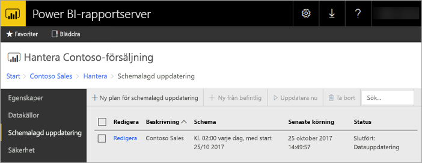
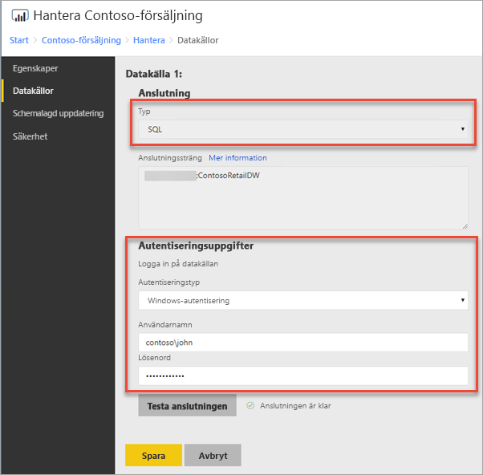
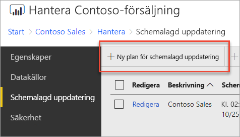
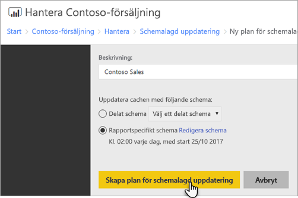
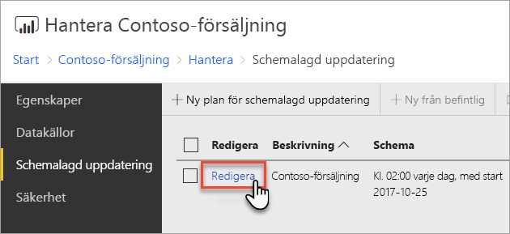
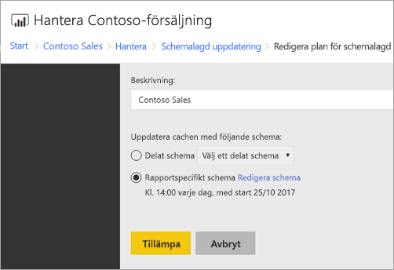

# Konfigurera schemalagd uppdatering av en Power BI-rapport
Om du vill uppdatera data i Power BI-rapport måste du skapa en plan för schemalagd uppdatering. Detta görs i området *Hantera* i Power BI-rapporten.

## Konfigurera autentiseringsuppgifter för datakälla
Innan du skapar en datauppdateringsplan, måste du ange autentiseringsuppgifter för **varje datakälla** som används i din Power BI-rapport.

1. Högerklicka på Power BI-rapporten i webbportalen och välj **Hantera**.
   
    
2. I den vänstra menyn väljer du fliken **Datakällor**.
3. Välj typ av autentisering som ska användas vid anslutning till varje datakälla. Ange rätt autentiseringsuppgifter.
   
    

## Skapa en plan för schemalagd uppdatering
Följ dessa steg om du vill skapa en plan för schemalagd uppdatering.

1. Högerklicka på Power BI-rapporten i webbportalen och välj **Hantera**.
   
    
2. I den vänstra menyn väljer du fliken **Schemalagd uppdatering**.
3. På sidan **schemalagd uppdatering** väljer du**ny plan för schemalagd uppdatering**.
   
    
4. På sidan **Ny plan för schemalagd uppdatering** anger du en beskrivning och ett schema för när du vill att din datamodell ska uppdateras.
5. Välj **Skapa plan för schemalagd uppdatering** när du är klar.
   
    

## Ändra en plan för schemalagd uppdatering
Du ändrar en plan för schemalagd uppdatering på ungefär samma sätt som du skapar den.

1. Högerklicka på Power BI-rapporten i webbportalen och välj **Hantera**.
   
    
2. I den vänstra menyn väljer du fliken **Schemalagd uppdatering**.
3. På sidan **Schemalagd uppdatering** väljer du **Redigera** bredvid uppdateringsplanen som du vill hantera.
   
    
4. På sidan **Redigera plan för schemalagd uppdatering** anger du en beskrivning och ett schema för när du vill att din datamodell ska uppdateras.
5. Välj **Använd** när du är klar.
   
    

## Visa status för plan för schemalagd uppdatering
Visa status för en plan för schemalagd uppdatering i webbportalen.

1. Högerklicka på Power BI-rapporten i webbportalen och välj **Hantera**.
   
    
2. I den vänstra menyn väljer du fliken **Schemalagd uppdatering**.
3. På sidan **Schemalagd uppdatering** visar den högra kolumnen för de flesta sidan status för en plan.
   
   | **Status** | **Beskrivning** |
   | --- | --- |
   | Ny plan för schemalagd uppdatering |Planen har skapats men har inte körts. |
   | Uppdaterar |Uppdateringsprocessen har startats. |
   | Spela upp modellen direkt på Analysis Server |Kopiera modellen från rapportserverns katalogdatabas till den värdbaserade Analysis Services-instansen. |
   | Uppdaterar data |Uppdatera data i modellen. |
   | Ta bort autentiseringsuppgifterna från modellen |De autentiseringsuppgifter som användes för att ansluta till datakällan från modellen har tagits bort. |
   | Spara modellen till katalogen |Uppdatering av data är klar och den uppdaterade modellen sparas tillbaka till katalogen för rapportserverdatabasen. |
   | Slutförd: Datauppdatering |Uppdateringen är klar. |
   | Fel: |Ett fel uppstod under uppdatering och visas. |

Webbsidan måste uppdateras för att visa aktuell status. Statusen ändras inte automatiskt.

## Nästa steg
Läs mer om att skapa och ändra scheman i [Skapa, ändra och ta bort scheman](https://docs.microsoft.com/sql/reporting-services/subscriptions/create-modify-and-delete-schedules).

Information om hur du felsöker schemalagd uppdatering finns i [Felsök schemalagd uppdatering i Power BI Report Server](scheduled-refresh-troubleshoot.md).

Har du fler frågor? [Fråga Power BI Community](https://community.powerbi.com/)

