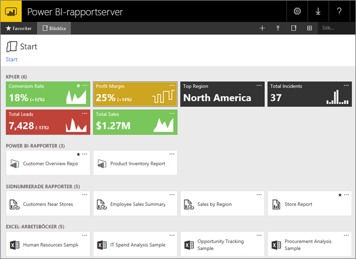
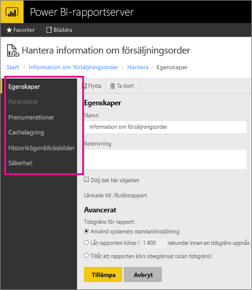

# Hantera innehåll i webbportalen 
Webbportalen för Power BI-rapportserver är en lokal plats för att visa, lagra och hantera dina Power BI, mobila och sidnumrerade rapporter och KPI:er.

Du kan visa webbportalen i alla moderna webbläsare. Rapporter och KPI:er i webbportalen är uppdelade i mappar och du kan markera dem som favoriter. Du kan även lagra Excel-arbetsböcker där. Från webbportalen kan du starta de verktyg du behöver för att skapa rapporter:

* **Power BI-rapporter** skapade med Power BI Desktop: Visa dem på webbportalen och i Power BI-mobilappar.
* **Sidnumrerade rapporter** skapade i Report Builder: Dokument med modernt utseende och fast layout optimerade för utskrift.
* **KPI:er** skapas direkt i webbportalen.

I webbportalen kan du bläddra igenom mapparna på rapportservern eller söka efter specifika rapporter. Du kan visa en rapport, dess allmänna egenskaper och tidigare kopior av rapporten som finns i rapporthistoriken. Beroende på dina behörigheter, kan du även kunna prenumerera på rapporter för leverans till din inkorgen eller en delad mapp i filsystemet.

## Webbportalsroller och behörigheter
Webbportalen är ett program som körs i en webbläsare. När du startar webbportalen, är de sidor, länkar och alternativ som du ser beroende av de behörigheter som du har på rapportservern. Om du har tilldelats en roll med fullständiga behörigheter, har du åtkomst till en fullständig uppsättning programmenyer och -sidor för att hantera en rapportserver. Om du har tilldelats en roll med behörigheter att visa och köra rapporter, visas bara menyer och sidor som du behöver för de aktiviteterna. Du kan ha olika rolltilldelningar för olika rapportservrar eller till och med för olika rapporter och mappar på en enda rapportserver.

## Starta webbportalen
1. Öppna din webbläsare.
   
    Se den här listan över [webbläsare och versioner som stöds](browser-support.md).
2. I adressfältet, skriver du webbportalens URL.
   
    Som standard är URL:en <em>http://[ComputerName]/reports</em>.
   
    Rapportservern kan ha konfigurerats för att använda en specifik port. Till exempel <em>http://[ComputerName]:80/reports</em> eller <em>http://[ComputerName]:8080/reports</em>
   
    Du ser att webbportalen grupperar objekt i dessa kategorier:
   
   * KPI:er
   * Mobila rapporter
   * Sidnumrerade rapporter
   * Power BI Desktop-rapporter
   * Excel-arbetsböcker
   * Datauppsättningar
   * Datakällor
   * Resurser

## Hantera objekt i webbportalen
Power BI-rapportserver ger dig detaljerad kontroll över de objekt som du lagrar på webbportalen. Du kan till exempel konfigurera prenumerationer, cachelagring, ögonblicksbilder och säkerhet för individuella sidnumrerade rapporter.

1. Välj ellipsen (...) i det övre högra hörnet av ett objekt och välj sedan **Hantera**.
   
    
2. Välj egenskapen eller den andra funktionen du vill ange.
   
    
3. Välj **Tillämpa**.

Läs mer om att [arbeta med prenumerationer i webbportalen](https://docs.microsoft.com/sql/reporting-services/working-with-subscriptions-web-portal).

## Nästa steg
[Vad är Power BI-rapportservern?](get-started.md)

Har du fler frågor? [Fråga Power BI Community](https://community.powerbi.com/)

