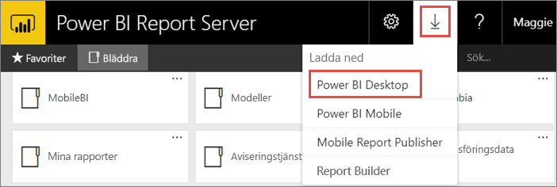
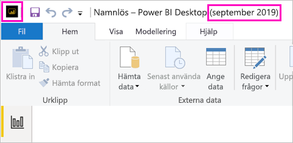
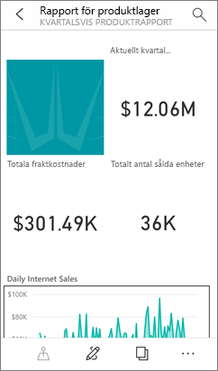

# Installera Power BI Desktop som har optimerats för Power BI-rapportservern

Om du vill skapa Power BI-rapporter för Power BI-rapportservern måste du hämta och installera den version av Power BI Desktop som är optimerad för Power BI-rapportserver. Den här versionen skiljer sig från Power BI Desktop som används med Power BI-tjänsten. Versionen av Power BI Desktop för Power BI-tjänsten innehåller till exempel förhandsgranskningsfunktioner som inte är tillgängliga i Power BI-rapportserverversionen förrän de är allmänt tillgängliga. Om du använder den här versionen, se till att rapportservern kan interagera med en känd version av rapporter och modeller. 

Den bra nyheten är att du kan installera Power BI Desktop och Power BI Desktop som har optimerats för Power BI-rapportservern sida vid sida på samma dator.

## Ladda ner och installera Power BI Desktop

Det enklaste sättet att se till att du har den senaste versionen av Power BI Desktop optimerad för Power BI-rapportserver är att starta från webbportalen för din rapportserver.

1. I webbportalen för rapportservern väljer du pilen **Hämta** > **Power BI Desktop**.

    

    Eller gå till startsidan för [Power BI-rapportservern](https://powerbi.microsoft.com/report-server/) och välj **Avancerade nedladdningsalternativ**.

2. På sidan Download Center väljer du ett språk och sedan **Hämta**.

3. Beroende på din dator, väljer du: 

    - **PBIDesktopRS.msi** (32-bitarsversionen) eller
    - **PBIDesktopRS_x64.msi** (64-bitarsversionen).

1. När du har hämtat installationsprogrammet kör du installationsguiden för Power BI Desktop (september 2019).

2. I slutet av installationen väljer du **Starta Power BI Desktop**.

    Det startar automatiskt och du är redo att sätta igång.

## Kontrollera att du använder rätt version
Det är enkelt att kontrollera att du använder rätt version av Power BI Desktop: Titta på startskärmen eller namnlisten i Power BI Desktop. Du kan se att du har rätt version eftersom det står **Power BI Desktop (september 2019)** i namnlisten. Power BI-logotypens färger är dessutom spegelvända, gult på svart istället för svart på gult.

Versionen av Power BI Desktop för Power BI-tjänsten har inte månaden och året i namnlisten.

## Association för filtillägg
Om du installerar både Power BI Desktop och Power BI Desktop som har optimerats för Power BI-rapportservern på samma dator har den senaste installationen av Power BI Desktop en filassociation med .pbix-filer. Det innebär att den Power BI Desktop-version som installerades senast öppnas när du dubbelklickar på en pbix-fil.

Om du har Power BI Desktop och sedan installerar Power BI Desktop som har optimerats för Power BI-rapportservern öppnas alla pbix-filer i Power BI Desktop som är optimerat för Power BI-rapportservern som standard. Om du hellre vill att Power BI Desktop ska vara standard för att öppna pbix-filer kan du installera om [Power BI Desktop från Microsoft Store](https://aka.ms/pbidesktopstore).

Du kan alltid öppna den version av Power BI Desktop som du vill använda först. Och sedan öppna filen i Power BI Desktop.

När du redigerar en Power BI-rapport från Power BI-rapportservern eller skapar en ny Power BI-rapport från webbportalen öppnas alltid rätt version av Power BI Desktop.

## Överväganden och begränsningar

Power BI-rapporter i Power BI-rapportserver, i Power BI-tjänsten (`https://app.powerbi.com` och i Power BI-mobilappen fungerar nästan likadant men några funktioner skiljer sig).

### Välja ett språk

För Power BI Desktop som har optimerats för Power BI-rapportserver väljer du språk när du installerar appen. Du kan inte ändra språket i efterhand, men du kan installera en version på ett annat språk.

### Visuellt rapportobjekt i en webbläsare

Rapporter i Power BI-rapportservern har stöd för nästan alla visualiseringar, inklusive visuella Power BI-objekt. Rapporter i Power BI-rapportservern stöder inte:

* R-visualiseringar
* ArcGIS-mappar
* Synliga sökvägar
* Power BI Desktop-förhandsgranskningsfunktioner

### Rapporter i Power BI-mobilappar

Rapporter i Power BI-rapportservern stöder alla de grundläggande funktionerna i [Power BI-mobilappar](../consumer/mobile/mobile-apps-for-mobile-devices.md), inklusive:

* [Telefonrapportlayout](../desktop-create-phone-report.md): Du kan optimera en rapport för Power BI-mobilappar. Optimerade rapporter på din mobiltelefon har en särskild ikon,  och en särskild layout.
  
    

Rapporter i Power BI-rapportservern stöder inte de här funktionerna i Power BI-mobilappar:

* R-visualiseringar
* ArcGIS-mappar
* Visuella objekt för Power BI
* Synliga sökvägar
* Geofiltering eller streckkoder

### Anpassad säkerhet

Det finns inget stöd för anpassad säkerhet i Power BI Desktop optimerad för Power BI-rapportserver. Om din Power BI-rapportserver har konfigurerats med ett anpassat säkerhetstillägg kan du inte spara en Power BI-rapport från Power BI Desktop (optimerad för Power BI Report Server) till Power BI Report Server-instansen. Du måste spara .pbix-rapportfilen från Power BI Desktop och ladda upp den till Power BI Report Server-portalen.

### Spara rapporter på en Power BI-rapportserver i en annan domän

När du sparar en Power BI-rapport på en Power BI-rapportserver används dina Windows-autentiseringsuppgifter. Du kan inte spara direkt på en rapportserver i en annan domän än den där dina Windows-autentiseringsuppgifter gäller. Du kan visa rapportservern i en webbläsare och manuellt ladda upp filen från datorn i stället.

## Power BI Desktop för tidigare versioner av Power BI-rapportserver

Om din rapportserver är en tidigare version behöver du motsvarande version av Power BI Desktop. Här är länken för att ladda ned en tidigare version.

- Microsoft Power BI Desktop ([Optimerad för Power BI Report Server – september 2019](https://go.microsoft.com/fwlink/?linkid=2103723))

## Nästa steg

Nu när du har installerat Power BI Desktop kan du börja skapa Power BI-rapporter.

[Skapa en Power BI-rapport för Power BI-rapportservern](quickstart-create-powerbi-report.md)  
[Vad är Power BI-rapportservern?](get-started.md)

Har du fler frågor? [Fråga Power BI Community](https://community.powerbi.com/)
