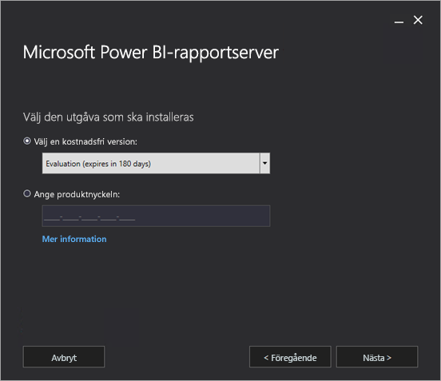
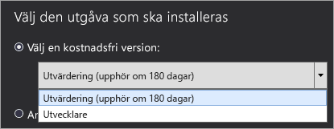
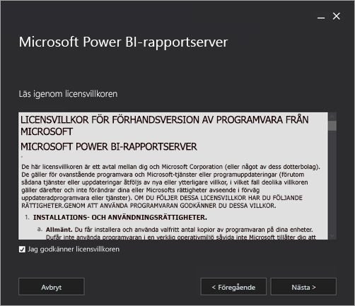
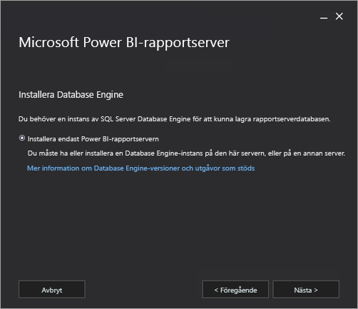
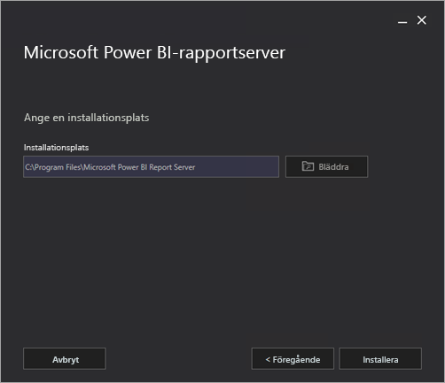
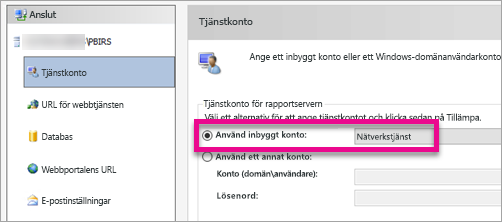
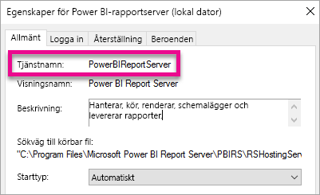

# Installera Power BI-rapportserver

Läs mer om att installera Power BI-rapportserver.

 **Hämta** 

Om du vill ladda ned Power BI-rapportservern går du till [Lokal rapportering med Power BI-rapportserver](https://powerbi.microsoft.com/report-server/) och väljer **Ladda ned kostnadsfri utvärderingsversion**. 

## Innan du börjar
Innan du installerar Power BI-rapportservern rekommenderar vi att du granskar [maskin- och programvarukraven för att installera Power BI-rapportservern](system-requirements.md).

### Produktnyckel för Power BI-rapportserver

#### Power BI Premium
Om du har köpt Power BI Premium så kommer du att ha tillgång till din produktnyckel för Power BI-raportservern i fliken **premiuminställningar** i Power BI-administratörsportalen. Den finns endast tillgänglig för globala administratörer eller användare som har tilldelats rollen Power BI-tjänstadministratör.

Om du väljer **Power BI-rapportservernyckel** så visas en dialogruta med din produktnyckel. Du kan kopiera den och använda den med installationen.

#### SQL Server Enterprise Software Assurance (SA)
Om du har ett SQL Server Enterprise SA-avtal, kan du få din produktnyckel från [Volume Licensing Service Center](https://www.microsoft.com/Licensing/servicecenter/).

## Installera din rapportserver
Det är enkelt att installera Power BI-rapportservern. Det krävs endast några få steg för att installera filerna.

Du behöver inte en SQL Server Database Engine-server tillgänglig vid tidpunkten för installationen. Du behöver bara en för att konfigurera Reporting Services efter installationen.

1. Hitta platsen för PowerBIReportServer.exe och starta installationsprogrammet.
2. Välj **installera Power BI-rapportservern**.
   
    
3. Välj en utgåva att installera och välj sedan **nästa**.
   
    
   
    Du kan välja antingen utvärdering eller Developer edition från listmenyn.
   
    
   
    Annars kan du ange en produktnyckel för den server som du har köpt från antingen Power BI-tjänsten eller Volume License Service Center. Mer information om hur du hämtar produktnyckeln finns i avsnittet [innan du börjar](#before-you-begin).
4. Läs och godkänn licensvillkoren och välj sedan **nästa**.
   
    
5. Du måste ha en databasmotor som är tillgänglig för att lagra rapportserverdatabasen. Välj **nästa** för att enbart installera rapportservern.
   
    
6. Ange installationsplatsen för rapportservern. Välj **installera** för att fortsätta.
   
    
   
    Standardsökvägen är C:\Program Files\Microsoft Power BI Report Server.

1. När installationen är slutförd, kan du välja **konfigurera rapportservern** för att starta konfigurationshanteraren för Reporting Services.
   
    

## Konfigurera rapportservern

När du har valt **Konfigurera rapportservern** i installationsprogrammet, visas du konfigurationshanteraren för Reporting Services. Mer information finns i [konfigurationshanteraren för Reporting Services](https://docs.microsoft.com/sql/reporting-services/install-windows/reporting-services-configuration-manager-native-mode).

Du behöver [skapa en rapportserverdatabas](https://docs.microsoft.com/sql/reporting-services/install-windows/ssrs-report-server-create-a-report-server-database) för att slutföra den inledande konfigurationen av Reporting Services. En SQL Server Database-server krävs för att slutföra det här steget.

### Skapa en databas på en annan server
Om du skapar rapportserverdatabasen på en databasserver på en annan dator, måste du ändra tjänstkontot för rapportservern till en autentiseringsuppgift som kan identifieras på databasservern. 

Som standard använder rapportservern det virtuella tjänstkontot. Om du försöker skapa en databas på en annan server, kan du få följande fel i steget tillämpar anslutningsrättigheter.

`System.Data.SqlClient.SqlException (0x80131904): Windows NT user or group '(null)' not found. Check the name again.`

Du kan kringgå felet genom att ändra kontot till antingen nätverkstjänst eller ett domänkonto. Om du ändrar kontot till nätverkstjänst så tillämpas rättigheter i kontexten för datorkontot för rapportservern.

Mer information finns i [konfigurera tjänstkontot för rapportservern](https://docs.microsoft.com/sql/reporting-services/install-windows/configure-the-report-server-service-account-ssrs-configuration-manager).

## Windows-tjänsten
En windows-tjänst skapas som en del av installationen. Den visas som **Power BI-rapportserver**. Tjänstnamnet är **PowerBIReportServer**.

## Standard-URL-reservationer
URL-reservationer består av ett prefix, värdnamn, port och en virtuell katalog:

| Del | Beskrivning |
| --- | --- |
| Prefix |Standardprefixet är HTTP. Om du tidigare har installerat ett certifikat för Secure Sockets Layer (SSL) görs ett försök att skapa URL-reservationer som använder HTTPS-prefixet. |
| Värddatornamn |Standardvärdnamnet är ett starkt jokertecken (+). Det anger att rapportservern godkänner alla HTTP-begäranden på den angivna porten för alla värdnamn som matchas till datorn, inklusive `http://<computername>/reportserver`, `http://localhost/reportserver` eller`http://<IPAddress>/reportserver.` |
| Port |Standardporten är 80. Om du använder någon annan port än port 80 så måste du uttryckligen lägga till den till URL:en när du öppnar webbportalen i ett webbläsarfönster. |
| Virtuell katalog |Som standard skapas virtuella kataloger i formatet ReportServer för webbtjänsten rapportserver och rapporter för webbportalen. För webbtjänsten rapportserver, är den virtuella standardkatalogen **rapportserver**. För webbportalen är den virtuella standardkatalogen **rapporter**. |

Ett exempel på den fullständiga URL-strängen kan vara följande:

* `http://+:80/reportserver`, ger åtkomst till rapportservern.
* `http://+:80/reports`, ger åtkomst till webbportalen.

## Brandväggen
Om du ansluter till rapportservern från en fjärrdator, behöver du kontrollera att du har konfigurerat brandväggsregler om det finns en brandvägg.

Du måste öppna TCP-porten som du har konfigurerat för din webbtjänst-URL och webbportals-URL. De är konfigurerade på TCP-port 80 som standard.

## Ytterligare konfiguration
* Om du vill konfigurera integration med Power BI-tjänsten så att du kan fästa rapportobjekt i en Power BI-instrumentpanel, se [integrera med Power BI-tjänsten](https://docs.microsoft.com/sql/reporting-services/install-windows/power-bi-report-server-integration-configuration-manager).
* Om du vill konfigurera e-post för prenumerationsbearbetning, se [e-postinställningar](https://docs.microsoft.com/sql/reporting-services/install-windows/e-mail-settings-reporting-services-native-mode-configuration-manager) och [e-postleverans i en rapportserver](https://docs.microsoft.com/sql/reporting-services/subscriptions/e-mail-delivery-in-reporting-services).
* Om du vill konfigurera webbportalen så att du kan komma åt den på en rapportdator för att visa och hantera rapporter, se [konfigurera en brandvägg för reportserveråtkomst](https://docs.microsoft.com/sql/reporting-services/report-server/configure-a-firewall-for-report-server-access) och [konfigurera en rapportserver för fjärradministration](https://docs.microsoft.com/sql/reporting-services/report-server/configure-a-report-server-for-remote-administration).

## Nästa steg
[Administratörsöversikt](admin-handbook-overview.md)  
[Så här hittar du rapportserverns produktnyckel](find-product-key.md)  
[Installera Power BI Desktop optimerad för Power BI-rapportserver](install-powerbi-desktop.md)  
[Verifiera en Reporting Services-installation](https://docs.microsoft.com/sql/reporting-services/install-windows/verify-a-reporting-services-installation)  
[Konfigurera tjänstkontot för rapportservern](https://docs.microsoft.com/sql/reporting-services/install-windows/configure-the-report-server-service-account-ssrs-configuration-manager)  
[Konfigurera rapportserverns URL:er](https://docs.microsoft.com/sql/reporting-services/install-windows/configure-report-server-urls-ssrs-configuration-manager)  
[Konfigurera en databasanslutning för rapportservern](https://docs.microsoft.com/sql/reporting-services/install-windows/configure-a-report-server-database-connection-ssrs-configuration-manager)  
[Initiera en rapportserver](https://docs.microsoft.com/sql/reporting-services/install-windows/ssrs-encryption-keys-initialize-a-report-server)  
[Konfigurera SSL-anslutningar på en rapportserver](https://docs.microsoft.com/sql/reporting-services/security/configure-ssl-connections-on-a-native-mode-report-server)  
[Konfigurera Windows-tjänstekonton och -behörigheter](https://docs.microsoft.com/sql/database-engine/configure-windows/configure-windows-service-accounts-and-permissions)  
[Webbläsarstöd för Power BI-rapportserver](browser-support.md)

Har du fler frågor? [Fråga Power BI Community](https://community.powerbi.com/)

