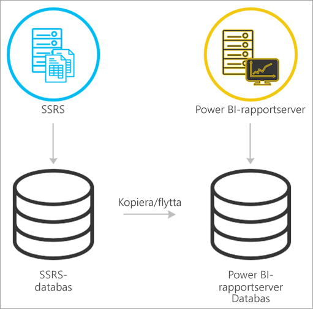
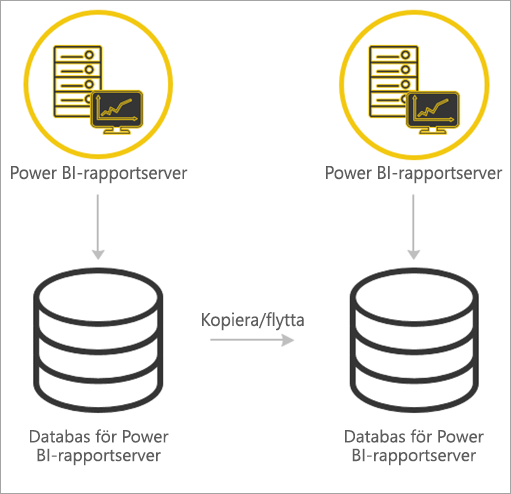

# <a name="migrate-a-report-server-installation"></a>Migrera en rapportserverinstallation
Läs hur du migrerar din befintliga SQL Server Reporting Services-instans (SSRS) till en instans av Power BI-rapportserver.

Migrering definieras som att flytta programdatafiler till en ny Power BI-rapportserverinstans. Här följer några vanliga orsaker till varför du kan behöva migrera din installation:

* Du vill flytta från SQL Server Reporting Services till Power BI-rapportserver
  
  > [!NOTE]
  > Det finns ingen uppgradering på plats från SQL Server Reporting Services till Power BI-rapportserver. Det krävs en migrering.
  > 
  > 
* Du har en storskalig distribution eller uppdateringskrav
* Du ändrar maskinvara eller topologin för din installation
* Du påträffar ett problem som blockerar uppgraderingen

## <a name="migrating-to-power-bi-report-server-from-ssrs-native-mode"></a>Migrera till Power BI-rapportserver från SSRS (enhetligt läge)
En migrering från en instans av SSRS (enhetligt läge) till Power BI-rapportserver består av några steg.



> [!NOTE]
> SQL Server 2008 Reporting Services och senare har stöd för migrering.
> 
> 

* Säkerhetskopiera databas-, program- och konfigurationsfiler
* Säkerhetskopiera krypteringsnyckeln
* Klona din rapportserverdatabas som innehåller dina rapporter
* Installera Power BI-rapportserver. Om du använder samma maskinvara, kan du installera Power BI-rapportserver på samma server som SSRS-instansen. Mer information om hur du installerar Power BI-rapportserver finns i [Installera Power BI-rapportserver](install-report-server.md).

> [!NOTE]
> Instansnamnet för Power BI-rapportserver kommer att vara *PBIRS*.
> 
> 

* Konfigurera rapportservern med hjälp av konfigurationshanteraren för Report Server och ansluta till den klonade databasen.
* Genomför de rensningar som behövs för SSRS-instansen (enhetligt läge)

## <a name="migration-to-power-bi-report-server-from-ssrs-sharepoint-integrated-mode"></a>Migrera till Power BI-rapportserver från SSRS (SharePoint-integrerat läge)
Det är inte lika enkelt att migrera från en SSRS (SharePoint-integrerat läge) till Power BI-rapportserver som det är i enhetligt läge. De här stegen ger lite vägledning, men du kan ha andra filer och tillgångar inom SharePoint som behöver hanteras utanför de här stegen.


Du måste migrera det specifika rapportserverinnehållet från SharePoint till din Power BI-rapportserver. Detta förutsätter att du redan har installerat Power BI-rapportserver någonstans i din miljö. Mer information om hur du installerar Power BI-rapportserver finns i [Installera Power BI-rapportserver](install-report-server.md).

Om du vill kopiera rapportserverinnehållet från din SharePoint-miljö till Power BI-rapportserver, måste du använda verktyg som **rs.exe** för att kopiera innehållet. Nedan visas ett exempel på skriptet för att kopiera rapportserverinnehåll från SharePoint till Power BI-rapportserver.

> [!NOTE]
> Exempelskriptet bör arbeta mot SharePoint 2010 och senare och SQL Server 2008 Reporting Services och senare.
> 
> 

### <a name="sample-script"></a>Exempelskript
```
Sample Script
rs.exe
-i ssrs_migration.rss -e Mgmt2010
-s http://SourceServer/_vti_bin/reportserver
-v st="sites/bi" -v f="Shared Documents“
-u Domain\User1 -p Password
-v ts=http://TargetServer/reportserver
-v tu="Domain\User" -v tp="Password"
```

## <a name="migrateing-from-one-power-bi-report-server-to-another"></a>Migrera från en Power BI-rapportserver till en annan
Att migrera från en Power BI-rapportserver är samma process som att migrera från SSRS (enhetligt läge).



* Säkerhetskopiera databas-, program- och konfigurationsfiler
* Säkerhetskopiera krypteringsnyckeln
* Klona din rapportserverdatabas som innehåller dina rapporter
* Installera Power BI-rapportserver. Du *kan inte* installera Power BI-rapportserver på samma server som du migrerar från. Mer information om hur du installerar Power BI-rapportserver finns i [Installera Power BI-rapportserver](install-report-server.md).

> [!NOTE]
> Instansnamnet för Power BI-rapportserver kommer att vara *PBIRS*.
> 
> 

* Konfigurera rapportservern med hjälp av konfigurationshanteraren för Report Server och ansluta till den klonade databasen.
* Utför all rensning som behövs för den gamla Power BI-rapportserverinstallationen.

## <a name="next-steps"></a>Nästa steg
[Administratörsöversikt](admin-handbook-overview.md)  
[Installera Power BI-rapportserver](install-report-server.md)  
[Skriptet med rs.exe-verktyget och webbtjänsten](https://docs.microsoft.com/sql/reporting-services/tools/script-with-the-rs-exe-utility-and-the-web-service)

Har du fler frågor? [Fråga Power BI Community](https://community.powerbi.com/)

