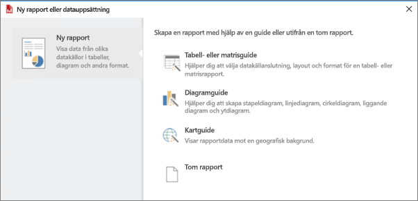
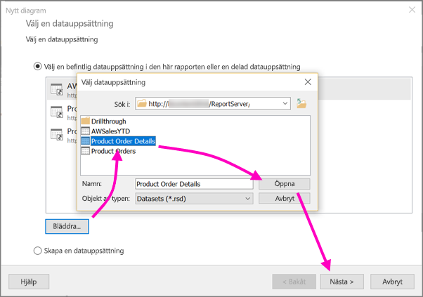
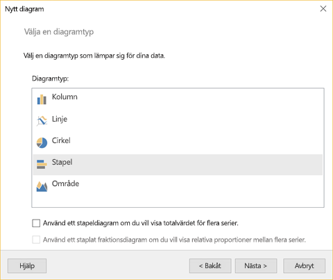
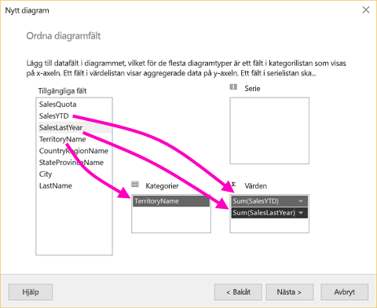
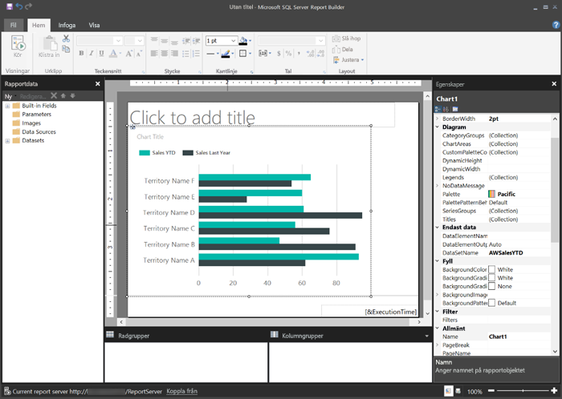
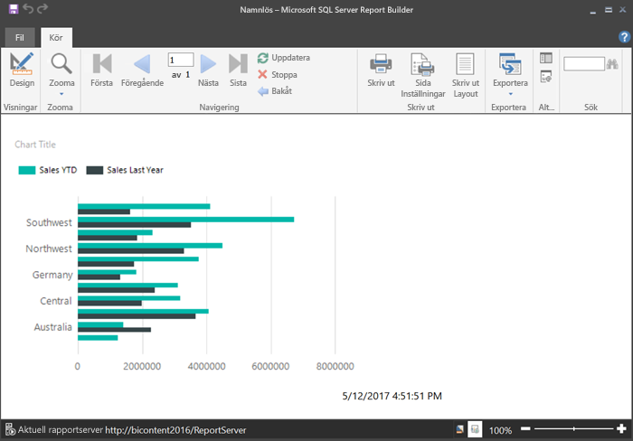
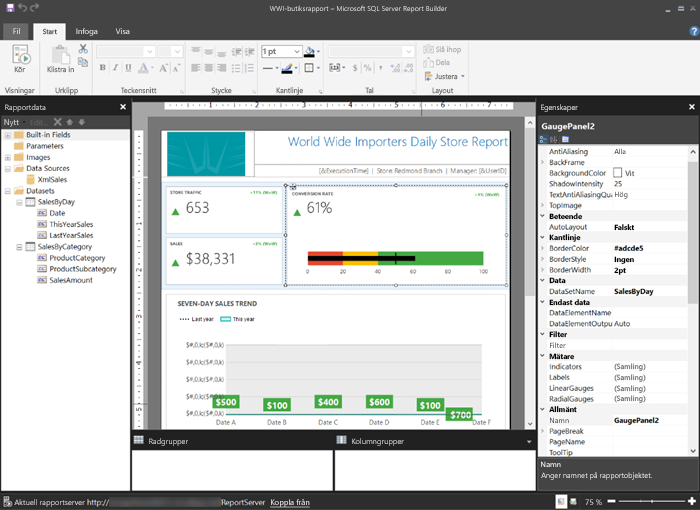

# Skapa en sidnumrerad rapport för Power BI-rapportservern
Som namnet antyder sidnumrerade rapporter ha många sidor. De har ett fast format och kan anpassas med precision. Sidnumrerade rapporter är RDL-filer.

Du kan lagra och hantera sidnumrerade rapporter i webbportalen Power BI Report Server, precis som i webbportalen SQL Server Reporting Services (SSRS). Skapa och redigera dem i Report Builder eller Report Designer i SQL Server Data Tools (SSDT) och publicera dem sedan i någon av webbportalerna. Personerna i din organisation som läser rapporterna kan se dem i webbläsaren eller i mobilappen Power BI på deras mobilenhet.

Om du redan har skapat sidnumrerade rapporter i Report Builder eller Report Designer är du redo att skapa sidnumrerade rapporter för Power BI-rapportservern. Annars kan du följa dessa snabbsteg för att komma igång.

## Steg 1: Installera och starta Report Builder
Du kanske redan har installerat Report Builder för att skapa rapporter för SSRS-servern. Du kan använda samma version eller Report Builder för att skapa rapporter för Power BI-rapportservern. Det är lätt att installera programmet.

1. Välj **ny** > **sidnumrerad rapport** i webbportalen för Power BI-rapportservern.
   
    
   
    Om du inte redan har installerat Report Builder vägleds du nu genom installationsprocessen.
2. När Report Builder har installerats öppnas programmet på skärmen **Ny rapport eller datamängd**.
   
    
3. Välj guiden för den typ av rapport som du vill skapa:
   
   * Tabell eller matris
   * Diagram
   * Karta
   * Inget
4. Vi börjar med guiden för diagram.
   
    Diagramguiden hjälper dig att skapa ett grundläggande diagram i en rapport. Därifrån kan du anpassa rapporten på ett nästa obegränsat antal sätt.

## Steg 2: Gå igenom diagramguiden
Diagramguiden hjälper dig att skapa en visualisering i en rapport.

Sidnumrerade rapporter kan ansluta till en mängd olika datakällor, från Microsoft SQL Server och Microsoft Azure SQL Database till Oracle, Hyperion och mycket mer. Läs mer om [datakällor som kan användas i sidnumrerade rapporter](connect-data-sources.md).

På den första sidan i diagramguiden, **Välj en datamängd**, kan du skapa en datamängd eller välja en delad datamängd på en server. *Datauppsättningar* returnerar rapportdata från en fråga på en extern datakälla.

1. Välj **Bläddra** > välj en delad datamängd på en server > **Öppna** > **Nästa**.
   
    
   
     Behöver du skapa en datauppsättning? Se [Skapa en delad eller inbäddade datauppsättning](https://docs.microsoft.com/sql/reporting-services/report-data/create-a-shared-dataset-or-embedded-dataset-report-builder-and-ssrs).
2. Välj en diagramtyp – i det här fallet ett stapeldiagram.
   
    
3. Ordna fälten genom att dra dem till rutorna **Kategorier**, **Serier** och **Värden**.
   
    
4. Välj **Nästa** > **Slutför**.

## Steg 3: Utforma din rapport
Nu är du i designvyn i rapporten. Observera att dessa data är platshållare, inte dina data.

* Välj **kör** om du vill visa dina data.
  
     
* Välj **Design** om du vill gå tillbaka till designvyn.

Du kan redigera diagrammet som du precis skapade, ändra layout, värden, förklaringar... praktiskt taget vad som helst.

Och du kan lägga till alla typer av andra visualiseringar: mätare, tabeller, matriser, tabeller, kartor och mycket mer. Du kan lägga till sidhuvuden och sidfötter för flera sidor. Gå till självstudierna för [Report Builder](https://docs.microsoft.com/sql/reporting-services/report-builder-tutorials) för att testa dem själv.

## Steg 4: Spara din rapport på rapportservern
När rapporten är klar kan du spara den i Power BI-rapportservern.

1. På menyn **Arkiv** väljer du **Spara som** och sparar den till rapportservern. 
2. Nu kan du visa den i webbläsaren.
   
    

## Nästa steg
Det finns många bra resurser för att designa rapporter i Report Builder och i Report Designer i SQL Server Data Tools. Självstudiekurserna för Report Builder är ett bra ställe att börja.

* [Report Builder, självstudier](https://docs.microsoft.com/sql/reporting-services/report-builder-tutorials)
* [Användarhandbok för Power BI-rapportserver](user-handbook-overview.md)  

Har du fler frågor? [Fråga Power BI Community](https://community.powerbi.com/)

