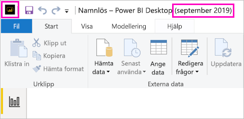
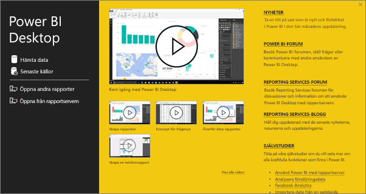
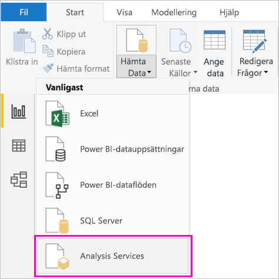
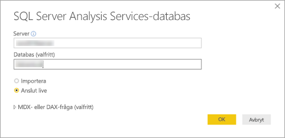
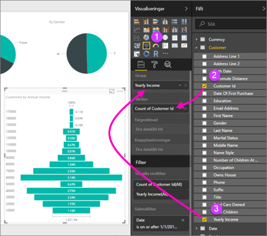

# Skapa en Power BI-rapport för Power BI-rapportservern
Du kan lagra och hantera Power BI-rapporter lokalt i webbportalen för Power BI-rapportserver, precis som du kan lagra Power BI-rapporter i molnet i Power BI-tjänsten (https://powerbi.com). Du skapar och redigerar rapporter i Power BI Desktop och publicerar dem till webbportalen. Rapportläsare i din organisation kan sedan se dem i webbläsaren eller i en Power BI-mobilapp på en mobilenhet.

Här är fyra steg för att komma igång snabbt.

## Steg 1: Installera Power BI Desktop som har optimerats för Power BI-rapportservern

Om du redan har skapat Power BI-rapporter i Power BI Desktop är du nästan redo att skapa Power BI-rapporter för Power BI-rapportserver. Vi rekommenderar att du installerar versionen av Power BI Desktop som är optimerad för Power BI-rapportserver så att du vet att servern och appen alltid är synkroniserade. Du kan ha bägge versionerna av Power BI Desktop på samma dator.

1. I webbportalen för rapportservern väljer du pilen **Hämta** > **Power BI Desktop**.

    

    Eller gå till startsidan för [Power BI-rapportservern](https://powerbi.microsoft.com/report-server/) och välj **Avancerade nedladdningsalternativ**.

2. På sidan Download Center väljer du **Hämta**.

3. Beroende på din dator, väljer du:

    - **PBIDesktopRS.msi** (32-bitarsversionen) eller

    - **PBIDesktopRS_x64.msi** (64-bitarsversionen).

4. När du har hämtat installationsprogrammet kör du installationsguiden för Power BI Desktop (september 2019).

2. I slutet av installationen, markerar du **Starta Power BI Desktop nu**.
   
    Det startar automatiskt och du är redo att sätta igång. Du kan se att du har rätt version eftersom det står **Power BI Desktop (september 2019)** i namnlisten.

    

3. Om du inte är bekant med Power BI Desktop, bör du titta på videoklippen på välkomstskärmen.
   
    

## Steg 2: Välj en datakälla
Du kan ansluta till en mängd olika datakällor. Läs mer om att [ansluta till datakällor](connect-data-sources.md).

1. På välkomstskärmen väljer du **hämta data**.
   
    På fliken **Start** väljer du **hämta data**.
2. Välj din datakälla. I det här exemplet **Analysis Services**.
   
    
3. Fyll i **server** och **databas** om du vill. Kontrollera att **anslut live** är markerat > **OK**.
   
    
4. Välj rapportservern där du ska spara dina rapporter.
   
    

## Steg 3: Utforma din rapport
Nu kommer det roliga: Du får skapa visuella objekt som illustrerar dina data.

Du kan till exempel skapa ett trattdiagram med kunder och gruppvärden efter årliga intäkter.

1. I **visualiseringar** väljer du **trattdiagram**.
2. Dra fältet som ska räknas till brunnen **värden**. Om det inte är ett numeriskt fält, gör Power BI Desktop automatiskt det till ett *antal* av värdet.
3. Dra fältet till gruppen på **grupp**-brunnen.

Läs mer om [att skapa en Power BI-rapport](../desktop-report-view.md).

## Steg 4: Spara din rapport på rapportservern
När din rapport är klar, kan du spara den på den Power BI-rapportserver som du valde i steg 2.

1. På **fil**-menyn, väljer du **spara som** > **Power BI-rapportserver**.
   
    
2. Nu kan du visa den i webbportalen.
   
    
    
> [!NOTE]
> Om du redigerar rapporten i framtiden kommer de rapportdata du ser på skrivbordet alltid att vara cachelagrade data från när rapporten ursprungligen skapades.  Om du vill visa aktuella data när du redigerar rapporten måste du uppdatera data i Power BI Desktop-programmet.

## Nästa steg
### Power BI Desktop
Det finns många bra resurser för att skapa rapporter i Power BI Desktop. Den här länken är en bra utgångspunkt.

* [Kom igång med Power BI Desktop](../desktop-getting-started.md)
* Interaktiv utbildning: [Utforska Power BI Desktop](/learn/modules/get-data-power-bi/2-getting-started-power-bi-desktop)

### Power BI-rapportserver
* [Installera Power BI Desktop som har optimerats för Power BI-rapportservern](install-powerbi-desktop.md)  
* [Vad är Power BI-rapportservern?](get-started.md)  

Har du fler frågor? [Fråga Power BI Community](https://community.powerbi.com/)
