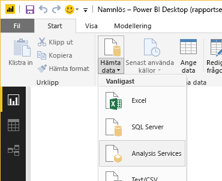
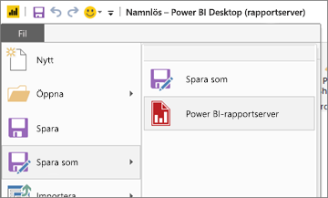

# Snabbstart: Skapa en Power BI-rapport för Power BI-rapportserver
Du kan lagra och hantera Power BI-rapporter lokalt i webbportalen för Power BI-rapportserver, precis som du kan lagra Power BI-rapporter i molnet i Power BI-tjänsten (https://powerbi.com). Du skapar och redigerar rapporter i Power BI Desktop och publicerar dem till webbportalen. Rapportläsare i din organisation kan sedan se dem i webbläsaren eller i en Power BI-mobilapp på en mobilenhet.

Här är fyra steg för att komma igång snabbt.

## Steg 1: Installera Power BI Desktop som har optimerats för Microsoft Power BI-rapportserver

Om du redan har skapat Power BI-rapporter i Power BI Desktop är du nästan redo att skapa Power BI-rapporter för Power BI-rapportserver. Vi rekommenderar att du installerar versionen av Power BI Desktop som är optimerad för Power BI-rapportserver så att du vet att servern och appen alltid är synkroniserade. Du kan ha bägge versionerna av Power BI Desktop på samma dator.

1. I webbportalen för rapportservern väljer du pilen **Hämta** > **Power BI Desktop**.

    

    Eller så du kan gå direkt till [Microsoft Power BI Desktop](https://go.microsoft.com/fwlink/?linkid=861076) (optimerad för Power BI-rapportserver – oktober 2017) i Microsoft Download Center.

2. På sidan Download Center väljer du **Hämta**.

3. Beroende på din dator, väljer du:

    - **PBIDesktopRS.msi** (32-bitarsversionen) eller

    - **PBIDesktopRS_x64.msi** (64-bitarsversionen).

4. När du har hämtat installationsprogrammet kör du installationsguiden för Power BI Desktop (oktober 2017).

2. I slutet av installationen, markerar du **Starta Power BI Desktop nu**.
   
    Det startar automatiskt och du är redo att sätta igång. Du kan se att du har rätt version eftersom det står Power BI Desktop (oktober 2017) i namnlisten.

    

3. Om du inte är bekant med Power BI Desktop, bör du titta på videoklippen på välkomstskärmen.
   
    

## Steg 2: Välj en datakälla
Du kan ansluta till en mängd olika datakällor. Läs mer om att [ansluta till datakällor](connect-data-sources.md).

1. På välkomstskärmen väljer du **hämta data**.
   
    På fliken **Start** väljer du **hämta data**.
2. Välj din datakälla. I det här exemplet **Analysis Services**.
   
    
3. Fyll i **server** och **databas** om du vill. Kontrollera att **anslut live** är markerat > **OK**.
   
    
4. Välj rapportservern där du ska spara dina rapporter.
   
    

## Steg 3: Utforma din rapport
Nu kommer det roliga: du får skapa visuella objekt som illustrerar dina data.

Du kan till exempel skapa ett trattdiagram med kunder och gruppvärden efter årliga intäkter.

1. I **visualiseringar** väljer du **trattdiagram**.
2. Dra fältet som ska räknas till brunnen **värden**. Om det inte är ett numeriskt fält, gör Power BI Desktop automatiskt det till ett *antal* av värdet.
3. Dra fältet till gruppen på **grupp**-brunnen.

Läs mer om [att skapa en Power BI-rapport](../desktop-report-view.md).

## Steg 4: Spara din rapport på rapportservern
När din rapport är klar, kan du spara den på den Power BI-rapportserver som du valde i steg 2.

1. På **fil**-menyn, väljer du **spara som** > **Power BI-rapportserver**.
   
    
2. Nu kan du visa den i webbportalen.
   
    

## Överväganden och begränsningar
Rapporter i Power BI-rapportserver och i Power BI-tjänsten (http://powerbi.com) fungerar nästan likadant, men några funktioner skiljer sig.

### I en webbläsare
Rapporter i Power BI-rapportservern har stöd för alla visualiseringar, inklusive:

* Anpassade visuella objekt

Rapporter i Power BI-rapportservern stöder inte:

* R-visualiseringar
* ArcGIS-mappar
* Synliga sökvägar
* Power BI Desktop-förhandsgranskningsfunktioner

### I Power BI-mobilappar
Rapporter i Power BI-rapportservern stöder alla de grundläggande funktionerna i [Power BI-mobilappar](../mobile-apps-for-mobile-devices.md), inklusive:

* [Telefonrapportlayout](../desktop-create-phone-report.md): Du kan optimera en rapport för Power BI-mobilappar. Optimerade rapporter på din mobiltelefon har en särskild ikon,  och layout.
  
    

Rapporter i Power BI-rapportservern stöder inte de här funktionerna i Power BI-mobilappar:

* R-visualiseringar
* ArcGIS-mappar
* Anpassade visuella objekt
* Synliga sökvägar
* Geofiltering eller streckkoder

## Nästa steg
### Power BI Desktop
Det finns många bra resurser för att skapa rapporter i Power BI Desktop. De här länkarna är en bra utgångspunkt.

* [Kom igång med Power BI Desktop](../desktop-getting-started.md)
* Interaktiv inlärning: [Kom igång med Power BI Desktop](../guided-learning/gettingdata.yml#step-2)

### Power BI-rapportserver
* [Installera Power BI Desktop som har optimerats för Power BI-rapportservern](install-powerbi-desktop.md)  
* [Användarhandbok för Power BI-rapportserver](user-handbook-overview.md)  

Har du fler frågor? [Fråga Power BI Community](https://community.powerbi.com/)
