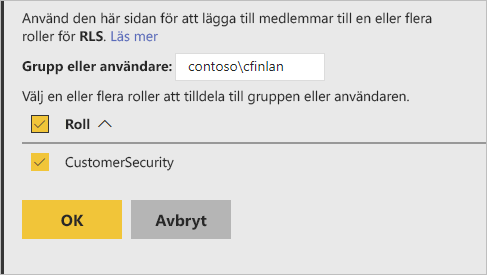
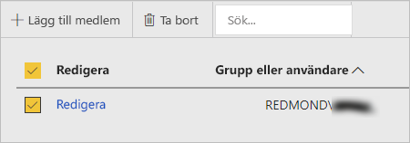

# Säkerhet på radnivå (RLS) i Power BI-rapportservern

Konfiguration av säkerhet på radnivå (RLS) med Power BI-rapportserver kan begränsa dataåtkomst för givna användare. Filter begränsar åtkomst till data på radnivå och du kan definiera filter inom roller.  Om du använder standardbehörigheterna i Power BI-rapportservern kan alla användare med utgivarbehörighet eller innehållshanterarbehörighet för Power BI-rapporten tilldela medlemmar till roller för rapporten.    

Du kan konfigurera RLS för rapporter som importerats till Power BI med Power BI Desktop. Du kan också konfigurera RLS på rapporter som använder DirectQuery, till exempel SQL Server.  Tänk på att RLS inte respekteras om din DirectQuery-anslutning använder integrerad autentisering för rapportens läsare. För Analysis Services live-anslutningar konfigurerar du säkerhet på radnivå på den lokala modellen. Säkerhetsalternativet visas inte för datauppsättningar med live-anslutning. 

[!INCLUDE [rls-desktop-define-roles](../includes/rls-desktop-define-roles.md)]

## Dubbelriktad korsfiltrering

Som standard använder säkerhetsfiltrering på radnivå sig av enkelriktade filter, oavsett om relationerna är inställda på enkelriktade eller dubbelriktade. Du kan aktivera dubbelriktad korsfiltrering med säkerhet på radnivå manuellt.

- Välj relationen och markera kryssrutan **Tillämpa säkerhetsfilter i båda riktningarna**. 

    

Markera den här rutan när du implementerar [dynamisk säkerhet på radnivå](https://docs.microsoft.com/analysis-services/tutorial-tabular-1200/supplemental-lesson-implement-dynamic-security-by-using-row-filters) baserat på användarnamn eller inloggnings-ID. 

Mer information finns i [Dubbelriktad korsfiltrering med DirectQuery i Power BI Desktop](../desktop-bidirectional-filtering.md) och det tekniska faktabladet [Skydda en Tabular BI-semantikmodell](https://download.microsoft.com/download/D/2/0/D20E1C5F-72EA-4505-9F26-FEF9550EFD44/Securing%20the%20Tabular%20BI%20Semantic%20Model.docx).

[!INCLUDE [rls-desktop-view-as-roles](../includes/rls-desktop-view-as-roles.md)]

## Lägga till medlemmar i roller 

När du sparar rapporten i Power BI-rapportservern hanterar du säkerhet och lägger till eller tar bort medlemmar på servern. Endast användare med utgivarbehörighet eller innehållshanterarbehörighet för rapporten har alternativet för säkerhet på radnivå tillgängligt och är inte nedtonade.

 Om rapporten inte har de roller som behövs måste du öppna den i Power BI Desktop, lägga till eller ändra roller och sedan spara den igen på Power BI-rapportservern. 

1. Spara rapporten på Power BI-rapportservern i Power BI Desktop. Du måste använda Power BI Desktop-versionen som har optimerats för Power BI-rapportservern.
2. I Power BI-rapporttjänsten väljer du de tre punkterna ( **...** ) bredvid rapporten. 

3. Välj **Hantera** > **Säkerhet på radnivå**. 

     

    På sidan **Säkerhet på radnivå** kan du lägga till medlemmar till en roll som du har skapat i Power BI Desktop.

5. Om du vill lägga till en medlem väljer du **Lägg till medlem**.

1. Ange användaren eller gruppen i textrutan i formatet för användarnamn (domän\användare) och välj de roller som du vill tilldela dem. Den här medlemmen måste vara inom din organisation.   

    

    Beroende på hur du har konfigurerat Active Directory kan du även ange användarens huvudnamn här. I så fall visar rapportservern motsvarande användarnamn i listan.

1. Tillämpa genom att klicka på **OK**.   

8. Ta bort medlemmar genom att markera kryssrutan bredvid deras namn och välja **Ta bort**.  Du kan ta bort flera medlemmar i taget. 

    

## username() och userprincipalname()

Du kan använda DAX-funktionerna username() eller userprincipalname() i din datauppsättning. Du kan använda dem i uttryck i Power BI Desktop. När du publicerar din modell använder Power BI-rapportservern den.

I Power BI Desktop returnerar username() en användare i formatet domän\användare och userprincipalname() returnerar en användare i formatet user@contoso.com.

I Power BI-rapportservern returnerar både username() och userprincipalname() användarens huvudnamn (UPN ), som liknar en e-postadress.

Om du använder anpassad autentisering i Power BI-rapportservern returneras användarnamnets format som du har konfigurerat för användare.  

## Begränsningar 

Här följer de aktuella begränsningarna för säkerhet på radnivå i Power BI-modeller. 

Användare som hade rapporter med DAX-funktionen username() ser nu det nya beteendet där användarens huvudnamn (UPN) returneras förutom när han/hon använder DirectQuery med integrerad säkerhet.  Eftersom ingen hänsyn tas till RLS i det här scenariot är beteendet i det här scenariot oförändrat.

Du kan endast definiera RLS på datauppsättningar som skapats med Power BI Desktop. Om du vill aktivera RLS för datauppsättningar som skapats med Excel måste du först konvertera filerna till PBIX-filer (Power BI Desktop-filer). Läs mer om [konvertering av Excel-filer](../desktop-import-excel-workbooks.md).

Endast ETL- (Extract, Transform, Load) och DirectQuery-anslutningar med lagrade autentiseringsuppgifter stöds. Live-anslutningar till Analysis Services och DirectQuery-anslutningar som använder integrerad autentisering ska hanteras i den underliggande datakällan. 

Om du använder integrerad säkerhet med DirectQuery kan dina användare märka följande:
- RLS har inaktiverats och alla data returneras.
- Användare kan inte uppdatera sin rolltilldelningar och får ett felmeddelande på sidan om att hantera RLS.
- För DAX-användarnamnfunktionen kan du fortsätta att ta emot användarnamnet som domän\användare. 

Rapportförfattare har inte behörighet att visa rapportdata i Power BI-rapportservern förrän de har tilldelat sig själva roller efter att ha laddat upp rapporten. 

 

## Vanliga frågor och svar 

### Kan jag skapa rollerna för Analysis Services-datakällor? 

Du kan göra det om du har importerat data till Power BI Desktop. Om du använder en live-anslutning kan du inte konfigurera RLS i Power BI-tjänsten. RLS definieras i Analysis Services-modellen lokalt. 

### Kan jag använda RLS för att begränsa kolumner eller mått som är tillgängliga för mina användare? 

Nej. Om användarna har åtkomst till en viss datarad, kan de se alla datakolumner för den raden. 

### Tillåter RLS att jag döljer detaljerade data men ger åtkomst till data som sammanfattas i visuella objekt? 

Nej, du kan skydda enskilda datarader men användarna kan alltid se information eller sammanfattade data. 

### Kan jag lägga till nya roller i Power BI Desktop om jag redan har befintliga roller och medlemmar som har tilldelats? 

Om du redan har befintliga roller som definierats och medlemmar som tilldelats i Power BI-rapportservern kan du skapa ytterligare roller och publicera rapporten på nytt utan att det påverkar dina aktuella tilldelningar. 
 

## Nästa steg

[Vad är Power BI-rapportservern? ](get-started.md)  
 [Administratörshandbok](admin-handbook-overview.md)  

Har du fler frågor? [Fråga Power BI Community](https://community.powerbi.com/)
