# Självstudie: Utforska webbportalen för Power BI-rapportserver i en virtuell dator
I de här självstudierna skapar du en virtuell Azure-dator med Power BI-rapportservern redan installerad, så att du kan visa, redigera och hantera exempel på Power BI- och sidnumrerade rapporter samt KPI:er.

De här uppgifterna kommer du att utföra i de här självstudierna:

> [!div class="checklist"]
> * Skapa och ansluta till en virtuell dator
> * Börja utforska Power BI-rapportserverns webbportal
> * Tagga ett favoritobjekt
> * Visa och redigera en Power BI-rapport
> * Visa, hantera och redigera en sidnumrerad rapport
> * Visa en Excel-arbetsbok i Excel Online

För de här självstudierna behöver du en Azure-prenumeration. Om du inte har någon, kan du [skapa ett kostnadsfritt konto](https://azure.microsoft.com/free/?WT.mc_id=A261C142F) innan du börjar.

## Skapa en virtuell dator med Power BI-rapportserver

Som tur är har Power BI-teamet skapat en virtuell dator som levereras med Power BI-rapportservern redan installerad.

1. På Azure Marketplace väljer du Power BI-rapportserver. Följande länk öppnar den direkt: [Power BI-rapportserver](https://azuremarketplace.microsoft.com/marketplace/apps/reportingservices.technical-preview?tab=Overview).  

2. Välj **Hämta nu**.
3. Om du accepterar leverantörens användningsvillkor och sekretesspolicy väljer du **Fortsätt**.

4. Välj **Skapa**.

    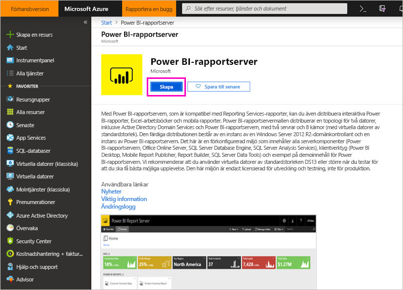

5. I **Steg 1: Grundläggande** anger du **Namn på virtuell dator** till **reportservervm**.

    Namnet på den virtuella datorn i Power BI-rapportserver får inte innehålla bindestreck.

5. Skapa ett användarnamn och ett lösenord.

6. För **Resursgrupp** väljer du **Skapa ny** och ger den namnet **reportserverresourcegroup** > **OK**.

    Om du går igenom kursen mer än en gång måste du ge resursgruppen ett annat namn efter första gången. Du kan inte använda samma namn på resursgruppen två gånger i samma prenumeration. 

    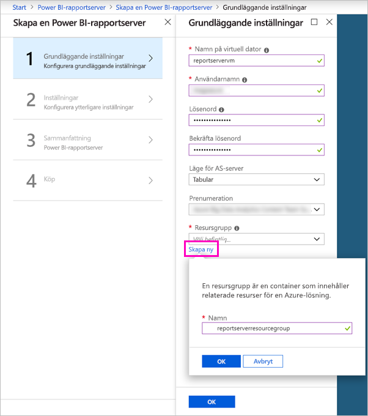

7. Behåll de övriga standardvärdena > **OK**.

8. I **Steg 2: Inställningar** behåller du standardvärdena > **OK**.
 
    Värdena för **SQL Storage-konto** och **Diagnostics Storage-konto** måste också vara unika. Om du går igenom självstudien mer än en gång behöver du ge dem olika namn.

9. I **Steg 3: Sammanfattning** går du igenom dina val > **OK**.

10. I **Steg 4: Köp** läser du användarvillkoren och sekretesspolicyn > **Skapa**.

    **Processen för att skicka distribution för Power BI-rapportservern** kan ta flera minuter.

## Anslut till den virtuella datorn

1. Välj **Virtuella datorer** i det vänstra navigeringsfönstret i Azure. 

2. I rutan **Filtrera efter namn** skriver du ”rapport”. 

3. Välj den virtuella datorn med namnet **REPORTSERVERVM**.

    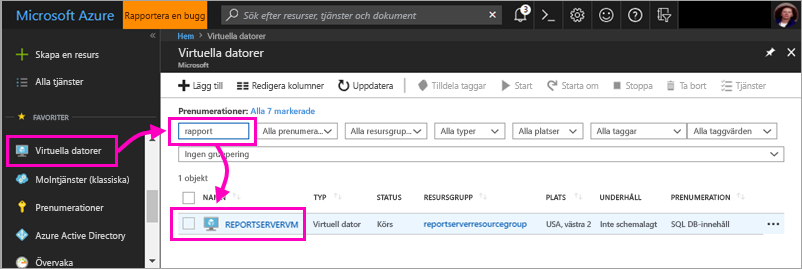

4. Välj **Anslut** under den virtuella datorn REPORTSERVERVM.

    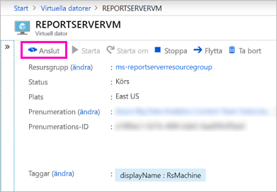

5. I fönstret **Anslut till virtuell dator** behåller du standardvärdena och väljer **Ladda ned RDP-fil**.

1. I dialogrutan **Anslutning till fjärrskrivbord** väljer du **Anslut**.

6. Ange det namn och lösenord som du skapade för den virtuella datorn > **OK**.

7. I nästa dialogruta står det **Fjärrdatorns identitet kan inte identifieras**. Välj **Ja**.

   Ta-da! Din nya virtuella dator öppnas.

## Power BI-rapportservern på den virtuella datorn

När den virtuella datorn öppnas visas nedanstående objekt på skrivbordet.

|Tal  |Vad det är  |
|---------|---------|
| | Exempel på Power BI-rapporter (av typen .PBIX) |
| | Länkar till Power BI-rapportserverns dokumentation |
| | Startar Power BI Desktop som har optimerats för Power BI-rapportserver (januari 2019) |
| | Öppnar Power BI-rapportserverns webbportal i webbläsaren |
| | Startar SQL Server Data Tools för att skapa sidnumrerade rapporter (av typen .RDL) |

Dubbelklicka på ikonen för **rapportserverns webbportal**. Webbläsaren öppnar `http://localhost/reports/browse`. I webbportalen kan du se olika filer grupperade efter typ. 

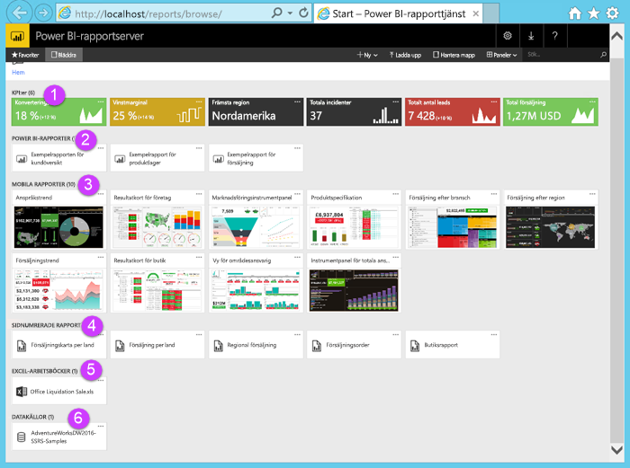

|Tal  |Vad det är  |
|---------|---------|
| | KPI:er som skapats i webbportalen |
| |  Power BI-rapporter (av typen .PBIX)  |
| | Mobila rapporter som skapats i SQL Server Mobile Report Publisher  |
| |  Sidnumrerade rapporter som skapats i Report Builder eller i SQL Server Data Tools  |
| | Excel-arbetsböcker   | 
| | Datakällor för sidnumrerade rapporter | 

## Tagga dina favoriter
Du kan tagga de rapporter och KPI:er som du vill ska vara favoriter. De är lättare att hitta eftersom de är samlade i en enda favoritmapp, både i webbportalen och i Power BI-mobilappar. 

1. Välj ellipsen ( **...** ) i det övre högra hörnet i av **Vinstmarginal** KPI > **Lägg till i favoriter**.
   
    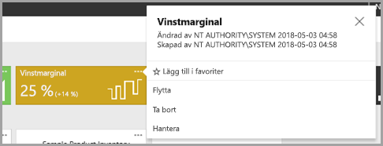
2. Välj **favoriter** från webbportalens menyflik för att se dem tillsammans med dina andra favoriter på favoriter-sidan i webbportalen.
   
    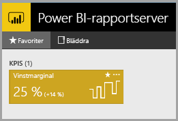

3. Välj **Bläddra** för att gå tillbaka till webbportalen.
   
## Visa objekt i listvyn
Som standard visar webbportalen innehållet i panelvyn.

Du kan växla till listvy, där det är enkelt att flytta eller ta bort flera objekt i taget. 

1. Select **panel** >  **-listan**.
   
    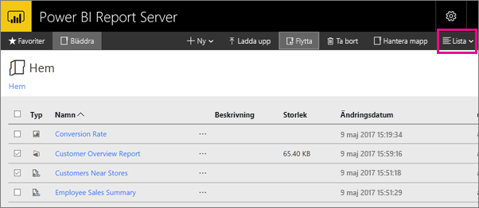

2. Gå tillbaka till panelvyn: Välj **Lista** > **Paneler**.

## Power BI-rapporter

Du kan visa och interagera med Power BI-rapporter i webbportalen och starta Power BI Desktop direkt från webbportalen.

### Visa Power BI-rapporter

1. I webbportalen, under **Power BI-rapporter**, väljer du **exemplet på kundöversiktsrapporten**. Rapporten öppnas i webbläsaren.

1. Välj USA-blocket i trädkartan för att se hur det markerar relaterade värden i de övriga visuella objekten.

    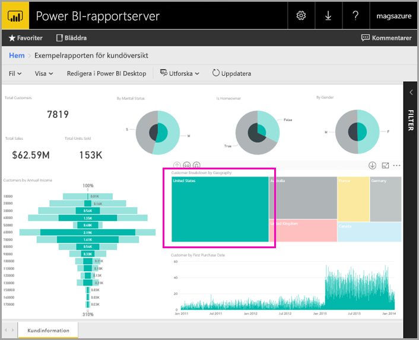

### Redigera i Power BI Desktop

1. Välj **Redigera i Power BI Desktop**.

1. Välj **Tillåt** för att tillåta att den här webbplatsen får öppna ett program på datorn. 

     Rapporten öppnas i Power BI Desktop. Notera namnet på den översta raden, ”Power BI Desktop (januari 2019)”. Det är den version som optimerats för Power BI-rapportservern.

    Använd versionen av Power BI Desktop som är installerad på den virtuella datorn. Du kan inte ladda upp en rapport på en annan domän.

3. I fönstret Fält expanderar du tabellen Kunder och drar fältet Sysselsättning till Rapportnivåfilter.

    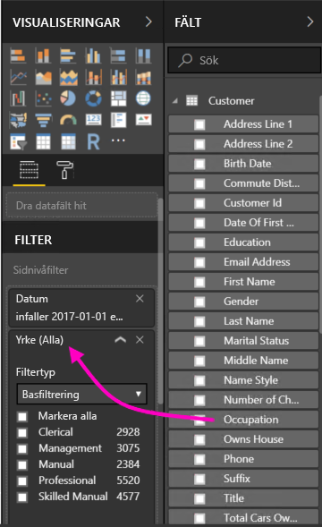

1. Spara rapporten.

1. Gå tillbaka till rapporten i webbläsaren och välj ikonen **Uppdatera** i webbläsaren.

    

8. Expandera fönstret **Filter** till höger om du vill se filtret **Sysselsättning** som du lade till. Välj **Professionell**.

    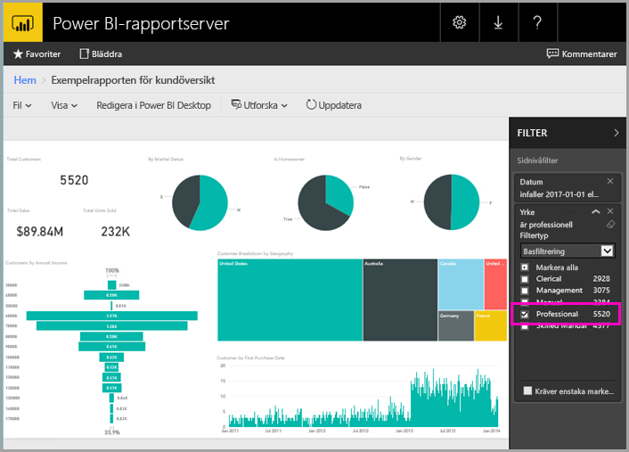

3. Välj **Bläddra** för att gå tillbaka till webbportalen.

## Sidnumrerade rapporter (av typen .RDL)

Du kan visa och hantera sidnumrerade rapporter och starta Report Builder från webbportalen.

### Hantera en sidnumrerad rapport

1. Under **Sidnumrerade rapporter** i webbportalen väljer du **Fler alternativ** (...) bredvid **Försäljningsorder** > **Hantera**.

1. Välj **Parametrar**, ändra standardvärdet för **SalesOrderNumber** till **SO50689** > **Verkställ**.

   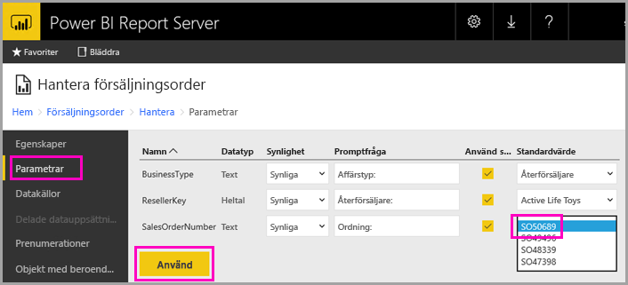

3. Välj **Bläddra** för att gå tillbaka till webbportalen.

### Visa en sidnumrerad rapport

1. Välj **Försäljningsorder** i webbportalen.
 
3.  Du ser att den öppnas efter den parameter för **Order** som du angav, **SO50689**. 

    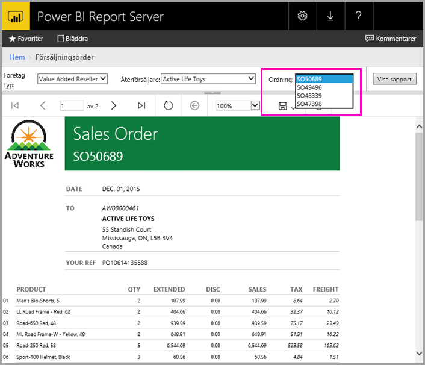

    Du kan ändra den här parametern här, tillsammans med de övriga parametrarna, utan att ändra standardvärdena.

1. Välj **Order** **SO48339** > **Visa rapport**.

4. Du ser att detta är sidan 1 av 2. Välj högerpilen för att se den andra sidan. Tabellen fortsätter på den sidan.

    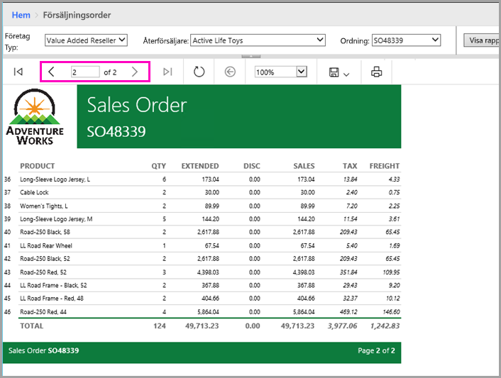

5. Välj **Bläddra** för att gå tillbaka till webbportalen.

### Redigera en sidnumrerad rapport

Du kan redigera sidnumrerade rapporter i Report Builder och du kan starta Report Builder direkt från webbläsaren.

1. Välj **Fler alternativ** (...) bredvid **Försäljningsorder** > **Redigera i Report Builder** i webbportalen.

1. Välj **Tillåt** för att tillåta att den här webbplatsen får öppna ett program på datorn.

1. Försäljningsorderrapporten öppnas i designvyn i Report Builder.

    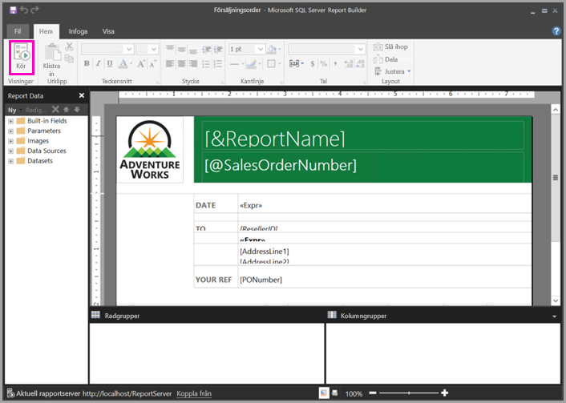

1. Välj **Kör** för att förhandsgranska rapporten.

    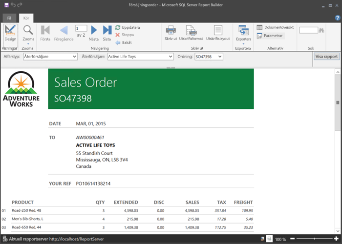

5. Stäng Report Builder och gå tillbaka till webbläsaren.

## Visa Excel-arbetsböcker

Du kan visa och interagera med Excel-arbetsböcker i Excel Online i Power BI-rapportservern. 

1. Välj Excel-arbetsboken **Office Liquidation Sale.xlsx**. Du kan bli ombedd att ange autentiseringsuppgifter. Välj **Avbryt**. 
    Den öppnas i webbportalen.
1. Välj **Installation** i utsnittet.

    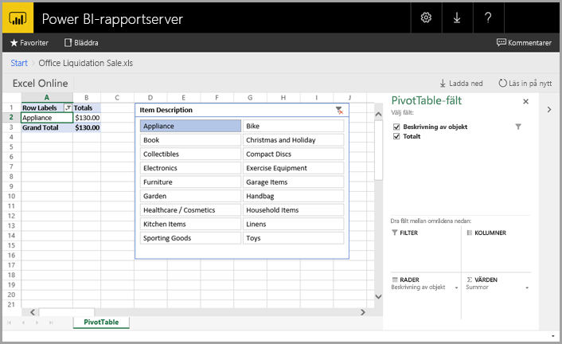

1. Välj **Bläddra** för att gå tillbaka till webbportalen.

## Rensa resurser

Nu när du är klar med de här självstudierna kan du ta bort resursgruppen, den virtuella datorn och alla relaterade resurser. 

- För att göra det väljer du resursgruppen för den virtuella datorn och sedan **Ta bort**.

## Nästa steg

I de här självstudierna har du skapat en virtuell dator med Power BI-rapportservern. Du har provat några av funktionerna i webbportalen och du har öppnat en Power BI-rapport och en sidnumrerad rapport i sina respektive redigerare. Den här virtuella datorn har installerade SQL Server Analysis Services-datakällor, så du kan prova att skapa egna Power BI- och sidnumrerade rapporter med de här datakällorna. 

Om du vill veta mer om hur du skapar rapporter för Power BI-rapportservern kan du fortsätta läsa.

> [!div class="nextstepaction"]
> [Skapa en Power BI-rapport för Power BI-rapportservern](./quickstart-create-powerbi-report.md)

