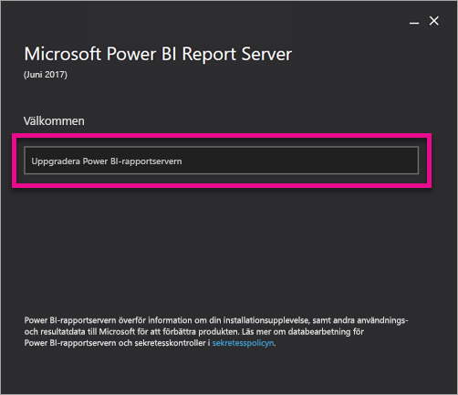
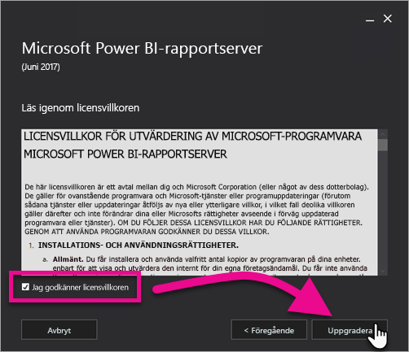
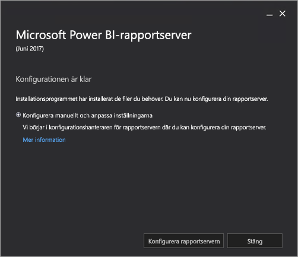

# Uppgradera Power BI-rapportserver
Lär dig mer om att uppgradera Power BI-rapportservern.

 **Hämta** 

Om du vill ladda ned Power BI-rapportservern och Power BI Desktop som är optimerat för Power BI-rapportserver, går du till [Lokal rapportering med Power BI-rapportserver](https://powerbi.microsoft.com/report-server/).

 Aktuell viktig information finns i [Power BI-rapportserver – viktig information](release-notes.md).

## Innan du börjar
Innan du uppgraderar en rapportserver, rekommenderas att du utför följande steg för att säkerhetskopiera rapportservern.

### Säkerhetskopiera krypteringsnycklarna
Du bör säkerhetskopiera krypteringsnycklarna när du konfigurerar en rapportserverinstallation för första gången. Du bör även säkerhetskopiera nycklarna varje gång du ändrar identiteten för tjänstkonton eller byter namn på datorn. Mer information finns i [Säkerhetskopiera och återställa Reporting Services krypteringsnycklar](https://docs.microsoft.com/sql/reporting-services/install-windows/ssrs-encryption-keys-back-up-and-restore-encryption-keys).

### Säkerhetskopiera databaser för rapportservern
Eftersom en rapportserver är en autonom server, lagras alla programdata i databaserna **reportserver** och **reportservertempdb** databaser som körs på en instans av SQL Server Database Engine. Du kan säkerhetskopiera databaserna **reportserver** och **reportservertempdb** databaser med någon av metoderna som stöds för att säkerhetskopiera SQL Server-databaser. Följande rekommendationer är specifika för rapportserverdatabaser:

* Använd den fullständiga återställningsmodellen för säkerhetskopiering av en **reportserver**-databas.
* Använd den förenklade återställningsmodellen för säkerhetskopiering av en **reportservertempdb**-databas.
* Du kan använda olika scheman för säkerhetskopiering för varje databas. Det enda skälet att säkerhetskopiera **reportservertempdb** är för att undvika att skapa den på nytt om ett maskinvarufel uppstår. I händelse av maskinvarufel är det inte nödvändigt att återställa data i **reportservertempdb**, men du behöver tabellstrukturen. Om du förlorar **reportservertempdb** är det enda sättet att få tillbaka den är återskapa rapportserverdatabasen. Om du återskapar **reportservertempdb** är det viktigt att den har samma namn som den primära rapportserver-databasen.

Mer information om säkerhetskopiering och återställning av relationsdatabaser i SQL Server finns i [Säkerhetskopiera och återställa SQL Server-databaser](https://docs.microsoft.com/sql/relational-databases/backup-restore/back-up-and-restore-of-sql-server-databases).

### Säkerhetskopiera konfigurationsfiler
Power BI-rapportservern använder konfigurationsfiler för att lagra programinställningar. Du bör säkerhetskopiera filerna när du först konfigurerar servern och när du har distribuerat anpassade tillägg. Filer för säkerhetskopiering inkluderar:

* config.json
* RSHostingService.exe.config
* Rsreportserver.config
* Rssvrpolicy.config
* Reportingservicesservice.exe.config
* Web.config för Report Server ASP.NET-program
* Machine.config för ASP.NET

## Uppgradera en rapportserver
Det är enkelt att uppgradera Power BI-rapportservern. Det krävs endast några få steg för att installera filerna.

1. Hitta platsen för PowerBIReportServer.exe och starta installationsprogrammet.
2. Välj **Uppgradera Power BI-rapportserver**.
   
    
3. Läs och godkänn licensvillkoren och välj sedan **Uppgradera**.
   
    
4. När uppgraderingen är slutförd, kan du välja **Konfigurera rapportserver** för att starta konfigurationshanteraren för rapporttjänster eller **Stäng** att avsluta installationsprogrammet.
   
    

## Uppgradera Power BI Desktop
När rapportservern har uppgraderats är det lämpligt att kontrollera att alla Power BI-rapportförfattare har uppgraderats till versionen av Power BI Desktop som har optimerats för Power BI-rapportservern som motsvarar servern.

## Nästa steg
[Handbok för administratör](admin-handbook-overview.md)  
[Installera Power BI Desktop som har optimerats för Power BI-rapportservern](install-powerbi-desktop.md)  
[Verifiera en Reporting Services-installation](https://docs.microsoft.com/sql/reporting-services/install-windows/verify-a-reporting-services-installation)  
[Konfigurera tjänstkontot för rapportservern](https://docs.microsoft.com/sql/reporting-services/install-windows/configure-the-report-server-service-account-ssrs-configuration-manager)  
[Konfigurera rapportserverns URL:er](https://docs.microsoft.com/sql/reporting-services/install-windows/configure-report-server-urls-ssrs-configuration-manager)  
[Konfigurera en databasanslutning för rapportservern](https://docs.microsoft.com/sql/reporting-services/install-windows/configure-a-report-server-database-connection-ssrs-configuration-manager)  
[Initiera en rapportserver](https://docs.microsoft.com/sql/reporting-services/install-windows/ssrs-encryption-keys-initialize-a-report-server)  
[Konfigurera SSL-anslutningar på en rapportserver](https://docs.microsoft.com/sql/reporting-services/security/configure-ssl-connections-on-a-native-mode-report-server)  
[Konfigurera Windows-tjänstekonton och -behörigheter](https://docs.microsoft.com/sql/database-engine/configure-windows/configure-windows-service-accounts-and-permissions)  
[Webbläsarstöd för Power BI-rapportserver](browser-support.md)

Har du fler frågor? [Fråga Power BI Community](https://community.powerbi.com/)

