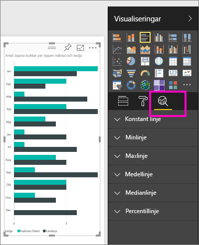
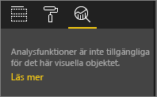

# Analytics-fönstret i Power BI-tjänsten
Med fönstret **Analytics** i **Power BI-tjänsten** kan du lägga till dynamiska *referensrader* i visualiseringar och ange fokus för viktiga trender eller insikter.

> [!NOTE]
> Fönstret **Analytics** visas bara när du väljer ett visuellt objekt på rapportarbetsytan.
> 
> 

## Använda fönstret Analytics
Med fönstret **Analytics** kan du skapa följande typer av dynamiska referensrader (alla rader är inte tillgängliga för alla typer av visuella objekt):

* X-axel, konstant rad
* Y-axel, konstant rad
* Min rad
* Max rad
* Genomsnittlig rad
* Median rad
* Percentil rad

Följande avsnitt visar hur du kan använda fönstret **Analytics** och dynamiska referensrader i dina visualiseringar.

Följ dessa steg om du vill visa tillgängliga dynamiska referensrader för någon visualisering:

1. Välj eller skapa en visualisering och välj sedan ikonen **Analytics** från fönstret **Visualiseringar**.
2. Välj nedpilen för typen av rad som du vill skapa för att visa dess alternativ. I det här fallet väljer vi **Genomsnittlig rad**.
   
   
3. Om du vill skapa en ny rad, välj **+ Lägg till**. Du kan sedan ange ett namn för raden genom att dubbelklicka på textrutan och sedan skriva in i ditt namn.
   
   Det finns många typer av alternativ för din rad, till exempel att välja dess *färg*, *genomskinlighet*, *stil* och *position* (i förhållande till visualiseringens dataelement) samt om du vill inkludera etiketten. Du kan dessutom välja vilka **Mått** i visualiseringen som du vill att linjen ska baseras på genom att välja i listrutan **Mått**, som fylls i automatiskt med dataelement från visualiseringen. I det här fallet väljer vi *Antal öppna butiker* som mått, märker den som *Snitt # öppna butiker* och anpassar några av de andra alternativen som visas nedan.
   
   
4. Om du vill visa dataetiketten flytta du skjutreglaget **Dataetikett** till på. När du gör detta får du en mängd ytterligare alternativ för din dataetikett.
5. Observera siffran som visas bredvid objektet **Genomsnittlig rad** objektet i fönstret **Analytics**. Detta anger hur många dynamiska rader som finns för ditt visuella objekt samt deras typ. Om vi lägger till en **Konstant rad** som målet 9 för antal butiker kan du se att fönstret **Analytics** visar att vi nu också har en referenslinje för **Konstant rad** som tillämpas på den här visualiseringen.
   
   
   
   Om det visuella objektet du har valt inte kan ha dynamiska referensrader (i det här fallet **karta**), visas följande när du väljer fönstret **Analytics**.
   
   

Det finns många typer av intressanta insikter som du kan markera genom att skapa dynamiska referensrader i fönstret **Analytics**.

Vi planerar fler funktioner, inklusive att fler visuella objekt som kan ha dynamiska referenslinjer, så håll ögonen öppna efter nyheter.

## Begränsningar
Möjligheten att använda dynamiska referens raderna beror på vilken typ av visualisering som används. I följande lista visas vilka dynamiska rader som är tillgängliga för vilka visuella objekt:

Alla dynamiska linjer är tillgängliga på följande visuella objekt:

* Ytdiagram
* Linjediagram
* Punktdiagram
* Grupperat stående stapeldiagram
* Grupperat liggande stapeldiagram

Följande visuella objekt kan bara använda en *konstant rad* från fönstret **Analytics**:

* Staplad yta
* Liggande stapel
* Stående stapel
* 100 % liggande stapel
* 100 % stående stapel

För följande visuella objekt är *trendlinjen* för närvarande det enda alternativet:

* Ej staplad linje
* Grupperat stående stapeldiagram

Slutligen, icke-kartesiska visuella objekt går för närvarande inte att använda med dynamiska rader från fönstret **Analytics**, till exempel:

* Matrix
* Cirkeldiagram
* Toroid
* Tabell

## Nästa steg
[Analytics-fönstret i Power BI Desktop](desktop-analytics-pane.md)

Har du fler frågor? [Försök med att fråga Power BI Community](http://community.powerbi.com/)

