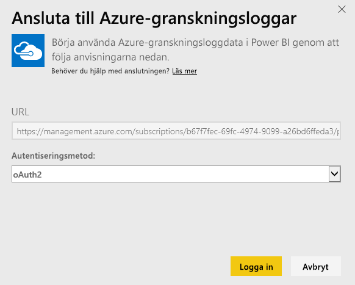
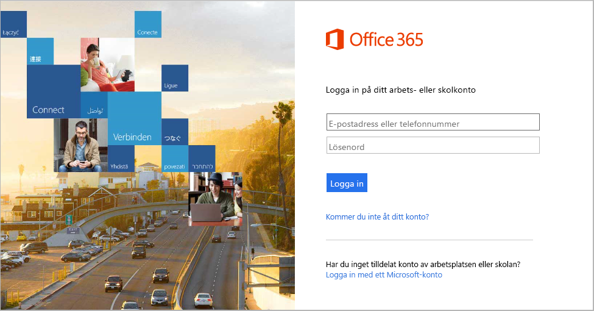

# Ansluta till Azure-granskningsloggar med Power BI
Du kan analysera och visualisera informationen som lagras i granskningsloggarna med Azure-granskningsloggarnas innehållspaket. Power BI hämtar dina data, skapar en färdig instrumentpanel och sedan rapporter baserade på dessa data.

[Anslut till Azure-granskningsloggarnas innehållspaket](https://app.powerbi.com/getdata/services/azure-audit-logs) eller läs mer om integration av [Azure-granskningsloggarna](https://powerbi.microsoft.com/integrations/azure-audit-logs) med Power BI.

## Så här ansluter du
1. Välj **Hämta data** längst ned i det vänstra navigeringsfönstret.  
   
    
2. I rutan **tjänster** väljer du **Hämta**.  
   
     
3. Välj **Azure-granskningsloggarna** > **Hämta**.  
   
   
4. Skriv in ditt **prenumerations-ID för Azure** när du uppmanas till det. Information om hur du hittar ditt [prenumerations-ID](#FindingParams) visas nedan.   
   
    
5. Som **autentiseringsmetod** väljer du **oAuth2** \> **Logga in**.
   
    
6. Ange dina autentiseringsuppgifter för att avsluta inloggningsprocessen.
   
    
7. Power BI hämtar dina Azure-granskningsloggdata och skapar en instrumentpanel och en rapport som är färdiga att använda. 
   
    

**Och sedan?**

* Prova att [ställa en fråga i rutan Frågor och svar](power-bi-q-and-a.md) överst på instrumentpanelen
* [Ändra panelerna](service-dashboard-edit-tile.md) på instrumentpanelen.
* [Välj en panel](service-dashboard-tiles.md) för att öppna den underliggande rapporten.
* Även om din datauppsättning är schemalagd för att uppdateras dagligen, kan du ändra uppdateringsschemat eller försöka uppdatera den på begäran med **Uppdatera nu**.

## Systemkrav
Azure-granskningsloggarnas innehållspaket kräver åtkomst till granskningsloggar i Azure Portal. Du hittar mer information [här](https://azure.microsoft.com/documentation/articles/insights-debugging-with-events/).

## Hitta parametrar
Det finns två enkla sätt för att hitta ditt prenumerations-ID.

1. Från https://portal.azure.com –&gt; Bläddra –&gt; Prenumerationer –&gt; Prenumerations-ID
2. Från https://manage.windowsazure.com –&gt; Inställningar –&gt; Prenumerations-ID

Ditt prenumerations-ID är en lång uppsättning siffror och tecken, liknande exemplet i Steg \#4 ovan. 

## Felsökning
Om det uppstår ett fel med autentiseringsuppgifterna eller ett fel vid uppdateringsförsök till följd av ogiltiga autentiseringsuppgifter, kan du prova med att ta bort alla förekomster av Azure-granskningsloggarnas innehållspaket och ansluta igen.

## Nästa steg
[Kom igång med Power BI](service-get-started.md)  
[Power BI – grundläggande begrepp](service-basic-concepts.md)  

