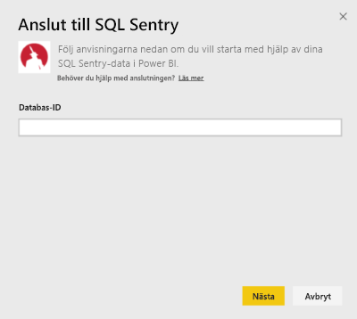
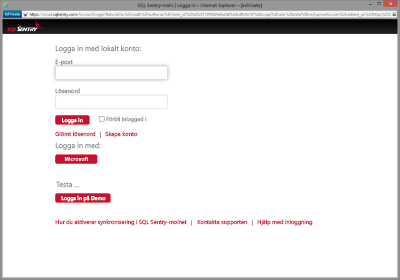
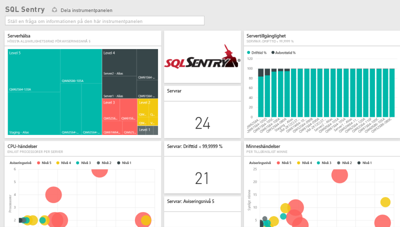
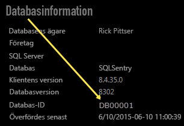

# Anslut till SQL Sentry med Power BI
Det är enkelt att analysera dina prestandadata som samlats in av SQL Sentry med Power BI. Power BI hämtar dina data och skapar sedan en standardinstrumentpanel och relaterade rapporter baserat på dessa data.

Anslut till [SQL Sentry-innehållspaketet](https://app.powerbi.com/groups/me/getdata/services/sql-sentry) för Power BI.

>[!NOTE]
>Åtkomst till ett SQL Sentry-konto som du använder för att ansluta till http://cloud.sqlsentry.com och ett databas-ID som du övervakar krävs för att ansluta.  Instruktionerna för var du hittar databas-ID finns nedan.

## Så här ansluter du
1. Välj **Hämta data** längst ned i det vänstra navigeringsfönstret.
   
   
2. I rutan **Tjänster** väljer du **Hämta**.
   
    
3. Välj **SQL Sentry \> Hämta**.
   
   
4. Ange **databas-ID** för den databas som du vill övervaka i Power BI. Mer information om hur du [hittar det](#FindingParams) nedan.
   
   
5. Som autentiseringsmetod väljer du **oAuth2 \> logga in**.
   
   När du uppmanas, anger du dina autentiseringsuppgifter för cloud.sqlsentry.com och följer autentiseringsprocessen SQL Sentry.
   
   
   
   Första gången du ansluter, uppmanas du att ge Power BI skrivskyddad åtkomst till ditt konto. Klicka på Bevilja för att starta importen.  Importen kan ta några minuter beroende på mängden data i ditt konto.
   
   
6. När Power BI har importerat dessa data, visas en ny instrumentpanel, rapport och datauppsättning i det vänstra navigeringsfönstret. Nya objekt har markerats med en gul asterisk \*:
   
   
7. Välj SQL Sentry-instrumentpanelen.
   
   Det här är standardinstrumentpanelen som Power BI skapar för att visa dina data. Du kan modifiera den här instrumentpanelen för att visa dina data på det sätt som du vill.
   
   

**Och sedan?**

* Prova att [ställa en fråga i rutan Frågor och svar](consumer/end-user-q-and-a.md) överst på instrumentpanelen
* [Ändra panelerna](service-dashboard-edit-tile.md) på instrumentpanelen.
* [Välj en panel](consumer/end-user-tiles.md) för att öppna den underliggande rapporten.
* Medan din datauppsättning schemaläggs att uppdateras dagligen så kan du ändra uppdateringsfrekvensen eller testa att uppdatera den på begäran med **Uppdatera nu**

## Det här ingår
Följande data finns tillgängliga från SQL Sentry i Power BI:

| Tabellnamn | Beskrivning |
| --- | --- |
| Anslutning |Den här tabellen innehåller information om dina SQL Sentry-definierade anslutningar. |
| Datum  |Den här tabellen innehåller datum från idag tillbaka till det tidigaste datumet då prestandadata samlades in och sparades. |
| Driftstopp  |Den här tabellen innehåller information relaterat till driftstopp och driftstid för varje server som övervakas i din miljö. |
| Minnesanvändning  |Den här tabellen innehåller data om hur mycket minne som är tillgängligt eller fritt i var och en av dina servrar.  |
| Server  |Den här tabellen innehåller poster för varje server i din miljö. |
| Serverhälsa  |Den här tabellen innehåller data för händelser som skapats av anpassade villkor i din miljö, inklusive allvarlighetsgrad och antal. |

## Hitta parametrar
Du kan hitta **databas-ID:t** genom att logga in på <https://cloud.sqlsentry.com> i ett nytt webbläsarfönster.  **Databas-ID** visas på huvudöversiktssidan:

    

**Databas-ID** visas också på skärmen databasinformation:

    

## Felsökning
Om data från vissa av dina appar inte visas i Power BI, kontrollera att du använder rätt databas-ID och att du har behörighet att visa data. 

Om du inte är ägare till den SQL Sentry-databas som synkroniseras till <https://cloud.sqlsentry.com>, kontaktar du din administratör för att kontrollera att du har behörighet att visa insamlade data.

## Nästa steg
[Vad är Power BI?](power-bi-overview.md)

[Hämta data för Power BI](service-get-data.md)

