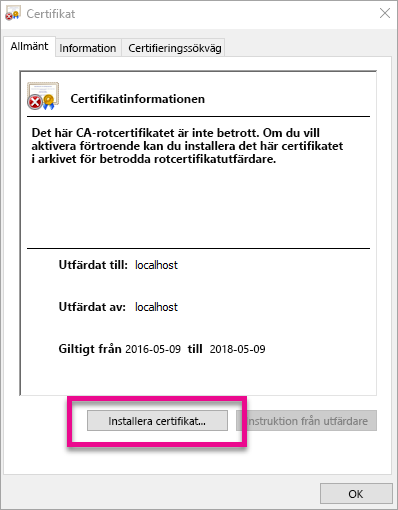
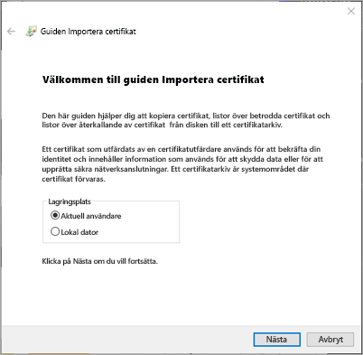
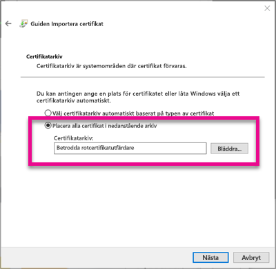
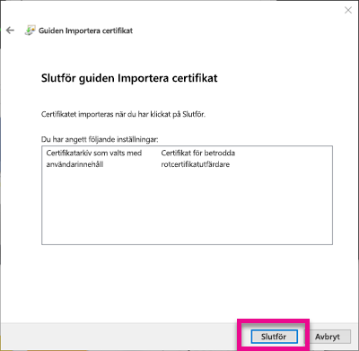
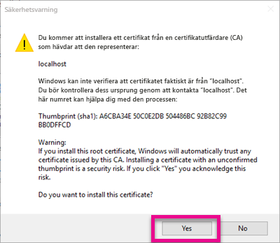
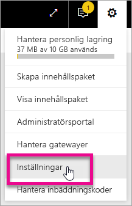
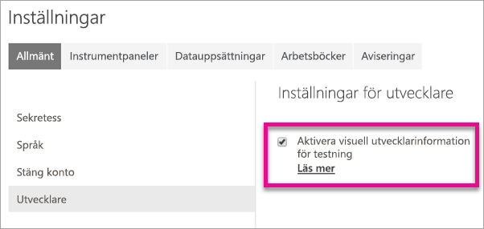

# <a name="use-developer-tools-to-create-custom-visuals"></a>Använd utvecklingsverktyg för att skapa en anpassad visualisering
Med anpassad visualisering kan du uppfylla dina användares behov och matcha appens design. Lär dig hur du skapar en anpassad visualisering för Power BI med utvecklingsverktygen.

> [!NOTE]
> Du kan använda det här dokumentet för att komma igång. Mer detaljerad information finns i referensinformation inom [Power BI visuell information git repo](https://github.com/Microsoft/PowerBI-visuals).
> 
> 

## <a name="requirements"></a>Krav
* NodeJS 4.0+ krävs (5.0 eller senare rekommenderas) [Hämta NodeJS](https://nodejs.org)

## <a name="install-nodejs-and-the-power-bi-tools"></a>Installera Power BI-verktyg och NodeJS
Du måste installera NodeJS för att skapa en anpassad visualisering. NodeJS krävs för att köra kommandoradsverktyg.

1. Hämta och installera [NodeJS](https://nodejs.org). Version 4.0 eller senare krävs, men det är rekommenderat att ha 5.0 eller senare.
2. Installera kommandoradverktyg. Kör följande kommando från en kommandotolk.
   
        npm install -g powerbi-visuals-tools
3. Du kan bekräfta att verktygen är installerade genom att köra följande kommando utan några parametrar.
   
        pbiviz
   
    Du bör se utdata för hjälp.
   
    <pre><code>
         +syyso+/
    oms/+osyhdhyso/
    ym/       /+oshddhys+/
    ym/              /+oyhddhyo+/
    ym/                     /osyhdho
    ym/                           sm+
    ym/               yddy        om+
    ym/         shho /mmmm/       om+
     /    oys/ +mmmm /mmmm/       om+
    oso  ommmh +mmmm /mmmm/       om+
   ymmmy smmmh +mmmm /mmmm/       om+
   ymmmy smmmh +mmmm /mmmm/       om+
   ymmmy smmmh +mmmm /mmmm/       om+
   +dmd+ smmmh +mmmm /mmmm/       om+
         /hmdo +mmmm /mmmm/ /so+//ym/
               /dmmh /mmmm/ /osyhhy/
                 //   dmmd
                       ++
   
       PowerBI Custom Visual Tool
   
    Usage: pbiviz [options] [command]
   
    Commands:
   
    new [name]        Create a new visual
    info              Display info about the current visual
    start             Start the current visual
    package           Package the current visual into a pbiviz file
    update [version]  Updates the api definitions and schemas in the current visual. Changes the version if specified
    help [cmd]        display help for [cmd]
   
    Options:
   
    -h, --help      output usage information
    -V, --version   output the version number
    --install-cert  Install localhost certificate
    </code></pre>

<a name"ssl-setup"></a>

### <a name="server-certificate-setup"></a>Ställa in servercertifikat
Du behöver en betrodd https-server för att aktivera dynamisk förhandsgranskning av ditt visuella objekt. Innan du kan börja måste du installera ett SSL-certifikat som tillåter att visuella objekt laddas upp till webbläsaren. 

> [!NOTE]
> Denna inställning behöver bara ställas in en gång för din utvecklararbetsstation.
> 
> 

Kör följande kommando för att *lägga till* certifikat.

    pbiviz --install-cert

**Windows OS**

1. Välj **installera certifikat...** .
   
    
2. Välj **Aktuell användare** och välj sedan **Nästa**.
   
    
3. Välj **Placera alla certifikat i nedanstående arkiv** och välj **Bläddra...** .
4. Välj **Betrodda rotcertifikatutfärdare** och välj sedan **OK**. Välj **Nästa**.
   
    
5. Välj **Slutför**.
   
    
6. Välj **Ja** på säkerhetsvarningsmeddelandet.
   
    
7. Stäng alla webbläsare som du har öppnat.

> [!NOTE]
> Om certifikatet inte har identifierats kan du behöva starta om datorn.
> 
> 

**OSX**

1. Om låset i det övre vänstra hörnet är låst markerar du det för att låsa upp det. Sök efter *localhost* och dubbelklicka på certifikatet.
   
    
2. Välj **Lita alltid på** och stäng fönstret.
   
    
3. Ange ditt användarnamn och lösenord. Välj **Uppdatera inställningar**.
   
    
4. Stäng alla webbläsare som du har öppnat.

> [!NOTE]
> Om certifikatet inte har identifierats kan du behöva starta om datorn.
> 
> 

## <a name="enable-live-preview-of-developer-visual"></a>Aktivera dynamisk förhandsgranskning av utvecklarens visualisering
Följ dessa steg om du vill aktivera en dynamisk förhandsgranskning av din anpassade visualisering. Detta tillåter att visualiseringen används i Power BI-tjänsten när du redigerar rapporter.

1. Bläddra och logga in på [app.powerbi.com](https://app.powerbi.com).
2. Välj **kugghjulsikonen** och sedan **Inställningar**.
   
    
3. Välj **Utvecklare** och välj sedan **Aktivera utvecklarens visualisering för test**.
   
    
4. Välj **Utvecklarens visualisering** i fönstret **Visualisering**.
   
    
   
   > [!NOTE]
   > Detta kräver att du har kört `pbiviz start` från visualiseringsmappen på din utvecklingsdator. Mer information om hur du skapar ditt visuella objekt finns [Skapa en ny visualisering](#create-a-new-visual) i den här artikeln.
   > 
   > 
5. Välj visualiseringen i rapportarbetsytan. Du kan binda data på samma sätt som du gör i andra visuella objekt.

Nu kan du börja utveckla ditt visuella objekt.

## <a name="create-a-new-visual"></a>Skapa en ny visualisering
Du kan skapa ett nytt visualiseringsprojekt genom att köra följande kommando.

```
pbiviz new My Visual name
```

Du kan ersätta *namnet Min visualisering* med det namn som du vill ge visualiseringen. Detta kan ändras senare genom att ändra fälten `name` och `displayName` inom den genererade `pbiviz.json`-filen.

Det här kommandot skapar en ny mapp i katalogen där kommandot kördes. Den skapar en grundläggande startmall för ditt visuella objekt. När kommandot har slutförts kan du öppna katalogen och använda din favoritredigerare för att börja arbeta på din nya visualisering.

## <a name="testing-your-visual-in-power-bi"></a>Testa ditt visuella objekt i Power BI
Du kan testa ditt visuella objekt i Power BI-tjänsten i rapporter och instrumentpaneler.

<a name="running-your-visual"></a>

### <a name="running-your-visual"></a>Kör ditt visuella objekt
Du kan köra ditt visuella objekt genom att göra följande.

1. Öppna en kommandotolk.
2. Ändra katalogen till din mapp för visuella objekt. Detta är den mapp som innehåller filen `pbiviz.json`.
3. Kör följande kommando.
   
    ```
    pbiviz start
    ```
   
    

Om du befinner dig på fel plats visas ett fel som liknar följande.

```
    error  LOAD ERROR Error: pbiviz.json not found. You must be in the root of a visual project to run this command.
        at e (C:\Users\[user]\AppData\Roaming\npm\node_modules\powerbi-visuals-tools\lib\VisualPackage.js:67:35)
        at Function.loadVisualPackage (C:\Users\[user]\AppData\Roaming\npm\node_modules\powerbi-visuals-tools\lib\VisualPackage.js:62:16)
        at Object.<anonymous> (C:\Users\[user]\AppData\Roaming\npm\node_modules\powerbi-visuals-tools\bin\pbiviz-start.js:43:15)
        at Module._compile (module.js:556:32)
        at Object.Module._extensions..js (module.js:565:10)
        at Module.load (module.js:473:32)
        at tryModuleLoad (module.js:432:12)
        at Function.Module._load (module.js:424:3)
        at Module.runMain (module.js:590:10)
        at run (bootstrap_node.js:394:7)
```

### <a name="viewing-your-visual-in-power-bi"></a>Visa ditt visuella objekt i Power BI
Om du vill visa ditt visuella objekt i en rapport, gå till rapporten och välj visualiseringen från fönstret **Visualiseringar**.

> [!NOTE]
> Du måste köra kommandot `pbiviz start` innan du gör detta enligt beskrivningen i avsnittet [Kör ditt visuella objekt](#running-your-visual).
> 
> 


Sedan visas startmallen för visualiseringen.


| Verktygsfältobjekt | Beskrivning |
| --- | --- |
| Uppdatera visualisering |Uppdatera visualiseringen manuellt om automatisk återinläsning har inaktiverats. |
| Växla automatisk återinläsning |När detta är aktiverat kommer visualiseringen automatiskt att uppdateras varje gång du sparar den. |
| Visa datavy |Visar visualiseringens underliggande data i felsökningssyfte |
| Få hjälp |Dokumentation i GitHub |
| Skicka feedback |Berätta för oss om vi kan förbättra upplevelsen på något sätt! (Kräver GitHub-konto) |

## <a name="package-your-visual-for-use-in-power-bi-desktop-and-distribution"></a>Paketera ditt visuella objekt för användning i Power BI Desktop och distribution
Innan du kan läsa in ditt visuella objekt i [Power BI Desktop](https://powerbi.microsoft.com/desktop/) eller dela den med communityn i [Power BI-galleriet](https://visuals.powerbi.com) måste du skapa en `pbiviz`-fil.

Du kan paketera ditt visuella objekt genom att göra följande.

1. Öppna en kommandotolk.
2. Ändra katalogen till din mapp för visuella objekt. Detta är den mapp som innehåller filen `pbiviz.json`.
3. Kör följande kommando.
   
    ```
    pbiviz package
    ```

Det här kommandot skapar en `pbiviz` i katalogen `dist/` i ditt visualiseringsprojekt. Om det redan finns en `pbiviz`-fil kommer den att skrivas över.

## <a name="updating-the-visuals-api-version"></a>Uppdaterar API-versionen för visualiseringen
När du skapar ett visuellt objekt med `pbiviz new`, flyttas en kopia av lämpliga API-typdefinitioner och json-scheman till katalogen för ditt visuella objekt. Du kan använda kommandot `pbiviz update` för att uppdatera de här filerna om det behövs. Detta kan vara användbart om vi släpper en korrigering för en äldre API-version eller om du vill uppdatera till den senaste API-versionen.

### <a name="updating-your-existing-api-version"></a>Uppdatera din befintliga API-version
Om vi släpper en uppdatering för en befintlig API kan du hämta den senaste versionen genom att göra följande.

```
#Update your version of pbiviz
npm install -g powerbi-visuals-tools

#Run update from the root of your visual project, where pbiviz.json is located
pbiviz update
```

Detta hämtar de senaste verktygen från npm, vilket imfattar uppdaterade typdefinitioner och scheman. Med hjälp av `pbiviz update` skrivs egenskapen `apiVersion` i ditt *pbiviz.json*-fält med den senaste versionen.

### <a name="upgrading-to-a-different-api-version"></a>Uppgradera till en annan API-version
Du kan uppdatera till en annan API-version med hjälp av samma steg som nämns ovan. Du kan uttryckligen ange API-versionen som du vill använda.

```
#Update your version of pbiviz
npm install -g powerbi-visuals-tools

#Run update from the root of your visual project, where pbiviz.json is located
pbiviz update 1.2.0
```

Därmed uppdateras ditt visuella objekt till API-version 1.2.0. Du kan ersätta `1.2.0` med den version du vill använda.

> [!WARNING]
> Standard-API-versionen som används av verktygen kommer alltid att vara den säkra versionen av API:et. Alla versioner som är senare än standardversionen är mindre stabila och kan komma att ändras. De kan bete sig oväntat eller avvikande mellan Power BI-tjänsten och Power BI Desktop. Den aktuella säkra API-versionen finns i [Ändringsloggen](https://github.com/Microsoft/PowerBI-visuals/blob/master/ChangeLog.md). Läs mer om betaversioner i [Översikt](https://github.com/Microsoft/PowerBI-visuals/blob/master/Roadmap/README.md).
> 
> 

## <a name="inside-the-visual-project"></a>Inuti visualiseringsprojektet
Ditt visualiseringsprojekt befinner sig i den mapp som skapas när du kör kommandot `pbiviz new`. 

### <a name="file-structure"></a>Filstruktur
| Objekt | Beskrivning |
| --- | --- |
| assets/ |Används för att lagra visualiseringsresurser (ikon, skärmbilder och så vidare). |
| dist/ |När du kör `pbiviz package` skapas pbiviz-filen här. |
| src/ |TypeScript-kod för ditt visuella objekt. |
| style/ |Färre format för ditt visuella objekt. |
| .gitignore |Visar git för att ignorera filer som inte bör spåras i databasen. |
| capabilities.json |Används för att definiera [funktioner](https://github.com/Microsoft/PowerBI-visuals/blob/master/Capabilities/Capabilities.md) för ditt visuella objekt. |
| package.json |Används av [npm](https://www.npmjs.com/) att hantera moduler. |
| pbiviz.json |Huvudkonfigurationsfil. |
| tsconfig.json |TypeScript-kompileringsinställningar. Lär dig mer om [tsconfig.json](https://www.typescriptlang.org/docs/handbook/tsconfig-json.html). |

### <a name="pbivizjson"></a>pbiviz.json
Den här filen är ditt visuella objekts huvudsakliga konfigurationsfil. Den innehåller metadata, samt information om dina filer som behövs för att bygga ditt visuella objekt.

```
{
    "visual": {
        "name": "myVisual", // internal visual name (should not contain spaces)
        "displayName": "My Visual!", // visual name displayed to user (used in gallery)
        "guid": "PBI_CV_xxxxxxx", // a unique id for this visual MUST BE UNIQUE
        "visualClassName": "Visual" // the entry class for your visual
        "version": "1.0.0", // visual version. Should be semantic version (increment if you update the visual)
        "description": "", // description used in gallery
        "supportUrl": "", // url to where users can get support for this visual
        "gitHubUrl": "" // url to the source in github (if applicable)
    },
    "apiVersion": "1.0.0", //API version this visual was created with
    "author": {
        "name": "", // your name
        "email": "" // your e-mail
    },
    "assets": {
        "icon": "assets/icon.png" // relative path to your icon file (20x20 png)
    },
    "style": "style/visual.less", // relative path to your less file
    "capabilities": "capabilities.json" // relative path to your capabilities definition 
}
```

### <a name="visual-source-typescript"></a>Visualiseringskälla (TypeScript)
Visualiseringskoden måste skrivas i TypeScript, vilket är en supermängd JavaScript som stöder mer avancerade funktioner och snabb åtkomst till ES6/ES7 funktioner.

Alla TypeScript-filer ska lagras i `src/` katalogen och läggas till i `files` matrisen i `tsconfig.json`. På så sätt kan TypeScript-kompilatorn att läsa in dem i rätt ordning.

När ditt visuella objekt skapas kommer all TypeScript att kompileras i en enda JavaScript-fil. Du kan referera till exporterade element från andra filer utan manuell `require` så länge båda filerna visas i tsconfig.

Du kan skapa så många filer och klasser som du behöver i ditt visuella objekt.

Läs mer om [TypeScript](http://www.typescriptlang.org/).

### <a name="visual-style-less"></a>Visualiseringsformat (mindre)
Visual formatering hanteras med sammanhängande formatmallar (CSS). För din bekvämlighet använder vi förkompileraren Less som stöder avancerade funktioner, som kapsling, variabler, mixins, villkor, slingor med mera. Du kan bara skriva vanlig CSS i Less-filen om du inte vill använda någon av dessa funktioner.

Alla Less-filer ska lagras i katalogen `style/`. Filen som anges under `style`-fältet inom din `pbiviz.json`-fil kommer att läsas in. Eventuella ytterligare filer ska läsas in med hjälp av `@import`.

Läs mer om [Less](http://lesscss.org/).

## <a name="debugging"></a>Felsökning
Tips om hur du felsöker ditt anpassade visuella objekt finns i [felsökningsguiden](https://github.com/Microsoft/PowerBI-visuals/blob/master/tools/debugging.md).

## <a name="submit-your-visual-to-appsource"></a>Skicka din visualisering till AppSource
Du kan ange att dina visualiseringar ska kunna användas av andra genom att skicka dem till AppSource. Mer information om den här processen finns i [Publicera anpassat visuellt objekt till AppSource](developer/office-store.md).

## <a name="troubleshooting"></a>Felsökning
**Pbiviz-kommandot hittades inte (eller liknande fel)**

Om du kör `pbiviz` i din terminal-/kommandorad bör du se hjälpskärmen. Om inte har den installerats korrekt. Kontrollera att du har installerat version 4.0 av NodeJS eller senare.

Mer information finns i [Installera Power BI-verktyg och NodeJS](#install-nodejs-and-the-power-bi-tools)...

**Det gick inte att hitta det visuella felsökningsobjektet på fliken Visualiseringar**

Det visuella felsökningsobjektet ser ut som en frågeikon på fliken **Visualiseringar**.


Kontrollera att du har aktiverat det på inställningarna för Power BI om du inte kan se det. 

> [!NOTE]
> Det går för närvarande endast att felsöka visuella objekt i Power BI-tjänsten och inte i Power BI Desktop eller mobilappen. Det paketerade visuella objektet kommer fortfarande att fungera överallt.
> 
> 

Mer information finns i [Aktivera dynamisk förhandsgranskning av utvecklarens visuella objekt](#enable-live-preview-of-developer-visual)...

**Det går inte att kontakta den visuella servern**

Kör den visuella servern `pbiviz start` på din terminal/kommandoraden från roten av ditt visuella projekt. Om servern körs, är det troligt att dina SSL-vertificates inte har installerats korrekt.

Mer information finns i [Kör din visuella objekt](#running-your-visual) eller [Servercertifikatinstallation](#ssl-setup).

## <a name="next-steps"></a>Nästa steg
[Visualiseringar i Power BI](power-bi-report-visualizations.md)  
[Anpassade visualiseringar i Power BI](power-bi-custom-visuals.md)  
[Publicera anpassade visuella objekt i Office Store](developer/office-store.md)  
[TypeScript](http://www.typescriptlang.org/)  
[Less CSS](http://lesscss.org/)  

Har du fler frågor? [Fråga Power BI Community](http://community.powerbi.com/)

