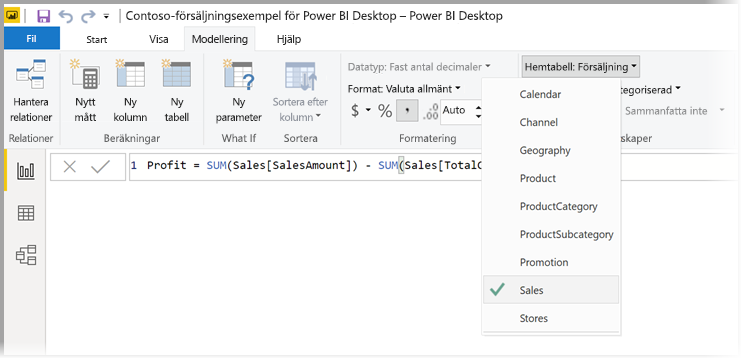
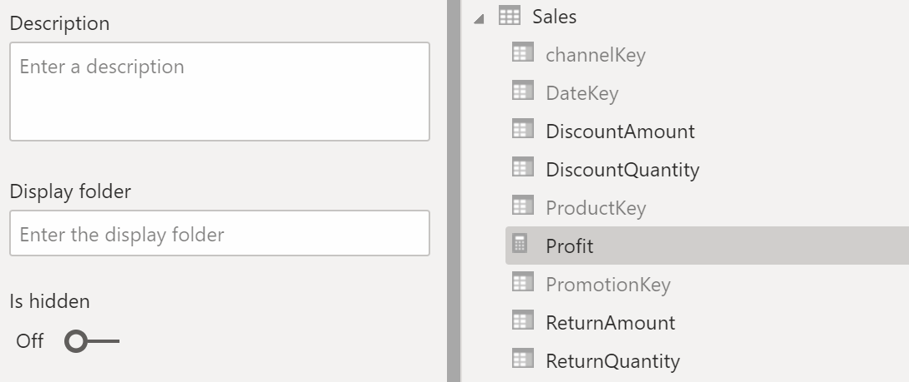

# <a name="create-measures-for-data-analysis-in-power-bi-desktop"></a>Skapa mått för dataanalys i Power BI Desktop

I Power BI Desktop får du hjälp att skapa insikter om dina data med bara några klickningar. Men data innehåller ibland inte allt du behöver för att besvara några av dina viktigaste frågor. Mått kan vara en hjälp på vägen.

Mått används i några av de vanligaste dataanalyserna. Enkla summeringar som summor, medelvärden, lägsta, högsta och antal kan du även ställa in via källan **Fält**. Det beräknade resultatet av mått ändras alltid när du interagerar med dina rapporter, vilket ger snabb och dynamisk utforskning av dina data. Låt oss ta en närmare titt. Mer information finns i [Skapa beräknade mått](/learn/modules/model-data-power-bi/4b-create-calculated-measures).

## <a name="understanding-measures"></a>Förstå mått

I Power BI Desktop skapar och visar du mått i *Rapportvyn* eller *Datavyn*. De mått du skapar själv visas i **fältlistan** med en miniräknarikon. Du kan kalla åtgärder vad du vill och lägga till dem i en ny eller befintlig visualisering precis som ett annat fält.


> [!NOTE]
> Du kan också vara intresserad av *snabbåtgärder*, som är färdiga åtgärder som du kan välja från dialogrutor. De är ett bra sätt att snabbt skapa mått och ett bra sätt att lära dig DAX-syntaxen (Data Analysis Expressions), eftersom de är automatiskt skapade DAX-formler som du kan granska. Läs mer i [snabbmått](desktop-quick-measures.md).
> 
> 

## <a name="data-analysis-expressions"></a>Data Analysis-uttryck

Mått beräknar ett resultat från en uttrycksformel. När du skapar egna åtgärder, använder du formelspråket [Data Analys-uttryck](/dax/) (DAX). DAX innehåller ett bibliotek med över 200 funktioner, operatorer och konstruktioner. DAX-biblioteket ger stor flexibilitet när du skapar mått för att beräkna resultat för praktiskt taget alla dataanalysbehov.

DAX-formler påminner mycket om Excel formler. DAX har dessutom stöd för många av funktionerna i Excel som `DATE`, `SUM` och `LEFT`. Funktionerna i DAX är dock avsedda att användas med relationsdata som de vi har i Power BI Desktop.

## <a name="lets-look-at-an-example"></a>Låt oss ta en titt på ett exempel

Jan är försäljningschef på Contoso. Jan har blivit ombedd att ange försäljningsprognoser för återförsäljare under nästa räkenskapsår. Jan bestämmer sig för att basera sina uppskattningar på förra årets försäljningssiffror, med sex procents årlig ökning från olika kampanjer som är inplanerade under de kommande sex månaderna.

För att rapportera uppskattningarna importerar Jan fjolårets säljdata till Power BI Desktop. Jan hittar fältet **SalesAmount** i tabellen **Reseller Sales**. Eftersom de data som Jan har importerat endast innehåller försäljningssiffror för det senaste året ändrar hon namnet på fältet **SalesAmount** till *Last Years Sales*. Sedan drar Jan **Last Years Sales** till rapportarbetsytan. Den visas i ett diagram som ett enda värde, vilket är summan av alla återförsäljares försäljning förra året.

Jan observerar att en beräkning har angetts automatiskt trots att hon inte angav någon. Power BI Desktop skapade ett eget mått genom att addera alla värden i **Last Years Sales**.

Jan behöver dock ett mått för att beräkna en uppskattning för nästa år, som bygger på förra årets försäljning multiplicerat med 1,06 för att ta med den förväntade ökningen på 6 procent i beräkningen. För den här beräkningen skapar Jan ett mått. Jan använder funktionen *Nytt mått* och anger sedan följande DAX-formel:

```dax
    Projected Sales = SUM('Sales'[Last Years Sales])*1.06
```

Jan drar sedan måttet Projected Sales till diagrammet.


Nu har Jan ett mått för att beräkna framtida försäljning med minimal ansträngning. Jan kan analysera sina prognoser ytterligare genom att filtrera specifika återförsäljare eller lägga till andra fält i rapporten.

## <a name="data-categories-for-measures"></a>Datakategorier för mått

Du kan också välja datakategorier för mått.

Med datakategorier kan du bland annat använda mått till att skapa dynamiska webbadresser och markera datakategorin som en webbadress.

Du kan till exempel skapa tabeller som visar måtten som webbadresser och sedan klicka på URL:en som skapas baserat på ditt val. Det här är särskilt användbart om du vill länka till andra Power BI-rapporter med [URL-filterparametrar](../collaborate-share/service-url-filters.md).

## <a name="organizing-your-measures"></a>Ordna dina mått

Måtten har en *starttabell* som anger var de finns i fältlistan. Du kan ändra deras plats genom att välja en plats från tabellerna i din modell.



Du kan också ordna fält i en tabell i *visningsmappar*. Välj **Modell** till vänster i Power BI Desktop. I fönstret **Egenskaper** väljer du det fält du vill flytta från listan med tillgängliga fält. Ange ett namn för den nya mappen i **Visa mapp** för att skapa en mapp. När du skapar en mapp flyttas det markerade fältet till den mappen.



Du kan skapa undermappar med hjälp av ett omvänt snedstreck. Om du till exempel skriver *Ekonomi\Valutor* så skapas mappen *Ekonomi*, och i den mappen skapas mappen *Valutor*.

Du kan göra så att ett fält visas i flera mappar genom att avgränsa mappnamnen med ett semikolon. Om du till exempel skriver *Produkter\Namn;Avdelningar* visas fältet i mappen *Avdelningar* och i mappen *Namn* inuti mappen *Produkter*.

Du kan skapa en särskild tabell som bara innehåller mått. Den tabellen visas alltid överst i **fältlistan**. Det gör du genom att skapa en tabell med bara en kolumn. Du kan använda **Ange data** för att skapa tabellen. Flytta sedan dina mått till tabellen. Slutligen döljer du kolumnen, men inte tabellen, som du skapade. Välj pilen överst i **fältlistan** så att du stänger och öppnar fältlistan igen för att se ändringarna.


## <a name="learn-more"></a>Läs mer

Vi har bara gett en kort introduktion till beräknade tabeller här. Det finns mycket du kan lära dig om att skapa egna. Mer information finns i [Självstudie: Skapa egna mått i Power BI Desktop](desktop-tutorial-create-measures.md). Du kan ladda ned en exempelfil och få stegvisa instruktioner för hur du skapar fler mått.  

Om du vill fördjupa dig i DAX kan du läsa [Grunderna för DAX i Power BI Desktop](desktop-quickstart-learn-dax-basics.md). Lathunden för [Data Analysis Expressions](/dax/) innehåller detaljerade artiklar om alla funktioner, syntaxer operatörer och namnkonventioner. DAX har funnits i åratal i Power Pivot i Excel och SQL Server Analysis Services. Det finns även många andra utmärkta resurser. Läs [DAX Resource Center Wiki](https://social.technet.microsoft.com/wiki/contents/articles/1088.dax-resource-center.aspx), där inflytelserika BI-experter delar med sig av sina kunskaper om DAX.
