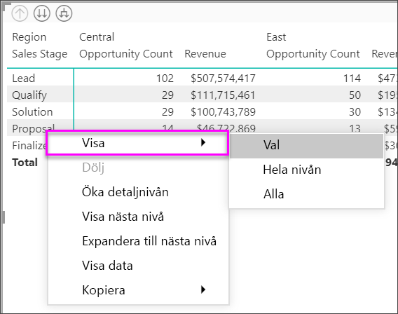
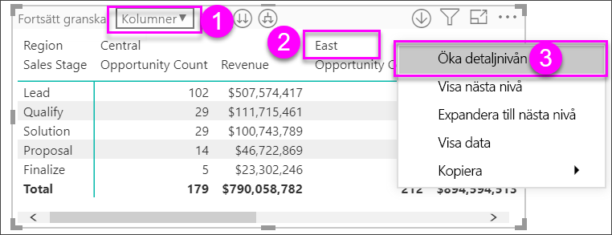
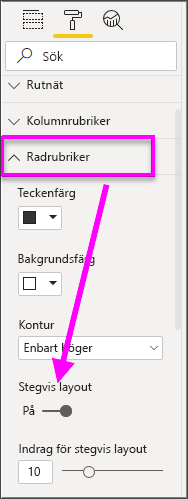
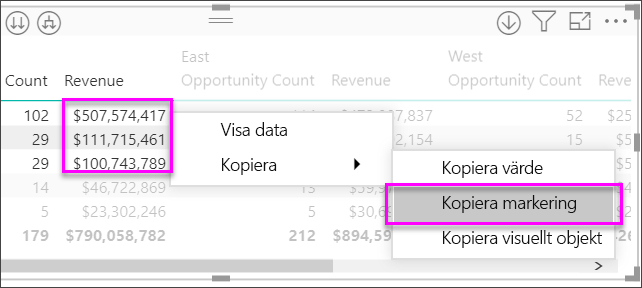
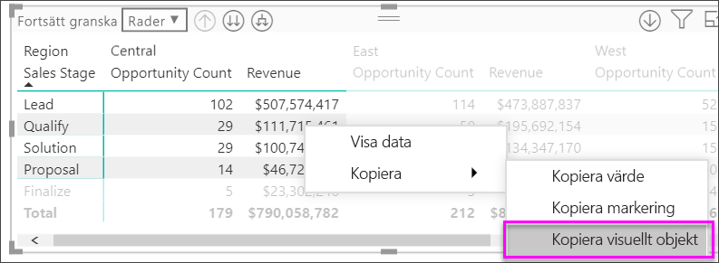
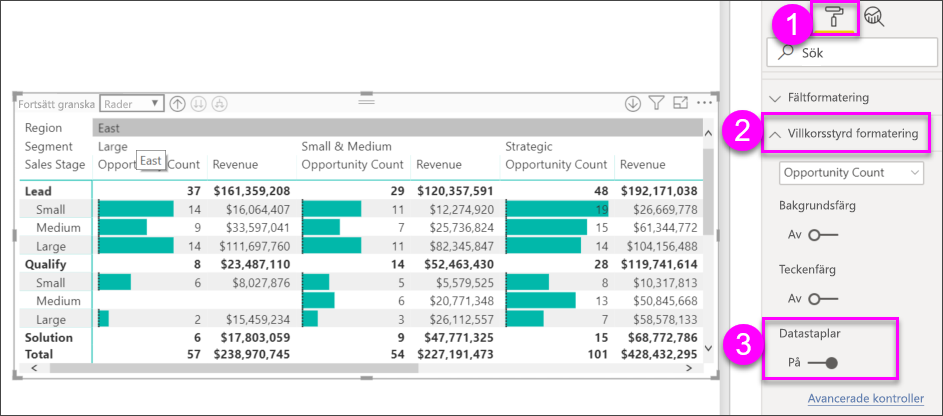
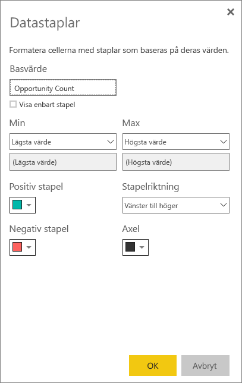

# Använd det visuella matrisobjektet i Power BI

[!INCLUDE [power-bi-visuals-desktop-banner](../includes/power-bi-visuals-desktop-banner.md)]

Det visuella matrisobjektet liknar en tabell.  En tabell har stöd för två dimensioner och dess data är plana, vilket innebär att dublettvärden visas och inte aggregeras. En matris gör det enklare att visa data på ett meningsfullt sätt med hjälpa av flera dimensioner – och den har stöd för stegvis layout. Matrisen aggregerar data automatiskt och gör det möjligt att öka detaljnivån. 

Du kan skapa visuella matrisobjekt i **Power BI Desktop**-rapporter och korsmarkera element i matrisen med andra visuella objekt på den rapportsidan. Du kan till exempel välja rader, kolumner och även enskilda celler och korsmarkeringar. Du kan även kopiera enskilda celler och markeringar av flera celler och klistra in dem i andra program. 

Det finns många funktioner som är kopplade till matrisen och vi ska gå igenom dem i följande avsnitt i den här artikeln.

## Beräkning av summor i Power BI

Innan vi går vidare till hur man använder det visuella matrisobjektet är det viktigt att du förstår hur Power BI beräknar total- och delsummor i tabeller och matriser. När det gäller summa- och delsummarader utvärderar Power BI måttet för alla rader i underliggande data – det handlar inte bara om att lägga till värdena i de tabellrader som syns eller visas. Detta innebär att du kan få andra värden än vad du räknat med i totalsummaraden.

Ta en titt på följande visuella matrisobjekt. 

I det här exemplet visar varje rad i det visuella matrisobjektet längst till höger *Belopp* för varje kombination säljare/datum. Men eftersom en säljare visas för flera datum kan siffrorna visas mer än en gång. Den korrekta totalsumman för underliggande data och en enkel addering av de synliga värdena överensstämmer därmed inte. Detta är ett vanligt mönster när det värde som du summerar finns på ”ett”-sidan i ett ett-till-många-samband.

När du tittar på summor och delsummor, kom ihåg att dessa värden baseras på underliggande data. De är inte bara baserade på de synliga värdena.

<!-- use Nov blog post video

## Expanding and collapsing row headers
There are two ways you can expand row headers. The first is through the right-click menu. You’ll see options to expand the specific row header you clicked on, the entire level or everything down to the very last level of the hierarchy. You have similar options for collapsing row headers as well.

You can also add +/- buttons to the row headers through the formatting pane under the row headers card. By default, the icons will match the formatting of the row header, but you can customize the icons’ color and size separately if you want. 
Once the icons are turned on, they work similarly to the icons from PivotTables in Excel.

The expansion state of the matrix will save with your report. It can be pinned to dashboards as well, but consumers will need to open up the report to change the state. Conditional formatting will only apply to the inner most visible level of the hierarchy. Note that this expand/collapse experience is not currently supported when connecting to AS servers older than 2016 or MD servers.

Watch the following video to learn more about expand/collapse in the matrix:

-->
## Öka detaljnivån i det visuella matrisobjektet
Det finns en mängd intressanta aktiviteter som ökar detaljnivån i matrisen som inte var tillgängliga tidigare. Detta inkluderar möjligheten att öka detaljnivån för rader, kolumner och även i enskilda avsnitt och celler. Nu ska vi titta på hur var och en av dessa fungerar.

### Öka detaljnivån för radrubriker

Gå till fönstret Visualiseringar. När du lägger till flera fält i avsnittet **Rader** i området **Fält** aktiveras ökad detaljnivå för raderna det visuella matrisobjektet. Detta påminner om hur du skapar en hierarki som sedan låter dig öka detaljnivån (och återgå) i hierarkin och analysera data på varje nivå.

I följande bild innehåller avsnittet **Rader** *Försäljningssteg* och *Affärsmöjlighetens storlek* och skapar en gruppering (eller hierarki) i raderna som vi kan visa i större eller mindre detalj.

När en gruppering har skapats i avsnittet **Rader** visar det visuella objektet ikonerna *detaljgranska* och *expandera* i det övre vänstra hörnet.

På samma sätt som du kan använda funktionerna för att öka detaljnivån och expandera beteendet för andra visuella objekt, kan vi öka detaljnivån i hierarkin (eller återgå) med dessa knappar. I det här fallet kan vi gå från *Försäljningssteg* till *Affärsmöjlighetens storlek*, vilket visas i följande bild där ikonen för att öka detaljnivån en nivå (högaffeln) har valts.

Förutom ikonerna kan du välja någon av radrubrikerna och öka detaljnivån genom att välja från menyn som visas.

Observera att det finns flera alternativ på menyn som visas, vilket genererar olika resultat:

Genom att välja **Granska nedåt** expanderas matrisen för *radnivån*, *exklusive* alla andra radrubriker med undantag för den radrubrik som valdes. I följande bild har **Förslag** > **Granska nedåt** valts. Observera att andra topprader inte längre visas i matrisen. Detta är en mycket användbar funktion och som är särskilt fiffig när det är dags att korsmarkera avsnitt.

Välj ikonen **Granska uppåt** för att gå tillbaka till föregående toppnivåsvy. Om du sedan väljer **Förslag** > **Visa nästa nivå** visas en fallande lista över alla objekt på nästa nivå (i det här fallet fältet *Affärsmöjlighetens storlek*) utan kategoriseringen för nästa hierarkinivå.

Välj ikonen **Granska uppåt** i det övre vänstra hörnet för att matrisen ska visa alla toppkategorier och välj sedan **Förslag** > **Expandera till nästa nivå** för att visa alla värdena för hierarkins båda nivåer – *Försäljningssteg* och *Affärsmöjlighetens storlek*.

Du kan också använda menyalternativet **Expandera** för att styra visningen ytterligare.  Välj exempelvis **Förslag** > **Expandera** > **Val**. Power BI visar en fullständig rad för varje *Försäljningssteg* och alla alternativen för *Affärsmöjlighetens storlek* för *Förslag*.

### Öka detaljnivån för kolumnrubriker
På samma sätt som du kan öka detaljnivån för rader kan du göra samma med Kolumner. I följande bild finns det två fält i fältet **Kolumner** som skapar en hierarki som liknar den som vi använde för raderna tidigare i den här artikeln. I fältområdet **Kolumner** hittar vi *Region* och *Segment*. Så snart som det andra fältet lades till i **Kolumner**, visades en ny listrutemeny på det visuella objektet som för närvarande visar **Rader**.

Om du vill öka detaljnivån för kolumner, väljer du **Kolumner** i menyn *Fortsätt granska* som finns i det övre vänstra hörnet av matrisen. Välj den *östra* regionen och välj **Granska nedåt**.

När du väljer **Granska nedåt** visas nästa nivå i kolumnhierarkin för *Region > Östra*, vilket i detta fall är *Antal affärsmöjligheter*. Den andra regionen är dold.

Resten av alternativen i menyn fungerar för kolumner på samma sätt som de gör för rader (se föregående avsnitt **Öka detaljnivån för radrubriker**). Du kan **Visa nästa nivå**, **Expandera till nästa nivå** med kolumner på samma sätt som rader.

> [!NOTE]
> Ikonerna för att öka och minska detaljnivån längst upp till vänster på matrisen gäller endast för rader. Du måste använda högerklicksmenyn för att öka detaljnivån i kolumner.

## Stegvis layout med matriser

Visuella matrisobjekt har automatiskt indrag för underkategorier i en hierarki under en överordnad kategori. Detta kallas stegvis layout.

I den ursprungliga versionen av det visuella matrisobjektet visades underkategorier i en helt annan kolumn och tog upp mer utrymme i det visuella objektet. Följande bild visar tabellen i den ursprungliga matrisen. Observera underkategorierna i en separat kolumn.

I följande bild visas en matris med stegvis layout. Lägg märke till kategorin *datorer* visar underkategorierna något indragna (tillbehör för datorer, stationära datorer, bärbara datorer, skärmar och så vidare) vilket är tydligare och mycket mer komprimerat.

Du kan enkelt ändra inställningarna för stegvis layout. Med det visuella matrisobjektet markerat, i **Formatera**-avsnittet (färgvalsikonen) i **Visualiseringar**-fönstret, expanderar du radrubriksavsnittet. Du har två alternativ: knappen stegvis layout (som aktiverar eller inaktiverar funktionen) och stegvis layoutindrag (anger indrag i bildpunkter).

Om du inaktiverar stegvis layout, visar Power BI underkategorierna i en annan kolumn istället för att visas indragna under den överordnade kategorin.

## Delsummor med matriser

Du kan aktivera eller inaktivera delsummor i matriser, för såväl rader som kolumner. På den följande bilden kan du se att raddelsummorna är inställda på **På**.

I avsnittet format i fönstret Visualiseringar, expanderar du kortet **Delsummor** och sätter skjutreglaget raddelsummor till **Av**. När du gör det visas inte delsummorna.

Samma sak gäller för kolumndelsummor.

## Korsmarkering med matriser

Med det visuella matrisobjektet kan du välja valfria element i matrisen som grund för korsmarkering. Välj en kolumn i en matris så markerar Power BI kolumnen, precis som alla andra visuella objekt på rapportsidan. Den här typen av korsmarkering har varit en vanlig funktion för andra visuella objekt och val av datapunkter, så nu har det visuella matrisobjektet samma funktion.

Dessutom fungerar Ctrl + klicka för korsmarkering. I följande bild valdes till exempel en samling av underkategorier från det visuella matrisobjektet. Observera hur objekt som inte var markerat från det visuella objektet är nedtonade och hur övriga visuella objekt på sidan återspeglar de val du gjorde i det visuella matrisobjektet.

## Kopiera värdena från Power BI så att du kan använda dem i andra program

Din matris eller tabell kan ha innehåll som du vill använda i andra program: Dynamics CRM, Excel och andra Power BI-rapporter. Genom att högerklicka i Power BI kan du kopiera en cell eller ett cellurval till Urklipp. Sedan kan du klistra in dem i det andra programmet.

* Om du vill kopiera en enskild cells värde markerar du cellen, högerklickar och väljer **Kopiera värde**. Med det oformaterade cellvärdet i Urklipp kan du nu klistra in det i ett annat program.

    

* Om du vill kopiera mer än en enskild cell markerar du ett cellområde eller markerar en eller flera celler med hjälp av CTRL. 

    

* Kopian inkluderar kolumn- och radrubrikerna.

    

* Om du vill göra en kopia av den visuella objektet som bara innehåller de markerade cellerna, markerar du en eller flera celler med CTRL, högerklick och väljer **Kopiera visuellt objekt**

    

* Kopian kommer att vara en annan matris visualisering, men innehåller bara dina kopierade data.

    

## Fyllning och teckenfärger med matriser
Med det visuella matrisobjektet kan du använda villkorsstyrd formatering (färger, fyllning och datastaplar) för cellernas bakgrundsfärger inom matrisen samt tillämpa villkorsstyrd formatering på själva texten och värdena.

Om du vill tillämpa villkorsstyrd formatering, väljer du det visuella matrisobjektet och öppnar fönstret **Format**. Expandera kortet **Villkorsstyrd formatering** och flytta skjutreglaget till **På** för antingen **Bakgrundsfärg**, **Teckenfärg** eller **Datastaplar**. När du aktiverar något av dessa alternativ visas en länk till *Avancerade kontroller*, där du kan anpassa färger och värden för formatering av färg.
  
  

Välj *Avancerade kontroller* för att visa en dialogruta där du kan göra justeringar. Det här exemplet visar dialogrutan för **Datastaplar**.

## Nästa steg

[Punktdiagram och bubbeldiagram i Power BI](power-bi-visualization-scatter.md)

[Visualiseringstyper i Power BI](power-bi-visualization-types-for-reports-and-q-and-a.md)