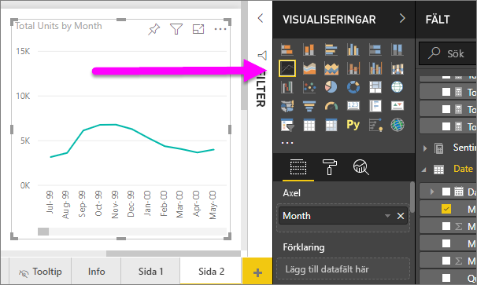
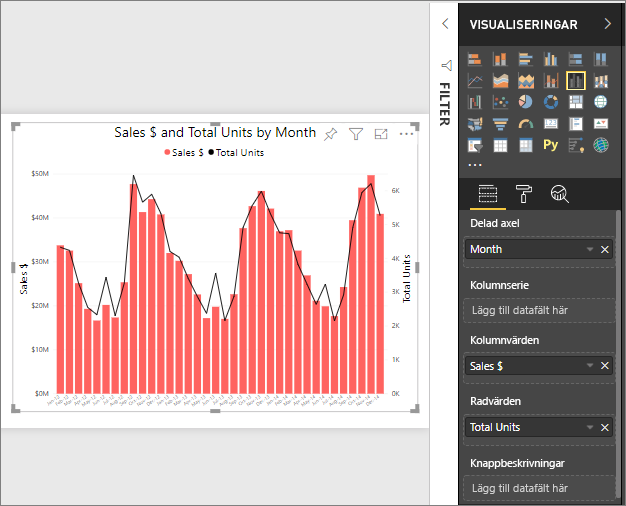

# Linjediagram i Power BI
Ett linjediagram är en serie datapunkter som representeras av punkter och anslutna via raka linjer. Ett linjediagram kan innehålla en eller flera rader. Linjediagram har ett X och Y-axeln. 

## Skapa ett linjediagram
Dessa anvisningar används på försäljning och marknadsföring appen att skapa ett linjediagram som visar årets försäljning efter kategori. Om du vill följa med kan du hämta exempelappen från appsource.com.

1. Börja med en tom rapportsida. Om du inte använder Power BI-tjänsten, se till att du öppnar rapporten i [Redigeringsvyn](../service-interact-with-a-report-in-editing-view.md).

2. Från fönstret fält, Välj **salesfact (säljfakta)** \> **Totalt antal enheter**, och välj **datum** > **månad**.  Powerbi skapar ett stapeldiagram på rapportarbetsytan.

    

4. Konvertera till ett linjediagram genom att välja diagrammall rad från fönstret visualiseringar. 

    
   

4. Filtrera din linjediagram för att visa data i flera år 2012 2014. Om din filterfönstret är komprimerat expanderar du den nu. Från fönstret fält, Välj **datum** \> **år** och dra den till fönstret filter. Släpp den under rubriken **filter på det här visuella objektet**. 
     
    

    Ändra **avancerade filter** till **grundläggande filter** och välj **2012**, **2013** och **2014**.

    

6. Du kan också [justera storlek och färg för diagramtexten](power-bi-visualization-customize-title-background-and-legend.md). 

    

## Lägga till ytterligare rader i diagrammet
Linjediagram kan ha många olika rader. Och i vissa fall kan värdena på raderna kanske avvikande så att de inte visas tillsammans. Låt oss titta på att lägga till ytterligare rader till våra aktuella diagram och lär dig sedan att formatera diagrammet när de värden som representeras av raderna är mycket olika. 

### Lägg till ytterligare rader
I stället för att titta på totalt antal enheter för alla regioner som en enda rad i diagrammet, vi dela upp till totalt antal enheter per region. Lägg till ytterligare rader genom att dra **Geo** > **Region** till brunnen förklaring.

   

### Använd två Y-axlar
Vad händer om du vill titta på total försäljning och Totalt antal enheter i samma schema? Försäljningssiffrorna är mycket högre än enhetsnummer, vilket gör linjediagrammet inte kan användas. Den röda linjen för totalt antal enheter visas i själva verket ska vara noll.

   

Visa mycket avvikande värden i ett diagram genom att använda ett kombinationsdiagram. Du kan lära dig allt om kombinationsdiagram genom att läsa [kombinationsdiagram i Power BI](power-bi-visualization-combo-chart.md). I vårt exempel nedan har kan vi Visa försäljnings- och Totalt antal enheter tillsammans i ett diagram genom att lägga till en andra Y-axel. 

   

## Överväganden och felsökning
* Ett linjediagram kan inte ha dubbla Y-axlar.  Du måste använda ett kombinationsdiagram i stället.
* I exemplen ovan har diagrammen formaterade för att öka teckenstorlek, ändra teckenfärg, lägga till axelrubriker, diagramrubrik och förklaring center, starta båda axlarna på noll och mycket mer. Formateringsfönstret (färgrollerikonen) har en till synes ändlösa uppsättning med alternativ för att göra dina diagram ser på sätt som du vill. Det bästa sättet att lära dig är att öppna formateringsfönstret och utforska.

## Nästa steg

[Visualiseringstyper i Power BI](power-bi-visualization-types-for-reports-and-q-and-a.md)

