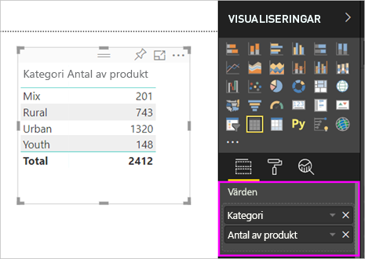

# Del 1, lägg till visualiseringar i en Power BI-rapport
Den här artikeln ger en snabb introduktion till att skapa en visualisering i en rapport med antingen Power BI-tjänsten eller Power BI Desktop.  För mer avancerat innehåll, se [del II](power-bi-report-add-visualizations-ii.md). Amanda visar ett par sätt att skapa, redigera och formatera visuella objekt på rapportarbetsytan. Prova sedan att skapa en egen rapport med hjälp av den [Försäljning- och marknadsföringsexempel](../sample-datasets.md).

<iframe width="560" height="315" src="https://www.youtube.com/embed/IkJda4O7oGs" frameborder="0" allowfullscreen></iframe>

## Öppna en rapport och lägg till en ny sida
1. Öppna en rapport i [redigeringsvyn](../consumer/end-user-reading-view.md). Den här kursen använder exemplet för [försäljning och marknadsföring](../sample-datasets.md).
2. Om fönstret Fält inte visas, väljer du på pilikonen för att öppna den. 
   
   
3. Lägg till en tom sida i rapporten.

## Lägg till visuella objekt i rapporten
1. Skapa ett visuellt objekt genom att välja ett fält från fönstret **Fält**.  
   
   **Börja med ett numeriskt fält** som SalesFact > Sales $. Power BI skapar ett stapeldiagram med en enda kolumn.
   
   
   
   **Eller börja med ett kategorifält**, till exempel Namn eller Produkt: Power BI skapar en tabell och lägger till fältet till brunnen **Värden**.
   
   
   
   **Eller börja med ett geografiskt fält**, till exempel Geo > Stad. Power BI och Bing Maps skapar en kartvisualisering.
   
   
2. Skapa en visualisering och ändra dess typ. Välj **Produkt > Kategori**, sedan **Produkt > Antal produkter** för att lägga till dem i **Värden**.
   
   
3. Ändra visualiseringen till ett stapeldiagram genom att välja ikonen stapeldiagram.
   
   
4. När du skapar visualiseringar i rapporten kan du [fästa dem på din instrumentpanel](../service-dashboard-pin-tile-from-report.md). Välj fästikonen  för att fästa visualiseringen.
   
   
  

## Nästa steg
 Fortsätt till [Del 2: Lägg till visualiseringar i en Power BI-rapport](power-bi-report-add-visualizations-ii.md)
   
   [Interagera med visualiseringar](../consumer/end-user-reading-view.md) i rapporten.
   
   [Gör ännu mer med visualiseringar](power-bi-report-visualizations.md).
   
   [Spara rapporten](../service-report-save.md).
