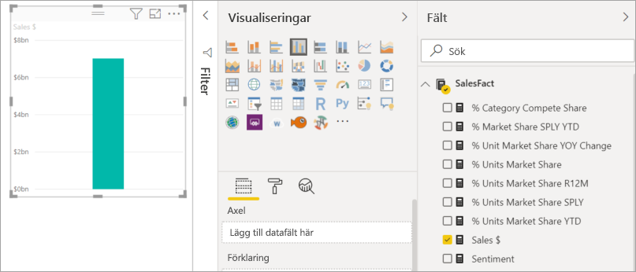
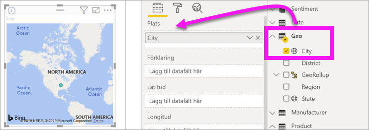
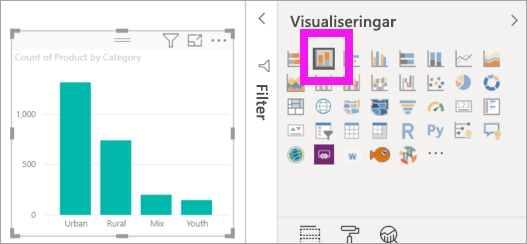
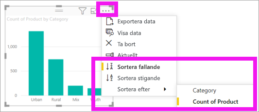

# Lägga till visuella objekt i en Power BI-rapport (del 1)

[!INCLUDE [power-bi-visuals-desktop-banner](../includes/power-bi-visuals-desktop-banner.md)]

Den här artikeln ger en snabb introduktion till att skapa en visualisering i en rapport. Den gäller för både Power BI-tjänsten och Power BI Desktop. För mer avancerat innehåll, [se del 2](power-bi-report-add-visualizations-ii.md) i den här serien. Amanda visar ett par sätt att skapa, redigera och formatera visuella objekt på rapportarbetsytan. Prova sedan att skapa en egen rapport med hjälp av den [Försäljning- och marknadsföringsexempel](../sample-datasets.md).

<iframe width="560" height="315" src="https://www.youtube.com/embed/IkJda4O7oGs" frameborder="0" allowfullscreen></iframe>

## Förutsättningar

I den här självstudien används [pbix-filen Sales & marketing](https://download.microsoft.com/download/9/7/6/9767913A-29DB-40CF-8944-9AC2BC940C53/Sales%20and%20Marketing%20Sample%20PBIX.pbix).

1. Välj **Arkiv** > **Öppna** uppe till vänster i menyraden i Power BI Desktop
   
2. Leta rätt på din kopia av **pbix-exempelfilen Sales and marketing**

1. Öppna **PBIX-exempelfilen Sales and marketing** i rapportvyn .

1. Välj  för att lägga till en ny sida.

## Lägg till visuella objekt i rapporten

1. Skapa ett visuellt objekt genom att välja ett fält från fönstret **Fält**.

    Börja med ett numeriskt fält som **Sales** > **TotalSales**. Power BI skapar ett stapeldiagram med en enda kolumn.

    

    Eller börja med ett kategorifält, till exempel **Namn** eller **Produkt**. Power BI skapar en tabell och lägger till fältet till området **Värden**.

    

    Eller börja med ett geografiskt fält, till exempel **Geo** > **Stad**. Power BI och Bing Maps skapar en kartvisualisering.

    

## Ändra typen av visualisering

 Skapa en visualisering och ändra dess typ. 
 
 1. Välj **Produkt** > **Kategori** och sedan **Produkt** > **Antal produkter** för att lägga till dem i området **Värden**.

    

1. Ändra visualiseringen till ett kolumndiagram genom att välja ikonen för **staplade kolumndiagram**.

   

1. Du ändrar hur det visuella objektet sorteras genom att välja **Fler åtgärder** (...).  Använd sorteringsalternativen till att ändra sorteringsordningen (stigande eller fallande) och ändra vilken kolumn som används till sorteringen (**Sortera efter**).

   
  
## Nästa steg

 Fortsätt till:

* [Del 2: Lägg till visualiseringar i en Power BI-rapport](power-bi-report-add-visualizations-ii.md)

* [Interagera med visualiseringar](../consumer/end-user-reading-view.md) i rapporten.

