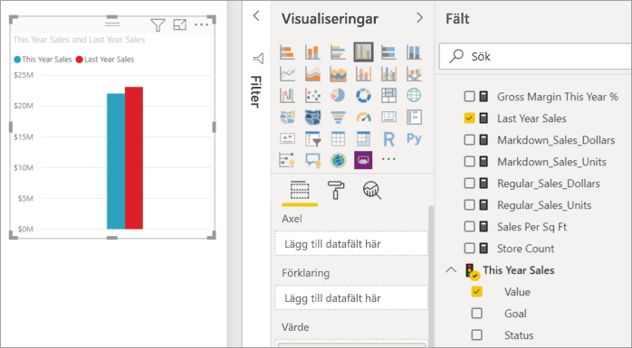
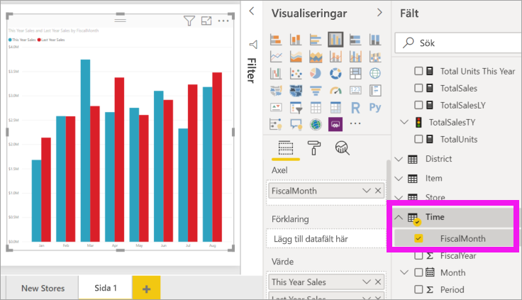
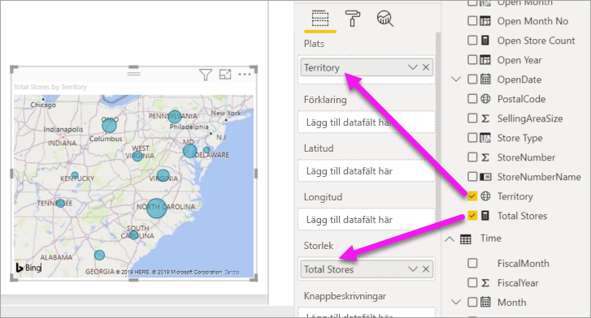
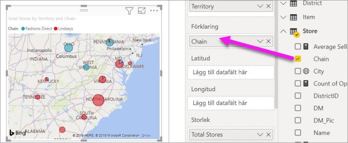

# Del 2, lägg till visualiseringar i en Power BI-rapport

[!INCLUDE [power-bi-visuals-desktop-banner](../includes/power-bi-visuals-desktop-banner.md)]

I [del 1](power-bi-report-add-visualizations-i.md) skapade du en grundläggande visualisering genom att markera kryssrutorna bredvid fältnamnen.  I del 2 får du lära dig hur du drar och släpper, och hur du använder panelerna **Fält** och **Visualiseringar** till att skapa och modifiera visualiseringar.

## Skapa en ny visualisering
I den här självstudien tar vi hjälp av vår Retail Analysis-datamängd för att skapa några viktiga visualiseringar.

## Förutsättningar

I den här självstudien använder vi [PBIX-exempelfilen Retail analysis](https://download.microsoft.com/download/9/6/D/96DDC2FF-2568-491D-AAFA-AFDD6F763AE3/Retail%20Analysis%20Sample%20PBIX.pbix).

1. Välj **Arkiv** > **Öppna** uppe till vänster i menyraden i Power BI Desktop
   
2. Leta reda på kopian av **PBIX-filen Exempel för detaljhandelsanalys**

1. Öppna **PBIX-filen Exempel för detaljhandelsanalys** i rapportvyn .

1. Välj  för att lägga till en ny sida.

## Lägg till visuella objekt i rapporten

Skapa ett visuellt objekt genom att välja ett fält från fönstret **Fält**. Vilken typ av visualisering som skapas beror på typen av fält du väljer. Power BI använder datatypen till att avgöra vilken visualisering som ska användas för att visa resultatet. Du kan ändra vilken visualisering som används genom att välja på en annan ikon i fönstret Visualiseringar. Tänk på att alla visualiseringar inte passar för visning av dina data. Geografiska data visas till exempel inte bra i ett trattdiagram eller linjediagram. 

### Lägg till ett ytdiagram som jämför årets försäljning med föregående års

1. I tabellen **Försäljning** väljer du **This Year Sales (Årets försäljning)**  > **Värde** och **Last Year Sales (Förra årets försäljning)** . Power BI skapar ett kolumndiagram.  Det här diagrammet är intressant och du vill veta mer. Hur ser den månadsvisa försäljningen ut?  
   
   

2. Från tidtabellen drar du **FiscalMonth** till **Axel**-området.  
   

3. [Ändra visualiseringen](power-bi-report-change-visualization-type.md) till ett ytdiagram.  Det finns många visualiseringstyper att välja bland – titta närmare på [beskrivningarna för var och en, metodtipsen och självstudierna](power-bi-visualization-types-for-reports-and-q-and-a.md) om du behöver hjälp med att bestämma vilken typ du ska använda. Välj ytdiagramikonen  i fönstret Visualiseringar.

4. Sortera visualiseringen genom att välja **Fler alternativ** (...) och sedan **Sortera efter** >  **FiscalMonth**.

5. [Ändra storlek på visualiseringen](power-bi-visualization-move-and-resize.md) genom att välja visualiseringen, ta tag i en av konturens cirklar och dra. Gör den tillräckligt bred för att eliminera rullningslisten och tillräckligt liten för att ge oss tillräckligt med utrymme för att lägga till ytterligare en visualisering.
   
   
6. [Spara rapporten](../service-report-save.md).

### Lägga till en kartvisualisering som visar försäljningen efter plats

1. I tabellen **Butik** väljer du **Territorium**. Dra **Totalt antal butiker** till området Storlek. Power BI identifierar att Territorium är en plats och skapar en kartvisualisering.  
   

2. Lägg till en förklaring.  Om du vill visa dina data efter butiksnamn drar du **Butik** > **Kedja** till förklaringsområdet.  
   

## Nästa steg
* Du hittar mer i [Visualiseringar i Power BI-rapporter](power-bi-report-visualizations.md).  
* Har du fler frågor? [Prova Power BI Community](https://community.powerbi.com/)

