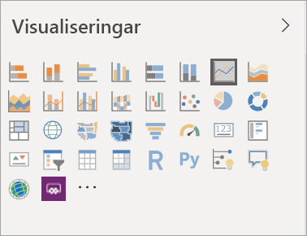
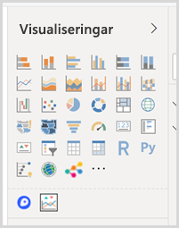

# Visualiseringar i Power BI-rapporter

Visualiseringar (visuella objekt) visar insikter som har upptäckts i data. En Power BI-rapport kan ha en enda sida med ett visuellt objekt eller en mängd sidor med visuella objekt. I Power BI-tjänsten kan visuella objekt [fästas från rapporter på instrumentpaneler](../service-dashboard-pin-tile-from-report.md).

Det är viktigt att skilja mellan *de som designar rapporten* och de som *använder den*.  Om du skapar eller ändrar rapporten är du designer.  Designer har redigeringsbehörighet för rapporten och dess underliggande datauppsättning. I Power BI Desktop, innebär det att du kan öppna datauppsättningen i Datavyn och skapa visuella objekt i Rapportvyn. I Power BI-tjänsten innebär det att du kan öppna datauppsättningen eller rapporten i rapportredigeraren i [Redigeringsvyn](../consumer/end-user-reading-view.md). Om en rapport eller instrumentpanel har [delats med dig](../consumer/end-user-shared-with-me.md) är du en rapport*konsument*. Du kan visa och interagera med rapporten och dess visuella objekt, men du kan inte göra lika många ändringar som en *designer*.

Många olika typer av visuella objekt är tillgängliga direkt från Power BI-fönstret Visualiseringar.

Om du vill ha ännu fler alternativ kan du besöka [Microsoft AppSource community-webbplatsen](https://appsource.microsoft.com) och söka efter och [ladda ned](https://appsource.microsoft.com/marketplace/apps?page=1&product=power-bi-visuals) [anpassade visuella objekt](../developer/visuals/custom-visual-develop-tutorial.md) från Microsoft och communityn.

<iframe width="560" height="315" src="https://www.youtube.com/embed/SYk_gWrtKvM?list=PL1N57mwBHtN0JFoKSR0n-tBkUJHeMP2cP" frameborder="0" allowfullscreen></iframe>

Om du inte har arbetat med Power BI tidigare eller behöver en uppfräschning, kan du använda länkarna nedan för att läsa om grunderna i Power BI-visualiseringar.  Alternativt, kan du använda vår innehållsförteckning (till vänster om den här artikeln) för att hitta ännu mer användbar information.

## Lägg till en visualisering i Power BI

[Skapa visualiseringar](power-bi-report-add-visualizations-i.md) på sidorna i dina rapporter. Bläddra igenom [listan över tillgängliga visualiseringar och tillgängliga visualiseringssjälvstudier.](power-bi-visualization-types-for-reports-and-q-and-a.md) 

## Ladda upp en anpassad visualisering och använd den i Power BI

Lägg till en anpassad visualisering som du har skapat själv eller som du hittat på [Microsoft AppSource community-webbplatsen](https://appsource.microsoft.com/marketplace/apps?product=power-bi-visuals). Känner du dig kreativ? Ta en närmare titt på vår källkod och använd våra [utvecklarverktyg](../developer/visuals/custom-visual-develop-tutorial.md) om du vill skapa nya visualiseringstyper och [dela dem med communityn](../developer/office-store.md). Om du vill veta mer om hur man utvecklar anpassade visuella objekt kan du läsa [Utveckla ett anpassat visuellt objekt i Power BI](../developer/visuals/custom-visual-develop-tutorial.md).

## Anpassa visualiseringsfönstret (förhandsversion)

Om du märker att du använder samma anpassade visuella objekt i många rapporter kan fästa du den anpassade visualiseringen i ditt visualiseringsfönster. Högerklicka på det visuella objektet för att fästa visualiseringen i fönstret.

När ett visuellt objekt har fästs flyttas det upp till de andra inbyggda visuella objekten. Det här visuella objektet är nu kopplat till kontot du är inloggad på, och alla nya rapporter du skapar kommer automatiskt innehålla det här visuella objektet förutsatt att du är inloggad. Det gör det enkelt att standardisera ett visst visuellt objekt, utan att du behöver lägga till det i varje enskild rapport.

Eftersom funktionen bara finns som förhandsversion kommer du bara att se det fästa visuella objekt i Power BI Desktop. Du måste också vara inloggad för att funktionen ska vara tillgänglig.

## Ändra visualiseringstyp

Försök att [ändra visualiseringstypen](power-bi-report-change-visualization-type.md) för att se vilken som fungerar bäst med dina data.

## Fäst visualiseringen

När du har fått till visualiseringen som du vill ha den i Power BI-tjänsten, kan du [fästa den på en instrumentpanel](../service-dashboard-pin-tile-from-report.md) som en panel. Om du ändrar den visualisering som används i rapporten efter att du fäster den, ändras inte panelen på instrumentpanelen. Om den var ett linjediagram förblir den ett linjediagram, även om du har ändrat till ett ringdiagram i rapporten.

## Begränsningar och överväganden
- De visuella objekten kan läsas in långsamt, beroende på datakällan och antalet fält (mått eller kolumner).  Vi rekommenderar att du begränsar antalet visuella objekt till totalt 10–20 fält, för bättre läsbarhet och prestanda. 

- Den övre gränsen för visuella objekt är 100 fält (mått eller kolumner). Om dina visuella objekt inte kan läsas in måste du minska antalet fält.   

## Nästa steg

* [Visualiseringstyper i Power BI](power-bi-visualization-types-for-reports-and-q-and-a.md)
* [Anpassade visuella objekt](../developer/power-bi-custom-visuals.md)
