# Skapa ArcGIS-kartor i Power BI Desktop

[!INCLUDE [power-bi-visuals-desktop-banner](../includes/power-bi-visuals-desktop-banner.md)]

Den här självstudien är skriven utifrån en person som skapar en ArcGIS-karta för Power BI. När en *designer* delar en karta från ArcGIS Maps for Power BI med en kollega så kan kollegan visa och interagera med kartan, men inte spara några ändringar. Mer information om hur du visar en ArcGIS-karta finns i [Interagera med ArcGIS Maps for Power BI](power-bi-visualizations-arcgis.md).

Kombinationen av ArcGIS-kartor och Power BI tar mappning längre än till bara presentation av punkter på en karta – helt enkelt till en helt ny nivå. Välj mellan grundläggande kartor, platstyper, teman, symbolformat och referensskikt för att skapa fantastiska informativa kartvisualiseringar. Kombinationen av auktoritära dataskikt på en karta med spatial analys ger en djupare förståelse av visualiseringens data.

 Du kan inte skapa en ArcGIS Maps for Power BI-karta på en mobil enhet, men du kan visa och interagera med den. Se [Interagera med ArcGIS-kartor](power-bi-visualizations-arcgis.md).

> [!NOTE]
> ArcGIS Maps för Power BI är för närvarande inte tillgängligt för Power BI-rapportserver.

> [!TIP]
> GIS står för Geographic Information Systems.

I exemplet nedan används en mörkgrå arbetsyta för att visa regional försäljning som en termisk karta mot ett demografiskt skikt för den disponibla medianinkomsten 2016. Som du kommer märka när du läser vidare ger användningen av ArcGIS Maps for Power BI tillgång till nästan obegränsad utökad mappningskapacitet, demografiska data och även mer övertygande kartvisualiseringar så att du kan förmedla ditt budskap på bästa sätt.

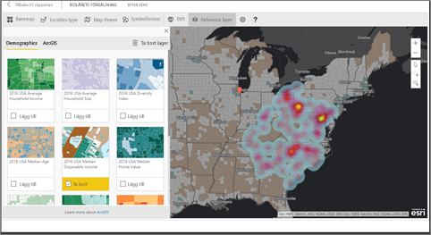

> [!TIP]
> Besök [Esris sida om ArcGIS Maps for Power BI](https://www.esri.com/powerbi) för att visa de många exemplen eller läsa kundutlåtanden. Gå sedan till Esris [startsida för att komma igång med ArcGIS Maps for Power BI](https://doc.arcgis.com/en/maps-for-powerbi/get-started/about-maps-for-power-bi.htm).

## Användargodkännande
ArcGIS Maps for Power BI tillhandahålls av Esri(https://www.esri.com). Din användning av ArcGIS Maps för Power BI är föremål för Esris villkor och sekretesspolicy. Power BI-användare som vill använda de visuella objekten i ArcGIS Maps för Power BI, måste ge sitt samtycke i dialogrutan för medgivande.

**Resurser**

[Villkor](https://go.microsoft.com/fwlink/?LinkID=826322)

[Sekretesspolicy](https://go.microsoft.com/fwlink/?LinkID=826323)

[Produktsida för ArcGIS Maps för Power BI](https://www.esri.com/powerbi)

## Förutsättningar

I den här självstudien använder vi Power BI Desktop och [PBIX-exempelfilen Retail Analysis](https://download.microsoft.com/download/9/6/D/96DDC2FF-2568-491D-AAFA-AFDD6F763AE3/Retail%20Analysis%20Sample%20PBIX.pbix). Du kan också skapa ArcGIS Maps for Power BI med hjälp av Power BI-tjänsten. 

1. I den övre vänstra delen i menyraden väljer du **Arkiv** \> **Öppna**
   
2. Leta reda på **PBIX-filen Exempel på detaljhandelsanalys** som sparats på den lokala datorn.

1. Öppna **Exempel på detaljhandelsanalys** i rapportvyn .

1. Välj  för att lägga till en ny sida.

   
## Skapa en visualisering med en ArcGIS Maps for Power BI-karta

Titta på när Will skapar några olika visualiseringar och följ sedan anvisningarna nedan för att prova själv med hjälp av [.PBIX-exempelfilen Retail Analysis](../sample-datasets.md).
    

   > [!NOTE]
   > Den här videon använder en äldre version av Power BI Desktop.
   > 

> [!VIDEO https://www.youtube.com/embed/EKVvOZmxg9s]

1. Välj ArcGIS Maps för Power BI-ikonen från panelen Visualiseringar.
   
    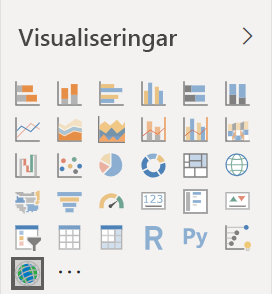    

2. Power BI lägger till en tom mall på rapportarbetsytan. I den här självstudien använder vi den kostnadsfria versionen.
   
   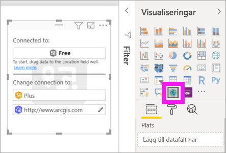

3. På panelen **Fält** drar du ett datafält till bucketerna **Plats** eller **Latitud** och/eller **Longitud**. I det här exemplet använder vi **Store > City**.
   
   > [!NOTE]
   > ArcGIS Maps för Power BI identifierar automatiskt om de fält som du har valt visas bäst som en form eller en punkt på en karta. Du kan justera standardvärdet i inställningarna (se nedan).
   > 
   > 
   
    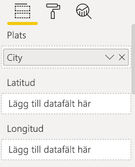

4. Dra ett mått till bucketen **Storlek** från panelen **Fält** för att justera hur data visas. I det här exemplet använder vi **Sales > Last Year Sales**.
   
    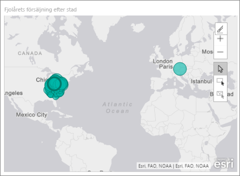

Du har skapat din första ArcGIS Maps for Power BI-karta. Nu ska vi förfina och formatera vår karta med hjälp av baskartor, platstyper, teman och mycket annat.

## Inställningar och formatering för ArcGIS Maps for Power BI
Så här gör du för att få åtkomst till formateringsfunktionerna i **ArcGIS Maps för Power BI**:

1. Du kan få åtkomst till ytterligare funktioner genom att välja **Fler alternativ** (...) uppe till höger i visualiseringen och sedan **Redigera**.
   
   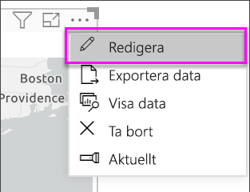
   
   Visualiseringen utökas och du ser de tillgängliga funktionerna längst upp. När du väljer en funktion öppnas ett åtgärdsfönster med detaljerade alternativ. 
   
   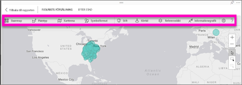
   

> [!TIP]
> **Esri** tillhandahåller [omfattande dokumentation](https://go.microsoft.com/fwlink/?LinkID=828772) om funktionsuppsättningen i **ArcGIS Maps för Power BI**.

### Grundläggande kartor
Fyra grundläggande kartor tillhandahålls: Dark Gray Canvas (Mörkgrå arbetsyta), Light Gray Canvas (Ljusgrå arbetsyta), OpenStreetMap och Streets (Gator).  *Streets* är ArcGIS grundläggande standardkarta.

Om du vill använda en grundläggande karta väljer du den i åtgärdsfönstret.

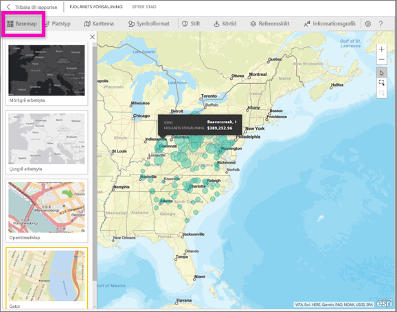

### Platstyp
ArgGIS Maps for Power BI identifierar automatiskt det bästa sättet att visa data på kartan. Den väljer mellan punkter eller gränser. Med alternativen för Platstyp kan du finjustera de här valen.

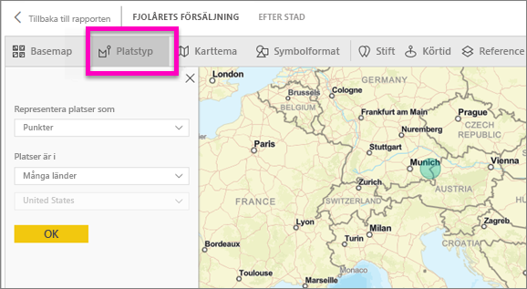

**Gränser** fungerar bara om dina data innehåller geografiska standardvärden. ArcGIS Maps for Power BI räknar automatiskt ut vilken form som ska visas på kartan. Geografiska standardvärden är länder, provinser, postnummer och så vidare. Men precis som med geokodning kan det hända att Power BI inte kan identifiera att fältet ska vara en gräns som standard, eller så kanske det inte går att hitta någon gräns för dina data.  

### Karttema
Det finns fyra kartteman. Power BI väljer automatiskt antingen temat **Endast plats** eller **Storlek**, baserat på vilka fält du lade till i bucketarna **Plats** och **Storlek**. Vår karta använder **Storlek** som standard eftersom vi lade till fält i båda bucketarna. Prova de andra temana och gå tillbaka till **Storlek** innan du går vidare till nästa steg.  

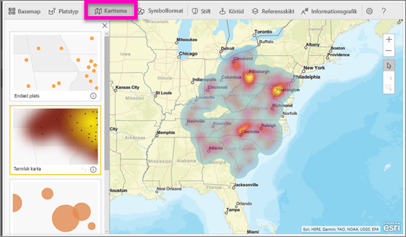

<table>
<tr><th>Tema</th><th>Beskrivning</th>
<tr>
<td>Endast plats</td>
<td>Ritar datapunkter eller fyllda gränser på kartan baserat på fälten du lade till i bucketen Plats.</td>
</tr>
<tr>
<td>Termisk karta</td>
<td>Ritar dataintensiteten på kartan. Områden med högre aktivitet eller värde representeras av starkare och lysande färger. </td>
</tr>
<tr>
<td>Storlek</td>
<td>Ritar datapunkter på kartan baserat på fälten du lade till i bucketen Storlek.</td>
</tr>
<tr>
<td>Klustring</td>
<td>Punkter inom den angivna klusterradien grupperas i en enda symbol som representerar antalet punkter i det området av kartan. </td>
</tr>
</table>

### Symbolformat
Med olika symbolformat kan du finjustera hur data ska visas på kartan. Symbolformat är sammanhangsberoende baserat på vilken platstyp och vilket karttema du väljer. I exemplet nedan är karttemat inställt på **Storlek** och symbolformatet har flera justeringar av genomskinlighet, stil och storlek. 

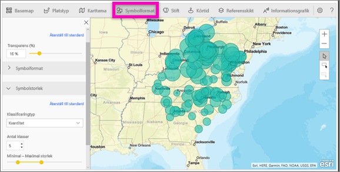

### Stift
Du kan uppmärksamma punkter på kartan genom att lägga till stift.  

1. Välj fliken **Stift**.
2. Ange nyckelord (till exempel adresser, platser och orienteringspunkter) i sökrutan och välj i listrutan. En symbol som visas på kartan och kartan zoomar automatiskt in på platsen. Sökresultaten sparas som platskort på panelen Stift. Du kan spara upp till 10 platskort.
   
   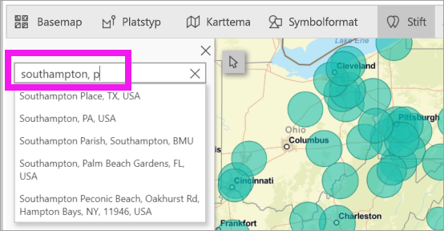
3. Power BI lägger till ett stift till platsen och du kan ändra färg på stiftet.
   
   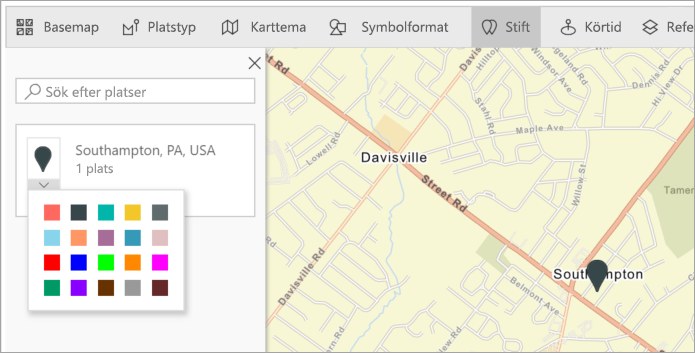
4. Lägg till och ta bort stift.
   
   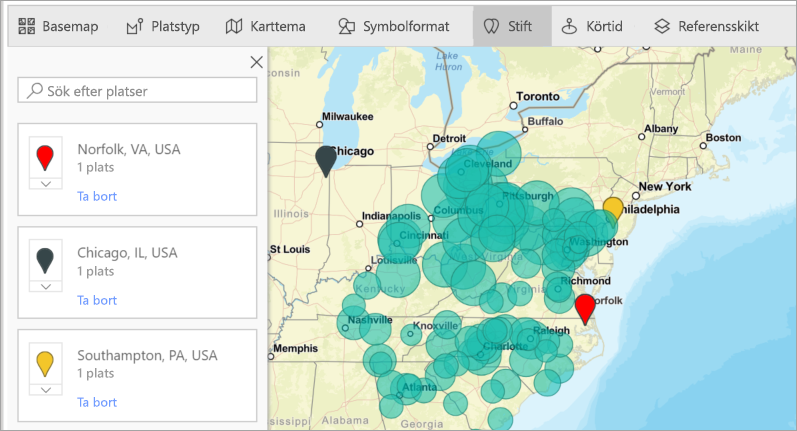

### Körtid
På panelen Drive time (Körtid) kan du välja en plats och sedan avgöra vilka andra kartfunktioner som finns inom en angiven radie eller körtid. I exemplet nedan ser du en 50-mils radie från Washington D.C.  Följ stegen nedan för att skapa ett eget körtidslager. 
    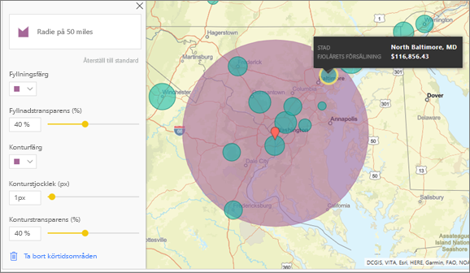

1. Välj verktyget för enstaka val och välj ett stift eller en bubbla. I det här exemplet har vi valt ett stift för flygplatsen Douglas i Charlotte

   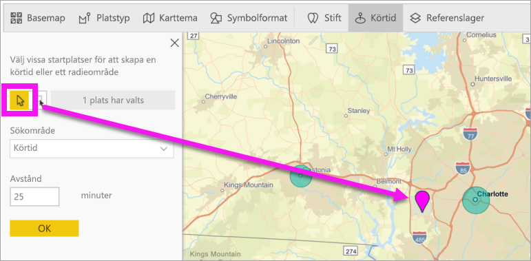
   
   > [!TIP]
   > Det är enklare att välja en plats om du zoomar in på kartan. Du kan zooma med +-ikonen eller genom att rulla på musen.
   > 
   > 
2. Anta att du reser till flygplatsen Douglas i Charlotte under några dagrar och vill ta reda på vilka av butikerna i din kedja som ligger inom rimligt köravstånd. Ändra sökområdet till **körningstid** och avståndet till **25** minuter. Välj OK.    
   
    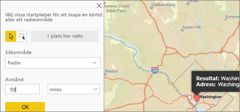

    

3. Det finns två butiker inom 25 minuters körsträcka. Radien visas i lila. Välj valfri plats för att visa detaljerad information om den. Du kan också formatera radien genom att ändra färgen och konturen.
   
    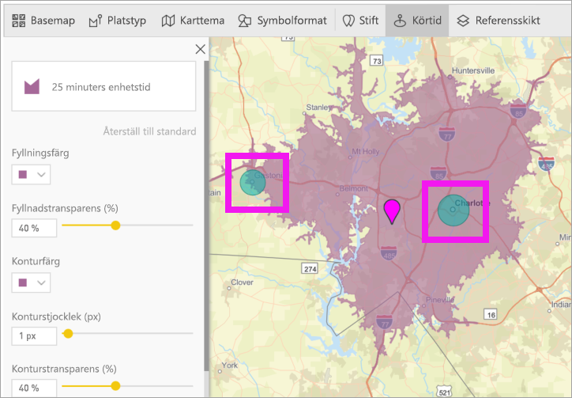

### Referensskikt
#### Referensskikt – demografi
ArcGIS Maps för Power BI tillhandahåller ett urval av demografiska skikt som hjälper till att sätta data från Power BI i sin kontext.

1. Välj fliken **Referensskikt** och välj **Demografi**.
2. Varje skikt i listan har en kryssruta. Markera med en bock för att lägga till skiktet på kartan.  I det här exemplet har vi lagt till den genomsnittliga hushållsinkomsten. 
   
    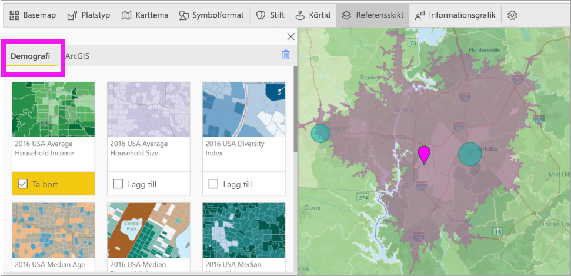
3. Varje skikt är också interaktivt. Hovra över en bubbla om du vill se mer information. Klicka på ett skuggat område om du vill se information i form av diagram. Här har vi valt postnummer 28227 och det finns två diagram vi kan visa.
   
    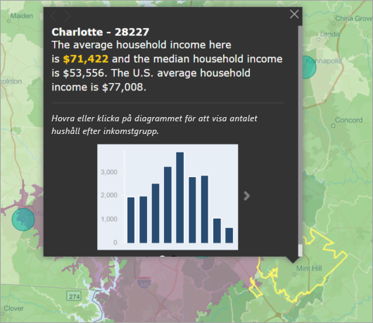

#### Referensskikt – ArcGIS
ArcGIS Online gör det möjligt för organisationer att publicera offentliga webbplatskartor. Dessutom ger Esri tillgång till en granskad uppsättning webbkartor via Living Atlas. På ArcGIS-fliken kan du söka igenom alla offentliga webbkartor eller Living Atlas-kartor och lägga till dem på kartan som referensskikt.

1. Välj fliken **Referensskikt** och välj **ArcGIS**.
2. Ange sökorden och välj sedan ett kartskikt. I det här exemplet har vi valt amerikanska kongressdistrikt.
   
    
3. Om du vill se information väljer du ett skuggat område för att öppna *Välj från referensskikt*: Använd verktyget för val av referensskikt för att markera gränser eller objekt på referensskiktet.

 

## Välja datapunkter
Med ArcGIS Maps for Power BI kan du med fem vallägen välja dina data exakt och snabbt.

Ändra valläge genom att hovra markören över ikonen verktyget för ett val som visas i bilden nedan. Det dolda fältet expanderas med ytterligare verktyg:

Varje verktyg har en unik roll i att du kan välja dina data: 

 Välj enskilda datapunkter.

 Ritar en rektangel på kartan och väljer de inneslutna datapunkterna.

 Medför att gränser eller polygoner inom referensskikt kan användas för att markera inneslutna datapunkter.

 Gör att du kan välja data med ett buffertskikt.

 Gör att du kan välja datapunkter som liknar varandra.

> [!NOTE]
> Du kan välja högst 250 datapunkter i taget.
> 
> 

 

## Få hjälp
**Esri** tillhandahåller [omfattande dokumentation](https://go.microsoft.com/fwlink/?LinkID=828772) om funktionsuppsättningen i **ArcGIS Maps för Power BI**.

Du kan ställa frågor, hitta den senaste informationen, rapportera problem och få svar i Power BI-[communityns tråd om **ArcGIS Maps för Power BI**](https://go.microsoft.com/fwlink/?LinkID=828771).

Om du har förslag på en förbättring kan du skicka det till [Power BI:s idélista](https://ideas.powerbi.com).

 

## Hantera användningen av ArcGIS Maps för Power BI i din organisation
Med Power BI kan designers, klientadministratörer och IT-administratörer sköt användningen av ArcGIS Maps for Power BI. Nedan ser du vad varje roll kan utföra. 

### Alternativ för designers
Designers i Power BI Desktop kan inaktivera ArcGIS Maps for Power BI på fliken Säkerhet. Välj **Arkiv** > **Alternativ och inställningar** och sedan **Alternativ** > **Säkerhet**. När ArcGIS Maps är inaktiverat läses det inte in som standard.

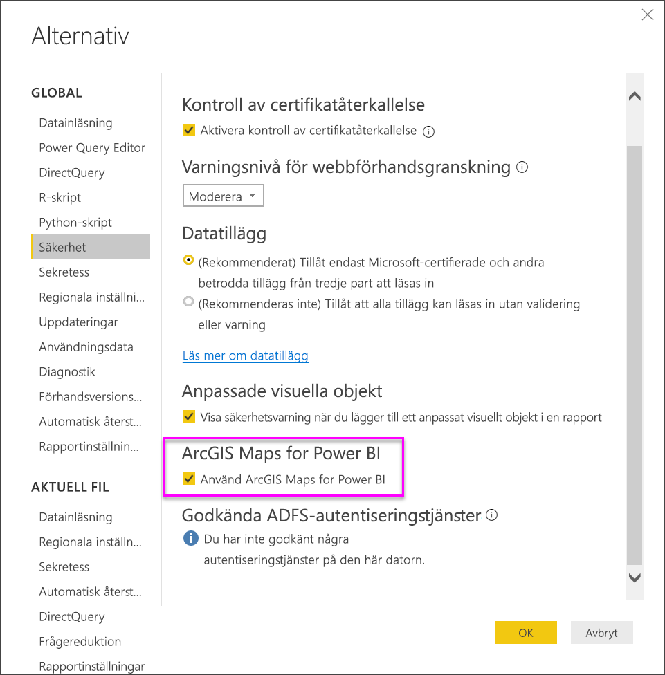

### Alternativ för klientadministratörer
Administratörer för klientorganisationer på PowerBI.com kan avaktivera ArcGIS Maps for Power BI för samtliga användare. Välj **Inställningar** > **Administrationsportalen** > **Inställningar för klientorganisation**. När funktionen är inaktiv visas inte längre ikonen för ArcGIS Maps for Power BI i fönstret Visualiseringar i Power BI.

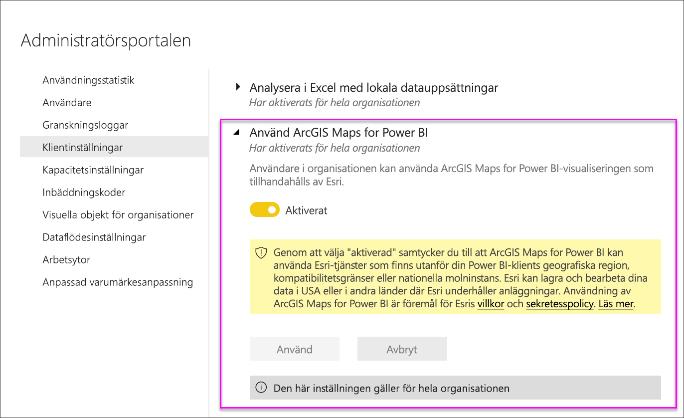

### Alternativ för IT-administratörer
Power BI Desktop stöder användning av **Grupprincip** för att inaktivera ArcGIS Maps för Power BI på en organisations distribuerade datorer.

<table>
<tr><th>Attribut</th><th>Värde</th>
</tr>
<tr>
<td>nyckel</td>
<td>Programvara\Principer\Microsoft\Power BI Desktop&lt;/td&gt;
</tr>
<tr>
<td>valueName</td>
<td>EnableArcGISMaps</td>
</tr>
</table>

Ett värde på 1 (decimal) aktiverar ArcGIS Maps för Power BI.

Ett värde på 0 (decimal) inaktiverar ArcGIS Maps för Power BI.

## Överväganden och begränsningar
ArcGIS Maps för Power BI finns tillgängligt i följande tjänster och appar:

<table>
<tr><th>Tjänst/app</th><th>Tillgängligt</th></tr>
<tr>
<td>Power BI Desktop</td>
<td>Ja</td>
</tr>
<tr>
<td>Power BI-tjänsten (app.powerbi.com)</td>
<td>Ja</td>
</tr>
<tr>
<td>Power BI Mobile-appar</td>
<td>Ja</td>
</tr>
<tr>
<td>Power BI Publicera på webben</td>
<td>Nej</td>
</tr>
<tr>
<td>Power BI Embedded</td>
<td>Nej</td>
</tr>
<tr>
<td>Power BI-tjänstinbäddning (PowerBI.com)</td>
<td>Nej</td>
</tr>
</table>

I tjänster eller program där ArcGIS Maps för Power BI inte är tillgängligt, visas visualiseringen som ett tomt visuellt objekt med Power BI-logotypen.

Vid geokodning av gatuadresser, geokodas enbart de första 1 500 adresserna. Geokodning av platsnamn eller länder omfattas inte av gränsen på 1 500 adresser.

 

**Hur fungerar ArcGIS Maps for Power BI?**
ArcGIS Maps for Power BI tillhandahålls av Esri(https://www.esri.com). Din användning av ArcGIS Maps for Power BI är föremål för Esris [villkor](https://go.microsoft.com/fwlink/?LinkID=8263222) och [sekretesspolicy](https://go.microsoft.com/fwlink/?LinkID=826323). Power BI-användare som vill använda de visuella objekten i ArcGIS Maps for Power BI måste ge sitt godkännande i dialogrutan (mer information finns i avsnittet Användargodkännande).  Användningen av ArcGIS Maps for Power BI från Esri är föremål för Esris villkor och sekretesspolicy. Det finns länkar till dessa från dialogrutan för godkännande. Alla användare måste ge sitt godkännande innan de kan börja använda ArcGIS Maps for Power BI. När användaren gett sitt godkännande skickas data som är kopplade till den visuella informationen till Esris tjänster för geokodning (eller mer), vilket innebär att platsinformationen omvandlas till latitud- och longitudinformation som kan visas på en karta. Utgå från att alla data som är kopplade till datavisualiseringen kan skickas till Esris tjänster. Esri tillhandahåller tjänster som grundläggande kartor, spatialanalyser, geokodning osv. De visuella objekten i ArcGIS Maps for Power BI samverkar med dessa tjänster genom en SSL-anslutning som skyddas av ett certifikat som tillhandahålls och hanteras av Esri. Mer information om ArcGIS Maps for Power BI finns på Esris [produktsida för ArcGIS Maps for Power BI](https://www.esri.com/powerbi).

När användare registrerar sig för en Plus-prenumeration på ArcGIS Maps for Power BI från Esri, upprättar de en direkt relation med Esri. Power BI skickar ingen personlig information om användaren till Esri. Användaren loggar in i och har förtroende för ett AAD-program som tillhandahålls av Esri med sin egen AAD-identitet. Därmed delar användaren sin personliga information direkt med Esri. När användaren lägger till Plus-innehåll till ett visuellt objekt i ArcGIS Maps for Power BI måste andra Power BI-användare också ha en Plus-prenumeration från Esri för att kunna visa eller redigera innehållet. 

Kontakta Esri via deras supportwebbplats om du har frågor som rör mer detaljerad teknisk information om hur Esris ArcGIS Maps for Power BI fungerar.

**Vilka data skickas till Esri?**
Du kan läsa om vilka data som överförs till Esri på deras [dokumentationswebbplats](https://doc.arcgis.com/en/maps-for-powerbi/get-started/data-transfer.htm).

**Kostar det något att använda ArcGIS Maps för Power BI?**

ArcGIS Maps for Power BI tillhandahålls av **Esri** utan extra kostnad. Du måste samtycka till användaravtalet.  

**Jag får ett felmeddelande i Power BI Desktop om att mitt cacheminne är fullt.**

Detta är ett programfel som vi håller på att åtgärda.  Under tiden ska du försöka ta bort filer på den här platsen för att rensa cacheminnet: C:\Users\\AppData\Local\Microsoft\Power BI Desktop\CEF och starta sedan om Power BI.

**Stöder ArcGIS Maps för Power BI Esris Shapefiles?**

ArcGIS Maps för Power BI identifierar automatiskt standardgränser som länder/regioner, stater/provinser och postnummer. Om du behöver lägga till egna former kan du göra det med hjälp av [Shape Maps for Power BI Desktop](desktop-shape-map.md).

**Kan jag visa mina ArcGIS-kartor offline?**

Nej, Power BI behöver nätverksanslutning för att visa kartor.

**Kan jag ansluta till mitt ArcGIS-onlinekonto från Power BI?**

Inte ännu. [Rösta på den här idén](https://ideas.powerbi.com/forums/265200-power-bi-ideas/suggestions/9154765-arcgis-geodatabases) så skickar vi dig ett e-postmeddelande när vi börjar arbeta på den här funktionen.  

## Nästa steg
[Interagera med en ArcGIS-karta som har delats med dig](power-bi-visualizations-arcgis.md)

[Blogginlägg som meddelar tillgängligheten för ArcGIS-kartor för Power BI](https://powerbi.microsoft.com/blog/announcing-arcgis-maps-for-power-bi-by-esri-preview/)

Har du fler frågor? [Fråga Power BI Community](https://community.powerbi.com/)

