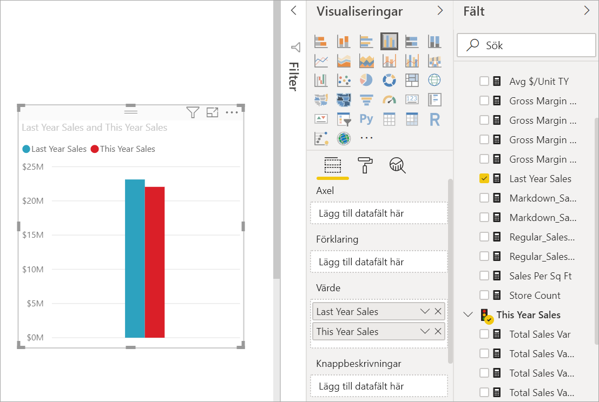
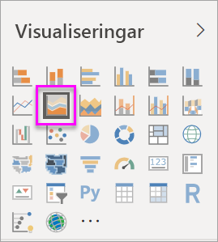
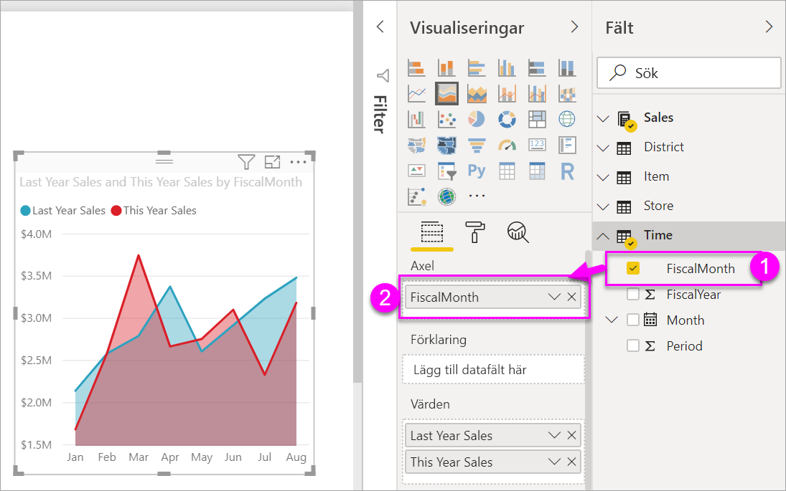

# Grundläggande ytdiagram

[!INCLUDE [power-bi-visuals-desktop-banner](../includes/power-bi-visuals-desktop-banner.md)]

Det grundläggande ytdiagrammet (kallas även för ett överlappande ytdiagram) baseras på linjediagrammet. Området mellan axel och linje fylls med färger för att illustrera volym. 

Ytdiagrammet framhäver omfattningen av förändring över tid och kan användas för att uppmärksamma totalvärdet över en trend. Data som representerar vinst över tid kan till exempel ritas i ett ytdiagram för att betona den totala vinsten.

## När ska du använda ett grundläggande ytdiagram
Grundläggande ytdiagram är ett bra val:

* för att se och jämföra volymtrenden över tidsserier 
* för enskilda serier som representerar en fysiskt kvantifierbar uppsättning

### Förutsättningar
De här självstudierna använder sig av [PBIX-filen Exempel på detaljhandelsanalys](https://download.microsoft.com/download/9/6/D/96DDC2FF-2568-491D-AAFA-AFDD6F763AE3/Retail%20Analysis%20Sample%20PBIX.pbix).

1. Välj **Arkiv** > **Öppna** uppe till vänster på menyraden
   
2. Leta reda på kopian av **PBIX-filen Exempel för detaljhandelsanalys**

1. Öppna **PBIX-filen Exempel för detaljhandelsanalys** i rapportvyn .

1. Välj  för att lägga till en ny sida.

## Skapa ett grundläggande ytdiagram
 

1. Med de här stegen kan du skapa ett ytdiagram som visar årets försäljning och förra årets försäljning per månad.
   
   a. I fönstret Fält väljer du **Försäljning \> Förra årets försäljning** och **Årets försäljning > Värde**.

   

   b.  Omvandla diagrammet till ett grundläggande ytdiagram genom att välja ytdiagramikonen från fönstret Visualiseringar.

   
   
   c.  Välj **Tid\> FiscalMonth** och lägg till det i **Axel**.   
   
   
   d.  Om du vill visa diagrammet efter månad, väljer du ellipserna (övre högra hörnet av visualiseringen) och väljer **sortera efter månad**. Om du vill ändra sorteringsordningen väljer du ellipsen igen och väljer antingen **Sort ascending (Sortera stigande)** eller **Sort descending (Sortera fallande)** .

## Markering och korsfiltrering
Information om hur du använder filterfönstret finns i [Lägg till ett filter i en rapport](../power-bi-report-add-filter.md).

Om du vill fokusera på ett visst område i ditt diagrammet, väljer du det området eller dess översta kant.  Till skillnad från andra visualiseringstyper så korsfiltreras inte andra visualiseringar på rapportsidan om du markerar ett grundläggande ytdiagram och det finns andra visualiseringar på samma sida. Ytdiagram är dock ett mål för korsfiltrering som utlösts av andra visualiseringar på rapportsidan. 

1. Testa genom att välja ditt ytdiagram och kopiera det till rapportsidan **Ny lageranalys** (CTRL+C och CTRL+V).
2. Välj ett av de skuggade områdena i ytdiagrammet och sedan det andra skuggade området. De övriga visualiseringarna på sidan påverkas inte.
1. Nu ska du välja ett element. Lägg märke till hur ytdiagrammet påverkas – det korsfiltreras.

     

Läs mer i [Visuella interaktioner i rapporter](../service-reports-visual-interactions.md)

## Överväganden och felsökning   
* [Gör rapporten mer lättillgänglig för personer med funktionshinder](../desktop-accessibility.md)
* Grundläggande ytdiagram är inte effektiva för att jämföra värden på grund av ocklusion av överlappande områden. Power BI använder genomskinlighet för att ange överlappande områden. Dock fungerar det bara bra med två eller tre olika områden. När du behöver jämföra trender med fler än tre mått, kan du testa att använda linjediagram. När du behöver jämföra volym med fler än tre mått, kan du testa att använda en trädkarta.

## Nästa steg
[Rapporter i Power BI](power-bi-visualization-card.md)  

