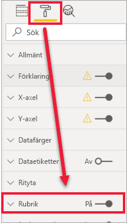
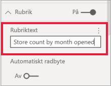
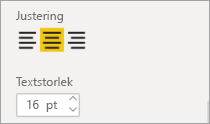
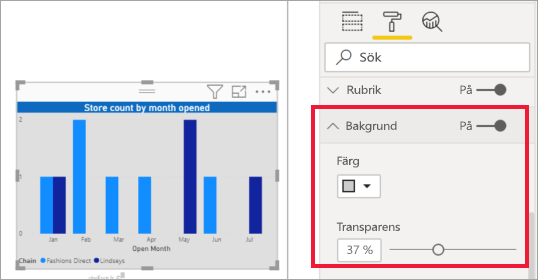
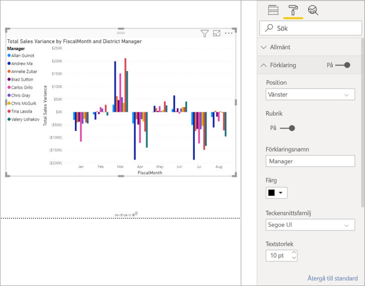

# Anpassa visualiseringens rubrik, bakgrund och förklaring

I de här självstudierna kommer du att få lära dig några olika metoder för att anpassa dina visualiseringar. Det finns många alternativ att välja mellan för att anpassa visualiseringar. Det bästa sättet att lära dig om alla är genom att utforska fönstret **Format** (välj rollerikonen). I den här artikeln kan du komma igång med att anpassa en visualiseringsrubrik, förklaring, bakgrund och lägger till ett tema.

Du kan inte anpassa alla visualiseringar. Se den [fullständiga listan](#visualization-types-that-you-can-customize) över visualiseringar för mer information.

## Förutsättningar

- Power BI-tjänsten eller Power BI Desktop

- Rapporten Exempel på detaljhandelsanalys

## Anpassa visualiseringstitlar i rapporter

Logga in i Power BI-tjänsten och öppna rapporten [Retail Analysis Sample](../sample-datasets.md) så att du kan följa med.

> [!NOTE]
> När du fäster en visualisering på en instrumentpanel blir den en panel på instrumentpanelen. Panelerna själva kan också anpassas med [nya rubriker, undertexter och hyperlänkar och du kan även ändra storleken](../service-dashboard-edit-tile.md).

1. Gå till sidan **Nya butiker** i rapporten **Exempel på detaljhandelsanalys**.

1. Välj det grupperade kolumndiagrammet **Antal öppna butiker efter öppningsmånad och kedja**.

1. I fönstret **Visualiseringar** väljer du rollerikonen för att visa formatalternativen.

1. Välj **Rubrik** att expandera avsnittet.

   

1. Flytta skjutreglaget för **Rubrik** till **På**.

1. Ändra rubriken genom att ange *Antal butiker efter öppningsmånad* i fältet **Rubriktext**.

    

1. Ändra **Teckenfärg** till vit och **Bakgrundsfärg** till blå.    

    a. Välj listrutan och en färg från **Temafärger**, **Senaste färger** eller **Anpassad färg**.

        

    b. Välj i listrutan för att stänga färgfönstret.

1. Öka textstorleken till **16 punkter**.

1. Den sista anpassningen av diagramrubriken är att justera den så att den befinner sig i mitten av visualiseringen.

    

    I det här steget i självstudierna ser rubriken till ditt grupperade kolumndiagram ut ungefär så här:

    

Spara de ändringar som du har gjort och gå vidare till nästa avsnitt.

Om du vill återställa alla anpassningar väljer du **Återgå till standard** längst ned i anpassningsfönstret för **Rubrik**.

## Anpassa visualiseringens bakgrund

Expandera alternativen för **Bakgrund** med samma grupperade kolumndiagram valt.

1. Flytta skjutreglaget för **Bakgrund** till **På**.

1. Välj en grå färg i listrutan.

1. Ändra **genomskinligheten** till **74 %** .

I det här steget i självstudierna ser bakgrunden till ditt grupperade kolumndiagram ut ungefär så här:

Spara de ändringar som du har gjort och gå vidare till nästa avsnitt.

Om du vill återställa alla ändringarna väljer du **Återgå till standard** längst ned i anpassningsfönstret för **Bakgrund**.

## Anpassa visualiseringens förklaringar

1. Öppna rapportsidan **Översikt** och välj diagrammet **Total försäljningsvarians efter FiscalMonth och distriktschef**.

1. På fliken **Visualisering** väljer du rollerikonen för att öppna formatfönstret.

1. Visa alternativen för **Förklaring**:

    

1. Flytta skjutreglaget för **Förklaring** till **På**.

1. Flytta förklaringen till vänster sida av visualiseringen.

1. Lägg till en förklaringsrubrik genom att ändra **Rubrik** till **På**.

1. Ange *Chef* i fältet **Förklaringsnamn**.

1. Ändra **Färg** till svart.

Spara de ändringar som du har gjort och gå vidare till nästa avsnitt.

Om du någonsin behöver återställa alla ändringarna väljer du **Återgå till standard** längst ned i anpassningsfönstret för **Förklaring**.

## Anpassa färger med hjälp av ett tema

Med rapportteman kan du tillämpa designändringar i hela rapporten, till exempel genom att använda företagsfärger, ändra ikonuppsättningar eller använda ny förvald visuell formatering. När du tillämpar ett rapporttema kommer färgerna och formateringen från det valda temat att användas för alla visuella objekt i rapporten.

Om du vill använda ett tema i rapporten väljer du **Växla tema** i menyraden. Välj ett tema.  I rapporten nedan används temat **Solar**.

 

## Visualiseringstyper som kan anpassas

Här är en lista över visualiseringarna och vilka anpassningsalternativ som är tillgängliga för dem:

| Visualisering | Rubrik | Bakgrund | Förklaring |
|:--- |:--- |:--- |:--- |
| Område | ja | ja |ja |
| Stapel | ja | ja |ja |
| Kort | ja | ja |saknas |
| Flerradskort | ja | ja | saknas |
| Kolumn | ja | ja | ja |
| Kombination | ja | ja | ja |
| Ring | ja | ja | ja |
| Ifylld karta | ja | ja | ja |
| Tratt | ja | ja | saknas |
| Mätare | ja | ja | saknas |
| Viktig påverkare | ja | ja | saknas |
| KPI | ja | ja | saknas |
| Linje | ja | ja | ja |
| Karta | ja | ja | ja |
| Matris | ja | ja | saknas |
| Cirkel | ja | ja | ja |
| Frågor och svar | ja | ja | saknas |
| Punkt | ja | ja | ja |
| Form | ja | ja | ja |
| Utsnitt | ja | ja | saknas |
| Tabell | ja | ja | saknas |
| Textruta | nej | ja | saknas |
| Trädkarta | ja | ja | ja |
| Vattenfall | ja | ja | ja |

## Nästa steg

- [Anpassa egenskaper för X-axel och Y-axel](power-bi-visualization-customize-x-axis-and-y-axis.md)

- [Komma igång med färgformatering och axelegenskaper](service-getting-started-with-color-formatting-and-axis-properties.md)

Har du fler frågor? [Prova Power BI Community](https://community.powerbi.com/)
