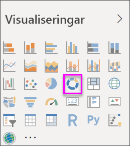
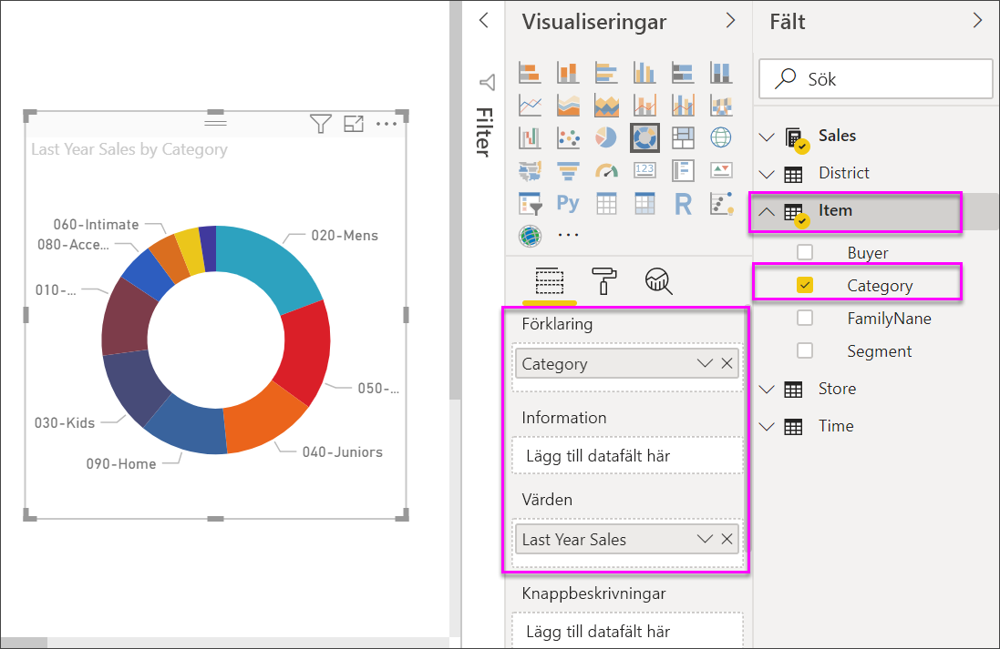

# Skapa och använda ringdiagram i Power BI

[!INCLUDE[consumer-appliesto-nyyn](../includes/consumer-appliesto-nyyn.md)]

[!INCLUDE [power-bi-visuals-desktop-banner](../includes/power-bi-visuals-desktop-banner.md)]

Ett ringdiagram liknar ett cirkeldiagram såtillvida att det visar förhållandet mellan delarna och helheten. Den enda skillnaden är att mitten är tom och har utrymme för en etikett eller ikon.

## Förutsättning

De här självstudierna använder sig av [PBIX-filen Exempel på detaljhandelsanalys](https://download.microsoft.com/download/9/6/D/96DDC2FF-2568-491D-AAFA-AFDD6F763AE3/Retail%20Analysis%20Sample%20PBIX.pbix).

1. Välj **Arkiv** > **Öppna** uppe till vänster på menyraden
   
2. Leta reda på kopian av **PBIX-filen Exempel för detaljhandelsanalys**

1. Öppna **PBIX-filen Exempel för detaljhandelsanalys** i rapportvyn .

1. Välj  för att lägga till en ny sida.

> [!NOTE]
> För att dela en rapport med en Power BI-kollega krävs att du både har individuella Power BI Pro-licenser eller att rapporten har sparats med Premium-kapacitet.    

## Skapa ett ringdiagram

1. Börja på en tom rapportsida och välj **Försäljning** \> **Senaste årets försäljning** i fönstret Fält.  
   
3. I fönstret visualiseringar, väljer du ikonen för cirkeldiagrammet  för att konvertera ditt stapeldiagram till ett cirkeldiagram. Om **Fjolårets försäljning** inte är i **Värden**-området, drar du det dit.
     
   

4. Välj **Objekt** \> **Kategori** för att lägga till den i området **Förklaring**. 
     
    

5. Du kan också [justera storlek och färg för diagramtexten](power-bi-visualization-customize-title-background-and-legend.md). 

## Överväganden och felsökning
* Summan av ringdiagrammets värden måste uppgå till 100 %.
* För många kategorier gör det svårt att läsa och tolka översikten.
* Ringdiagram är bättre för att jämföra en särskild sektion med helheten än för att jämföra enskilda sektioner med varandra. 

## Nästa steg
[Trattdiagram i Power BI](power-bi-visualization-funnel-charts.md)

[Visualiseringstyper i Power BI](power-bi-visualization-types-for-reports-and-q-and-a.md)

