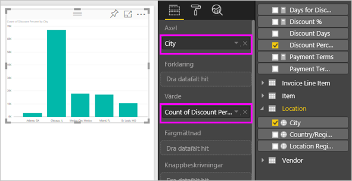
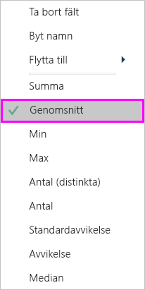
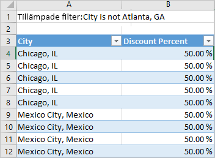

# Exportera data från visualiseringar
Om du vill se de data som används i en visualisering, kan du visa dessa data i Power BI eller exportera data till Excel som en XLSX- eller CSV-fil. Alternativet att exportera data kräver en Pro- eller Premium-licens och redigeringsbehörigheter till datauppsättningen och rapporten. 

Här kan du se Will exportera data från en visualisering i sin rapport, spara den som .xlsx-fil och öppna den i Excel. Prova sedan själv genom att följa de stegvisa anvisningarna under videon.

<iframe width="560" height="315" src="https://www.youtube.com/embed/KjheMTGjDXw" frameborder="0" allowfullscreen></iframe>

## Från en visualisering på en Power BI-instrumentpanel
1. Välj ellipserna i det övre högra hörnet i visualiseringen.

    
2. Välj ikonen **Exportera data**.

    
3. Data exporteras till en csv-fil. Om visualiseringen filtreras kommer också nedladdade data att filtreras.    
4. Din webbläsare uppmanar dig att spara filen.  När du sparat den ska du öppna .csv-filen i Excel.

    

## Från en visualisering i en rapport
Om du vill följa med kan öppna [exempelrapporten för anskaffningsanalys ](../sample-procurement.md) i [Redigeringsvyn](../consumer/end-user-reading-view.md). [Lägg till en tom rapportsida](../power-bi-report-add-page.md). Följ stegen nedan för att lägga till en samling och ett filter på visualiseringsnivå.

1. Skapa ett nytt stapeldiagram.  Från fönstret fält väljer du **Plats > Ort** och **Faktura > Rabattprocent**.  Du kan behöva flytta **Rabattprocent** till värdet. 

    
2. Ändra sammanställningen för **Rabattprocent** från **Antal** till **Medelvärde**. I värdet väljer du pilen till höger om **Rabattprocent** (det kan stå **Antal rabattprocent**) och sedan **Medelvärde**.

    
3. Lägg till ett filter i **Stad** att ta bort **Atlanta**.

   

   Vi är nu redo att testa båda alternativen för dataexport. 

4. Välj ellipserna i det övre högra hörnet i visualiseringen. Välj **Exportera data**.

   
5. Om din visualisering i Power BI online har en aggregering (ett exempel är om du har ändrat **Antal** till *Medelvärde*, *Summa* eller *Minimivärde*), har du två alternativ: **Sammanfattade data** och **Underliggande data**. I Power BI Desktop har du endast alternativet för **sammanfattade data**. För mer information om att förstå mängder kan du läsa [Mängder i Power BI](../service-aggregates.md).
    
6. Välj **Sammanfattade data** > **Exportera** och välj .xlsx eller .csv. Power BI exporterar data.  Om du har tillämpat filter på visualiseringen exporteras data enligt filtret. När du väljer **Exportera** får du ett meddelande om att spara filten från webbläsaren. Öppna filen i Excel när du har sparat den.

   **Sammanfattade data**: Välj det här alternativet om du vill exportera data för det som visas i visualiseringen.  Den här typen av export visar bara de data (kolumner och mått) som du valt för att skapa visualiseringen.  Om visualiseringen har en aggregering exporterar du aggregerade data. Till exempel, om du har ett stapeldiagram med 4 staplar kommer du att få 4 rader med data. Sammanfattade data är tillgängliga som .xlsx och .csv.

   I det här exemplet visar vår Excel-export en summa för varje ort. Atlanta ingår inte i resultaten eftersom vi har filtrerat det.  Den första raden i vårt kalkylblad visar de filter som användes när data extraherades från Power BI.

   
7. Prova att välja **Underliggande data** > **Exportera** och välj .xlsx. Power BI exporterar data. Om du har tillämpat filter på visualiseringen exporteras data enligt filtret. När du väljer **Exportera** får du ett meddelande om att spara filten från webbläsaren. Öppna filen i Excel när du har sparat den.

   >[!WARNING]
   >När du exporterar underliggande data kan användare se alla detaljerade data – alla information i datakolumnerna. Power BI administratörer kan inaktivera detta för organisationen. Om du äger datauppsättningen kan du ställa in dina egna kolumner på ”dolda” så att de inte visas i listan Fält i Desktop eller Power BI-tjänsten.

   **Underliggande data**: Välj det här alternativet om du vill se data i visualiseringen ***och*** ytterligare data från modellen (information finns i diagrammet nedan).  Om din visualisering har en aggregering tas den bort om du väljer *Underliggande data*. När du väljer **Exportera**, exporteras data till en xlsx-fil och webbläsaren uppmanar dig att spara filen. Öppna filen i Excel när du har sparat den.

   I det här exemplet visar vår Excel-export en rad för varje Stadsrad i vår datauppsättning och rabattprocent för den posten. Med andra ord omvandlas data från en mängd till en detaljerad vy. Den första raden i vårt kalkylblad visar de filter som användes när data extraherades från Power BI.  

   

## Exportera underliggande data
Vad som visas när du väljer **Underliggande data** kan variera. Du kanske behöver hjälp från din administratör eller IT-avdelning för att förstå den här informationen. I rapportvyn i Power BI Desktop eller -tjänsten visas ett *mått* i fältlistan med en kalkylatorikon . Mått skapas i Power BI Desktop, inte i Power BI-tjänsten.

| Visualiseringen innehåller |                                                                              Vad som visas i exporten                                                                              |
|-----------------|-------------------------------------------------------------------------------------------------------------------------------------------------------------------------------------|
|   Aggregeringar    |                                                 Den *första* aggregeringen och icke-dolda data från hela tabellen för den aggregeringen.                                                  |
|   Aggregeringar    | Relaterade data – om visualiseringen använder data från andra datatabeller som är *\*\*relaterade*\* till datatabellen som innehåller aggregeringen (så länge relationen är \*:1 eller 1:1). |
|    Mått     |                                      Alla mått i visualiseringen *och* alla mått från datatabeller som innehåller något mått som används i visualiseringen.                                      |
|    Mått     |                                       Alla icke-dolda data från tabeller som innehåller måttet (så länge relationen är \*:1 eller 1:1).                                       |
|    Mått     |                                      Alla data från alla tabeller som är relaterade till tabeller som innehåller mått via en kedja av \*: 1 av 1:1).                                      |
|  Endast mått  |                                                   Alla icke-dolda kolumner från alla relaterade tabeller (för att expandera måttet).                                                   |
|  Endast mått  |                                                             Sammanfattade data för alla dubblettrader för modellmått.                                                              |

### Ange exportalternativ för
Power BI-rapportdesigners styr vilka typer av alternativ för export av data som är tillgängliga för deras kunder. Alternativen är:
- Tillåt export av endast sammanfattade data (detta är standardinställningen för nya rapporter) 
- Tillåt export av sammanfattade och underliggande data (detta var standardinställningen före oktober 2018) 
- Tillåt inte export av några data  

    > [!IMPORTANT]
    > Vi rekommenderar att rapportdesigner går tillbaka till gamla rapporter och återställer exportalternativet manuellt, om det behövs.

1. Starta i Power BI Desktop för att ställa in de här alternativen.

2. I det övre vänstra hörnet, väljer du alternativet **Fil** > **och alternativet** > **Inställningar**. 

3. Under **Aktuell fil**väljer du **Rapportinställningar**.

    

4. Gör ditt val från listrutan **exportera data**.

Du kan också uppdatera den här inställningen i Power BI-tjänsten.  

Det är viktigt att observera att om Power BI-administratörens portalinställningar är i konflikt med rapportinställningarna för Exportera data, åsidosätter administratörsinställningarna inställningarna för export. 

## Begränsningar och överväganden
* Det maximala antalet rader som kan exporteras från **Power BI Desktop** och **Power BI-tjänsten** till .csv är 30 000.
* Det maximala antalet rader som kan exporteras till .xlsx är 150 000.
* Export med *Underliggande data* fungerar inte om datakällan är en Analysis Services-liveanslutning och versionen som är äldre än 2016 och tabellerna i modellen inte har en unik nyckel.  
* Export med *Underliggande data* fungerar inte om alternativet *Visa objekt utan data* är aktiverat för visualiseringen som exporteras.
* När du använder DirectQuery är den maximala mängden data som kan exporteras 16 MB. Därmed kan mindre än det maximala antalet rader exporteras, särskilt om det finns många kolumner, data som är svåra att komprimera eller andra faktorer som påverkar filstorleken och minskar antalet rader som exporteras.
* Om visualiseringen använder data från mer än en datatabell och det inte finns någon relation för dessa tabeller i datamodellen, exporteras endast data för den första tabellen. 
* Anpassade visuella objekt och R-visualiseringar stöds inte för tillfället.
* Exportera data är inte tillgängligt för användare utanför organisationen som använder en instrumentpanel som har delats med dem. 
* I Power BI kan du byta namn på ett fält (kolumn) genom att dubbelklicka på fältet och skriva ett nytt namn.  Det här nya namnet kallas för ett *alias*. Ibland kan det hända att en Power BI-rapport innehåller duplicerade fältnamn, men eftersom Excel inte tillåter dubbletter  kommer ett alias ursprungliga fältnamn (kolumnnamn) att återställas när data exporteras till Excel.  
* Om det finns unicode-tecken i .csv-filen, visas texten inte korrekt i Excel. Men det går bra att öppna den i Anteckningar. Valutasymboler och främmande ord är exempel på unicode-tecken. Lösningen för detta är att importera CSV-filen i Excel, i stället för att öppna CSV-filen direkt. Gör så här:

  1. Öppna Excel
  2. Från fliken **Data** väljer du **Hämta externa data** > **Från text**.
* Power BI-administratörer har möjlighet att inaktivera export av data.

## Nästa steg
[Instrumentpaneler i Power BI](../consumer/end-user-dashboards.md)  
[Power BI – grundläggande begrepp](../consumer/end-user-basic-concepts.md)

Har du fler frågor? [Fråga Power BI Community](http://community.powerbi.com/)

