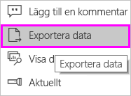
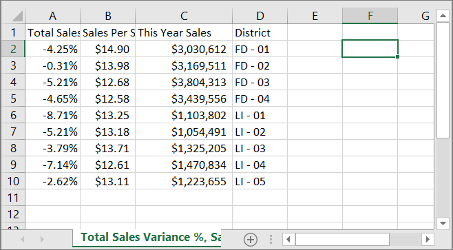
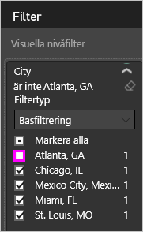
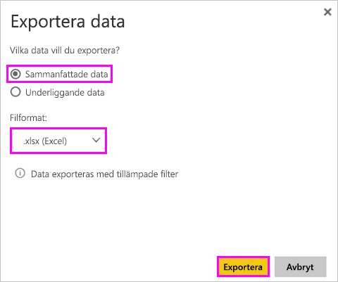
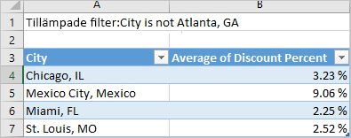
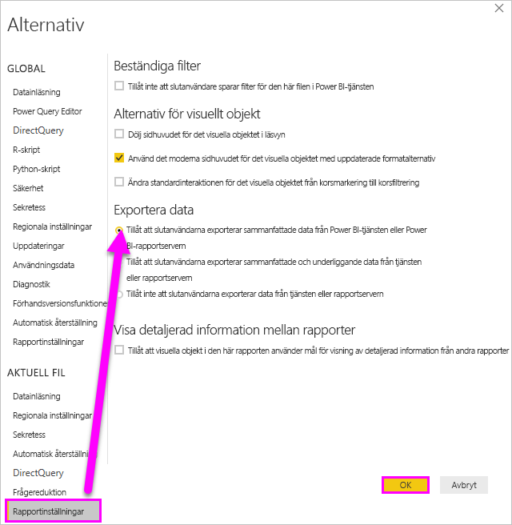

# Exportera data från visualiseringar

Om du vill se de data som Power BI använder för att skapa en visualisering, [kan du visa dessa data i Power BI](service-reports-show-data.md). Du kan också exportera dessa data till Excel som en *.xlsx*- eller *.csv-fil*. Alternativet att exportera data kräver en Pro- eller Premium-licens och redigeringsbehörigheter till datauppsättningen och rapporten.

Här kan du se Will exportera data från en visualisering i sin rapport, spara den som *.xlsx-fil* och öppna den i Excel. Prova sedan själv genom att följa de stegvisa anvisningarna under videon.

<iframe width="560" height="315" src="https://www.youtube.com/embed/KjheMTGjDXw" frameborder="0" allowfullscreen></iframe>

## Exportera data från en Power BI-instrumentpanel

1. Välj ellipsen i det övre högra hörnet av visualiseringen.

    

1. Välj ikonen **Exportera data**.

    

1. Power BI exporterar aktuella data till en *.csv-fil*. Om du har filtrerat visualiseringen, filtrerar appen hämtade data.

1. Din webbläsare uppmanar dig att spara filen.  När du har sparat *.csv-filen*, öppnar du den i Excel.

    

## Exportera data från en rapport

Om du vill följa med kan öppna [exempelrapporten för anskaffningsanalys ](../sample-procurement.md) i redigeringsvyn. Lägg till en ny tom rapportsida. Följ stegen nedan för att lägga till en samling och ett filter på visualiseringsnivå.

1. Skapa ett nytt**staplat kolumndiagram**.

1. Från fönstret **Fält** väljer du **Plats > Stad** och **Faktura > Rabattprocent**.  Du kan behöva flytta **Rabattprocent** till området **Värde**.

    

1. Ändra sammanställningen för **Rabattprocent** från **Antal** till **Medelvärde**. I området **Värde** väljer du pilen till höger om **Rabattprocent** (det kan stå **Mängd rabattprocent**) och sedan **Medelvärde**.

    

1. Lägg till ett filter till **Stad**, välj alla städer och ta sedan bort **Atlanta**.

    

   Vi är nu redo att testa båda alternativen för dataexport.

1. Välj ellipsen i det övre högra hörnet av visualiseringen. Välj **Exportera data**.

    

    Om din visualisering i Power BI online har en aggregering (ett exempel är om du har ändrat **Antal** till *Medelvärde*, *Summa* eller *Minimivärde*), har du två alternativ:

    - **Sammanfattade data**

    - **Underliggande data**

    I Power BI Desktop har du endast alternativet för **sammanfattade data**. För mer information om att förstå mängder kan du läsa [Mängder i Power BI](../service-aggregates.md).

1. För **Exportera data** väljer du **Sammanfattade data** och antingen *.xlsx* eller *.csv* och sedan **Exportera**. Power BI exporterar data.

    

    Om du har tillämpat filter på visualiseringen exporteras data enligt filtret. När du väljer **Exportera** får du ett meddelande om att spara filten från webbläsaren. Öppna filen i Excel när du har sparat den.

    **Sammanfattade data**: Välj det här alternativet om du vill exportera data för det som visas i det visuella objektet.  Den här typen av export visar bara de data (kolumner och mått) som du valt för att skapa visualiseringen.  Om visualiseringen har en aggregering exporterar du aggregerade data. Till exempel, om du har ett stapeldiagram med fyra staplar kommer du att få fyra rader med data. Sammanfattade data finns tillgängliga som *.xlsx* och *.csv*.

    I det här exemplet visar vår Excel-export en summa för varje ort. Atlanta ingår inte i resultaten eftersom vi har filtrerat bort det. Den första raden i vårt kalkylblad visar de filter som Power BI använde vid extraheringen av data.

    

1. Prova att välja **Underliggande data**, *.xlsx* och sedan **Exportera**. Power BI exporterar data. 

    > [!NOTE]
    > Beroende på rapportinställningarna kan du ha möjlighet att exportera underliggande data.

    Om du har tillämpat filter på visualiseringen exporteras data enligt filtret. När du väljer **Exportera** får du ett meddelande om att spara filten från webbläsaren. Öppna filen i Excel när du har sparat den.

    >[!WARNING]
    >När du exporterar underliggande data kan användare se alla detaljerade data – alla kolumner i aktuella data. Power BI-tjänsteadministratörer kan inaktivera detta för sin organisation. Om du äger datamängden kan du ställa in dina egna kolumner som **dolda** så att de inte visas i listan **Fält** i Desktop eller Power BI-tjänsten.

    **Underliggande data**: Välj det här alternativet om du vill se data i visualiseringen ***och*** ytterligare data från modellen (se diagrammet nedan för mer information). Om din visualisering har en aggregering tas den bort om du väljer *Underliggande data*. När du väljer **Exportera**, exporterar Power BI aktuella data till en *xlsx-fil* och webbläsaren uppmanar dig att spara filen. Öppna filen i Excel när du har sparat den.

    I det här exemplet visar Excel-exporten en rad för varje Stadsrad i vår datamängd och rabattprocenten för varje post. Power BI planar ut dina data. Det aggregerar inte dem. Den första raden i vårt kalkylblad visar de filter som Power BI använde vid extraheringen av data.  

    

## Exportera underliggande data

Vad som visas när du väljer **Underliggande data** kan variera. Du kanske behöver hjälp från din administratör eller IT-avdelning för att förstå den här informationen. I rapportvyn i Power BI Desktop eller -tjänsten visas ett *mått* i listan **Fält** med en kalkylatorikon . Power BI Desktop skapar mått. Det gör inte Power BI-tjänsten.

| Visualiseringen innehåller | Vad som visas i exporten  |
|---------------- | ---------------------------|
| Aggregeringar | Den *första* aggregeringen och icke-dolda data från hela tabellen för den aggregeringen. |
| Aggregeringar | Relaterade data – om det visuella objektet använder data från andra datatabeller som är *relaterade* till datatabellen som innehåller samlingen (så länge relationen är \*:1 eller 1:1). |
| Mått | alla mått i visualiseringen *och* alla mått från datatabeller som innehåller något mått som används i visualiseringen |
| Mått | alla icke-dolda data från tabeller som innehåller måttet (så länge relationen är \*:1 eller 1:1) |
| Mått | alla data från alla tabeller som är relaterade till tabeller som innehåller mått via en kedja av \*: 1 av 1:1) |
| Endast mått | alla icke-dolda kolumner från alla relaterade tabeller (för att expandera måttet) |
| Endast mått | sammanfattade data för alla dubblettrader för modellmått |

### Ange exportalternativ för

Power BI-rapportdesigners styr vilka typer av alternativ för export av data som är tillgängliga för deras kunder. Alternativen är:

- Tillåt slutanvändarna att exportera sammanfattade data från Power BI-tjänsten eller Power BI-rapportservern

- Tillåt slutanvändarna att exportera sammanfattade och underliggande data från tjänsten eller rapportservern

- Tillåt inte slutanvändare att exportera alla data från tjänsten eller rapportservern

    > [!IMPORTANT]
    > Vi rekommenderar att rapportdesigner går tillbaka till gamla rapporter och återställer exportalternativet manuellt, om det behövs.

För att ange de här alternativen:

1. Börja i Power BI Desktop.

1. I det övre vänstra hörnet, väljer du alternativet **Fil** > **och alternativet** > **Inställningar**.

1. Under **AKTUELL FIL** väljer du **Rapportinställningar**.

    

1. Gör ditt val från avsnittet **Exportera data**.

Du kan också uppdatera den här inställningen i Power BI-tjänsten.

Det är viktigt att observera att om Power BI-administratörens portalinställningar är i konflikt med rapportinställningarna för Exportera data, åsidosätter administratörsinställningarna inställningarna för dataexport.

## Begränsningar och överväganden
Dessa begränsningar och överväganden gäller för Power BI Desktop och Power BI-tjänsten, inklusive Power BI Pro och Premium.

- Om du vill exportera data från ett visuellt objekt, måste du ha [Skapa-behörighet för den underliggande datamängden](https://docs.microsoft.com/power-bi/service-datasets-build-permissions#build-permissions-for-shared-datasets).

-  Det maximala antal rader som **Power BI Desktop** och **Power BI-tjänsten** kan exportera från en **rapport i importläge** till en *.csv-fil* är 30 000.

- Det maximala antal rader som programmen kan exportera från en **rapport i importläge** till en *.xlsx-fil* är 150 000.

- Exportera med hjälp av *Underliggande data* fungerar inte om:

  - Datakällan är en liveanslutning till Analysis Services.

  - Versionen är äldre än från 2016.

  - Tabellerna i modellen saknar en unik nyckel.
    
  -  Om en administratör eller rapportdesigner har inaktiverat den här funktionen.

- Export med *Underliggande data* fungerar inte om alternativet *Visa objekt utan data* är aktiverat för den visualisering som Power BI exporterar.

- När du använder DirectQuery är den maximala mängd data som Power BI kan exportera 16 MB okomprimerade data. Ett oönskat resultat kan vara att du exporterar mindre än det maximala antalet rader. Det är troligt om

    - det finns många kolumner

    - det finns data som är svåra att komprimera

    - andra faktorer är inblandade som påverkar filstorleken och minskar antalet rader som Power BI kan exportera.

- Om visualiseringen använder data från mer än en datatabell och det inte finns någon relation för dessa tabeller i datamodellen, exporterar Power BI endast data för den första tabellen.

- Anpassade visuella objekt och visuella R-objekt stöds inte för tillfället.

- Exportera data är inte tillgängligt för användare utanför organisationen som använder en instrumentpanel som en intern medarbetare har delat med dem.

- I Power BI kan du byta namn på ett fält (en kolumn) genom att dubbelklicka på fältet och skriva ett nytt namn. Power BI refererar till det nya namnet som ett *alias*. Ibland kan det hända att en Power BI-rapport innehåller dubbla fältnamn, men Excel tillåter inte dubbletter. Så när Power BI exporterar data till Excel, återställs ett fältalias till de ursprungliga fältnamnen (kolumnnamnen).  

- Om det finns Unicode-tecken i *.csv-filen*, visas texten inte korrekt i Excel. Valutasymboler och främmande ord är exempel på Unicode-tecken. Du kan öppna filen i Anteckningar, då visas Unicode korrekt. Om du vill öppna filen i Excel, är lösningen att importera *.csv-filen*. För att importera filen till Excel:

  1. Öppna Excel.

  1. Gå till fliken **Data**.
  
  1. Välj **Hämta externa data** > **Från text**.
  
  1. Gå till den lokala mappen där filen lagras och välj *.csv-filen*.

- Power BI-administratörer kan inaktivera export av data.

Har du fler frågor? [Fråga Power BI Community](http://community.powerbi.com/)
