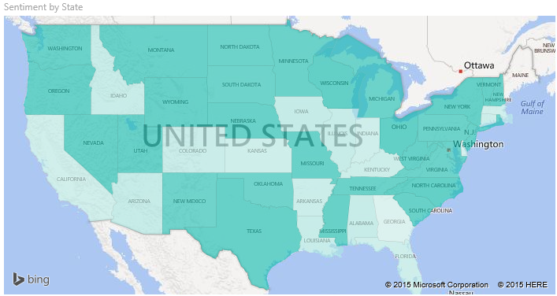
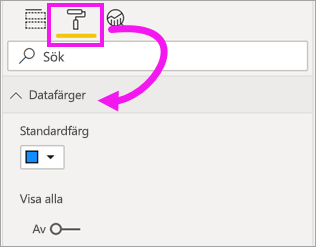
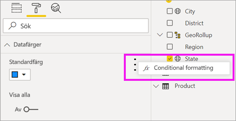
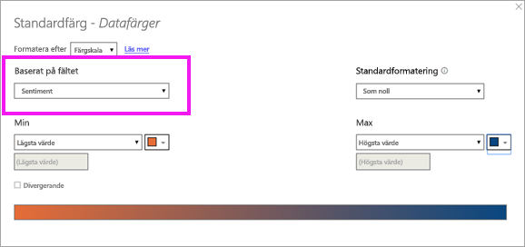
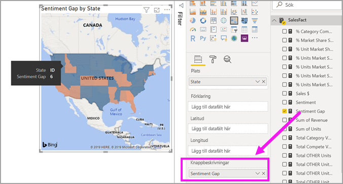
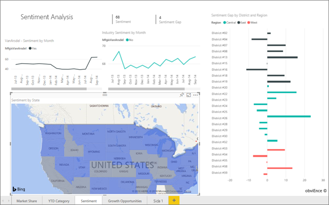
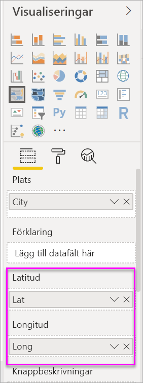

# Skapa och använda fyllda kartor (koropletkartor) i Power BI

[!INCLUDE[consumer-appliesto-nyyn](../includes/consumer-appliesto-nyyn.md)]

[!INCLUDE [power-bi-visuals-desktop-banner](../includes/power-bi-visuals-desktop-banner.md)]

En fylld karta använder skuggning, toning eller mönster för att visa hur ett värde skiljer sig åt proportionellt på en geografisk plats eller i en region.  Du kan snabbt visa dessa relativa skillnader med skuggning som sträcker sig från ljus (mindre ofta/lägre) till mörk (mer frekvent/fler).    

## Vad som skickas till Bing
Power BI integrerar med Bing för att tillhandahålla kartkoordinater av standardtyp (en process som kallas geokodning). När du skapar en kartvisualisering i Power BI-tjänsten eller i Power BI Desktop, skickas dina data i behållarna **Plats**, **Latitud** och **Longitud** (som används för att skapa visualiseringen) till Bing.

Du eller din administratör kan behöva uppdatera brandväggen för att tillåta åtkomst till de URL:er Bing använder för geokodning.  Dessa URL:er är:
- https://dev.virtualearth.net/REST/V1/Locations    
- https://platform.bing.com/geo/spatial/v1/public/Geodata    
- https://www.bing.com/api/maps/mapcontrol

Mer information om de data som skickas till Bing och tips för bättre geokodning hittar du i [Tips and tricks for map visualizations (Tips och råd om kartvisualiseringar)](power-bi-map-tips-and-tricks.md).

## När du ska använda en fylld karta
Fyllda kartor är ett bra alternativ:

* för att visa kvantitativ information på en karta,
* för att visa spatiala mönster och relationer,
* när dina data är standardiserade,
* när du arbetar med socioekonomiska data,
* när definierade regioner är viktiga,
* för att få en översikt över distributionen på flera geografiska platser.

### Förutsättningar
I den här självstudien används [pbix-exempelfilen Sales and Marketing](https://download.microsoft.com/download/9/7/6/9767913A-29DB-40CF-8944-9AC2BC940C53/Sales%20and%20Marketing%20Sample%20PBIX.pbix).
1. Välj **Arkiv** > **Öppna** uppe till vänster i menyraden
   
2. Leta rätt på din kopia av **pbix-exempelfilen Sales and marketing**

1. Öppna **PBIX-exempelfilen Sales and marketing** i rapportvyn .

1. Välj  för att lägga till en ny sida.

> [!NOTE]
> För att dela en rapport med en Power BI-kollega krävs att du både har individuella Power BI Pro-licenser eller att rapporten har sparats med Premium-kapacitet.    

### Skapa en koropletkarta
1. Välj fältet **Geo** \> **Stat** i fönstret Fält.    

   
2. [Konvertera diagrammet](power-bi-report-change-visualization-type.md) till en fylld karta. Observera att **Stat** nu befinner sig i **platsområdet**. Bing Maps använder fältet i **platsområdet** för att skapa kartan.  Platsen kan vara många olika giltiga platser som länder, stater, regioner, orter eller postnummer. Bing Maps tillhandahåller figurer för platser runt om i världen. Power BI kan inte skapa den fyllda kartan utan en giltig post i platsområdet.  

   
3. Filtrera kartan för att visa endast kontinentala USA.

   a.  Till vänster i visualiseringsfönstret finns rutan **Filter**. Expandera den om den är minimerad

   b.  Hovra över **Stat** och välj den expanderade sparren  
   

   c.  Sätt en bock bredvid **Alla** och ta bort bocken bredvid **AK**.

   
4. Välj rollerikonen för att öppna formateringsfönstret och välj  **Datafärger**.

    

5. Välj de tre lodräta punkterna och sedan **Villkorsstyrd formatering**.

    

6. Använd skärmen **Standardfärg – Datafärger** för att bestämma hur din koropletkarta ska skuggas. De alternativ som du kan välja mellan inkluderar vilket fält du ska basera skuggningen på och hur den ska tillämpas. I det här exemplet använder vi fältet **SalesFact** > **Sentiment** och anger det lägsta värdet för sentiment som orange och det högsta värdet som blått. Värden som faller mellan de högsta och lägsta värdena kommer att ha olika nyanser av orange och blått. Bilden längst ned på skärmen visar de olika färger som kommer att användas. 

    

7. Koropletkartan färgas i grönt och rött, där rött motsvarar de lägre sentimentsiffrorna och grönt de högre, positivare sentimenten.  Dra ett fält till knappbeskrivningsområdet för att visa ytterligare information.  Här har vi lagt till **SalesFact** > **Sentiment gap**. Om du markerar delstaten Idaho (ID) ser du att sentimentgapet är lågt, 6.
   

10. [Spara rapporten](../service-report-save.md).

Power BI ger dig stor kontroll över hur din koropletkarta ser ut. Experimentera med kontrollerna för datafärger tills du får det utseende du vill ha. 

## Markering och korsfiltrering
Information om hur du använder filterfönstret finns i [Lägg till ett filter i en rapport](../power-bi-report-add-filter.md).

Om du markerar en plats i en koropletkarta korsfiltreras de övriga visualiseringarna på rapportsidan, och vice versa.

1. Spara den här rapporten genom att välja **Arkiv > Spara**. 

2. Kopiera koropletkartan med hjälp av CTRL-C.

3. Längst ned i rapportarbetsytan kan du välja fliken **Sentiment** för att öppna rapportsidan för sentiment.

    

4. Flytta och ändra storlek på visualiseringarna på sidan för att skapa mer utrymme, och använd sedan CTRL + V för att klistra in koropletkartan från föregående rapport. (Se nedanstående bilder)

   

5. Välj en stat på den fyllda kartan.  Detta korsmarkerar och korsfiltrerar de övriga visualiseringarna på sidan. Om du till exempel väljer **Texas** så korsfiltreras korten och stapeldiagrammet korsmarkeras. Det här visar att sentimentet 75 och att Texas ligger i Central District nr 23.   
   
2. Välj en datapunkt i linjediagrammet VanArsdel – Sentiment per månad. Detta filtrerar koropletkartan för att visa sentimentdata för VanArsdel och inte deras konkurrenter.  
   

## Överväganden och felsökning
Kartdata kan vara tvetydiga.  Till exempel finns det ett Paris i Frankrike, men också i Texas. Dina geografiska data lagras sannolikt i separata kolumner – en kolumn för stadsnamn, en kolumn för stats- eller regionnamn och så vidare – så Bing kan förmodligen inte avgöra skillnaden mellan de två olika Paris. Om din datauppsättning redan innehåller data för latitud och longitud, har Power BI speciella fält för att hjälpa till att göra dina kartdata entydiga. Du behöver bara dra fältet som innehåller dina latituddata till området Visualiseringar \> Latitud.  Gör sedan samma sak för dina longituddata.    

Titta på den här videon för hjälp med tvetydigheter beträffande kartdata om du har behörighet att redigera datamängden i Power BI Desktop.

> [VIDEO https://www.youtube.com/embed/Co2z9b-s_yM ]

Om du inte har åtkomst till latitud- och longituddata, men redigeringsåtkomst till datamängden, [följer du de här instruktionerna för att uppdatera datamängden](https://support.office.com/article/Maps-in-Power-View-8A9B2AF3-A055-4131-A327-85CC835271F7).

Mer hjälp med kartvisualiseringar finns i [Tips and tricks for map visualizations (Tips och råd om kartvisualiseringar)](../power-bi-map-tips-and-tricks.md).

## Nästa steg

[Formkarta](desktop-shape-map.md)

[Visualiseringstyper i Power BI](power-bi-visualization-types-for-reports-and-q-and-a.md)
