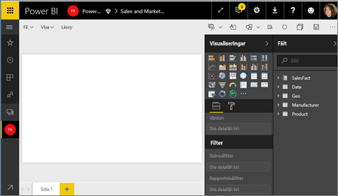
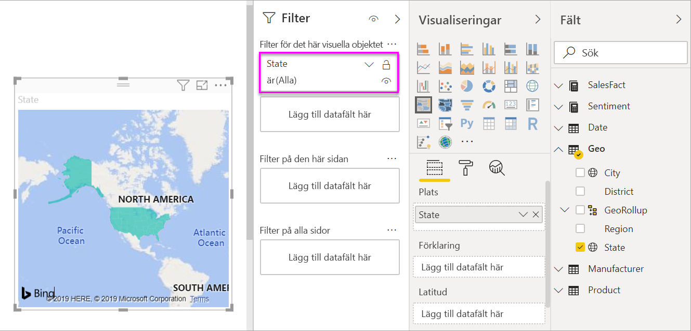
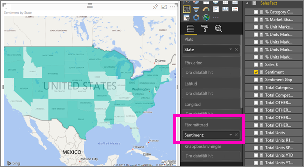

# Fyllda kartor (koropleter) i Power BI
En fylld karta använder skuggning, toning eller mönster för att visa hur ett värde skiljer sig åt proportionellt på en geografisk plats eller i en region.  Du kan snabbt visa dessa relativa skillnader med skuggning som sträcker sig från ljus (mindre ofta/lägre) till mörk (mer frekvent/fler).    

## Vad som skickas till Bing
Power BI integrerar med Bing för att tillhandahålla kartkoordinater av standardtyp (en process som kallas geokodning). När du skapar en kartvisualisering i Power BI-tjänsten eller i Power BI Desktop, skickas dina data i behållarna **Plats**, **Latitud** och **Longitud** (som används för att skapa visualiseringen) till Bing.

Du eller din administratör kan behöva uppdatera brandväggen för att tillåta åtkomst till de URL:er Bing använder för geokodning.  Dessa URL:er är:
    * https://dev.virtualearth.net/REST/V1/Locations
    * https://platform.bing.com/geo/spatial/v1/public/Geodata
    * https://www.bing.com/api/maps/mapcontrol

Mer information om de data som skickas till Bing och tips för bättre geokodning hittar du i [Tips and tricks for map visualizations (Tips och råd om kartvisualiseringar)](power-bi-map-tips-and-tricks.md).

## När du ska använda en fylld karta
Fyllda kartor är ett bra alternativ:

* för att visa kvantitativ information på en karta,
* för att visa spatiala mönster och relationer,
* när dina data är standardiserade,
* när du arbetar med socioekonomiska data,
* när definierade regioner är viktiga,
* för att få en översikt över distributionen på flera geografiska platser.

### Förutsättningar
- Power BI-tjänsten eller Power BI Desktop
- Exempel på försäljning och marknadsföring

Om du vill följa med använder vi självstudiekursen Power BI-tjänsten och inte Power BI Desktop.

## Skapa en grundläggande fylld karta
I det här videoklippet skapar Kim en grundläggande karta och konverterar den till en fylld karta.

<iframe width="560" height="315" src="https://www.youtube.com/embed/ajTPGNpthcg" frameborder="0" allowfullscreen></iframe>

1. För att skapa en egen fylld karta [hämtar du försäljnings- och marknadsföringsexemplet](../sample-datasets.md) genom att logga in till Power BI och välja **Hämta data \>Exempel \> Försäljning och marknadsföring \> Anslut**.
2. När det positiva meddelandet visas, väljer du **Visa datauppsättning**.

   
3. Power BI öppnar en tom rapportarbetsyta i [Redigeringsvy](../service-interact-with-a-report-in-editing-view.md).

    
4. Fönstret fält, Välj den **Geo** \> **tillstånd** fältet.    

   
5. [Konvertera diagrammet](power-bi-report-change-visualization-type.md) till en fylld karta. Observera att **Stat** nu befinner sig i **platsområdet**. Bing Maps använder fältet i **platsområdet** för att skapa kartan.  Platsen kan vara många olika giltiga platser: länder, stater, regioner, orter, postnummer och andra postkoder och så vidare. Bing Maps tillhandahåller figurer för platser runt om i världen. Power BI kan inte skapa den fyllda kartan utan en giltig post i platsområdet.  

   
6. Filtrera kartan för att visa endast kontinentala USA.

   a.  Längst ned i visualiseringsfönstret hittar du området **Filter**.

   b.  Hovra över **Stat** och klicka för att expandera sparren.  
   

   c.  Sätt en bock bredvid **Alla** och ta bort bocken bredvid **AK**.

   
7. Välj **SalesFact (Säljfakta)** \> **Sentiment** för att lägga till den till området **Färgmättnad**. Fältet i området **Färgmättnad** styr kartskuggningen.  
   
8. Den fyllda kartan skuggas i grönt, där ljusgrönt motsvarar de lägre sentimentsiffrorna och mörkgrönt de högre, positivare sentimenten.  Här har jag markerat staten Wyoming (WY) och ser att sentimenten är mycket bra, 74.  
   
9. [Spara rapporten](../service-report-save.md).

## Markering och korsfiltrering
Information om hur du använder fönstret Filter finns i [Lägga till ett filter i en rapport](../power-bi-report-add-filter.md).

Om du markerar en plats i en fylld karta korsfiltreras de övriga visualiseringarna på rapportsidan, och vice versa.

Om du vill göra detta kan du kopiera och klistra in din fyllda karta på sidan **Sentiment** i rapporten *Försäljning och marknadsföring*.

1. Välj en stat på den fyllda kartan.  Detta markerar de övriga visualiseringarna på sidan. Om jag t.ex. väljer **Texas** ser jag att sentimenten är 74 , att Texas ligger i centraldistrikt \#23 och att den största delen av försäljningsvolymen kommer från segmenten Moderation (Moderering) och Convenience (Bekvämlighet).   
   
2. Växla mellan **Nej** och **Ja** i linjediagrammet. Detta filtrerar den fyllda kartan för att visa sentiment för VanArsdel och VanArsdels konkurrenter.  
   

## Överväganden och felsökning
Kartdata kan vara tvetydiga.  Till exempel finns det ett Paris i Frankrike, men också i Texas. Dina geografiska data lagras sannolikt i separata kolumner – en kolumn för stadsnamn, en kolumn för stats- eller regionnamn och så vidare – så Bing kan förmodligen inte avgöra skillnaden mellan de två olika Paris. Om din datauppsättning redan innehåller data för latitud och longitud, har Power BI speciella fält för att hjälpa till att göra dina kartdata entydiga. Du behöver bara dra fältet som innehåller dina latituddata till området Visualiseringar \> Latitud.  Gör sedan samma sak för dina longituddata.  

Titta på den här videon för hjälp med tvetydigheter beträffande kartdata om du har behörighet att redigera datauppsättningen i Power BI Desktop.

<iframe width="560" height="315" src="https://www.youtube.com/embed/Co2z9b-s_yM" frameborder="0" allowfullscreen></iframe>

Om du inte har åtkomst till latitud- och longituddata, [följer du de här instruktionerna för att uppdatera datauppsättningen](https://support.office.com/article/Maps-in-Power-View-8A9B2AF3-A055-4131-A327-85CC835271F7).

Mer hjälp med kartvisualiseringar finns i [Tips and tricks for map visualizations (Tips och råd om kartvisualiseringar)](power-bi-map-tips-and-tricks.md).

## Nästa steg
[Lägga till den fyllda kartan som panel på instrumentpanelen (fästa det visuella objektet)](../service-dashboard-tiles.md)    
 [Lägga till en visualisering till en rapport](power-bi-report-add-visualizations-i.md)  
 [Visualiseringstyper i Power BI](power-bi-visualization-types-for-reports-and-q-and-a.md)    
 [Ändra typen av använd visualisering](power-bi-report-change-visualization-type.md)      
Har du fler frågor? [Prova Power BI Community](http://community.powerbi.com/)
