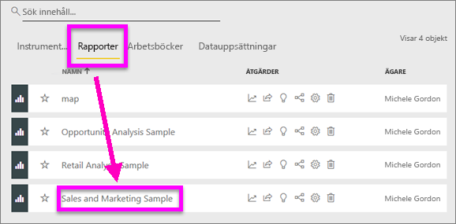
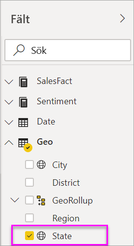
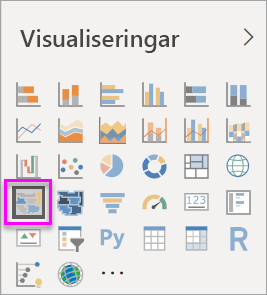
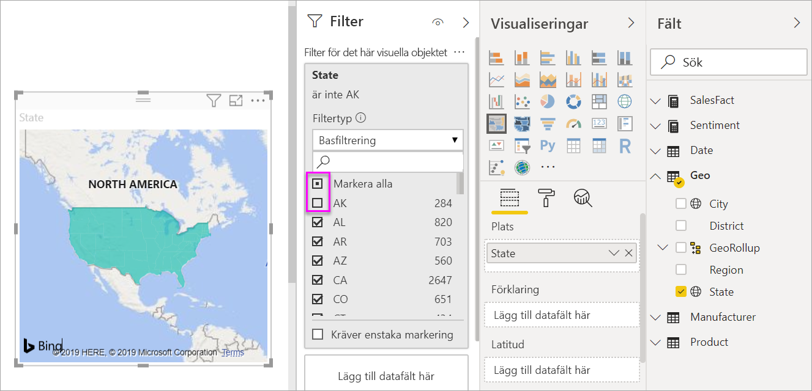
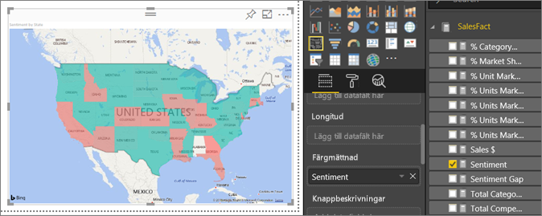
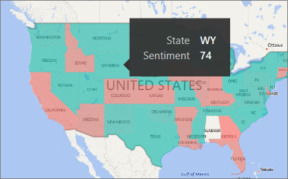
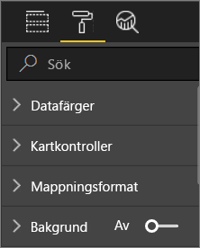
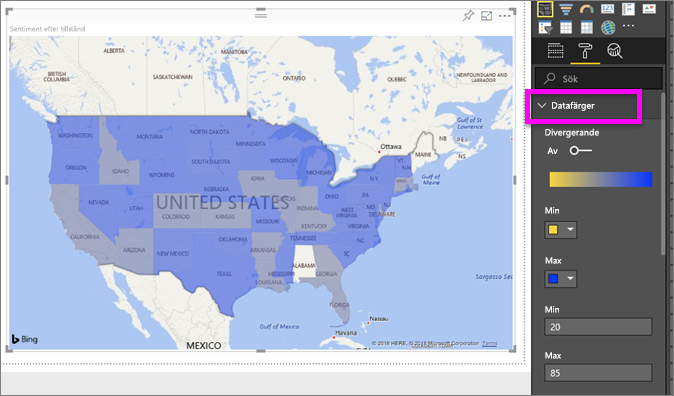
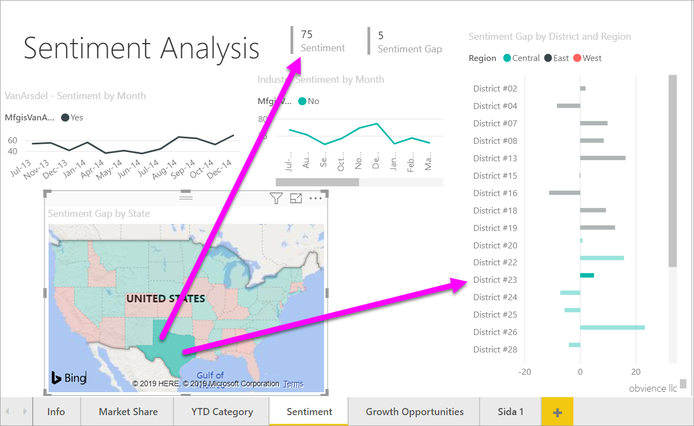

# Fyllda kartor (koropleter) i Power BI
En fylld karta använder skuggning, toning eller mönster för att visa hur ett värde skiljer sig åt proportionellt på en geografisk plats eller i en region.  Du kan snabbt visa dessa relativa skillnader med skuggning som sträcker sig från ljus (mindre ofta/lägre) till mörk (mer frekvent/fler).    

## Vad som skickas till Bing
Power BI integrerar med Bing för att tillhandahålla kartkoordinater av standardtyp (en process som kallas geokodning). När du skapar en kartvisualisering i Power BI-tjänsten eller i Power BI Desktop, skickas dina data i behållarna **Plats**, **Latitud** och **Longitud** (som används för att skapa visualiseringen) till Bing.

Du eller din administratör kan behöva uppdatera brandväggen för att tillåta åtkomst till de URL:er Bing använder för geokodning.  Dessa URL:er är:
- https://dev.virtualearth.net/REST/V1/Locations    
- https://platform.bing.com/geo/spatial/v1/public/Geodata    
- https://www.bing.com/api/maps/mapcontrol

Mer information om de data som skickas till Bing och tips för bättre geokodning hittar du i [Tips and tricks for map visualizations (Tips och råd om kartvisualiseringar)](power-bi-map-tips-and-tricks.md).

## När du ska använda en fylld karta
Fyllda kartor är ett bra alternativ:

* för att visa kvantitativ information på en karta,
* för att visa spatiala mönster och relationer,
* när dina data är standardiserade,
* när du arbetar med socioekonomiska data,
* när definierade regioner är viktiga,
* för att få en översikt över distributionen på flera geografiska platser.

### Förutsättningar
- Power BI-tjänsten eller Power BI Desktop
- Exempel på försäljning och marknadsföring

Om du vill följa med använder vi självstudiekursen Power BI-tjänsten och inte Power BI Desktop.

## Skapa en grundläggande fylld karta
I det här videoklippet skapar Kim en grundläggande karta och konverterar den till en fylld karta.

<iframe width="560" height="315" src="https://www.youtube.com/embed/ajTPGNpthcg" frameborder="0" allowfullscreen></iframe>

### Hämta data och lägg till en ny tom sida i rapporten
1. För att skapa en egen fylld karta [hämtar du försäljnings- och marknadsföringsexemplet](../sample-datasets.md) genom att logga in till Power BI och välja **Hämta data \>Exempel \> Försäljning och marknadsföring \> Anslut**.
2. När ett meddelande om lyckad åtgärd visas ska du stänga det och välja fliken **Rapporter**. Välj **Exempel på försäljning och marknadsföring** och öppna rapporten.

   
3. Rapporten öppnas i Power BI. Välj **Redigera rapport** för att öppna rapporten i [redigeringsvyn](../service-interact-with-a-report-in-editing-view.md).

4. Lägg till en ny sida genom att välja den gula plus-ikonen längst ned på rapportarbetsytan.

    

### Skapa en koropletkarta
1. Fönstret fält, Välj den **Geo** \> **tillstånd** fältet.    

   
5. [Konvertera diagrammet](power-bi-report-change-visualization-type.md) till en fylld karta. Observera att **Stat** nu befinner sig i **platsområdet**. Bing Maps använder fältet i **platsområdet** för att skapa kartan.  Platsen kan vara många olika giltiga platser: länder, stater, regioner, orter, postnummer och andra postkoder och så vidare. Bing Maps tillhandahåller figurer för platser runt om i världen. Power BI kan inte skapa den fyllda kartan utan en giltig post i platsområdet.  

   
6. Filtrera kartan för att visa endast kontinentala USA.

   a.  Längst ned i visualiseringsfönstret hittar du området **Filter**.

   b.  Hovra över **Stat** och klicka för att expandera sparren.  
   

   c.  Sätt en bock bredvid **Alla** och ta bort bocken bredvid **AK**.

   
7. Välj **SalesFact (Säljfakta)** \> **Sentiment** för att lägga till den till området **Färgmättnad**. Fältet i området **Färgmättnad** styr kartskuggningen.  
   
8. Koropletkartan färgas i grönt och rött, där rött motsvarar de lägre sentimentsiffrorna och grönt de högre, positivare sentimenten.  Här har jag markerat staten Wyoming (WY) och ser att sentimenten är mycket bra, 74.  
   
9. [Spara rapporten](../service-report-save.md).
##    Justerar färgformateringen
Power BI ger dig stor kontroll över hur din koropletkarta ser ut.
1. Välj färgrollerikonen för att öppna formateringsfönstret.

    

2. Välj **Datafärger** för att visa färgalternativ.
3. Ange färger för lägsta och högsta till gul respektive blå. Lägg till lägsta och högsta värden, baserat på dina data. Experimentera med kontrollerna tills du får det utseende du vill ha. 

    

## Markering och korsfiltrering
Information om hur du använder filterfönstret finns i [Lägg till ett filter i en rapport](../power-bi-report-add-filter.md).

Om du markerar en plats i en koropletkarta korsfiltreras de övriga visualiseringarna på rapportsidan, och vice versa.

1. Spara den här rapporten genom att välja **Arkiv > Spara**. 

2. Kopiera koropletkartan med hjälp av CTRL-C.

3. Längst ned i rapportarbetsytan kan du välja fliken **Sentiment** för att öppna rapportsidan för sentiment.

    

4. Flytta och ändra storlek på visualiseringarna på sidan för att skapa mer utrymme, och använd sedan CTRL + V för att klistra in koropletkartan från föregående rapport.

   

5. Välj en stat på den fyllda kartan.  Detta markerar de övriga visualiseringarna på sidan. Om jag väljer exempelvis **Texas** är sentimentet 74; Texas ligger i Central District \#23.   
   
2. Välj en datapunkt i linjediagrammet VanArsdel – Sentiment per månad. Detta filtrerar koropletkartan för att visa sentimentdata för VanArsdel och inte deras konkurrenter.  
   

## Överväganden och felsökning
Kartdata kan vara tvetydiga.  Till exempel finns det ett Paris i Frankrike, men också i Texas. Dina geografiska data lagras sannolikt i separata kolumner – en kolumn för stadsnamn, en kolumn för stats- eller regionnamn och så vidare – så Bing kan förmodligen inte avgöra skillnaden mellan de två olika Paris. Om din datauppsättning redan innehåller data för latitud och longitud, har Power BI speciella fält för att hjälpa till att göra dina kartdata entydiga. Du behöver bara dra fältet som innehåller dina latituddata till området Visualiseringar \> Latitud.  Gör sedan samma sak för dina longituddata.    

Titta på den här videon för hjälp med tvetydigheter beträffande kartdata om du har behörighet att redigera datauppsättningen i Power BI Desktop.

<iframe width="560" height="315" src="https://www.youtube.com/embed/Co2z9b-s_yM" frameborder="0" allowfullscreen></iframe>

Om du inte har åtkomst till latitud- och longituddata, [följer du de här instruktionerna för att uppdatera datauppsättningen](https://support.office.com/article/Maps-in-Power-View-8A9B2AF3-A055-4131-A327-85CC835271F7).

Mer hjälp med kartvisualiseringar finns i [Tips and tricks for map visualizations (Tips och råd om kartvisualiseringar)](../power-bi-map-tips-and-tricks.md).

## Nästa steg

[Formkarta](desktop-shape-map.md)

[Visualiseringstyper i Power BI](power-bi-visualization-types-for-reports-and-q-and-a.md)