# Skapa visualiseringar av viktiga påverkare

[!INCLUDE [power-bi-visuals-desktop-banner](../includes/power-bi-visuals-desktop-banner.md)]

Visualiseringen av viktiga påverkare hjälper dig att förstå vilka faktorer som påverkar ett mått du är intresserad av. Den analyserar dina data, rangordnar de faktorer som är viktiga och visar dem som viktiga influencers. Anta exempelvis att du vill ta reda på vad som påverkar personalomsättningen. En faktor kan vara anställningsavtalens längd och en annan kan vara medarbetarnas ålder. 
 
## När ska du använda viktiga påverkare 
Det visuella objektet för viktiga påverkare är ett bra val: 
- om du vill se vilka faktorer som påverkar det mått som analyseras
- om du vill jämföra den relativa vikten av de här faktorerna. Har till exempel korta avtalstider större effekt på personalomsättningen än långa avtalstider? 

## Funktioner för det visuella objektet för viktiga påverkare

1. **Flikar**: Välj en flik för att växla mellan vyer. **Viktiga påverkare** visar de viktigaste faktorerna som påverkar det valda måttvärdet. **Viktigaste segment** visar de viktigaste segmenten som påverkar det valda måttvärdet. Ett *segment* består av en kombination av värden. Ett segment kan till exempel vara konsumenter som har varit kunder i minst 20 år och lever i region väst. 

2. **Listruta**: Värdet för måttet som undersöks. I det här exemplet tittar vi på måttet **Omdöme**. Det valda värdet är **Lågt**.

3. **Omformulering**: Hjälper dig att tolka det visuella objektet i den vänstra rutan.

4. **Vänstra rutan**: Den vänstra rutan innehåller ett visuellt objekt. I det här fallet visas en lista med de viktigaste påverkarna.

5. **Omformulering**: Hjälper dig att tolka det visuella objektet i den högra rutan.

6. **Högra rutan**: Den högra rutan innehåller ett visuellt objekt. I det här fallet visar stapeldiagrammet alla värden för den viktiga påverkaren **Tema** som valts i den vänstra rutan. Det specifika värdet för **användbarhet** i den vänstra rutan visas i grönt. Alla andra värden för **Tema** visas i svart.

7. **Medellinje**: Medelvärdet beräknas för alla möjliga värden för **Tema**, förutom för **användbarhet** (som är den valda influeraren). Så beräkningen gäller för alla värden i svart. Den visar vilken procentandel av övriga **teman** som hade ett lågt omdöme. I det här fallet hade 11,35 % ett lågt omdöme (vilket visas av den prickade linjen).

8. **Kryssruta**: Filtrerar bort det visuella objektet i det högra fönstret så att endast värden som är influerare för det fältet visas. I det här exemplet skulle detta filtrera det visuella objektet för användbarhet, säkerhet och navigering.

## Analysera ett mått som är kategoriskt
 
Titta på den här videon om du vill lära dig att skapa ett visuellt objekt för viktiga influerare med ett kategoriskt mått. Följ stegen nedan för att skapa ett. 

   > [!NOTE]
   > I den här videon används en äldre version av Power BI Desktop.
   > 
   > 
<iframe width="560" height="315" src="https://www.youtube.com/embed/fDb5zZ3xmxU" frameborder="0" allow="accelerometer; autoplay; encrypted-media; gyroscope; picture-in-picture" allowfullscreen></iframe>

Din produktchef vill att du tar reda på vilka faktorer som gjorde att kunder lämnade negativa omdömen om er molntjänst. Öppna [PBIX-filen med kundfeedback](https://github.com/microsoft/powerbi-desktop-samples/tree/master/Monthly%20Desktop%20Blog%20Samples/2019/customerfeedback.pbix) i Power BI Desktop. Du kan också ladda ned [Excel-filen med kundfeedback för Power BI-tjänsten eller Power BI Desktop](https://github.com/microsoft/powerbi-desktop-samples/tree/master/Monthly%20Desktop%20Blog%20Samples/2019/customerfeedback.xlsx). Välj någon av länkarna och sedan **Ladda ned** från GitHub-sidan som öppnas.

> [!NOTE]
> Datamängden Customer Feedback (kundfeedback) bygger på [Moro et al., 2014] S. Moro, s. Cortez och s. Rita. ”A Data-Driven Approach to Predict the Success of Bank Telemarketing.” *Decision Support Systems*, Elsevier, 62:22–31, juni 2014. 

1. Öppna rapporten och välj ikonen **Viktiga påverkare**. 

    

2. Flytta det mått du vill undersöka till fältet **Analysera**. Om du vill se vad som får kunderna att lämna ett lågt omdöme om tjänsten väljer du **Kundtabell** > **Omdöme**.

3. Flytta fält som du tror kan påverka **Omdöme** till **Förklara med**. Du kan flytta så många fält du vill. I det här fallet börjar du med:
    - Land/Region 
    - Roll i organisationen 
    - Prenumerationstyp 
    - Företagsstorlek 
    - Tema
    
4. Låt fältet **Expandera efter** vara tomt. Det här fältet används endast vid analys av ett mått eller ett sammanfattat fält. 

5. Om du vill fokusera på negativa omdömen väljer du **Lågt** i listrutan **Vad påverkar omdömet att vara**.  

    

Analysen körs på tabellnivå för fältet som analyseras. I det här fallet är det måttet **Omdöme**. Det här måttet är definierat på kundnivå. Varje kund har gett antingen ett högt eller ett lågt omdöme. Alla förklarande faktorer måste vara definierade på kundnivå om det visuella objektet ska kunna använda dem. 

I föregående exempel har alla förklarande faktorer antingen en 1: 1- eller många-till-ett-relation med måttet. I det här fallet tilldelas varje kund ett enskilt tema för deras omdöme. På samma sätt så har kunder från ett och samma land en viss medlemstyp och har en viss roll i sin organisation. De förklarande faktorerna är redan attribut för kunden och ingen transformering krävs. Det visuella objektet kan använda dem direkt. 

Senare i självstudien ska vi titta på mer komplicerade exempel där det förekommer ett-till-många-relationer. I sådana fall måste kolumnerna först aggregeras ned till kundnivå innan du kan köra analysen. 

Mått och aggregeringar som används som förklarande faktorer utvärderas också på tabellnivå för måttet **Analysera**. Vi ser några exempel på det senare i den här artikeln. 

## Tolka kategorier av viktiga påverkare 
Låt oss ta en titt på de viktigaste påverkarna för låga omdömen. 

### Den främsta enskilda faktor som påverkar sannolikheten för ett lågt omdöme

Kunden i det här exemplet kan ha tre roller: konsument, administratör och utgivare. Att vara konsument är den viktigaste faktorn som bidrar till ett lågt omdöme. 

Närmare bestämt så är konsumenter 2,57 gånger mer troliga att ge tjänsten ett negativt omdöme. I diagrammet Viktiga påverkare står **Roll i organisationen är konsument** överst i listan till vänster. Om du väljer **Roll i organisationen är konsument**, visar Power BI ytterligare information i den högra rutan. Den komparativa effekten av respektive roll på sannolikheten för ett lågt omdöme visas.
  
- 14,93 % av konsumenterna ger ett lågt omdöme. 
- I genomsnitt ger alla andra roller ett lågt omdöme i 5,78 % av fallen.
- Konsumenterna är 2,57 gånger mer troliga att ge ett lågt omdöme jämfört med andra roller. Det här kan du räkna fram genom att dela den gröna stapeln med den röda streckade linjen. 

### Den näst viktigaste faktorn som påverkar sannolikheten för ett lågt omdöme

I det visuella objektet för viktiga påverkare kan vi jämföra och rangordna faktorer utifrån många olika variabler. Den andra påverkaren har inget samband med **Roll i organisationen**. Välj den andra påverkaren i listan, **Temat är användbarhet**. 

Den näst viktigaste faktorn handlar om temat för kundens recension. Kunder som kommenterat produktens användbarhet var 2,55 gånger mer troliga att ge ett lågt omdöme jämfört med kunder som kommenterade andra teman som tillförlitlighet, design eller hastighet. 

Från det ena visuella objektet till det andra ändrades medelvärdet, som visas med den röda streckade linjen, från 5,78 % till 11,34 %. Medelvärdet är dynamiskt eftersom det baseras på medelvärdet för alla andra värden. För den första påverkaren räknades inte kundens roll in. För den andra påverkaren räknas inte recensioner där temat är användbarhet in. 
 
Markera kryssrutan **Visa enbart värden som är påverkare** så att du endast visar de värden som påverkar mest. I det här fallet är de teman som bidrar till ett lågt omdöme. Tolv teman reduceras till de fyra som Power BI identifierar som teman som bidrar till ett lågt omdöme. 

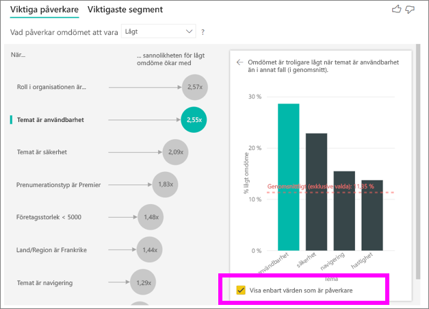

## Interagera med andra visuella objekt 
 
Varje gång du väljer ett utsnitt, ett filter eller ett annat visuellt objekt på arbetsytan körs analysen i det visuella objektet med viktiga påverkare igen för nya data. Du kan till exempel flytta **Företagsstorlek** till rapporten och använda den som ett utsnitt. Använd den till att se om de viktiga påverkarna för stora företagskunder skiljer sig från allmänheten. Här räknar vi stora företag som företag med fler än 50 000 anställda.
 
När du väljer **> 50 000** körs analysen igen och du kan se att påverkarna ändras. För kunder i stora företag är den viktigaste påverkaren för låga omdömen att temat gäller säkerhet. Det här kanske du vill undersöka vidare och se om det finns specifika säkerhetsfunktioner som våra kunder i stora företag är missnöjda med. 

## Tolka kontinuerliga viktiga påverkare 
 
Hittills har du sett hur du kan använda det visuella objektet för att utforska hur olika kategorifält påverkar låga omdömen. Du kan också ha kontinuerliga faktorer som ålder, höjd och pris i fältet **Förklara med**. Låt oss titta på vad händer om vi flyttar **Tjänstgöringsperiod** från kundtabellen till **Förklara med**. Tjänstgöringsperioden anger hur länge kunden har använt tjänsten. 
 
När tjänstgöringsperioden ökar ser vi att sannolikheten för ett lägre omdöme också ökar. Den här trenden innebär att kunder som använt tjänsten länge oftare ger ett negativt omdöme. Den här informationen är intressant och någonting du kanske bör följa upp senare. 
 
I visualiseringen ser du att varje gång tjänstgöringsperioden ökar med 13,44 månader så ökar i genomsnitt sannolikheten för ett lågt omdöme med 1,23 gånger. I det här fallet motsvarar 13,44 månader standardavvikelsen för nyttjandeperioden. Den insikt du får är att om tjänstgöringsperioden ökar med en standardmängd, som är standardavvikelsen för tjänstgöringsperioden, så påverkar det sannolikheten för ett lågt omdöme. 
 
Spridningsdiagrammet i den högra rutan visar den genomsnittliga procentandelen låga omdömen för varje värde för tjänstgöringsperioden. Lutningen framhävs med en trendlinje.

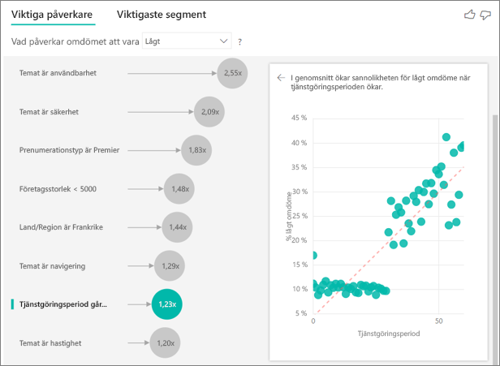

## Grupperade kontinuerliga viktiga influerare

I vissa fall märker du kanske att dina kontinuerliga faktorer automatiskt omvandlades till kategoriska faktorer. Det beror på att vi insåg att relationen mellan variablerna inte är linjär, och att vi därför inte kan beskriva relationen som blott ökande eller fallande (som vi gjorde i exemplet ovan).

Vi kör korrelationstester för att ta reda på hur linjär influeraren är med avseende på målet. Om målet är kontinuerligt kör vi Pearson-korrelationen och om målet är kategoriskt kör vi punkt-biserial-korrelationstester. Om vi upptäcker att relationen inte är tillräckligt linjär genomför vi övervakad gruppering och genererar högst 5 lagerplatser. För att ta reda på vilka lagerplatser som är mest lämpliga använder vi en metod för övervakad gruppering som tittar på relationen mellan den förklarande faktorn och det mål som analyseras.

## Tolka mått och aggregeringar som viktiga påverkare 
 
Du kan använda mått och aggregeringar som förklarande faktorer i din analys. Du kanske till exempel vill se vilken effekt antalet kundsupportärenden eller genomsnittlig varaktighet för ett öppet ärende har på vilket omdöme du får. 
 
I så fall vill du se om antalet supportärenden en kund har påverkar vilket omdöme de ger dig. Hämta nu **Supportbegäran-ID** från tabellen med supportärenden. Eftersom en kund kan ha flera supportärenden aggregerar du ID:t på kundnivå. Den här aggregeringen är viktig eftersom analysen körs på kundnivå, så alla drivande faktorer måste definieras på den precisionsnivån. 
 
Låt oss titta på antalet ID:n. Varje kundrad har ett antal supportärenden kopplade till sig. I det här fallet ser vi att när antalet supportärenden ökar så ökar också sannolikheten för ett lågt omdöme med 5,51 gånger. Det visuella objektet till höger visar det genomsnittliga antalet supportärenden efter olika **omdömesvärden** utvärderade på kundnivå. 

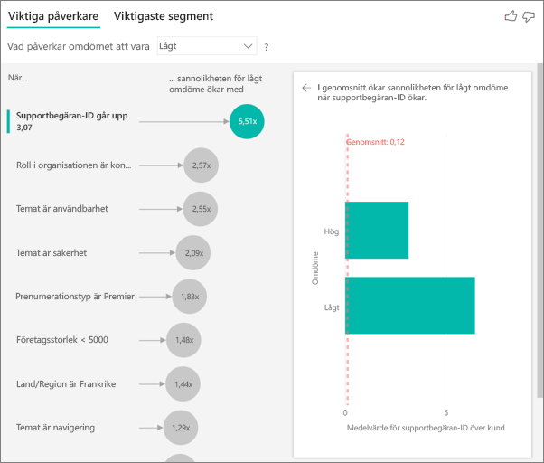

## Tolka resultaten: Viktigaste segment 
 
Du kan använda fliken **Viktiga påverkare** till att bedöma varje faktor individuellt. Du kan också använda fliken **Viktigaste segment** för att se hur en kombination av faktorer påverkar det mått du analyserar. 
 
På Viktiga segment visas inledningsvis en översikt över alla segment som har identifierats av Power BI. I följande exempel ser du att sex segment har identifierats. Dessa segment är rangordnade efter procentandelen låga omdömen inom segmentet. Segment 1 har till exempel 74,3 % låga kundomdömen. Ju högre bubbla, desto högre andel låga omdömen. Storleken på bubblan representerar hur många kunder som finns i segmentet. 

Om du markerar en bubbla visas mer detaljerad information om det segmentet. Om du till exempel väljer Segment 1 ser du att det består av relativt etablerade kunder. De har varit kunder längre än 29 månader och har fler än fyra supportärenden. Slutligen är de inte utgivare, så de är antingen konsumenter eller administratörer. 
 
I den här gruppen gav 74,3 % av kunderna av ett lågt omdöme. Den genomsnittliga kunden gav ett lågt omdöme 11,7 % av fallen, så det här segmentet har en större andel låga omdömen. 63 procentenheter större. Segment 1 innehåller även cirka 2,2 % av våra data, så det motsvarar en signifikant del av populationen. 

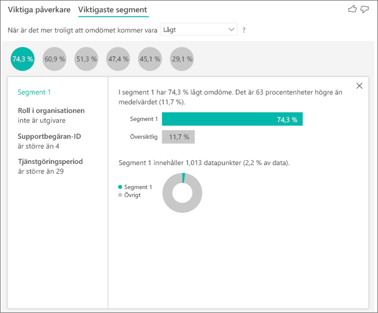

## Lägga till antal

Ibland kan en influerare ha stor påverkan trots att den representerar en mycket liten del av data. Till exempel är **temat** **användbarhet** den näst största influeraren för låga omdömen. Dock kan det ha funnits endast ett fåtal kunder som klagade på användbarheten. Antal kan hjälpa dig att prioritera vilka influerare som du vill fokusera på.

Du kan aktivera antal via **analyskortet** i formateringsfönstret.

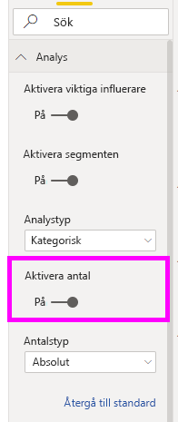

När antal har aktiverats ser du en ring signal runt varje influerares bubbla, som representerar den ungefärliga procentandelen data som influeraren innehåller. Ju mer av bubblan som ringen omger, desto mer data innehåller den. Vi kan se att **temat** **användbarhet** innehåller en mycket liten andel data.

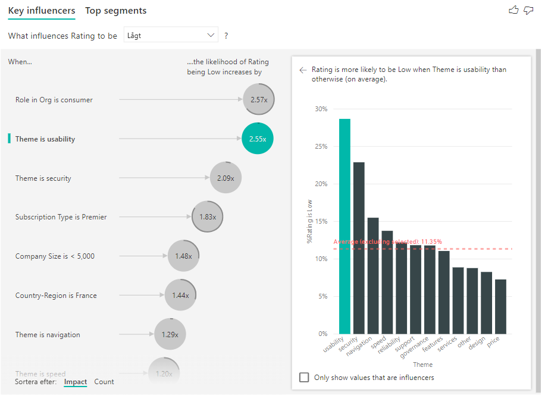

Du kan även växeln Sortera efter längst ned till vänster i det visuella objektet för att sortera bubblorna efter antal först i stället för påverkan. **Prenumerationstypen** **Premier** är den främsta influeraren baserat på antal.

Om det finns en hel ring runt cirkeln innebär det att influeraren innehåller 100 % av data. Du kan ändra antalstypen så att den blir relativ till den högsta influeraren med hjälp av listrutan **Antalstyp** i **analyskortet** för formateringsfönstret. Nu representeras den influerare som har störst antal data av en hel ring, och alla andra antal blir relativa till den.

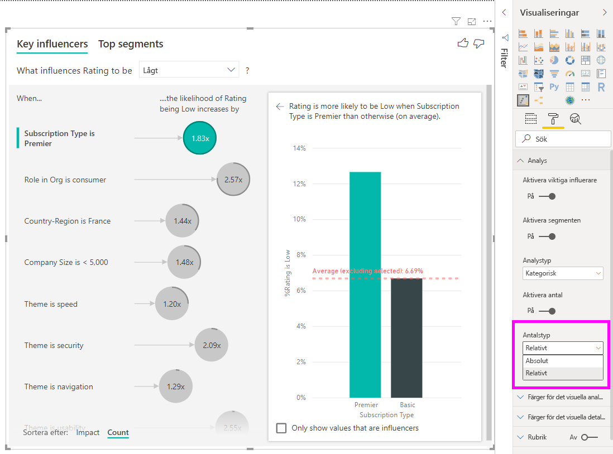

## Analysera ett mått som är numeriskt

Om du flyttar ett ej sammanfattat numeriskt fält till fältet **Analysera** kan du välja hur scenariot ska hanteras. Du kan ändra beteendet för det visuella objektet genom att gå till **formateringsfönstret** och växla mellan **Kategorisk analystyp** och **Kontinuerlig analystyp**.

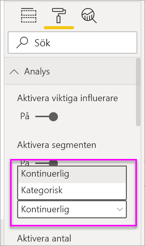

En **kategorisk analystyp** fungerar enligt beskrivningen ovan. Om du till exempel skulle ha omdömespoäng från 1 till 10 kan du ställa frågan ”vad påverkar omdömespoängen att 1?”

En **kontinuerlig analystyp** gör att frågan omformuleras något. I exemplet ovan skulle den nya frågan vara ”vad påverkar omdömespoängen att öka/minska?”

Denna skillnad är mycket användbar när du har mängder av unika värden i fältet du analyserar. I exemplet nedan tittar vi på huspriser. Det är inte så användbart att fråga ”vad påverkar huspriset att vara 156 214?” eftersom det är mycket specifikt och vi förmodligen inte har tillräckligt med data för att härleda ett mönster.

I stället kan vi fråga ”vad får huspriset att öka?” vilket gör att vi kan behandla huspriserna som intervall snarare än distinkta värden.

## Tolka resultaten: Viktiga påverkare 

I det här scenariot tittar vi på frågan ”vad får huspriset att öka”. Vi tittar på ett antal förklarande faktorer som kan påverka huspriset som **Year Built** (året då huset byggdes), **KitchenQual** (kökets kvalitet) och **YearRemodAdd** (året då huset renoverades). 

I exemplet nedan tittar vi på vår viktigaste påverkare, som är när kökets kvalitet är Excellent (utmärkt). Resultatet liknar det vi såg när vi analyserade kategoriska mått, men det finns några viktiga skillnader:

- Stapeldiagrammet till höger beaktar medelvärden snarare än procenttal. Därför ser vi det genomsnittliga huspriset för hus med utmärkt kökskvalitet (grön stapel) jämfört med det genomsnittliga huspriset för hus med en annan kökskvalitet (streckad linje)
- Talet i bubblan är fortfarande skillnaden mellan den röda streckade linjen och den gröna stapeln, men här uttrycks den som ett tal ($158.49K) i stället för en sannolikhet (1.93x). I genomsnitt är alltså hus med utmärkt kökskvalitet nästan $160K dyrare än hus som har en annan kökskvalitet.

I exemplet nedan tittar vi på hur en kontinuerlig faktor (året som huset renoverades) påverkar huspriset. Det här är skillnaden jämfört med hur vi analyserar kontinuerliga påverkare för kategoriska mått:

-   Punktdiagrammet i den högra rutan visar det genomsnittliga huspriset för varje distinkt renoveringsår. 
-   Värdet i bubblan visar med hur mycket det genomsnittliga huspriset ökade (i det här fallet $2.87K) när renoveringsåret ökade med dess standardavvikelse (i det här fallet 20 år)

När det gäller mått ska vi slutligen titta på det genomsnittliga år när huset byggdes. Så här ser analysen ut:

-   Punktdiagrammet i den högra rutan visar det genomsnittliga huspriset för varje distinkt värde i tabellen
-   Värdet i bubblan visar med hur mycket det genomsnittliga huspriset ökade (i det här fallet $1.35K) när det genomsnittliga byggåret ökade med dess standardavvikelse (i det här fallet 30 år)

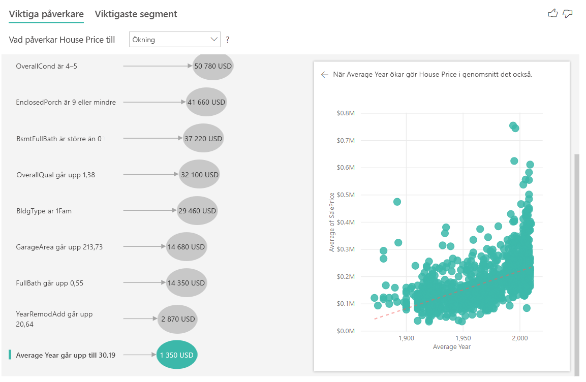

## Tolka resultaten: Viktigaste segment

Viktigaste segment för numeriska mål visar grupper där huspriset i genomsnitt är högre än i datamängden som helhet. Till exempel ser vi nedan att **Segment 1** består av hus där **GarageCars** (antal bilar som får plats i garaget) är större än 2 och **RoofStyle** är Hip. Hus med de här egenskaperna har ett genomsnittligt pris på $355K jämfört med genomsnittet i hela datamängden som är $180K.

## Analysera ett mått som är ett mått eller en sammanfattad kolumn

När det gäller ett mått eller en sammanfattad kolumn blir analysen som standard den **kontinuerliga analystyp** som beskrivs [ovan](https://docs.microsoft.com/power-bi/visuals/power-bi-visualization-influencers#analyze-a-metric-that-is-numeric). Detta kan inte ändras. Den största skillnaden mellan att analysera ett mått/en summerad kolumn och en ej sammanfattad numerisk kolumn är den nivå som analysen körs på.

När det gäller ej sammanfattade kolumner körs analysen alltid på tabellnivån. I exemplet med huspris ovan analyserade vi måttet **Huspris** för att se vad som orsakar att ett huspris ökar/minskar. Analysen körs automatiskt på tabellnivån. Vår tabell har ett unikt ID för varje hus så att analysen körs på husnivå.

För mått och sammanfattade kolumner vet vi inte omedelbart vilken nivå som de ska analyseras på. Om **Huspris** sammanfattades som ett **genomsnitt** skulle vi behöva ta hänsyn till vilken nivå som vi vill att det här genomsnittliga huspriset beräknas på. Är det ett genomsnittligt huspris på kvartersnivå? Eller är det kanske en regional nivå?

Mått och sammanfattade kolumner analyseras automatiskt på nivån för de **Förklara med**-fält som används. Anta att vi har tre fält i **Förklara med** som vi är intresserade av: **Kökskvalitet**, **Byggnadstyp** och **Luftkonditionering**. **Genomsnittligt huspris** skulle beräknas för varje unik kombination av dessa tre fält. Det är ofta användbart att växla till en tabellvy för att se hur de data som utvärderas ser ut.

Den här analysen är mycket sammanfattad, och det blir därför svårt för regressionsmodellen att hitta några mönster i de data som den kan lära sig från. Vi bör köra analysen på en mer detaljerad nivå för att få bättre resultat. Om vi ville analysera huspriset på husnivån skulle vi behöva lägga till fältet **ID** i analysen uttryckligen. Trots det vill vi inte att hus-ID ska betraktas som influerare. Det gör ingen nytta att få reda på att priset för ett hus ökar när hus-ID:t ökar. Här kan vi använda fältkällan **Expandera efter**. Du kan använda **Expandera efter** för att lägga till fält som du vill använda för att ange analysnivån utan att behöva leta efter nya influerare.

Ta en titt på hur visualiseringen ser ut när vi har lagt till **ID** i **Expandera efter**. När du har definierat den nivå som du vill att måttet analyseras på fungerar tolkning av influerare på exakt samma sätt som för [ej sammanfattande numeriska kolumner](https://docs.microsoft.com/power-bi/visuals/power-bi-visualization-influencers#analyze-a-metric-that-is-numeric).

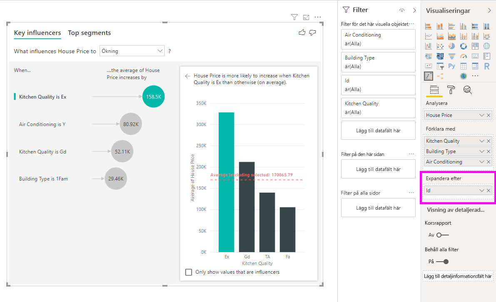

Om du vill lära dig mer om hur du kan analysera mått med visualiseringen av viktiga influerare kan du se följande självstudie.

<iframe width="1167" height="631" src="https://www.youtube.com/embed/2X1cW8oPtc8" frameborder="0" allow="accelerometer; autoplay; encrypted-media; gyroscope; picture-in-picture" allowfullscreen></iframe>

## Överväganden och felsökning 
 
**Vilka begränsningar gäller för det visuella objektet?** 
 
Det visuella objektet för den viktiga influeraren har vissa begränsningar:

- Direct Query stöds inte
- Live-anslutning till Azure Analysis Services och SQL Server Analysis Services stöds inte
- Publicera på webben stöds inte
- .NET Framework 4.6 eller senare krävs

**Jag ser ett fel om att inga påverkare eller segment hittades. Varför?** 

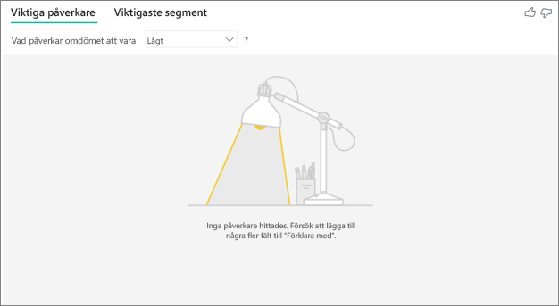

Det här felet uppstår när du har dragit in fält i **Förklara med** men inga påverkare hittades. 
- Du tog med måttet du analyserar i både **Analysera** och **Förklara med**. Ta bort det från **Förklara med**. 
- Dina förklarande fält har för många kategorier med få observationer. Detta gör det svårt för visualiseringen att avgöra vilka faktorer som är påverkare. Det är svårt att generalisera baserat på bara några få observationer. Om du analyserar ett numeriskt fält kanske du vill växla från **kategorisk analys** till **kontinuerlig analys** i **formateringsfönstret** under kortet **Analys**.
- Dina förklarande faktorer har tillräckligt med observationer för att göra generaliseringar, men visualiseringen kunde inte hitta någon meningsfull korrelation att rapportera.
 
**Jag ser ett fel om att måttet jag analyserar inte har tillräckligt med data för att köra analysen. Varför?** 

Visualiseringen letar efter mönster i data för en grupp jämfört med andra grupper. Till exempel kan kunder som gav låga omdömen jämföras med kunder som gav höga omdömen. Om det bara finns några få observationer i datamodellen är det svårt att hitta mönster. Om visualiseringen inte innehåller tillräckligt med data för att hitta meningsfulla påverkare innebär det att mer data behövs för att köra analysen. 

Vi rekommenderar minst 100 observationer för det valda tillståndet. I det här fallet är tillståndet kunder som slutar använda tjänsten. Du behöver också minst 10 observationer för de tillstånd som du använder till jämförelse. I det här fallet är jämförelsetillståndet kunder som inte slutar använda tjänsten.

Om du analyserar ett numeriskt fält kanske du vill växla från **kategorisk analys** till **kontinuerlig analys** i **formateringsfönstret** under kortet **Analys**.

**Jag får ett fel att när ”Analysera” inte är sammanfattad så körs analysen alltid på radnivån för sin överordnade tabell. Det är inte tillåtet att ändra den här nivån via ”Expandera efter”-fält. Varför?**

Vid analys av en numerisk eller kategorisk kolumn körs analysen alltid på tabellnivån. Om du till exempel analyserar huspriser och din tabell innehåller en ID-kolumn körs analysen automatiskt på hus-ID-nivån. 

När du analyserar ett mått eller en sammanfattad kolumn måste du uttryckligen ange vilken nivå som du vill att analysen ska köras på. Du kan använda **Expandera efter** för att ändra analysnivån för mått och sammanfattade kolumner utan att lägga till nya influerare. Om **Huspris** definierades som ett mått skulle du kunna lägga till kolumnen hus-ID till **Expandera efter** för att ändra nivån på analysen.

**Jag ser ett fel om att ett fält i *Förklara med* inte är unikt relaterat till tabellen som innehåller måttet jag analyserar. Varför?**
 
Analysen körs på tabellnivå för fältet som analyseras. Om du till exempel analyserar kundfeedback för din tjänst kanske du har en tabell som anger om en kund lämnade ett högt eller lågt omdöme. I så fall körs din analys på kundtabellsnivå. 

Om du har en relaterad tabell som är definierad på en mer detaljerad nivå än tabellen som innehåller måttet får du det här felet. Här är ett exempel: 
 
- Du analyserar vad som påverkar kunder att ge låga omdömen om din tjänst.
- Du vill se om vilken enhet kunden använder tjänsten på också påverkar vilket omdöme som ges.
- En kund kan använda tjänsten på flera olika sätt.
- I följande exempel använder kund 10000000 både en webbläsare och en surfplatta till att interagera med tjänsten.

Om du försöker använda enhetskolumnen som en förklarande faktor visas följande fel: 

Det här felet visas eftersom enheten inte är definierad på kundnivå. En kund kan använda tjänsten på flera olika enheter. Om visualiseringen ska kunna hitta mönster måste enheten vara ett attribut för kunden. Det finns flera lösningar som beror på din förståelse av verksamheten: 
 
- Du kan ändra sammanfattningen av enheter till ett antal. Använd till exempel antal om antalet enheter kan påverka vilket omdöme en kund ger. 
- Du kan pivotera enhetskolumnen för att se om användning av tjänsten på en viss enhet påverkar kundens omdöme.
 
I det här exemplet pivoterades data för att skapa nya kolumner för webbläsare, mobil och surfplatta (se till att du tar bort och återskapar dina relationer i modelleringsvyn efter att ha pivoterat dina data). Nu kan du använda dessa specifika enheter i **Förklara med**. Alla enheter visar sig vara påverkare och vi ser att webbläsare har den största effekten på kundernas omdöme.

Närmare bestämt är kunder som inte använder webbläsare för tjänsten 3,79 gånger mer troliga att lämna ett lågt omdöme än de som gör det. Längre ner i listan ser vi att det omvända är sant för mobiler. Det är mer troligt att kunder som använder mobilappen ger ett lägre betyg än kunder som inte gör det. 

**Jag ser en varning om att mått inte tagits med i min analys. Varför?** 

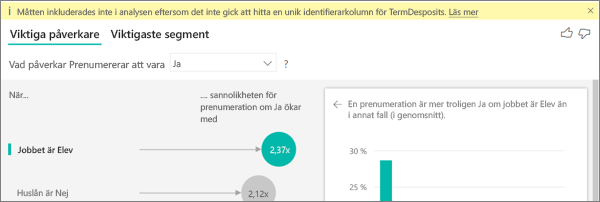

Analysen körs på tabellnivå för fältet som analyseras. Om du analyserar kundomsättning kan du ha en tabell som anger om en kund har lämnat er eller inte. I så fall körs din analys på kundtabellsnivå.
 
Mått och aggregeringar analyseras som standard på tabellnivå. Om det fanns ett mått för genomsnittliga utgifter per månad skulle det analyseras på kundtabellsnivå. 

Om kundtabellen inte har någon unik identifierare kan du inte utvärdera måttet och det ignoreras då i analysen. Du kan undvika det här genom att se till att tabellen med måttet har en unik identifierare. I det här fallet gäller det kundtabellen och den unika identifieraren är kund-ID:t. Det är också enkelt att lägga till en indexkolumn med hjälp av Power Query.
 
**Jag ser en varning om att måttet jag analyserar har fler än 10 unika värden och att detta kan påverka kvaliteten på min analys. Varför?** 

AI-visualiseringen kan analysera kategorifält och numeriska fält. Ett kategorifält kan handla om kundomsättning och värdena vara Ja eller Nej, eller så kan det handla om nöjdhet och värdena vara Hög, Medel eller Låg. Om du ökar antalet kategorier att analysera innebär det att det finns färre observationer per kategori. Då blir det svårare för visualiseringen att hitta mönster i dina data. 

När du analyserar numeriska fält kan du välja mellan att behandla de numeriska fälten som text, och i så fall kör du samma analys som för kategoridata (**Kategorisk analys**). Om du har mängder av distinkta värden rekommenderar vi att du byter till **Kontinuerlig analys** eftersom det innebär att vi kan härleda mönster från när värden ökar eller minskar snarare än att de behandlas som distinkta värden. Du kan byta från **kategorisk analys** till **kontinuerlig analys** i **formateringsfönstret** under kortet **Analys**.

Du kan hitta starkare påverkare om du grupperar liknande värden i en enhet. Om du till exempel har ett mått för pris får du troligtvis bättre resultat genom att samla liknande priser i grupper som Högt, Medel och Lågt i stället för att använda enskilda prispunkter. 

**Det finns faktorer i mina data som ser ut som om de borde vara påverkare, men det är de inte. Hur kan det bli så?**

I följande exempel drivar kunder som är konsumenter ett lågt omdöme, där 14,93 % av omdömena är låga. Administratörsrollen har också en hög andel låga omdömen (13,42 %), men den anses inte vara en påverkare. 

Orsaken till detta är att visualiseringen också tar hänsyn till antalet datapunkter när den identifierar påverkare. I följande exempel finns fler än 29 000 konsumenter och 10 gånger färre administratörer, ungefär 2 900. Endast 390 av dem gav ett lågt omdöme. Det visuella objektet har inte tillräckligt med data för att avgöra om det är ett mönster i administratörsomdömena eller om det bara är en slump. 

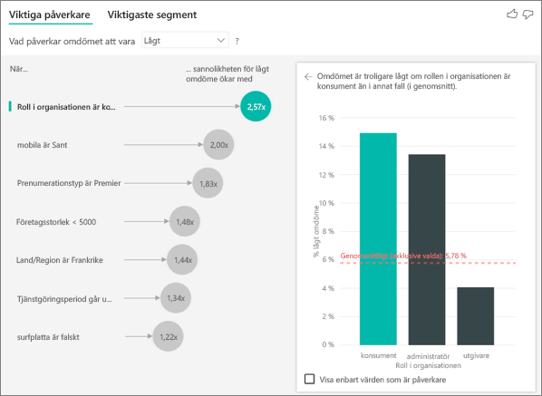

**Vilka datapunktsgränser gäller för viktiga påverkare?**
Vi kör analysen på ett prov med 10 000 datapunkter. Bubblorna på den ena sidan visar alla påverkare som identifierats. Kolumndiagrammen och plottarna på andra sidan följer provtagningsstrategierna för de visuella kärnobjekten.

**Hur beräknas viktiga påverkare vid kategorianalys?**

AI-visualiseringen använder [ML.NET](https://dotnet.microsoft.com/apps/machinelearning-ai/ml-dotnet) till att köra en logistisk regression för att beräkna viktiga påverkare. En logistisk regression är en statistisk modell som jämför olika grupper med varandra. 

Om du vill se vad som ger låga omdömen skulle den logistiska regressionen titta på hur kunder som gav en låg poäng skiljer sig från kunder som gav höga betyg. Om du har flera kategorier, som högt, neutralt och lågt omdöme, tittar du på hur kunderna som gav ett lågt omdöme skiljer sig från kunderna som inte gav ett lågt omdöme. Hur skiljer sig alltså kunderna som gav ett lågt omdöme från kunderna som gav ett högt eller neutralt omdöme? 
 
Den logistiska regressionen söker efter mönster i data och hur kunder som lämnade ett lågt omdöme kan skilja sig från dem som lämnade ett högt omdöme. Till exempel kanske kunder med fler supportärenden i högre utsträckning gav ett lågt omdöme än kunder med få eller inga supportärenden.
 
Den logistiska regressionen beaktar även hur många datapunkter som finns. Om kunder i en administratörsroll till exempel proportionellt sett ger mer negativa betyg, men om det bara finns några få administratörer, räknas inte den här faktorn som en påverkare. Detta görs eftersom det inte finns tillräckligt med datapunkter för att härleda ett mönster. Ett statistiskt test som kallas Wald-testet används för att avgöra om en faktor ska betraktas som en påverkare. Det visuella objektet använder p-värdet 0,05 för att fastställa tröskelvärdet. 

**Hur beräknas viktiga påverkare vid numerisk analys?**

AI-visualiseringen använder [ML.NET](https://dotnet.microsoft.com/apps/machinelearning-ai/ml-dotnet) till att köra en linjär regression för att beräkna viktiga påverkare. Linjär regression är en statistisk modell som visar hur utfallet för fältet du analyserar ändras baserat på dina förklarande faktorer.

Om vi till exempel analyserar huspriser kommer en linjär regression titta på hur priset påverkas om kökets kvalitet är Utmärkt. Har hus med utmärkt kvalitet på köket generellt ett högre eller lägre pris jämfört med hus som har en annan kvalitet på köket?

Den linjära regressionen beaktar även antalet datapunkter. Om hus med tennisbanor till exempel har högre priser, men det bara finns mycket få hus som har tennisbana, räknas inte den här faktorn som en påverkare. Detta görs eftersom det inte finns tillräckligt med datapunkter för att härleda ett mönster. Ett statistiskt test som kallas Wald-testet används för att avgöra om en faktor ska betraktas som en påverkare. Det visuella objektet använder p-värdet 0,05 för att fastställa tröskelvärdet. 

**Hur beräknas segment?**

AI-visualiseringen använder [ML.NET](https://dotnet.microsoft.com/apps/machinelearning-ai/ml-dotnet) till att köra ett beslutsträd för att hitta intressanta undergrupper. Syftet med beslutsträdet är att få fram en undergrupp med datapunkter som ligger relativt högt för det mått du är intresserad av. Det här kan vara kunder som lämnat ett lågt omdöme eller hus med höga priser.

Beslutsträdet tar varje förklarande faktor och försöker avgöra vilken faktor som ger den bästa *uppdelningen*. Om du till exempel filtrerar data så att endast kunder i stora företag inkluderas, skulle det skilja ut kunder som lämnade ett högt jämfört med ett lågt omdöme? Eller blir det kanske bättre om du filtrerar data så att du endast tar med användare som har kommenterat säkerheten? 

När beslutsträdet gör en uppdelning används delmängden data, och därefter söks nästa bästa uppdelning. I det här fallet är undergruppen kunder som har kommenterat säkerheten. Efter varje uppdelning beaktas även om det finns tillräckligt med datapunkter för att gruppen ska vara tillräckligt representativ att kunna härleda ett mönster från, eller om det bara rör sig om en anomali i data och därmed inget segment. Ett annat statistiskt test används för att kontrollera uppdelningens statistiska signifikans, med p-värdet 0,05. 

När beslutsträdet har slutförts används alla uppdelningar, som säkerhetskommentarer och stora företag, som Power BI-filter. Den här filterkombinationen paketeras som ett segment i det visuella objektet. 
 
**Varför blir visa faktorer påverkare eller slutar vara påverkare när jag flyttar fler fält till fältet *Förklara med*?**

Visualiseringen utvärderar alla förklarande faktorer tillsammans. En faktor kan vara påverkare i sig själv, men när den betraktas tillsammans med andra faktorer kanske den inte är det. Anta att du vill analysera vad som påverkar höga huspriser, med antal sovrum och husets storlek som förklarande faktorer:

- På egen hand kanske sovrum är en påverkande faktor för höga huspriser.
- Om du tar med husstorlek i analysen innebär det att du tittar på vad som händer med antalet sovrum när husstorleken är konstant.
- Om husstorleken är 1 500 kvadratfot gör förmodligen inte en fortsatt ökning av antalet sovrum att huspriset ökar markant. 
- Antalet sovrum kanske inte är en lika viktig faktor som innan du beaktade husets storlek. 

## Nästa steg
- [Kombinationsdiagram i Power BI](power-bi-visualization-combo-chart.md)
- [Visualiseringstyper i Power BI](power-bi-visualization-types-for-reports-and-q-and-a.md)
