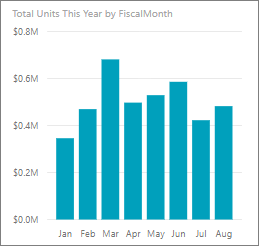

# Visuell KPI-information
En KPI (Key Performance Indicator) är en visuell ledtråd som kommunicerar de framsteg som gjorts mot ett mätbart mål. Mer information om KPI:er finns i [Microsoft Developer Network](https://msdn.microsoft.com/library/hh272050).

Om du inte har registrerat dig för Power BI [registrerar du dig för en kostnadsfri utvärderingsversion](https://app.powerbi.com/signupredirect?pbi_source=web) innan du börjar.

## Förutsättningar
* [Power BI Desktop – helt kostnadsfritt!](https://powerbi.microsoft.com/en-us/get-started/)
* [PBIX-filen Exempel på detaljhandelsanalys](http://download.microsoft.com/download/9/6/D/96DDC2FF-2568-491D-AAFA-AFDD6F763AE3/Retail%20Analysis%20Sample%20PBIX.pbix)

## När du ska använda KPI:er
KPI:er är ett bra alternativ

* för att mäta framsteg (Vad ligger jag före eller efter med?)
* för att mäta avståndet till ett mål (Hur långt före eller efter ligger jag?)   

## KPI-krav
En KPI (Key Performance Indicator) baseras på ett visst mått och är utformad för att hjälpa dig att utvärdera aktuellt värde och status för ett mått jämfört med ett definierat mål. Därför kräver ett visuellt KPI-objekt ett *grundläggande* mått som utvärderas mot ett värde och ett *målmått* eller -värde samt ett *tröskelvärde* eller ett *mål*.

För närvarande måste en KPI-datauppsättning innehålla målvärden för en KPI. Om din datauppsättning inte innehåller något, kan du skapa mål genom att lägga till ett Excel-blad med mål till din datamodell eller PBIX-fil.

## Så här skapar du en KPI
Öppna [PBIX-filen Exempel på detaljhandelsanalys](http://download.microsoft.com/download/9/6/D/96DDC2FF-2568-491D-AAFA-AFDD6F763AE3/Retail%20Analysis%20Sample%20PBIX.pbix) i Power BI Desktop. Vi ska skapa en KPI som mäter de framsteg som vi har gjort mot ett försäljningsmål.

Du kan också titta på när Will visar hur du skapar ett enskilt visuellt måttobjekt: måttdiagram, kort och KPI:er.

<iframe width="560" height="315" src="https://www.youtube.com/embed/xmja6EpqaO0?list=PL1N57mwBHtN0JFoKSR0n-tBkUJHeMP2cP" frameborder="0" allowfullscreen></iframe>

1. Öppna rapporten i rapportvyn och välj den gula fliken för att lägga till en ny sida.    
2. Välj **Försäljning > Total Units This Year (Totalt antal enheter i år)** i fönstret Fält.  Det här är indikatorn.
3. Lägg till **Tid > FiscalMonth (Räkenskapsmånad)**.  Detta representerar trenden.
4. VIKTIGT! Sortera diagrammet efter **FiscalMonth (Räkenskapsmånad)**. När du har konverterat visualiseringen till en KPI, går det inte att sortera.

    
5. Konvertera det visuella objektet till en KPI genom att välja KPI-ikonen i visualiseringsfönstret.
   
    
6. Lägg till ett mål. Lägg till förra årets försäljning som målet. Dra **Total Units Last Year (Totalt antal enheter förra året)** till fältet **Målsättningar**.
   
    
7. Du kan som alternativ formatera KPI:n genom att välja färgrollerikonen för att öppna panelen Formatering.
   
   * **Indikator** – styr indikatorns visningsenheter och decimalplaceringar.
   * **Trendaxel** – när denna är **På**, visas trendaxeln som bakgrund till det visuella KPI-objektet.  
   * **Mål** – när detta är inställt till **På**, visar det visuella objektet målet och avståndet från målet i procent.
   * **Färgkodning > Riktning** – vissa KPI:er anses *bättre* för högre värden och vissa anses *bättre* för lägre värden. Intäkter kontra väntetid till exempel. Vanligtvis är ett högre värde för intäkter bättre jämfört med ett högre värde för väntetid. Välj **högre är bättre** och du kan även ändra färginställningarna.

KPI:er finns även tillgängliga i Power BI-tjänsten och på dina mobila enheter – så att du kan hålla dig ansluten till din verksamhet när som helst.

## Överväganden och felsökning
* Om din KPI inte ser ut som den på bilden ovan, kan det bero på att du behöver sortera efter fiscalmonth (räkenskapsmånad). Eftersom KPI:er saknar sorteringsalternativ, måste du sortera efter fiscalmonth (räkenskapsmånad) *innan* du konverterar visualiseringen till en KPI.

## Nästa steg

[Grundläggande kartor i Power BI](power-bi-map-tips-and-tricks.md)

[Visualiseringstyper i Power BI](power-bi-visualization-types-for-reports-and-q-and-a.md)