# Introduktion Visuella frågor och svar i Power BI

[!INCLUDE[consumer-appliesto-nyyn](../includes/consumer-appliesto-nyyn.md)]    

[!INCLUDE [power-bi-service-new-look-include](../includes/power-bi-service-new-look-include.md)]

## Vad är Visuella frågor och svar?

Med Visuella frågor och svar kan användarna ställa frågor på naturligt språk och få svar i form av ett visuellt objekt. 

[!INCLUDE [power-bi-visuals-desktop-banner](../includes/power-bi-visuals-desktop-banner.md)]

Visuella frågor och svar kan både användas som verktyg för att *användarna* snabbt ska få svar på sina data, och för att *designers* ska kunna skapa visuella objekt i rapporter genom att dubbelklicka var som helst i rapporten och använda naturligt språk för att komma igång. Eftersom Visuella frågor och svar fungerar som alla andra visuella objekt kan de korsfiltreras/korsmarkeras och har även stöd för bokmärken. Visuella frågor och svar har dessutom stöd för teman och andra vanliga formateringsalternativ i Power BI.

Visuella frågor och svar består av fyra kärnkomponenter:

- Frågerutan. Det är här som användarna skriver sina frågor och får förslag på hur frågorna kan kompletteras.
- En lista med förslag på frågor.
- En ikon för att omvandla Visuella frågor och svar-objektet till ett vanligt visuellt objekt. 
- Ikon för att öppna verktygen i Frågor och svar så att designers kan konfigurera den underliggande motorn för naturligt språk.

## Förutsättningar

1. I den här självstudien används [pbix-exempelfilen Sales & Marketing](https://download.microsoft.com/download/9/7/6/9767913A-29DB-40CF-8944-9AC2BC940C53/Sales%20and%20Marketing%20Sample%20PBIX.pbix). 

1. Välj **Arkiv** > **Öppna** uppe till vänster i menyraden i Power BI Desktop
   
2. Leta rätt på din kopia av **pbix-exempelfilen Sales & Marketing**

1. Öppna filen i rapportvyn .

1. Välj  för att lägga till en ny sida.

Om du ser ett fel när du skapar ett Visuella frågor och svar-objekt ska du läsa avsnittet om [begränsningar](../natural-language/q-and-a-limitations.md) för att se om det finns stöd för din konfiguration av datakällor.    

> [!NOTE]
> För att dela en rapport med en Power BI-kollega krävs att du både har individuella Power BI Pro-licenser eller att rapporten har sparats med Premium-kapacitet. Se [delningsrapporter](../collaborate-share/service-share-reports.md).

## Skapa ett Visuella frågor och svar-objekt med hjälp av en föreslagen fråga
I den här övningen väljer vi en av de föreslagna frågorna för att skapa ett eget Visuella frågor och svar-objekt. 

1. Börja med en tom rapportsida och välj ikonen för Visuella frågor och svar i fönstret Visualiseringar.

    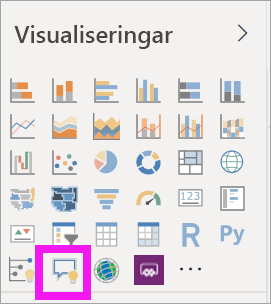

2. Ändra storlek på det visuella objektet genom att dra i kantlinjen.

    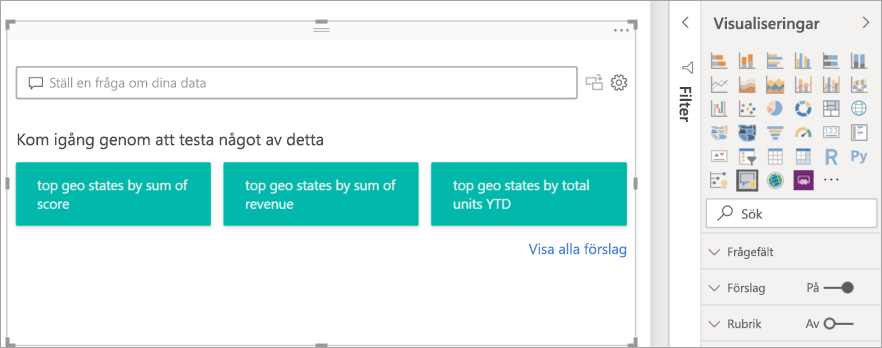

3. Skapa det visuella objektet genom att välja en av de föreslagna frågorna eller börja skriva i frågerutan. I det här exemplet har vi valt **top geo states by sum of revenue**. Power BI väljer vilken typ av visualisering som ska användas efter bästa förmåga. I det här fallet är det en karta.

    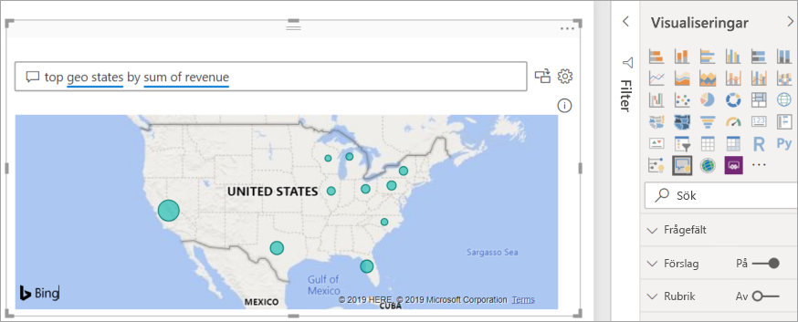

    Du kan ange för Power BI vilken visualiseringstyp som ska användas genom att lägga till den i frågan på naturligt språk. Tänk på att alla typer av visualiseringar kanske inte fungerar eller är meningsfulla för dina data. Dessa data skulle till exempel inte generera något meningsfullt punktdiagram. De fungerar däremot som en koropletkarta.

    

## Skapa ett Visuella frågor och svar-objekt med hjälp av en fråga på naturligt språk
I exemplet ovan valde vi en av de föreslagna frågorna för att skapa vårt Visuella frågor och svar-objekt.  I den här övningen ska vi skriva vår egen fråga. När vi skriver frågan får vi hjälp i form av automatisk komplettering, förslag och feedback i Power BI.

Om du är osäker på vilken typ av frågor du ska ställa eller vilken terminologi du ska använda kan du expandera **Visa alla förslag** eller titta i fönstret Fält som du hittar till höger om arbetsytan. På så sätt kan du bekanta dig med termerna och innehållet i datamängden Sales & Marketing.

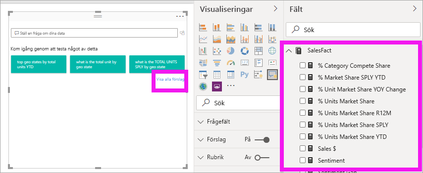

1. Skriv en fråga i Frågor och svar-fältet Power BI lägger till en röd understrykning för ord som tjänsten inte känner igen. När det är möjligt hjälper Power BI till att definiera okända ord.  I det första exemplet nedan kan du välja vilket som helst av förslagen.  

    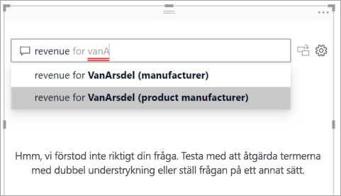

2. När vi skriver mer av frågan så meddelar Power BI oss om det inte går att förstå den. Vi får också olika hjälpförslag. I exemplet nedan frågar Power BI ”Did you mean...” (Menade du) och föreslår ett annat sätt att formulera frågan med hjälp av terminologi från datamängden. 

    

5. Med hjälp av Power BI kunde vi ställa en fråga där alla termer känns igen. Power BI visar resultatet som ett linjediagram. 

    

6. Nu ska vi ändra det visuella objektet till ett kolumndiagram. 

    

7.  Lägg till fler visuella objekt på rapportsidan och se hur Q&A-objektet interagerar med de andra visuella objekten på sidan. I det här exemplet har Q&A-objektet korsfiltrerat linjediagrammet och kartan, och korsmarkerat stapeldiagrammet.

    

## Formatera och anpassa Visuella frågor och svar-objektet
Du kan anpassa Visuella frågor och svar-objekt i formateringsrutan och genom att använda ett tema. 

### Använda ett tema
När du väljer ett tema används det på hela rapportsidan. Det finns många teman att välja bland, så prova tills du får ett utseende du är nöjd med. 

1. Välj fliken **Start** i menyfältet och sedan **Växla tema**. 

    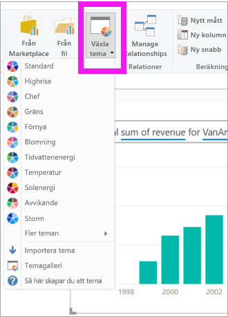

    
    
2. I det här exemplet har vi valt **Fler teman** > **Color blind safe** (anpassat för färgblinda).

    

### Formatera Visuella frågor och svar
Formatera Visuella frågor och svar, frågefältet och hur förslagen visas. Du kan ändra allt från bakgrunden för rubriken till vilken färg som ska användas för okända ord. Här har vi lagt till en grå bakgrund i frågerutan och ändrat understrecken till gult och grönt. Rubriken är centrerad och har gul bakgrund. 

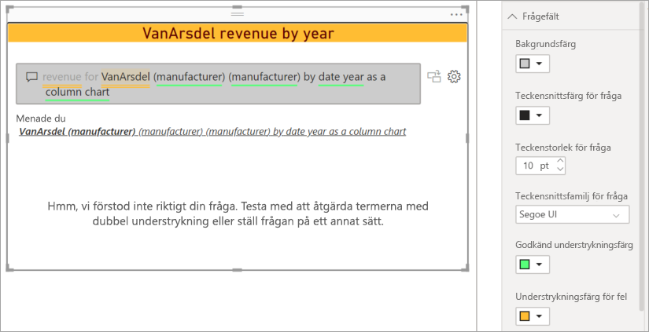

## Konvertera Visuella frågor och svar till ett vanligt visuellt objekt
Vi har formaterat det visuella objektet med kolumndiagrammet för färgblinda användare, lagt till en rubrik och en kantlinje. Nu är vi redo att konvertera det till ett vanligt visuellt objekt i vår rapport och dessutom fästa det på en instrumentpanel.

Välj ikonen  och **gör det här Frågor och svar-resultatet till ett vanligt visuellt objekt**.

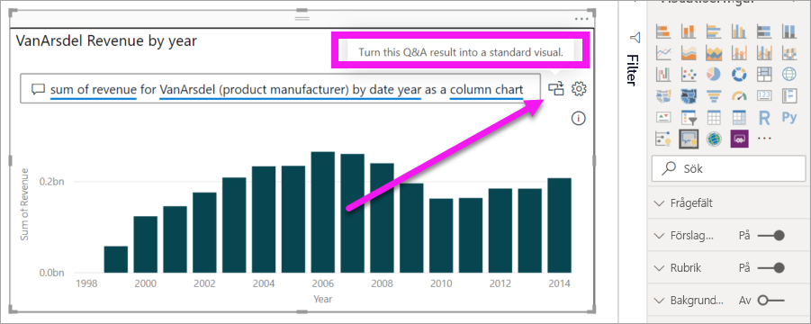

Det här visuella objektet är inte längre ett Visuella frågor och svar-objekt utan ett vanligt kolumndiagram. Du kan fästa det på en instrumentpanel. Det här visuella objektet fungerar på samma sätt som andra visuella objekt i rapporten. Observera att ikonen för kolumndiagram är markerade i fönstret Visualiseringar i stället för ikonen för Visuella frågor och svar.

Om du använder ***Power BI-tjänsten*** kan du nu fästa det visuella objektet på en instrumentpanel genom att välja fästikonen. 

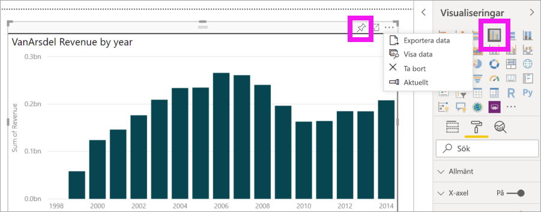

## Avancerade funktioner för Visuella frågor och svar
Om du väljer kugghjulsikonen öppnas verktygsfönstret för Visuella frågor och svar. 

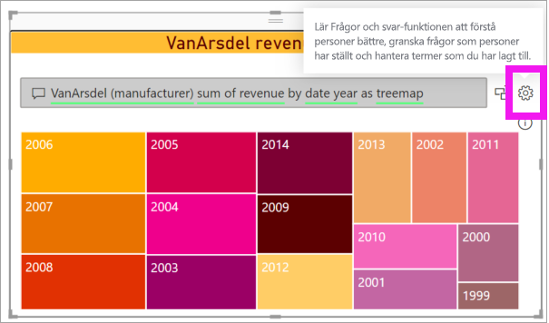

Använd verktygsfönstret till att träna Frågor och svar på termer funktionen inte känner igen, hantera de här termerna och hantera förslagen på frågor för datamängden och rapporten. Här kan du också granska frågor som har ställts i Visuella frågor och svar-objektet och se vilka frågor som användarna har flaggat. Läs mer i [Introduktion till verktyg för Frågor och svar](../natural-language/q-and-a-tooling-intro.md).

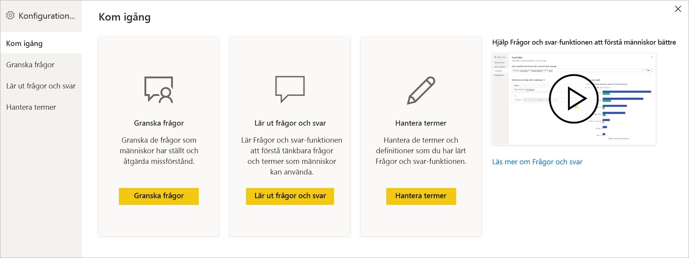

## Överväganden och felsökning
Visuella frågor och svar är integrerat med Office och Bing så att vanliga ord som inte känns igen kan matchas med fälten i din datamängd.  

## Nästa steg

Du kan integrera naturligt språk på flera olika sätt. Mer information finns i följande artiklar:

* [Verktyg för Frågor och svar](../natural-language/q-and-a-tooling-intro.md)
* [Metodtips för Frågor och svar](../natural-language/q-and-a-best-practices.md)
