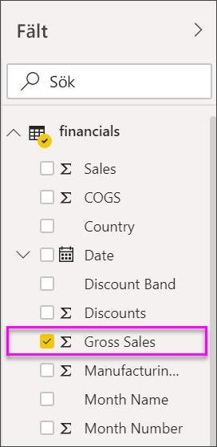
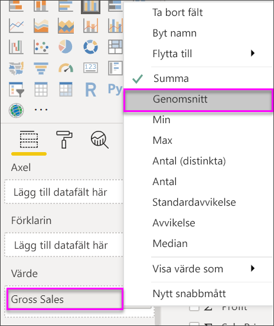
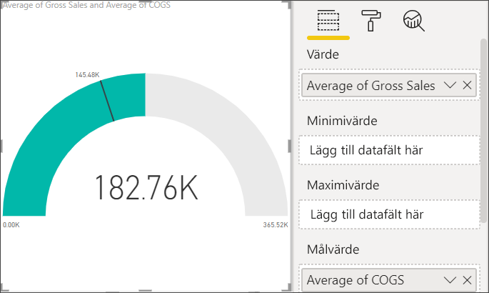
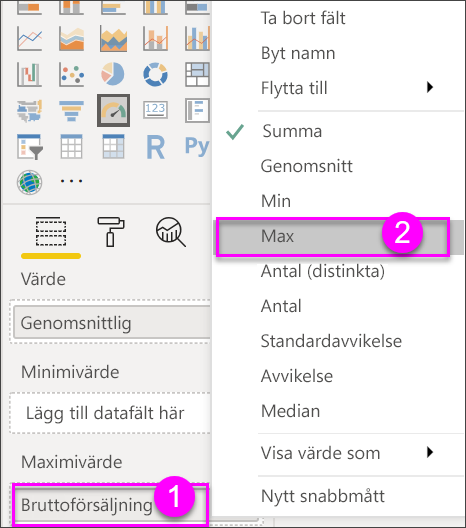
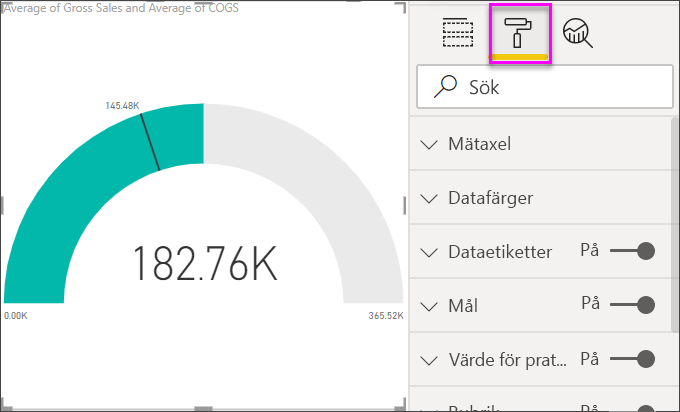
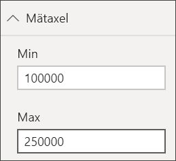
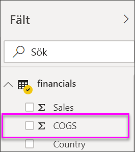
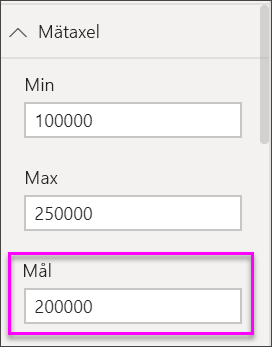
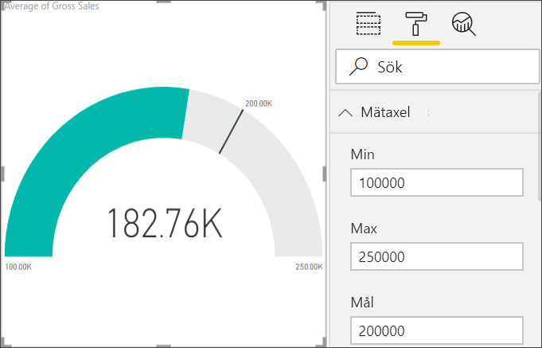

# Diagram med radiella mätare i Power BI

[!INCLUDE [power-bi-visuals-desktop-banner](../includes/power-bi-visuals-desktop-banner.md)]

Ett diagram med radiell mätare har en cirkelformad båge och visar ett värde som mäter framstegen mot ett mål eller en Key Performance Indicator (KPI). Linjen (eller *nålen*) representerar målet eller målvärdet. Skuggningen representerar framstegen mot målet. Värdet i bågen representerar framstegsvärdet. Power BI sprider alla möjliga värden jämnt fördelade längs bågen, från det lägsta (värdet längst till vänster) till det högsta (värdet längst till höger).

I det här exemplet är du en bilåterförsäljare som spårar säljteamets genomsnittliga försäljning per månad. Nålen representerar ett försäljningsmål på 140 bilar. Minsta möjliga genomsnittliga försäljning är 0 och högsta är 200.  Den blå skuggningen visar att teamet snittar ca 120 försäljningar den här månaden. Som tur är, är det fortfarande en vecka kvar till målet.

Du kan också titta på när Will visar hur du skapar enskilda visuella måttobjekt: måttdiagram, kort och KPI:er.
   > [!NOTE]
   > Den här videon använder en äldre version av Power BI Desktop.
   > 
   > 
<iframe width="560" height="315" src="https://www.youtube.com/embed/xmja6EpqaO0?list=PL1N57mwBHtN0JFoKSR0n-tBkUJHeMP2cP" frameborder="0" allowfullscreen></iframe>

## När är det bra att använda en radiell mätare

Radiella mätare är ett bra val för att:

* visa framsteg mot ett mål

* representera ett procentmått, t.ex. ett KPI

* visa hälsotillståndet för ett enskilt mått

* visa information som lätt kan sökas av och förstås.

## Förutsättningar

I den här självstudien används [Excel-filen med finansexemplet](https://download.microsoft.com/download/9/6/D/96DDC2FF-2568-491D-AAFA-AFDD6F763AE3/Retail%20Analysis%20Sample%20PBIX.pbix).

1. Välj **Hämta data** > **Excel** uppe till vänster på menyraden
   
2. Leta reda på kopian av **Excel-filen med finansexemplet**

1. Öppna **Excel-filen med finansexemplet** i rapportvyn .

1. Välj **financials** och **Sheet1**

1. Klicka på **Läs in**

1. Välj  för att lägga till en ny sida.

## Skapa en grundläggande radiell mätare

### Steg 1: Skapa en mätare för att spåra bruttomarginalförsäljning

1. Börja med en tom rapportsida

1. Välj **Bruttoförsäljning** i rutan **Fält**.

   

1. Ändra aggregering till **Genomsnitt**.

   

1. Välj mätarikonen  för att konvertera kolumndiagrammet till ett mätardiagram.

    

    Det kan hända att du, beroende på när du laddar ned filen **Finansiellt exempel**, får se siffror som inte stämmer överens med de här siffrorna.

    > [!TIP]
    > Som standard skapar Power BI ett mätardiagram där det antas att det aktuella värdet (i det här fallet **genomsnittlig bruttoförsäljning**) är mätarens mittpunkt. Eftersom den **genomsnittliga bruttoförsäljningen** är USD 182 760 är startvärdet (minst) 0 och slutvärdet (max) dubbla det aktuella värdet.

### Steg 3: Ange ett målvärde

1. Dra **KSV** från rutan **Fält** till området **Målvärde**.

1. Ändra aggregering till **Genomsnitt**.

   Power BI lägger till en nål som representerar vårt målvärde på **145 480 $** .

   

    Observera att vi har överskridit våra mål.

   > [!NOTE]
   > Du kan också ange ett målvärde manuellt. Se avsnittet om att [använda manuella formateringsalternativ för att ange värden för minimum, maximum och mål](#use-manual-format-options-to-set-minimum-maximum-and-target-values).

### Steg 4: Ange ett maxvärde

I steg 2 använde Power BI fältet **Värde** för att automatiskt ange min- och maxvärden. Men vad händer om du vill ange ett eget maxvärde? Anta att du i stället för att använda dubbla det aktuella värdet som största möjliga värde, vill ställa in maxvärdet på den högsta bruttoförsäljningen i datamängden.

1. Dra **Bruttoförsäljning** från fönstret **Fält** till området **Maxvärde**.

1. Ändra aggregering till **Maxvärde**.

   

   Mätaren ritas om med ett nytt slutvärde på 1,21 miljoner i bruttoförsäljning.

   

### Steg 5: Spara rapporten

1. [Spara rapporten](../service-report-save.md).

## Använd manuella formateringsalternativ för att ange värden för Minimum, Maximum och Mål nedan.

1. Ta bort **Maxvärde för bruttoförsäljning** från brunnen **Maxvärde**.

1. Välj rollerikonen för att öppna fönstret **Format**.

   

1. Expandera **Mätaxel** och ange värden för **Min** och **Max**.

    

1. Rensa alternativet **KSV** i rutan **Fält** för att ta bort målvärdet.

    

1. När fältet **Mål** visas under **Mätaraxeln** och ange ett värde.

     

1. Du kan också fortsätta formatera ditt mätardiagram.

När du är klar med de här stegen, har du ett mätardiagram som ser ut ungefär så här:

## Nästa steg

* [Visuella KPI-objekt (Key Performance Indicator)](power-bi-visualization-kpi.md)

* [Visualiseringstyper i Power BI](power-bi-visualization-types-for-reports-and-q-and-a.md)

Har du fler frågor? [Prova Power BI Community](https://community.powerbi.com/)
