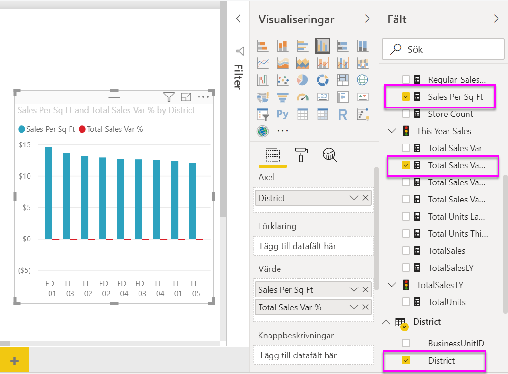
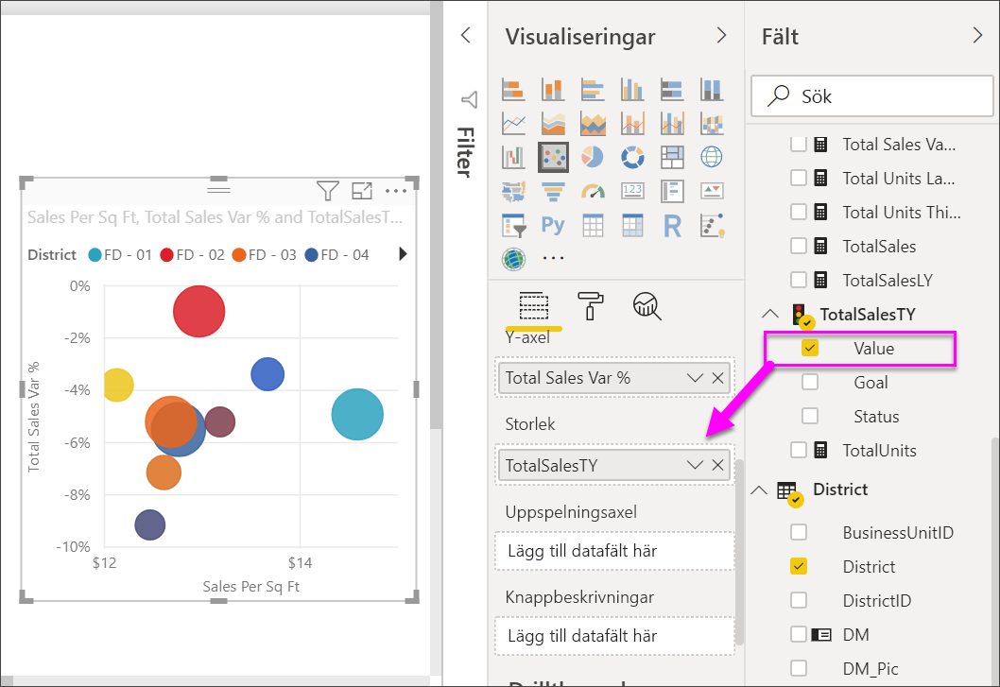
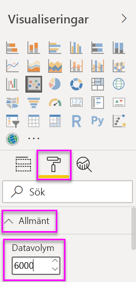
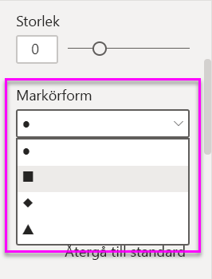
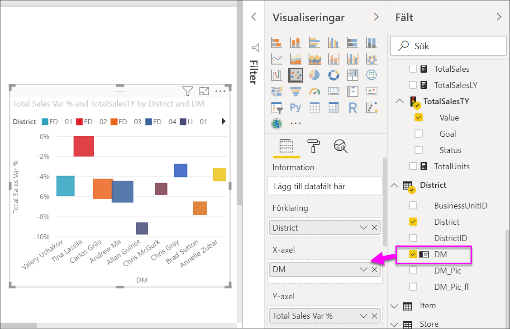
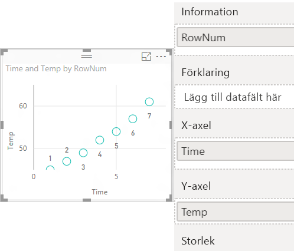
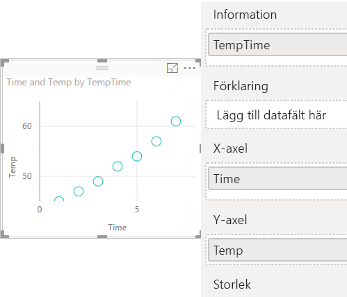

# Punktdiagram, bubbeldiagram och punktritningsdiagram i Power BI

[!INCLUDE [power-bi-visuals-desktop-banner](../includes/power-bi-visuals-desktop-banner.md)]

Ett punktdiagram har alltid två värdeaxlar som visar en uppsättning numeriska data längs en vågrät axel och en annan uppsättning numeriska värden längs en lodrät axel. Diagrammet visar punkter i skärningspunkten för ett numeriskt X- och Y-värde och kombinerar dessa värden till separata datapunkter. Power BI kan distribuera dessa datapunkter jämnt eller ojämnt på den vågräta axeln. Det beror på de data som diagrammet representerar.

Titta på det här videoklippet och se Skapa ett punktdiagram och följ stegen nedan för att skapa en egen.
   > [!NOTE]
   > Den här videon använder en äldre version av Power BI Desktop.
   > 
   > 
<iframe width="560" height="315" src="https://www.youtube.com/embed/PVcfPoVE3Ys?list=PL1N57mwBHtN0JFoKSR0n-tBkUJHeMP2cP" frameborder="0" allowfullscreen></iframe>

Du kan ange antalet datapunkter upp till 10 000.  

## När ska du använda punktdiagram, bubbeldiagram och punktritningsdiagram?

### Punktdiagram och bubbeldiagram

Ett punktdiagram visar relationen mellan två numeriska värden. Ett bubbeldiagram ersätter datapunkterna med bubblor, där *bubbelstorleken* motsvarar en ytterligare, tredje datadimension.

Punktdiagram är ett bra alternativ:

* för att visa relationer mellan två numeriska värden

* för att rita två grupper med siffror som en serie med X- och Y-koordinater

* för användning i stället för ett linjediagram när du vill ändra skalan på den vågräta axeln

* för att aktivera den vågräta axeln i en logaritmisk skala

* för att visa arbetsbladsdata som inkluderar par eller grupperade uppsättningar med värden

    > [!TIP]
    > Du kan justera oberoende skalor av axlar för att visa mer information om grupperade värden i punktdiagrammet.

* för att visa mönster i stora mängder data, till exempel genom att visa linjära eller icke-linjära trender, kluster och extremvärden

* för att jämföra ett stort antal datapunkter utan hänsyn till tid.  Ju mer data som inkluderas i ett punktdiagram, desto bättre jämförelser kan du göra.

Förutom vad punktdiagram kan hjälpa till med, är även bubbeldiagram ett bra alternativ:

* om dina data har tre dataserier som alla innehåller en uppsättning med värden

* för att presentera finansiella data.  Olika bubbelstorlekar är användbara för att visuellt betona specifika värden.

* för att använda med kvadranter.

### Punktritningsdiagram

Punktritningsdiagram liknar bubbeldiagram och punktdiagram men används istället till att rita numeriska data eller kategoridata utmed X-axeln.

De är ett bra val om du vill inkludera kategoridata utmed X-axeln.

## Förutsättningar

De här självstudierna använder sig av [PBIX-filen Exempel på detaljhandelsanalys](http://download.microsoft.com/download/9/6/D/96DDC2FF-2568-491D-AAFA-AFDD6F763AE3/Retail%20Analysis%20Sample%20PBIX.pbix).

1. Välj **Arkiv** > **Öppna** uppe till vänster på menyraden
   
2. Leta reda på kopian av **PBIX-filen Exempel för detaljhandelsanalys**

1. Öppna **PBIX-filen Exempel för detaljhandelsanalys** i rapportvyn .

1. Välj  för att lägga till en ny sida.

## Skapa ett punktdiagram

1. Börja på en tom rapportsida och välj följande fält i fönstret **Fält**:

    * **Försäljning** > **Försäljning efter kvm**

    * **Försäljning** > **Total försäljningsvarians %**

    * **Distrikt** > **Distrikt**

    

1. I fönstret **Visualiseringar** väljer du  för att konvertera det grupperade kolumndiagrammet till ett punktdiagram.

   

1. Dra **Distrikt** från **Information** till **Förklaring**.

    Power BI visar ett punktdiagram med **Total försäljningsvarians %** längs Y-axeln och **Försäljning per kvadratmeter** längs X-axeln. Datapunkternas färger representerar distrikt:

    

Nu ska vi lägga till en tredje dimension.

## Skapa ett bubbeldiagram

1. Från fönstret **Fält** drar du **Försäljning** > **Försäljning detta år** > **Värdet** till området **Storlek**. Datapunkterna expanderar till storlekar som motsvarar försäljningsvärdet.

   

1. Håll muspekaren över en bubbla. Storleken på bubblan reflekterar **försäljning detta år**.

    

1. Om du vill ange antalet datapunkter som ska visas i bubbeldiagrammet går du till **Format**-avsnittet i fönstret **Visualiseringar**, expanderar **Allmänt** och justerar **Datavolym**.

    

    Du kan ange en största datavolym på upp till 10 000. För högre volymer föreslår vi att du först testar så att prestanda inte försämras.

    > [!NOTE]
    > Fler datapunkter kan medföra längre inläsningstid. Om du väljer att publicera rapporter med gränser i den högre änden av skalan, ska du vara noga med att även testa dina rapporter på webben och mobilt. Du vill få bekräftat att diagrammets prestanda matchar dina användares förväntningar.

1. Du kan [formatera visualiseringens färger, etiketter, rubriker, bakgrund med mera](service-getting-started-with-color-formatting-and-axis-properties.md).

    Överväg att lägga till markörformer på varje linje för att [förbättra tillgängligheten](../desktop-accessibility.md). Välj markörform genom att expandera kortet **Former** och välja **Markörform** och sedan välja en form.

    

    Du kan ändra markörformen till en romb, triangel eller kvadrat. Med olika markörformer för varje linje är det enklare för rapportanvändare att skilja linjer (eller områden) från varandra.

## Skapa ett punktritningsdiagram

Om du vill skapa ett punktritningsdiagram ersätter du det numeriska **X-axelfältet** med ett kategorifält.

Ta bort **försäljning per kvm** från fönstret **X-axel** och ersätt det med **Distrikt** > **Distriktschef**.

## Överväganden och felsökning

### Ditt punktdiagram har endast en datapunkt

Har du skapat ett punktdiagram där du bara ser en datapunkt som aggregerar alla värdena på X- och Y-axlarna?  Eller samlar diagrammet alla värden längs en enda vågrät eller lodrät linje?

Lös problemet genom att lägga till ett fält i området **Information** som talar om för Power BI hur värdena ska grupperas. Fältet måste vara unikt för varje punkt som du vill rita. Ett enkelt radnummer eller ID-fält räcker bra.

Om du inte har detta i dina data, skapa ett fält som tillsammans sammanfogar X- och Y-värden till något unikt för varje punkt:

Skapa ett nytt fält genom att [använda Power BI Desktop frågeredigeraren för att lägga till en indexkolumn](../desktop-add-custom-column.md) i din datauppsättning. Lägg sedan till den här kolumnen till området **Information** i din visualisering.

## Nästa steg

* [Högdensitetssampling i Power BI-punktdiagram](desktop-high-density-scatter-charts.md)

* [Visualiseringstyper i Power BI](power-bi-visualization-types-for-reports-and-q-and-a.md)

Har du fler frågor? [Prova Power BI Community](http://community.powerbi.com/)
