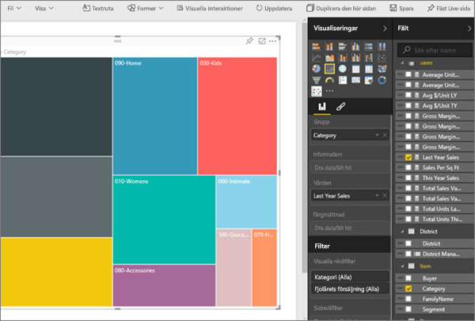
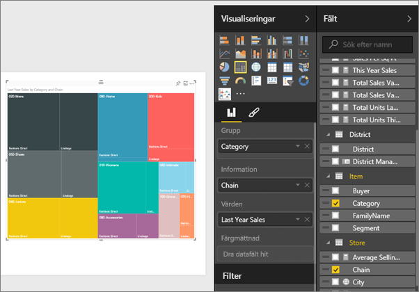

# Trädkartor i Power BI
Trädkartor visar hierarkiska data som en uppsättning kapslade rektanglar.  Varje nivå i hierarkin representeras av en färgad rektangel (som ofta kallas en ”gren”) som innehåller andra rektanglar (”löv”).  Utrymmet i varje rektangel fördelas utifrån kvantitativa värden som mäts och rektanglarna ordnas efter storlek från överst till vänster (störst) till nederst till höger (minst).

Om jag till exempel analyserar min försäljning, kan jag ha rektanglar på översta nivån (grenar) för klädkategorierna: **Urbant**, **Rural (Lantligt)**, **Youth (Ungdom)**, och **Mix (Blandning)**.  Min kategori av rektanglar innehåller mindre rektanglar (löv) för klädtillverkarna i den kategorin och dessa mindre rektanglar får sin storlek och skuggas baserat på antalet sålda artiklar.  I grenen **Urbant** ovan såldes mängder av Maximus-kläder, mindre av Natura och Fama och mycket lite av Leo.  Därmed skulle grenen **Urbant** i min trädkarta ha den största rektangeln för Maximus (i det övre vänstra hörnet), något mindre rektanglar för Natura och Fama, ett flertal andra rektanglar som representerar alla andra kläder som sålts och en liten rektangel för Leo.  Och jag skulle kunna jämföra antalet sålda artiklar med de övriga klädkategorierna genom att jämföra storlek och skuggning för varje lövnod; ju större rektangel och ju mörkare skuggning, desto högre värde.

## När du ska använda en trädkarta
Trädkartor är ett bra alternativ:

* för att visa stora mängder hierarkiska data,
* när ett stapeldiagram inte på ett effektivt sätt kan hantera ett stort antal värden,
* för att visa proportionerna mellan delarna och helheten,
* för att visa distributionsmönstret för mätvärdena för varje nivå av kategorier i hierarkin,
* för att visa attribut med hjälp av storlek och färgkodning,
* för att upptäcka mönster, avvikande värden, de viktigaste bidragande faktorerna och undantag.

### Förutsättningar
 - Power BI-tjänsten eller Power BI Desktop
 - Exempel på detaljhandelsanalys

## Skapa en grundläggande trädkarta
Vill du först se någon annan skapa en trädkarta?  Hoppa till 2:10 i det här videoklippet och se Amanda skapa en trädkarta.

<iframe width="560" height="315" src="https://www.youtube.com/embed/IkJda4O7oGs" frameborder="0" allowfullscreen></iframe>

Eller skapa en egen trädkarta. Dessa anvisningar använder sig av Exempel på detaljhandelsanalys. Om du vill följa med, loggar du in i Power BI-tjänsten (inte Desktop) och väljer **Hämta data\> Exempel \> Exempel på detaljhandelsanalys \> Anslut \>Gå till instrumentpanel**. För att skapa visualiseringar i en rapport måste du ha redigeringsbehörigheter för datauppsättningen och rapporten. Som tur är kan Power BI-exemplen redigeras. Men om någon delar en rapport med dig kan du inte lägga till nya visualiseringar.

1. Välj panelen ”Totalt antal butiker” för att öppna rapporten Exempel på detaljhandelsanalys.    
2. Öppna [Redigeringsvyn](../service-interact-with-a-report-in-editing-view.md) och välj måttet **Försäljning** > **Förra årets försäljning**.   
      
3. Konvertera diagrammet till en trädkarta.  
      
4. Dra **Artikel** > **Kategori** till området **Grupp**. Power BI skapar en trädkarta där storleken på rektanglarna återspeglar total försäljning och färgen representerar kategorin.  I princip har du skapat en hierarki som visuellt beskriver den relativa storleken för den totala försäljningen per kategori.  Kategorin **Mens (Herr)** har den högsta försäljningen och kategorin **Hosiery (Trikå)** har den lägsta.   
      
5. Dra **Store** > **kedjan** till den **information** bra för att slutföra din treemap. Nu kan du jämföra förra årets försäljning efter kategori och kedja.   
   
   
   > [!NOTE]
   > Färgmättnad och Information kan inte användas samtidigt.
   > 
   > 
5. Hovra över ett **kedjeområde** för att visa verktygstips för den delen av **kategorin**.  Hovra till exempel över **Lindseys** i rektangeln **040 Juniors (040 Junior)** för att visa verktygstips för Lindseys del av juniorkategorin.  
   
6. [Lägg till trädkartan som en panel på instrumentpanelen (fäst det visuella objektet)](../consumer/end-user-tiles.md). 
7. [Spara rapporten](../service-report-save.md).

## Markering och korsfiltrering
Information om hur du använder fönstret Filter finns i [Lägga till ett filter i en rapport](../power-bi-report-add-filter.md).

Om du markerar en kategori eller information i en trädkarta, korsmarkeras och korsfiltreras de övriga visualiseringarna på rapportsidan ... och vice versa. Om du vill göra detta lägger du antingen till några visuella objekt på samma sida eller kopierar och klistrar in trädkartan på en rapportsida där det redan finns andra visuella objekt.

1. Välj en kategori eller en kedja inom en kategori på trädkarta.  Detta korsmarkerar de övriga visualiseringarna på sidan. Om du till exempel väljer **050-Shoes (050-Skor)**, får du veta att förra årets skoförsäljning uppgick till USD 3 640 471 varav USD 2 174 185 kom från Fashions Direct.  
   

2. I om du väljer delen **Fashions Direct** i cirkeldiagrammet **Senaste årets försäljning per kedja**, korsfiltreras trädkartan.  
       

3. För att hantera hur diagram korsmarkeras och korsfiltrerar varandra, se [Visualiseringsinteraktioner i en Power BI-rapport](../consumer/end-user-interactions.md)

## Nästa steg
[ Fäst en visualisering på en instrumentpanel](../service-dashboard-pin-tile-from-report.md)  
[Power BI – grundläggande begrepp](../consumer/end-user-basic-concepts.md)  

Har du fler frågor? [Prova Power BI Community](http://community.powerbi.com/)  

