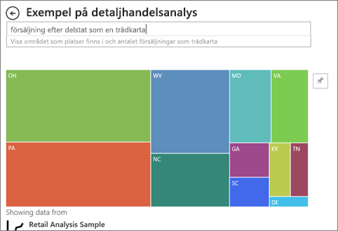

# Visualiseringstyper i Power BI
## Power BI-visualiseringar
Vi planerar nya visualiseringar, håll ögonen öppna!

Kolla även in [Microsoft AppSource](https://appsource.microsoft.com/marketplace/apps?product=power-bi-visuals) där du hittar en växande lista med [anpassade visuella objekt](../power-bi-custom-visuals.md) som du kan hämta och använda i dina egna instrumentpaneler och rapporter. Känner du dig kreativ? [Läs hur du skapar och lägger till dina egna visuella objekt på den här community-webbplatsen](../developer/office-store.md).  

## Lista över visuella objekt som är tillgängliga i Power BI
Alla dessa visuella objekt kan läggas till Power BI-rapporter, anges i frågor och svar och fästas på instrumentpaneler.

### Ytdiagram: Enkelt (i lager) och stapel

>[!TIP]
>Grundläggande ytdiagram baseras på linjediagram där området mellan axeln och linjen har fyllts i.

Mer information finns i [Grundläggande ytdiagram](power-bi-visualization-basic-area-chart.md).

### Fält och kolumndiagram

 

>[!TIP]
>Stapeldiagram är standard för att visa ett specifikt värde över olika kategorier.

### Kort: Flerrad

### Kort: Enskilt antal

Mer information finns i [Skapa ett kort (stor sifferpanel)](power-bi-visualization-card.md).

### Kombinationsdiagram

>[!TIP]
>En kombinationsdiagram kombinerar ett stapeldiagram och ett linjediagram. Alternativen är: *Linjediagram och stående stapeldiagram* samt *Linjediagram och grupperat stående stapeldiagram*.

Mer information finns i [Kombinationsdiagram i Power BI](power-bi-visualization-combo-chart.md).

### Ringdiagram

>[!TIP]
>Ringdiagram liknar cirkeldiagram.  De visar relationen mellan delar och en helhet.

Mer information finns i [Ringdiagram i Power BI](power-bi-visualization-doughnut-charts.md).

### Trattdiagram

>[!TIP]
>Trattdiagram hjälper dig att visualisera en process som har steg och objekt som flödar i ordning från ett stadium till nästa.  Använd ett trattdiagram om det finns ett stegvist flöde mellan faser, till exempel en försäljningsprocess som börjar med uppslag och slutar med ett köp.

Mer information finns i [Trattdiagram i Power BI](power-bi-visualization-funnel-charts.md).

### Måttdiagram

>[!TIP]
>Visar aktuell status i kontexten för ett mål.

Mer information finns i [Måttdiagram i Power BI](power-bi-visualization-radial-gauge-charts.md).

### Diagram över viktiga påverkare

Ett diagram över viktiga påverkare visar de största bidragande orsakerna till ett valt resultat eller värde.

Läs mer i [Key influencer charts in Power BI](power-bi-visualization-influencers.md) (Diagram över viktiga påverkare i Power BI)

### KPI:er

>[!TIP]
>Visar förloppet mot ett mätbart mål.

Mer information finns i [KPI i Power BI](power-bi-visualization-kpi.md).

### Linjediagram

>[!TIP]
>Fokusera på övergripande formen av en hel serie av värden, vanligtvis över tid.

### Kartor: Grundläggande kartor

>[!TIP]
>För att associera både kategorisk och kvantitativ information med platser.

Mer information finns i [Tips och trick för kartor](power-bi-map-tips-and-tricks.md).

### Kartor: ArcGIS-mappar

Mer information finns i [ArcGIS-kartor i Power BI](power-bi-visualization-arcgis.md).

### Kartor: Fyllda kartor (Choropleth)

>[!TIP]
>Ju mer intensiv färg, desto större värde.

Mer information finns i [Fyllda kartor i Power BI](power-bi-visualization-filled-maps-choropleths.md).

### Kartor: Formkartor

>[!TIP]
>Jämför regioner med hjälp av färger.

Mer information finns i [Formkartor i Power BI](desktop-shape-map.md).

### Matris

Mer information finns i [Matrix visuals in Power BI](desktop-matrix-visual.md) (Visuella matriser i Power BI).

### Cirkeldiagram

Cirkeldiagram visar relationen mellan delar och en helhet. 

### Banddiagram

Banddiagram visar vilken datakategori som har den högsta rangordningen (största värdet). Banddiagram är effektiva för att visa en rangordningsförändring med den högsta rangordningen (värdet) längst upp för varje tidsperiod.

### Punktdiagram och bubbeldiagram

>[!TIP]
>Punktdiagram visar relationer mellan två (punkter) eller tre (bubblor) kvantitativa mått – om, i vilken ordning, osv.

Mer information finns i [Punktdiagram i Power BI](power-bi-visualization-scatter.md).

### Punktdiagram med hög densitet

>[!TIP]
>Om du har för många datapunkter i ett visuellt objekt kan det bli rörigt, så man använder då en sofistikerad samplingsalgoritm för att säkerställa precisionen i visualiseringen.

Mer information finns i [Punktdiagram med hög densitet i Power BI](desktop-high-density-scatter-charts.md).

### Utsnitt

Mer information finns i [Utsnitt i Power BI](power-bi-visualization-slicers.md).

### Fristående bilder

Mer information finns i [Lägga till en bildwidget i en instrumentpanel](../service-dashboard-add-widget.md).

### Tabeller

>[!TIP]
>Fungerar bra med kvantitativa jämförelser mellan olika enheter där det finns många kategorier.

Mer information finns i [Arbeta med tabeller i Power BI](power-bi-visualization-tables.md).

### Trädkartor

Mer information finns i [Trädkartor i Power BI](power-bi-visualization-treemaps.md).

>[!TIP]
>Diagram som består av färgade rektanglar, vars storlek representerar värdet.  De kan vara hierarkiska, med rektanglar inbäddade i huvudrektanglarna.

### Vattenfallsdiagram

>[!TIP]
>Vattenfallet diagram visar löpande summa efter hand som värden adderas eller subtraheras.

Mer information finns i [Vattenfallsdiagram i Power BI](power-bi-visualization-waterfall-charts.md).

## Berätta för Frågor och svar vilket visuellt objekt som ska användas
När du skriver frågor med naturligt språk i Frågor och svar för Power BI kan du ange typen av visuellt objekt i din fråga.  Till exempel:

”***försäljning per tillstånd som en trädkarta***”

## Nästa steg
[Visuella objekt i Power BI-rapporter](power-bi-report-visualizations.md)    
[Rätt visuell referens från sqlbi.com](http://www.sqlbi.com/wp-content/uploads/videotrainings/dashboarddesign/visuals-reference-may2017-A3.pdf)